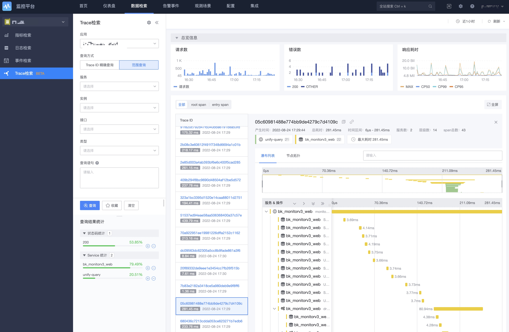

# Opentelemetry SDK (Java) Instructions

## 1. Background

Through OT's Java agent, bytecode is dynamically injected to capture the call chain data in most popular libraries and frameworks, and then reported

## 2. SDK address

[OpenTelemetry auto-instrumentation and instrumentation libraries for Java](https://github.com/open-telemetry/opentelemetry-java-instrumentation)

##3. Basic usage

1. Register the application: BlueKing Monitoring uses opentelemety as the data receiver. On the basis of reporting through the SDK, you need to register the corresponding application and obtain the corresponding token. To report data, you need to carry a token. Copy SecureKey and the url of port 4317, recorded as token and url respectively
     
     

2. Download jar: Download the latest opentelemetry-javaagent.jar from the [Release](https://github.com/open-telemetry/opentelemetry-java-instrumentation/releases/) page and store it on the business service machine , the full path of agent.jar is recorded as path

3. Add parameters: In the startup parameters of the business service, add parameters: ` " -Dotel.resource.attributes=service.name=${service_name},bk.data.token=${OT_token} -Dotel.exporter.otlp .endpoint=${OT_host} -Dotel.metrics.exporter=none -javaagent:${agent_path} "` , where

     * service_name: Represents the service name of the business, user-defined, used for display of the monitoring panel
     * OT_token: the token monitored by BlueKing in step 1
     * OT_host: The URL monitored by BlueKing in step 1

4. Observation data:

Data retrieval -> trace retrieval is the most intuitive

Observation Scenario -> Application Monitoring View application topology and service list

Note: Data access requires 10 minutes of statistics to produce corresponding data.

## 4. Advanced usage

1. OT agent currently supports these frameworks: [supported-libraries](https://opentelemetry.io/docs/instrumentation/java/automatic/agent-config/#suppressing-specific-agent-instrumentation), you can customize it according to your actual situation Need to turn off: -Dotel.instrumentation.[name].enabled=false to reduce some performance overhead (Note: The data of some frameworks is too noisy, so the OT agent is disabled by default. For details, please refer to: [disabled-instrumentations](https:/ /github.com/open-telemetry/opentelemetry-java-instrumentation/blob/main/docs/supported-libraries.md#disabled-instrumentations))

2. You can create a span for your own business code, introduce the corresponding version of [opentelemetry-extension-annotations](https://mvnrepository.com/artifact/io.opentelemetry/opentelemetry-extension-annotations), and then use @ on the method WithSpan, the agent will automatically collect and report the call chain of the method. For details, please refer to: [Annotations](https://opentelemetry.io/docs/instrumentation/java/automatic/annotations/)

3. In addition to using the properties parameters to access OT above, you can also use environment variables, configuration files, and SPI to access. For details, please refer to: [Agent Configuration](https://opentelemetry.io/docs/instrumentation/java/automatic/ agent-config/#configuring-the-agent)

4. Just add extensions to meet business needs, such as custom ID generation, etc., package it into a jar and use -Dotel.javaagent.extensions=xxx.jar to introduce it. For details, refer to: [Extension](https://github.com/open -telemetry/opentelemetry-java-instrumentation/tree/main/examples/extension#extensions-examples)

5. You can use -Dotel.javaagent.debug=true for debugging, and the input log will be printed on the standard output.

6. Logger context: trace_id=%mdc{trace_id} span_id=%mdc{span_id} trace_flags=%mdc{trace_flags}, supported logger framework: [Supported logging libraries](https://github.com/open-telemetry/ opentelemetry-java-instrumentation/blob/main/docs/logger-mdc-instrumentation.md#supported-logging-libraries)

## 5. Things to note

*JDK minimum version: 1.8
* Supported frameworks and web servers: https://github.com/open-telemetry/opentelemetry-java-instrumentation/blob/main/docs/supported-libraries.md
* Baseline cost:
     * Version: 1.14.0
     * Use case: [opentelemetry-java-instrumentation/benchmark-overhead](https://github.com/open-telemetry/opentelemetry-java-instrumentation/tree/main/benchmark-overhead)
     * Data: [opentelemetry-java-instrumentation/results.csv](https://github.com/open-telemetry/opentelemetry-java-instrumentation/blob/gh-pages/benchmark-overhead/results/release/results.csv )
     * Conclusion: startup time increases by 9%, memory increases by 17%, GC time increases by 8%, cycle time increases by 1.6%, HTTP average time increases by 0.5%, 95% of HTTP time increases by 1.5%,