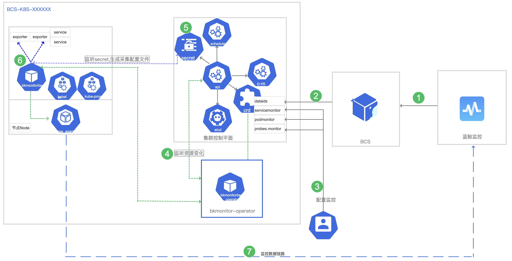
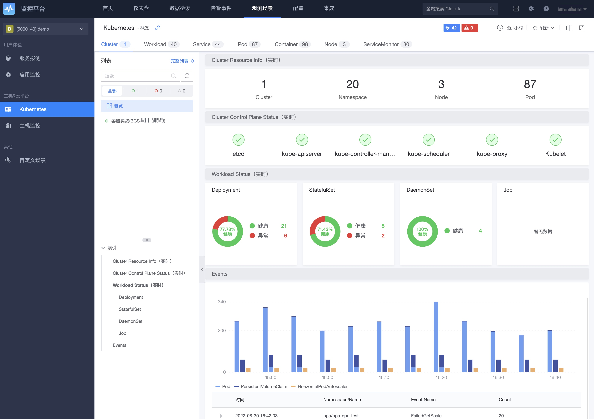
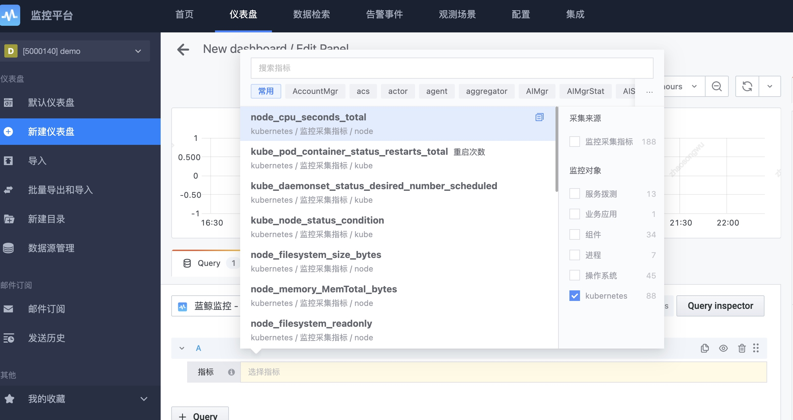

# Enable Kubernetes monitoring

## 1. Explanation of related terms

* Kubernetes: Container management and scheduling platform, refer to what kubernetes is.
* BCS: Blueking Container Service (BCS) is a highly scalable, flexible and easy-to-use container management service platform. Refer to the BCS usage documentation.
* gse_agent: The BlueKing agent running on the host (such as CVM, physical machine, etc.) is the channel for reporting monitoring data.
* bkmonitorbeat: indicator collector, used to collect indicator data. The bkmonitorbeat deployment depends on gse_agent. If the gse agent is not installed on the host, bkmonitorbeat will fail to start (the pod is in the init state).
* bkmonitor-operator: used to monitor the configuration of serviceMonitor, podMonitor, probeMonitor, etc., and is responsible for refreshing each bkmonitorbeat configuration file.
* dataid: The id used to identify data within the monitoring platform.

## 2. What is container monitoring?

Container monitoring generally refers to reporting indicators and events of the container environment in the container scenario.

At present, the container management platform is basically unified by kubernetes. The container monitoring mentioned here refers to the containers running in the kubernetes environment. Container monitoring scenarios that are not managed through kubernetes are not supported for the time being, and will not be separately discussed later. illustrate.

Monitoring features in container environments:

* The monitoring target is dynamic, and it is impossible to monitor the specified target IP and target port through traditional methods.
* Containers will be destroyed and created at any time, and monitoring targets change very quickly. Without monitoring, traceability and monitoring are impossible.
* No need to care about what machine the container is running on.
* The larger the number of containers, the greater the number of reported indicators.

The core demands of container monitoring are mainly divided into four categories:

1. Monitor the running status of the cluster itself. The purpose of monitoring is to keep an eye on the capacity at any time and detect abnormalities in a timely manner, so that cluster operators can quickly repair cluster problems.

    * Monitoring of kubernetes cluster status, such as monitoring of master cluster's etcd, kube-api, kube-scheduler, kube-proxy, kubelet and other core services.
    * Monitor node status, such as CPU, memory, network card, etc.
    * Statistical requirements for resources, such as cluster, NameSpace, node, and pod number statistics.
    * Monitor the running indicators and status of workload, service, pod, and container.
2. Monitoring of events and logs in the container.

    Collect container logs and events, and configure alarms.
3. Monitoring of custom indicators, whether the service indicators provided by the service running in the container are normal, because in most cases, the indicators of the operating environment are normal, which does not mean that the service itself is normal, so the service itself needs to be reported index.

    Service indicators, such as interface success, failure, saturation, error rate, etc. Usually such indicators have more practical reference value for application development and are more helpful to the business.
4. HPA function, dynamically expand and shrink the number of pods.

    Based on key indicators, increase or decrease the number of pods in the container to achieve effective utilization of resources.
    ​
    In the cloud native community, prometheus is almost always recommended when trying various monitoring solutions for kubernetes. The native prometheus can work well when the data dimension combination is small and meet daily usage needs. However, when the data dimension is large, even if the thanos solution is used, the effect is still not ideal. The specific performance is that when the number of indicator and dimension combinations is large, the memory occupied is relatively high, the query speed will be slowed down, and the recovery time will be long when the service is restarted, and the stability of monitoring will be greatly challenged.

## 3. Container monitoring solution

In order to allow everyone to centrally manage and monitor, and integrate container monitoring with host monitoring, business monitoring, etc., the monitoring platform has launched the monitoring capability of container scenarios. The following problems can be solved:

* Avoid the problems of OOM, unresponsive query, and low availability of prometheus service under high load conditions.
* There is no need to deploy prometheus independently for each kubernetes cluster.
* Solve the problem of separate use of container monitoring and business monitoring. Centralized viewing of monitoring and alarms allows monitoring data to be consumed and used in a unified place without the need to maintain multiple monitoring systems at the same time.

### Data collection process



Compared with prometheus-operator, the entire architecture has less prometheus components and more bkmonitorbeat daemonset, because our bkmonitorbeat can replace the collection capability of prometheus, and through the gse pipeline capability, we can use the storage and query capabilities of BlueKing Monitoring, that is Said that users do not need to deploy Prometheus related components and prometheus-operator in the cluster.

Thanks to the centralized storage of BlueKing monitoring, bkmonitor-operator consumes less resources in the cluster than the prometheus-operator solution.

### Data collection process description

1. After the user cluster is connected to BlueKing Monitoring, the dataid resource is generated and applied to the user cluster.
2. After operator dataid-wacther detects that the dataid resource is created, it starts the serviceMonitor/podMonitor/Probe detector to detect monitoring objects in the cluster in real time.
3. The operator generates a collection task based on the detected resource object, and creates a Secrets resource for each node to record the content of the collection task.
4. When the bkmonitorbeat-reloader on the node detects changes in the Secrets object on its own node, the reloader sends a reload signal to bkmonitorbeat to notify bkmonitorbeat to reload the configuration.
5. bkmonitorbeat senses that there is a collection task and collects and reports data.

### Differences in collection methods

1. The original Prometheus is pulled centrally by Prometheus-server, while BlueKing monitoring is collected through the local node, and the collection pressure is distributed to each node, so there is no centralized collection task pressure.
2. Deploy the bkmonitorbeat daemonset on each node. The daemonset collects the exporter data in the local pod.
3. The data in the cluster is provided natively by kube-state-metrics, prometheus-node-exporter, and kubelet, and collected by bkmonitorbeat of this node.
4. Supports collection of multiple clusters, multiple clusters can share a set of BlueKing monitoring

## 4. How to access container monitoring

There are two situations for connecting to a cluster monitored by a container:

- If the k8s cluster has been connected to the BCS cluster, you can directly install the bkmonitorbeat operator in the BCS cluster component.
- If the cluster is not managed by BCS, you need to host the k8s cluster. Please refer to [Cluster Management](../../../../..//BCS/1.28/UserGuide/Function/cluster_management.md) , and then install bkmonitorbeat operator

For the access process, please refer to [BlueKing Container Monitoring Installation](../../../../../BCS/1.28/UserGuide/Function/container_monitor.md)

## 5. How to view container monitoring data

Observation scenario -> kubernetes


## 6. How to configure container monitoring alarms


There are some built-in policies, please see [Container Default Policy Description](./k8s_default_rules.md) for details

## 7. How to access servicemonitor and podmonitor data

The container monitoring function is compatible with Prometheus' servicemonitor and podmonitor functions. For the definition of collection targets, please refer to [Document](https://github.com/prometheus-operator/prometheus-operator/blob/main/Documentation/user-guides/getting- started.md)

The difference from the Prometheus ecosystem is that there is no need to deploy Prometheus-operator and Prometheus, and the data reporting link is unified through the BlueKing data pipeline.

The data on each node is collected by the daemonset of the bkmonitor-operator on the node, rather than centralized collection. Therefore, the collection overhead is on the daemonset.

```
#View bkmonitor-operator
  kubectl get pods -n bkmonitor-operator -o wide
```


```
#View daemonset configuration
kubectl get ds -n bkmonitor-operator bkmonitor-operator-stack-bkmonitorbeat-daemonset -oyaml
```


Use up to 1 CPU core and 1G memory. If you need to collect a lot of data, you can adjust this configuration.

## 8. How to draw a dashboard - unified monitoring perspective

Container monitoring indicators can be displayed and analyzed in the dashboard, and can be viewed in customized views

