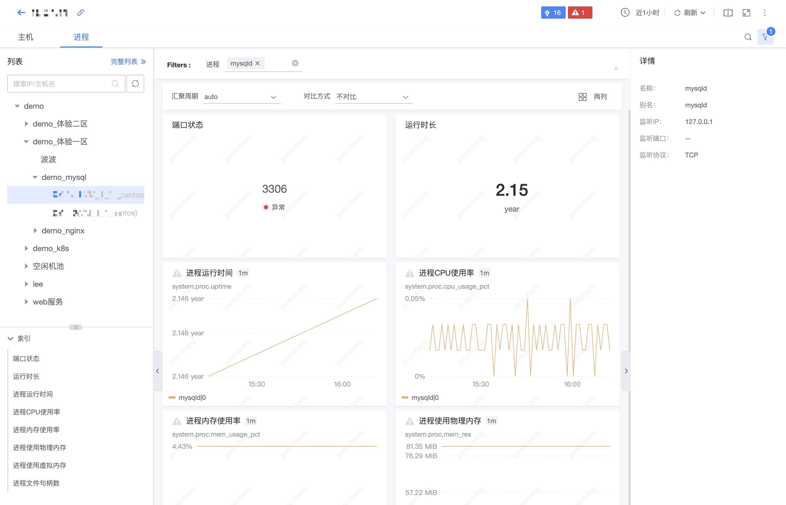

# Process and port monitoring

The monitoring of current processes and ports depends on the configuration of CMDB. Once CMDB is configured, process-related data and events can be automatically collected.

## Step one: Configure the platform registration process

**Configuration path**: Navigation → Business → 1) Business topology → 2) Module settings → 4) Service instance settings → 5) Process settings → 6) Label settings (optional)


- Process information configuration

   - Process alias (required): The externally displayed service name, user-defined, generally corresponds to the actual service name of the process, and will be used to distinguish different processes in the monitoring platform - host monitoring - host details - process service

   - Process name (required): The binary name of the program, which can be obtained through `readlink -f /proc/${pid}/exe`

   - Startup parameter matching rules (optional, important): important rules to achieve accurate matching of processes, mainly applied to processes with repeated binary names such as Java or Python. The Agent-side collector will use this rule to identify the process `cmdline`. Parameter-only process. If the parameters filled in are not unique, multiple processes will be identified. If the process binary name itself is unique, it does not need to be filled in.

   - Binding IP (optional): The IP address actually monitored by the process. It does not need to be filled in. If it is filled in, it must be an address that accurately corresponds to the IP. If the IP is wrong, the collector will be unable to match the process, resulting in abnormal data reporting.

   - Port (not required): Same as "Bind IP"

   - Protocol (optional): Same as "Bind IP"

For example, the durid-broker java program:


For more other process configuration methods, please see [Various Process Configuration Methods](./process_cases.md)

### Service Template

> Service instance: If the port, path and other information of the process are the same, it is recommended to use a service template and set the service classification. To facilitate subsequent management work. If the port paths are inconsistent, the implementation can be added automatically.


**Automatic delivery**:

Modifications to the process on the configuration platform will be automatically sent to `/etc/gse/host/hostid` on the Agent through the event push function of the configuration platform. The monitored process port collector will capture file changes and perform anomaly detection. And the content is updated to the collector. The delivery time is expected to be within 2 minutes, and the page process port update information is expected to be within 5 minutes.

## Step 2: Host monitoring and process monitoring


- Process: Green display when normal

- Port: Click on the process. It will be displayed in green when normal. If the port does not exist, it will be displayed in red. If it is occupied, it will be yellow. Gray means that the collector has not reported data. You need to check according to the data non-reporting process.

- Resources/Performance: Normally the chart has continuous data

- Check if the process matches exactly:
    - If it is a service whose binary is Java or Python, check whether the process port resource only reports the configured process. If the configured process is unique and there are multiple reported processes, it means that the exact match fails, and you need to confirm whether the matching parameters are unique.




### common problem

1. A process name was created in the CMDB, but a warning that the process name does not exist: The process does not exist on the machine, and the process name is wrong.

2. The port has been closed in the CMDB, but the alarm process does not exist: If process management is configured on the host in the CMDB, it means that the process should exist on the machine and must be accurate. Even if the port is false, it will still report that the process does not exist.

3. The current process is bound to the IP of ipv6, but because CMDB does not support ipv6, it will cause false alarms. Wait until CMDB supports ipv6.

4. The correct process port is configured in the CMDB, but it is still reported that the process port does not exist. Please check whether /var/lib/gse/host/hostid is consistent with the one in the CMDB. If not, it is caused by synchronization delay.

5. Related configuration locations

```
Process related configuration files

After the CMDB creates the process, the relevant configuration files will be written to /var/lib/gse/host/hostid and /usr/local/gse/plugins/etc/bkmonitorbeat.conf, as shown below

/var/lib/gse/host/hostid
The path of windows is c:/gse/data/host/hostid

/usr/local/gse/plugins/etc/processbeat.conf
The path of windows is c:/gse/plugins/etc/bkmonitorbeat.conf

Process collection plug-in

Process information is collected through the bkmonitorbeat plug-in. If the process does not exist, the port information cannot be collected.

#ps -ef |grep bkmonitorbeat
./bkmonitorbeat -c ../etc/bkmonitorbeat.conf
#ps -ef |grep bkmonitorbeat
./bkmonitorbeat -c ../etc/bkmonitorbeat.conf

```

## Step 3: Configure alarm policy


If you monitor process indicators, the following process indicators will be collected by default [Host-Process-Indicators](../../Other/functions/addenda/process-metrics.md)

## Related documents

More process-related collection and viewing scenarios [How to implement multi-instance collection](../integrations-metrics/multi_instance_monitor.md)