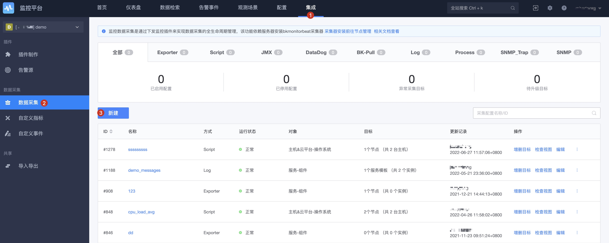

# Process monitoring-process collection plug-in

The dynamic process collection plug-in is a plug-in configuration capability built into the platform and relies on bkmonitorbeat. When the collection task is configured and delivered to the target machine, it will work based on the collected task information.

It is suitable for situations where a fixed process name matching port cannot be defined in the CMDB. For example, the port changes at any time and there is no fixed port, so it is impossible to define a port in the CMDB for monitoring.

## Implementation principle

By configuring the process name that needs to be monitored, the conditions can be selected to include or exclude certain command line keywords, similar to Linux commands

```
#Note, this means that this function is similar to the following Linux command. The actual detection process does not rely on Linux commands.

ps -ef | grep "keywords included" | grep -v "keywords not included"
```
Filter out the required processes, then detect whether the process has opened the port (optional function), and collect the relevant usage of the process.


## How to configure collection

The prerequisite depends on installing the bkmonitorbeat collector, and confirm whether it has been installed in "Node Management".


Menu: Integration->Data Collection->New



Fill in the relevant data collected


* Business: selected by default, no configuration required
* Name: The name of the collection item, indicating the purpose of the data collection
* Collection object: select process
* Collection cycle: The default is 1min, which can be configured as needed
* Collection method: Process
* Select plug-in: After selecting the collection method, the process collection plug-in will be selected by default and no configuration is required.
* Process matching: divided into two methods: command line matching and pid file


Command line matching method

```
Contains: process matching string, usually the name of the process. Note that Linux is cmdline, and windows is matching process name.

  Not included: processes that are not reported, you can fill in a regular expression, such as (\d+), processes that match numbers are not collected, ^
```

Process name: The name of the process. You can fill in the actual name of the process, or you can fill in the regular form. The regular brackets indicate the final value. For example, `(/containers/\d+)`, if its cmdline is

```
/bin/java -Xms30720m -Xmx30720m -XX:+UseConcMarkSweepGC -XX:CMSInitiatingOccupancyFraction=75 -XX:+UseCMSInitiatingOccupancyOnly -XX:+DisableExplicitGC -XX:+AlwaysPreTouch -server -Djava.awt.headless=true -Dfile.encoding=UTF -8 -Djna.nosys=true -Dio.netty.noUnsafe=true -Dio.netty.noKeySetOptimization=true -Dlog4j.shutdownHookEnabled=false -Dlog4j2.disable.jmx=true -Dlog4j.skipJansi=true -XX:+HeapDumpOnOutOfMemoryError - Des.path.home=/data1/containers/1495608881000003411/es -cp /data1/containers/1495608881000003411/es/lib/* org.elasticsearch.bootstrap.Elasticsearch -d
```

The final reported process name is /containers/1495608881000003411

## Effect after reporting


For related indicator descriptions, view [Process Metrics Description](./process_metrics.md)