# Quick access

Quick Access uses a simple website as a reference example to demonstrate how to achieve comprehensive monitoring coverage. This will also give you a basic understanding of the use of the monitoring platform.

Rough steps:

* step 1 Understand the website structure and determine monitoring points
* step 2 CMDB configuration and preparation
* step 3 Configure host-operating system and host-process monitoring
* step 4 Configure service-component monitoring
* step 5 Configure service-log monitoring of service module
* step 6 Configure application-service dialing test monitoring
* step 7 Supplement business monitoring through customized reporting
* step 8 Share configuration

## step 1 Understand the website structure and determine monitoring points

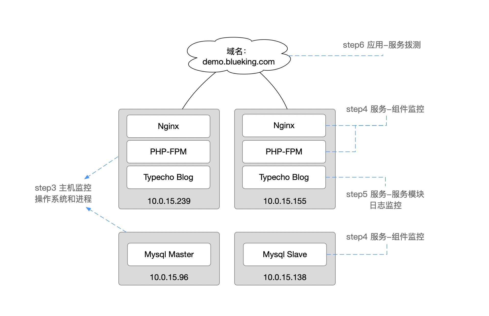

| Purpose | IP | Process | Description |
| ------------ | ----------- | ------------------ | ----------------- |
| web1 | 10.0.0.1 | nginx php-fpm | typecho blog program |
| web2 | 10.0.0.1 | nginx php-fpm | typecho blog program |
| mysql master | 10.0.0.1 | mysql mysqld_safe | database master |
| mysql slave | 10.0.0.1 | mysql mysqld_safe | database slave |

In order to ensure the stability of this BLOG website, a comprehensive monitoring needs to meet at least the following monitoring requirements:

1. Operating system data of 4 hosts -- monitoring the stability of the hosts
2. Process data on 4 hosts -- monitor the running data and survival of the process
3. Component operation data of nginx, php-fpm, mysql -- Monitor the operation data of components
4. Log data of the blog program -- collecting log positioning and log keyword alerts
5. Website dial-up test data -- remote monitoring of website availability

> The blog program chose [typecho](http://typecho.org/), a lightweight program, as an example.

## step 2 CMDB configuration and preparation

* [Create Business](../../../Configuration Platform/Product White Paper/Product Functions/BusinessManagement.md)
* [Create a cluster](../../../Configuration Platform/Product White Paper/Product Functions/SetTemp.md)
* [Create module](../../../Configuration Platform/Product White Paper/Product Functions/Model.md)

     > If the process configuration is the same on each machine, it is recommended to use the functions of cluster template and service template.
     > If the process configuration is different on each machine, it is recommended to check [How to implement multi-instance monitoring](../guide/multi_instance_monitor.md)

For more information, please see [Preparation](./prepare.md)

web configuration

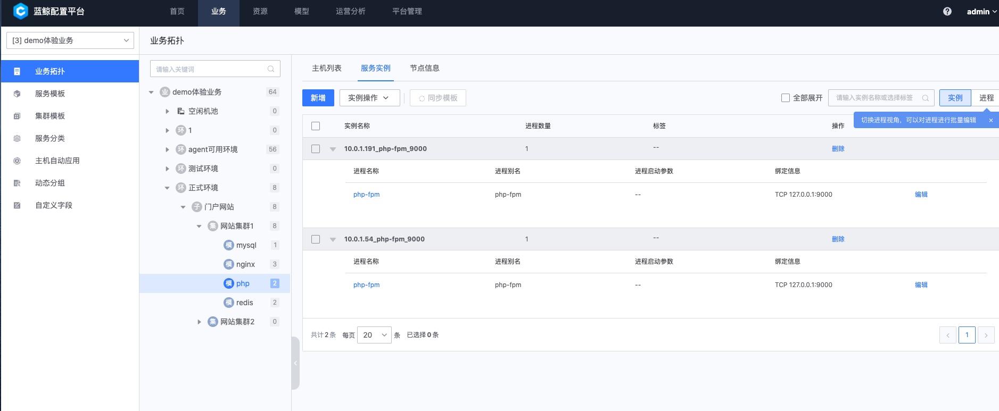

mysql configuration

For more process configuration methods, see [Process Configuration Types](../guide/process_cases.md)

## step 3 Configure host-operating system and host-process monitoring

After configuring the process information, you will see the corresponding collected data in "Host Monitoring".

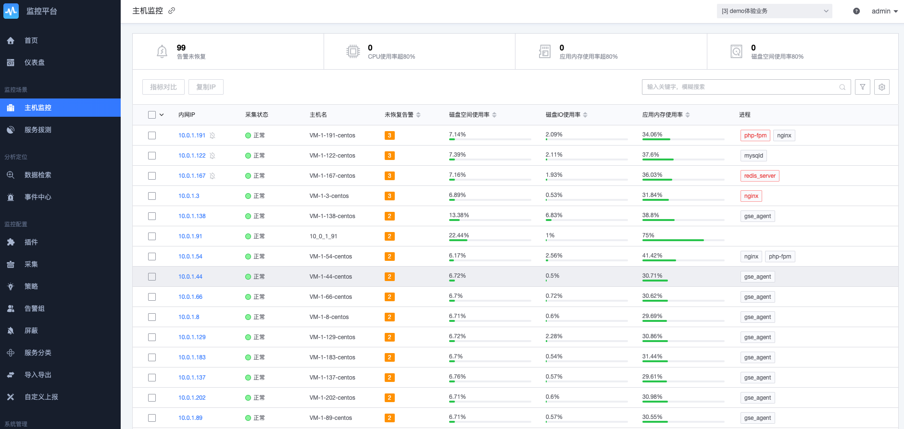

The platform comes with default policies. Please view [built-in policies](../functions/addenda/builtin-rules.md) for details. When the built-in policies do not meet the needs, you can add monitoring policies.

Configure process port monitoring: Navigation → Monitoring Configuration → Policy → New

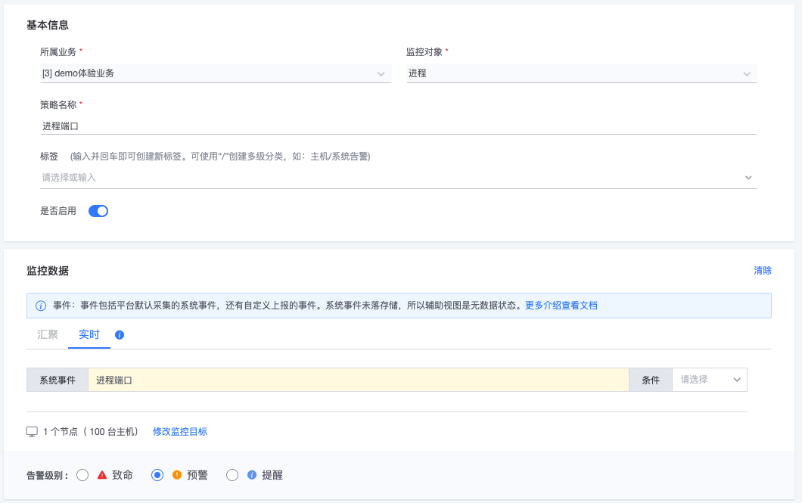

View alarm information in the event center: Navigation → Event Center

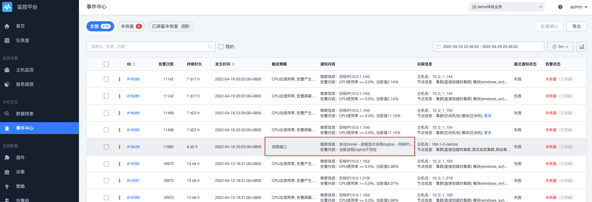

For more information, please view scenario cases:

* [Host Monitor](../functions/scene/host-monitor.md)
* [How to monitor the process](../guide/process_monitor.md)
* [How to monitor the operating system](../guide/os_monitor.md)

## step 4 Configure service-component monitoring

For MySQL and Nginx, you can quickly realize component monitoring needs by using the official built-in components of the monitoring platform. For more built-in components, view "Navigation → Monitoring Configuration → Plugins"

* [Built-in plug-ins](../functions/addenda/builtin-plugins.md)
* [Plugin Management](../functions/conf/plugins.md)

When using it, just use the plug-in capability directly in "Navigation → Monitoring Configuration → Collection". Set according to the plug-in configuration method.

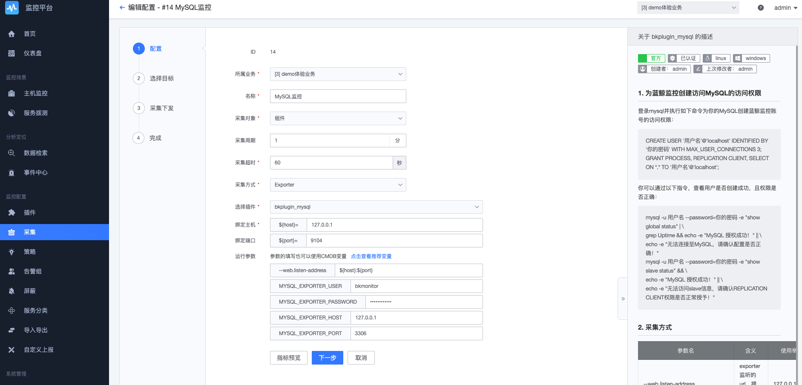

The collected data can be viewed in "Inspection View" and "Dashboard". For more usage methods, see [Collection Configuration](../functions/conf/collect-tasks.md)

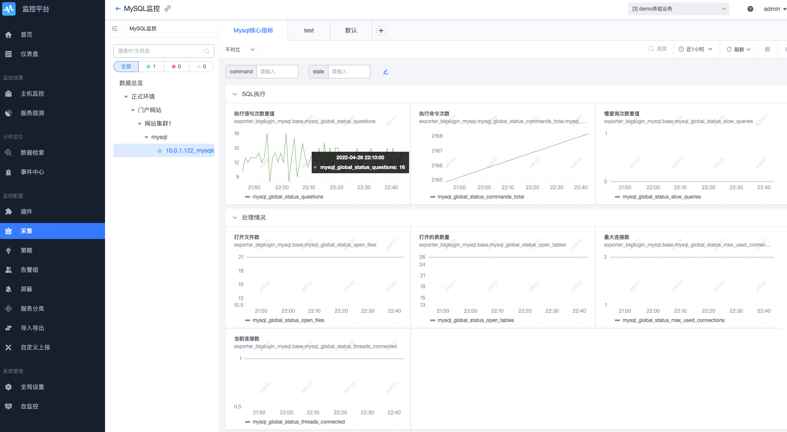

For details on policy configuration, see [Policy Configuration](../functions/conf/rules.md)

For example, PHP-FPM does not have a built-in official plug-in that can be used directly. You can check [How to monitor open source components](../guide/component_monitor.md).

## step 5 Configure service-log monitoring of service module

Collect program access logs

Log collection: Navigation → Management → Log collection → New

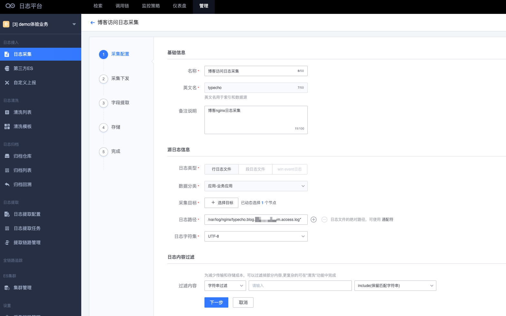

- Field extraction-formatted data

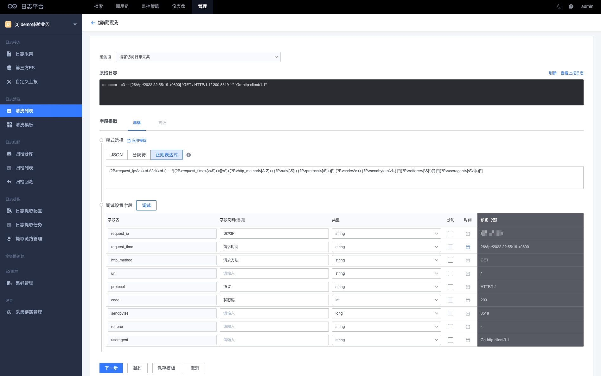

Data retrieval - View the data collected by the log. For more usage methods, see [Data retrieval](../functions/analyze/data-search.md).

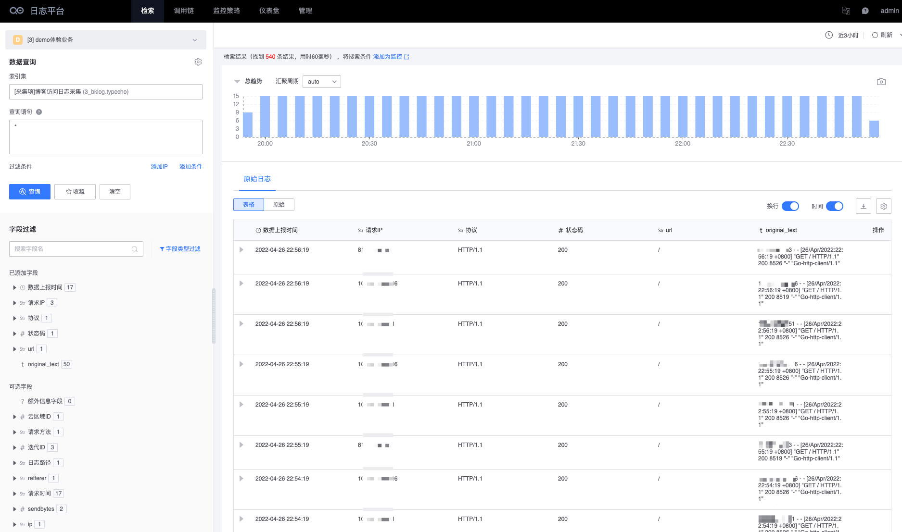

Configure log alarms - the log keyword contains the admin path, and an alarm will be issued if the number of accesses per minute is greater than 50.

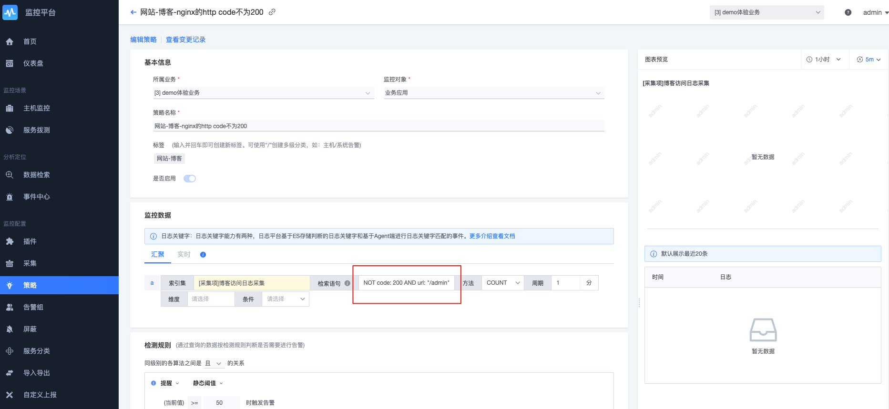

For more log monitoring configuration, see [How to monitor through log data](../guide/log_monitor.md)

## step 6 Configure Application-Service Dial Test Monitoring

Add remote home page detection and determine the stability of the website through service dial testing.

- Create a new dial test task

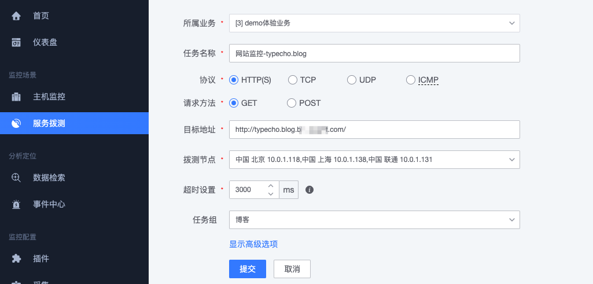

- View dial test results

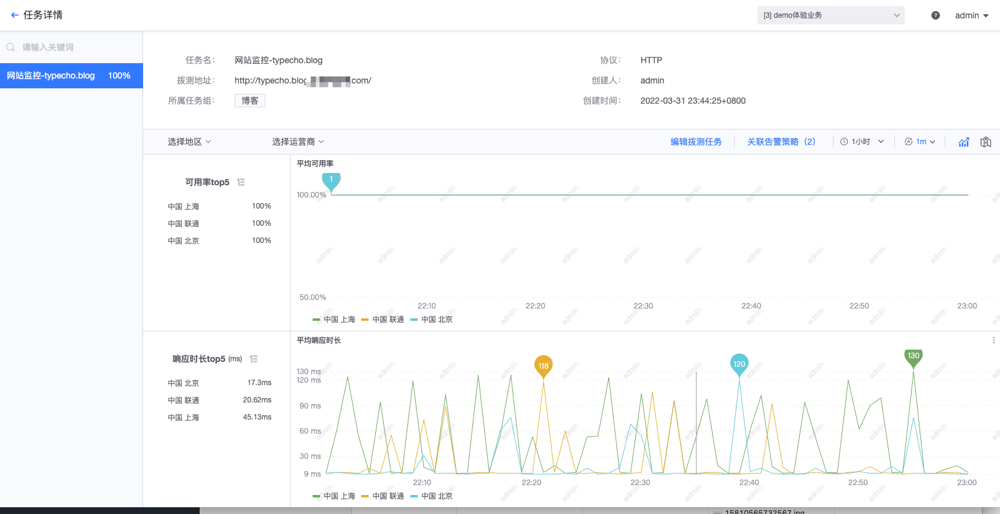

You can also set monitoring strategies for availability and response time. Please check out more.

* [Service Dial Test](../functions/scene/dial.md)

## step 7 Supplement business monitoring through customized reporting

If you want to report monitoring data directly in the business code, there are methods such as SDK, command line tools, and HTTP.

For details, please view [custom reporting function](../functions/conf/custom-report.md)

## step 8 Share configuration

If the website architecture of each business is similar, would it be very cumbersome to configure step3-step6 every time? Then make them into a template and export and import them directly.

Navigation → Monitoring Configuration → Import and Export

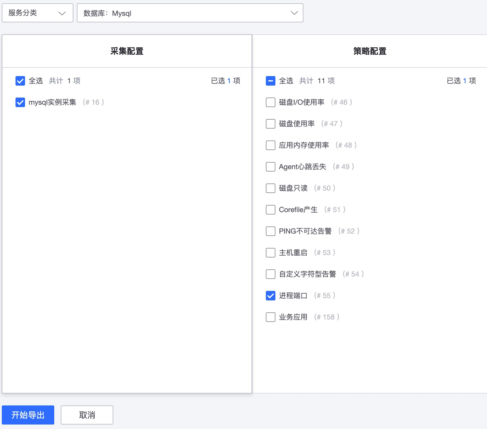

For more information, please see [Introduction to Import and Export Functions](../functions/conf/import-export.md)