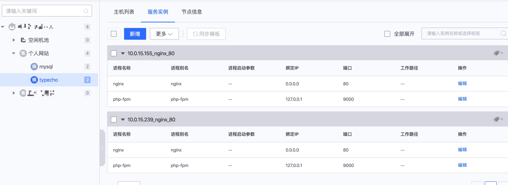
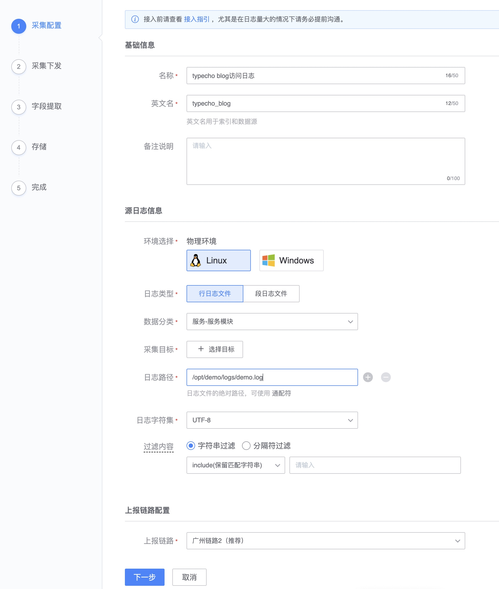
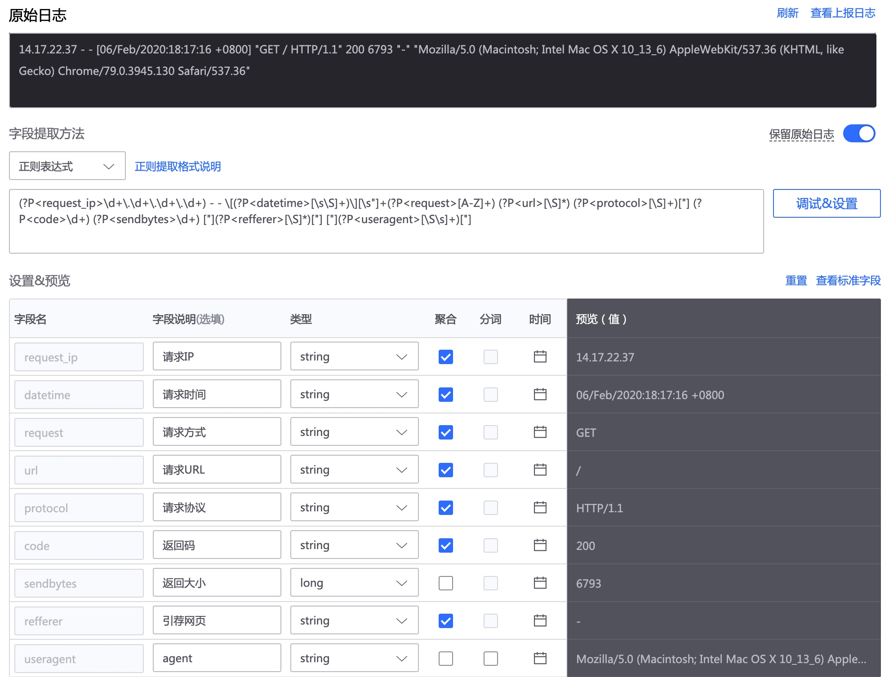

# Quick access

Quick access uses a simple website as a reference example, so that you can have a basic understanding of the use of the monitoring platform.

Rough steps:

* DEMO site: Understand the website structure and determine monitoring points
* Preparation: CMDB configuration and preparation
* Demo 1: Quick access to host and process monitoring
*Demo 2: Quickly implement business monitoring

## DEMO site: Understand the website structure and determine monitoring points

| Purpose | IP | Process | Description |
| ------------ | ----------- | ------------------ | --------------- |
| web1 | 10.0.0.1 | nginx php-fpm | typecho blog program |
| web2 | 10.0.0.1 | nginx php-fpm | typecho blog program |
| mysql master | 10.0.0.1 | mysql mysqld_safe | database master |
| mysql slave | 10.0.0.1 | mysql mysqld_safe | database slave |

In order to ensure the stability of this BLOG website, a comprehensive monitoring needs to meet at least the following monitoring requirements:

1. Operating system data of 4 hosts -- monitoring the stability of the hosts
2. Process data on 4 hosts -- monitor the running data and survival of the process
3. Component operation data of nginx, php-fpm, mysql -- Monitor the operation data of components
4. Log data of the blog program -- collecting log positioning and log keyword alerts
5. Website dial-up test data -- remote monitoring of website availability

> The blog program chose [typecho](http://typecho.org/), a lightweight program, as an example.

## Preparation: CMDB configuration and preparation

* [Create Business](../../../../CMDB/3.10/UserGuide/Feature/BusinessManagement.md)
* [Create cluster](../../../../CMDB/3.10/UserGuide/Feature/SetTemp.md)
* [Create module](../../../../CMDB/3.10/UserGuide/Feature/Model.md)

     > If the process configuration is the same on each machine, it is recommended to use the functions of cluster template and service template.
     > If the process configuration is different on each machine, it is recommended to check [How to implement multi-instance monitoring](../ProductFeatures/integrations-metrics/multi_instance_monitor.md)

For more information, please see [Preparation](./prepare.md)

web configuration

mysql configuration

For more process configuration methods, see [Process Configuration Type](../scene-process/process_cases.md)

## Demo 1: Quick access to host and process monitoring

After configuring the process information, you will see the corresponding collected data in "Host Monitoring".

The platform comes with default policies. Please view [Built-in Policies](../ProductFeatures/scene-host/builtin_host_rules.md) for details. When the built-in policies do not meet the needs, you can add monitoring policies.

Configure process port monitoring: Navigation → Monitoring Configuration → Policy → New
View alarm information in the event center: Navigation → Event Center

For more information, please view:

* [Enable host monitoring](../ProductFeatures/scene-host/host_monitor.md)
* [Enable process monitoring](../ProductFeatures/scene-process/process_monitor_overview.md)

## Demonstration 2: Quickly complete business monitoring

There are two commonly used types of business monitoring:

1) Logs generated by the program itself, analysis and alarms based on the logs
2) Indicator data generated by the program to understand the operating status of business functions

### Configure service-log monitoring of service module

Collect program access logs

Log platform: Navigation → Management → Collection → Log collection → New

- Field extraction-formatted data

### Supplement business monitoring through customized reporting

If you want to report monitoring data directly in the business code, there are methods such as SDK, command line tools, and HTTP.

1. HTTP JSON data format
2. Prometheus Metrics data format

Navigation: Integrations → Custom Metrics

For details, see [Custom reporting function](../ProductFeatures/integrations-metrics/custom_metrics_http.md)