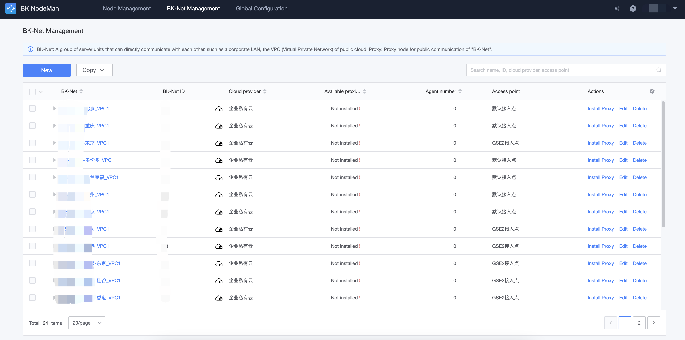

# BK-Net Manage 

A BK-Net is a group of server units that can communicate directly with each other, such as a local area network within an enterprise or a public cloud VPC (Virtual Private Cloud). 

When BlueKing is initially deployed, a "direct mode" is created by default. When the host can directly communicate with the network where BlueKing is deployed, the agent is installed in this zone. 

If the enterprise network is divided into regions, such as the isolation between the office network and the production network, the isolation between the head office and the branch network, and the isolation between the domestic service network and the foreign service network, multiple BK-Nets can be created according to the actual network connectivity planning. 

## Viewing BK-Net 

Click "BK-Net Manage" to view the existing BK-Nets. The initial deployment of BlueKing is complete, and this list is empty. It is important to note that BK-Net viewing requires authorization.

## Create a BK-Net 

**Step 1: Create a BK-Net.** 

On the BK-Net Manage page, click "New" to create a new cloud region. Explanation of BK-Net parameters: 
- BK-Net Name: the unique ID of the cloud zone. In BlueKing, this name must be unique 
- Cloud Service Provider: This is used to identify the provider of the current network. For enterprise private cloud, select Enterprise Private Cloud. For the network provided by public cloud, BlueKing has provided a list of common domestic and foreign vendors for selection by default. 
- Access Point: When there are multiple access points in Global Setting, you can define which access point is used to communicate with BlueKing in the current BK-Net. 

**Step 2: "Continue to Install Proxy" will be prompted after success submission.** 

Since the customized BK-Net is isolated from the network, you cannot continue to install the agent under it before installing the proxy. Therefore, it is recommended to select "Install Proxy" to configure the proxy. 
If you do not have the network or CVM resource ready for the proxy, you can install the proxy in the BK-Net Manage at any time. 

**Step 3: Enter Proxy Install Parameters**

Detail of the parameters required for install are explained below: 

- LAN IP: The IP that can communicate with the agent on the network 
- External communication IP: The IP that can communicate with the access point 
- Login IP: The IP of the proxy host that can be SSH logged in from BlueKing. This is an optional configuration. If it is not entered, the private IP will be used by default. 
- Authentication method: Supports password or key 
- Operation system: The host used as a proxy must be a 64-bit Linux system 
- Login port: The port where SSH connections can be made 
- Login account: It is recommended to use the root account. If you cannot use the root account, you must enter the account to execute the /tmp/setup_agent.sh script without secret. 
- Attributed Business Name: Used to define which business is entered into the BlueKing Configuration System after the proxy is installed. Please note that you must get the business name permissions of BlueKing Configuration System to perform this action 

## Proxy Query 

After the BK-Net complete install, click the cloud region title to view the proxy detail under the cloud region.

If you have not installed a proxy before, you can click New to continue installing a proxy. 
If a proxy already exists, you can decide whether to install multiple proxies according to the actual needs of your enterprise to achieve higher availability and load balancer requirements. 

## Uninstalling Proxy 

To uninstall the proxy of a BK-Net, click the name of the cloud region to view the existing proxies. 
Before uninstalling, you need to confirm that the current proxy has no agent connected to it. Failure to do so will result in failure. 

## Delete a BK-Net 

Before deleting a BK-Net, you need to confirm that the proxy in the current cloud region has been completely uninstalled.
