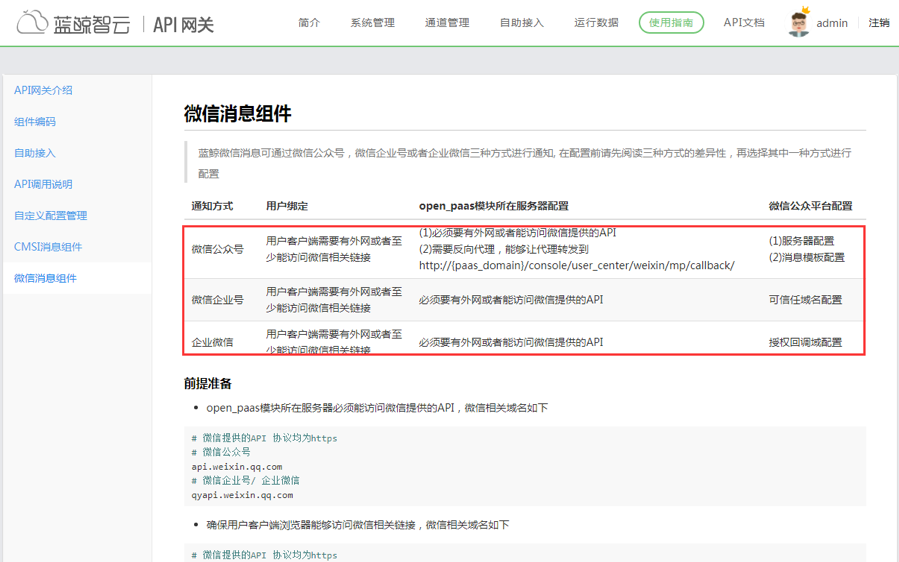
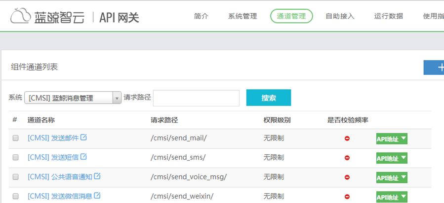
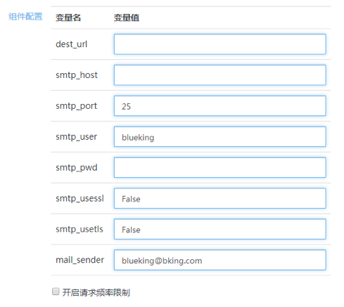
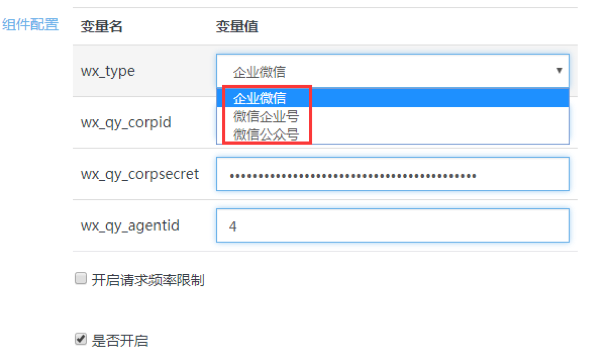

# How to Configure Notification Channels, Such as Email, WeChat, SMS, etc.

BlueKing has built-in notification channels for email and WeChat. Enter the "Developer Center" -> "API Gateway" -> "User Guide" -> "WeChat Message Component" with the role of "admin" to refer to the detailed tutorial for configuration. This configuration is a universal setting within the entire BlueKing system.

Notification Channel Configuration Entry

Warm Tips:

Since the software is privately deployed for internal use within an enterprise, the enterprise needs to provide existing notification channels such as email, WeChat, and SMS.

1. Email: You can use an existing email account.
2. WeChat: You can apply for an account on the WeChat official website. BlueKing does not provide public accounts, please ensure you can access [weixin.qq.com](https://weixin.qq.com/).
3. SMS: The default is Tencent Cloud's SMS channel, which requires users to purchase Tencent Cloud's SMS service.

All three notification channels provide a page-based configuration method without the need for secondary development; if you want to make revisions, you can adjust the coding in the background.

Notification Channel API

Click on the parameter information displayed at the bottom of "Send Email".

Email Channel Configuration Parameter Diagram

- dest_url: If the user is not proficient in Python, you can provide an interface in another language and fill it into dest_url. The ESB will only forward the request to complete the email configuration.

- smtp_host: SMTP server address (note the difference between corporate and personal email)

- smtp_port: SMTP server port (note the difference between corporate and personal email)

- smtp_user: SMTP server account (same as mail_sender)

- smtp_pwd: SMTP server account password (usually an authorization code)

- smtp_usessl: (default is 1)

- mail_sender: Default email sender (same as smtp_user)

Click on the parameter information displayed at the bottom of "Send WeChat Message".

WeChat Channel Configuration Parameter Diagram
