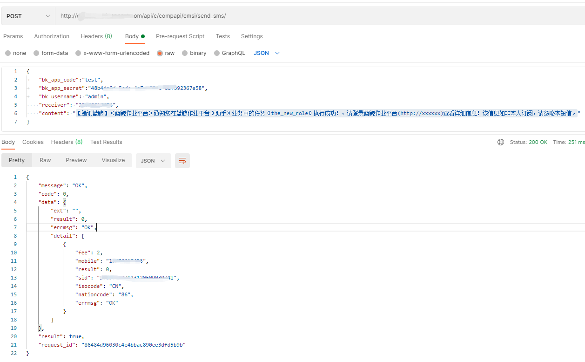

# Configure Message Notifications: SMS

Configuration Address: Enter "Developer Center" with the role of "admin" -> "API Gateway" -> "Component Management" -> Select the system "[CMSI] BlueKing Message Management" -> Select "[CMSI] Send SMS"

## Component Configuration

- dest_url: If the user is not proficient in Python, you can provide an interface in another language and fill it in dest_url. The ESB will only forward the request to complete the SMS configuration.
- qcloud_app_id: SDK AppID
- qcloud_app_key: App Key
- qcloud_sms_sign: The signature applied for on Tencent Cloud SMS, e.g., Tencent Technology

## Component Example

This example uses Tencent Cloud SMS as an example.

### 1. Create a Signature

First, go to Tencent Cloud Cloud Products -> SMS


Domestic SMS -> Signature Management -> Create Signature


> Note: Domestic SMS consists of signature + body text, and the signature symbol is 【】 (Note: full-width). The signature must be included when sending SMS content;

### 2. Create a Body Template

Domestic SMS -> Body Template Management -> Create Body Template

Template Example: {1} is your login verification code, please fill it in within {2} minutes. If it's not operated by you, please ignore this SMS. (Where {1}, {2} are customizable content, must be numbered consecutively starting from 1, such as {1}, {2}, etc.)

> Note: The SMS template content cannot contain 【】 symbols


Template Instance: "BlueKing Operation Platform" notification {1}. If you did not subscribe to this information, please ignore this SMS.

### 3. Create an Application

Application Management -> Application List -> Create Application


Click on the application name -> Obtain SDK AppID, App Key


### 4. Configure Channel

Enter "Developer Center" with the role of "admin" -> "API Gateway" -> "Channel Management" -> Select the system "[CMSI] BlueKing Message Management" -> Select "[CMSI] Send SMS"

```bash
qcloud_app_id: SDK AppID
qcloud_app_key: App Key
qcloud_sms_sign: Tencent BlueKing
```

Is it enabled: Yes

Submit changes


Submit changes after filling in

### 5. Test Interface

Using Postman tool request as an example

```bash
http://{PaaS_URL}/api/c/compapi/cmsi/send_sms/
```

```json
{
    "bk_app_code":"test",
    "bk_app_secret":"test",
    "bk_username": "admin",
    "receiver": "telephone number",
    "content": "【Tencent BlueKing】"BlueKing Operation Platform" notifies you that the task "the_new_role" in the "Assistant" business of BlueKing Operation Platform has been successfully executed! Please log in to the BlueKing Operation Platform (http://xxxxxx) to view detailed information! If you did not subscribe to this information, please ignore this SMS."
}
```


<center>Test Interface</center>


<center>Successfully received on mobile phone</center>

### 6. Troubleshoot Interface Issues

Check related log information by logging into the PaaS machine

```bash
tail -f /data/bkce/logs/open_paas/esb.log
```

### 7. FAQ

1. "message": "Signature format error or signature not approved"

Solution: Please go to Tencent Cloud SMS -> Domestic SMS -> Body Template Management -> Create Body Template

2. "message": "Verification code template parameter format error"

Solution: Please refer to the approved body template for sending emails, mainly pay attention to the position and spacing of template parameters.