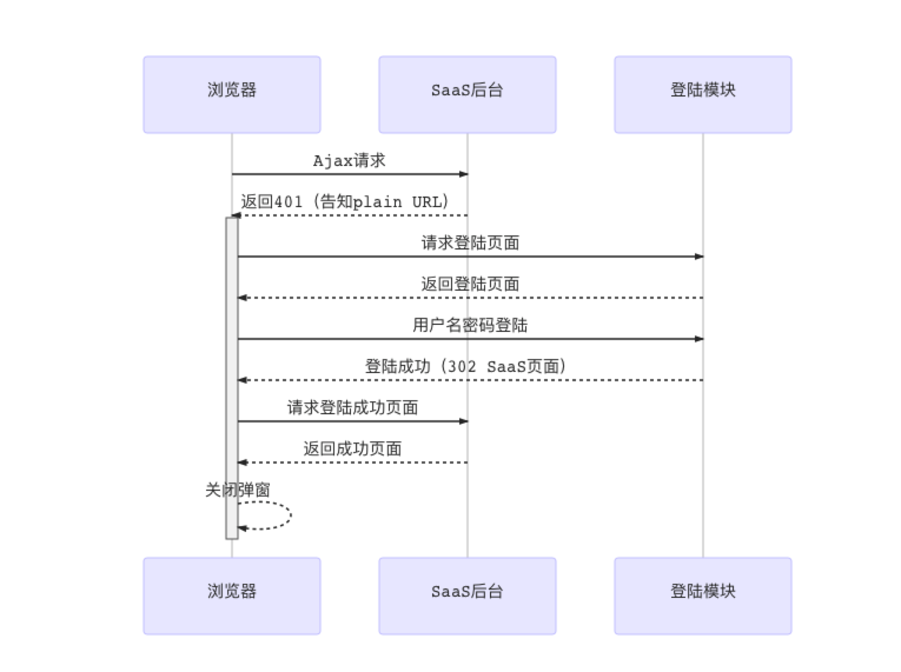

# In-app login pop-up window adaptation solution
## Overall implementation idea

The solution mainly solves the problem that when the login state is invalid, the ajax request will not trigger the overall page refresh, but a small login window will pop up in the page, so that users can retain the unsaved content of the current page. The main process is as follows:


## Sample code (Python project as an example)

- login.js
- Purpose: When the ajax request returns 401, the content returned by the request can be identified and a pop-up window can be opened

```javascript
/**
* Login-related JS, where remote_static_url & static_url come from global variables
*/

document.write(" <script lanague=\"javascript\" src=\""+remote_static_url+"artdialog/jquery.artDialog.js?skin=simple\"> <\/script>");

/**
* Do some unified public processing for AJAX requests, currently mainly processing the login page
*/
$.ajaxSetup({
    statusCode: {
        401: function(xhr) {
            var response = JSON.parse(xhr.responseText);
             // Confirm whether the current version supports Iframe login
            if (!response.has_plain) {
                window.location.reload();
            }

            try{
                window.top.BLUEKING.corefunc.open_login_dialog(response['login_url']);
            }catch(err){
                open_login_dialog(
                    response['login_url'], response['width'], response['height']);
                }
        }
    }
});

/**
* Open the login window
*/
function open_login_dialog(src, width, height){
    var login_html = '<div class="mod_login" id="loginbox" style="padding: 0px 0px; visibility: visible;" align="center">' +
                     '<iframe name="login_frame" id="login_frame"  width="100%" height="100%" frameborder="0" allowtransparency="yes"  src="'+src+
                     '" style="width:'+width+'px;height:'+height+'px;"></iframe>' +
                     '</div>';
    art.dialog({
        id:"401_dialog",
        fixed: true,
        lock: true,
        padding: "0px 0px",
        content: login_html
    });
}

/**
* Close the login box
*/
function close_login_dialog(){
    art.dialog({id: '401_dialog'}).close();

    try {
        window.close_login_dialog_after();
    } catch(err){}
}
```

- Login_success.html
- Purpose: After the user successfully logs in, trigger the closing of the login pop-up window

```html
<!DOCTYPE html>
<html>
    <head>
        <title>Login successful</title>
        <script src="{{ REMOTE_STATIC_URL }}jquery/jquery-1.7.2.min.js"></script>
        <script src="{{ REMOTE_STATIC_URL }}jquery/jquery.json-2.3.min.js"></script>
        <link href="{{ REMOTE_STATIC_URL }}bk/bk.css" rel="stylesheet" type="text/css"/>
    </head>
    <body>
        <div class="errors-login-failure-wrap box">
            <div class="errors-login-fialure-con clearfix" style="border: none;">
                
                <h1>Login successful</h1>
            </div>
        </div>
    </body>
    <script type="text/javascript">
        $(document).ready(function () {
            // Close the login popup
            try{
                window.top.BLUEKING.corefunc.close_login_dialog();
            }catch(err){
                try{
                    window.parent.close_login_dialog();
                }catch(err){}
            }
        });
    </script>
</html>
```

- Login failure 401 return format
- Purpose: Tell the browser the URL to open the login pop-up window and the pop-up window size

```json
{
  "login_url": "https://{PaaS_URL}:443/login/plain/?c_url=https%3A//{PaaS_URL}/t/framework-login/account/login_success/&app_code=framework-login",
  "width": 460,
  "height": 490,
  "has_plain": true
}
```
> **Note**: c_url tells the platform which page to redirect the user to after a successful login. Here, we redirect the user's browser to login_success.html above to close the pop-up window

## Notes

- For developers using the Python development framework, you can update to the latest development framework and change the `IS_AJAX_PLAIN_MODE` configuration to `True` to complete the adaptation

- The above js sample is a configuration sample sent using jquery according to ajax, and each project should be adjusted as needed

- Note that the test needs to be performed on the same domain name or with a cross-domain header, otherwise there will be cross-domain problems when closing the pop-up window