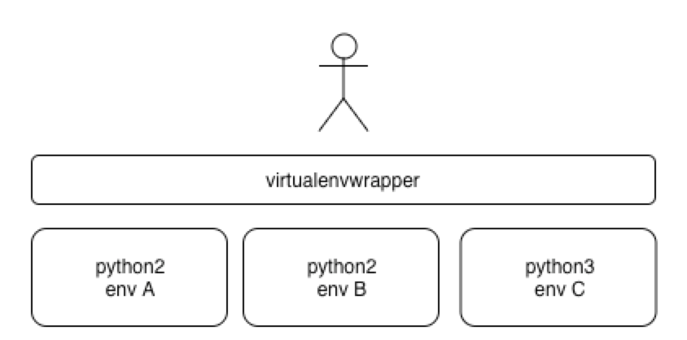

### Overall introduction of the solution

In order to facilitate developers to use existing environment configurations, the following solution uses the ability of Python's virtualenv module to create multiple independent Python environments, solving the problem of mutual independence between Python2 and Python3 development environments.

At the same time, in order to lower the threshold for using virtualenv, the solution also uses the virtualenvwrapper module to facilitate us to create, copy and delete various virtual environments.



Of course, there are other solutions in the Python ecosystem, which developers can refer to:

- [pyenv](https://github.com/pyenv/pyenv)

- [pipenv](https://github.com/pypa/pipenv)

### Install Python3 & virtualenvwrapper

- [MacOS environment]

First, we go to the Python official website to download the latest Python installation package: [Python download address](https://www.python.org/downloads/).

It is strongly recommended that you use the installer (Installer) to install. Because if you use the source code to install, you will encounter the openssl development dependency environment and macOS system restrictions, which will bring you various troubles.

- [Linux environment]

It is recommended that you use the Python source package for installation. The advantage of this is that we can specify the Python installation path to ensure that the newly installed Python3 will not affect existing system tools, such as yum.

Here, it is recommended that readers use the Python 3.6.3 source code installation because Python3.7 and later have restrictions on the openssl version, but the openssl version provided by the company's intranet yum source cannot meet the requirements, which will cause the openssl module to be missing when installing Python3.7, thus affecting the use of pip.

The source code installation command is as follows:

```bash
tar -zxf Python-3.6.3.tgz
cd Python-3.6.3
# Customize the installation path to /opt/python36
./configure --prefix=/opt/python36
# Compile and install
make -j 4
make install
export PATH=/opt/python36/bin:$PATH
```

- 【Windows environment】

When installing on Windows, you need to use a custom installation path. You can refer to the following video: [Windows installation instructions](https://www.youtube.com/watch?v=V_ACbv4329E).

> Readers should note that you need to modify the PATH environment variable after installation.

- 【virtualevnwrapper installation】

After the installation is complete, you can find that a new [python3] command has been added locally. Of course, don't worry about losing the system's own Python2 environment, the installer will keep this Python2. As shown below:


Next, we need to install virtualenvwrapper to help us create an independent virtual environment. Windows users need to note that virtualenvwrapper-win is installed.

```bash
# Install virtualenvwrapper
# Windows users, install virtualwrapper-win
$ sudo pip install virtualenvwrapper
...
# Specify the directory where the virtual environment is placed, which can be adjusted as needed
$ export WORKON_HOME=~/Envs
# Create a good path
$ mkdir -p $WORKON_HOME
# Add the virtualenvwrapper command and environment preparation. It is recommended that this command be placed in ~/.bash_profile
$ source /usr/local/bin/virtualenvwrapper.sh
```

### Split environment

After installation, we can first take a look at the help menu of virtualenv, as shown below:


-p This parameter is the key to the implementation of the entire solution. We can use this parameter to specify the Python interpreter path used by the virtual environment. By default, the parameter uses the interpreter /usr/bin/python.

Therefore, we can specify different interpreter paths to create different virtual environments for Py2 and Py3. The operation is as follows:
```bash
$ mkvirtualenv test_python2_env
New python executable in /Users/.virtualenvs/test_python2_env/bin/python
Installing setuptools, pip, wheel...done.
virtualenvwrapper.user_scripts creating /Users/.virtualenvs/test_python2_env/bin/predeactivate
virtualenvwrapper.user_scripts creating /Users/.virtualenvs/test_python2_env/bin/postdeactivate
virtualenvwrapper.user_scripts creating /Users/.virtualenvs/test_python2_env/bin/preactivate
virtualenvwrapper.user_scripts creating /Users/.virtualenvs/test_python2_env/bin/postactivate
virtualenvwrapper.user_scripts creating /Users/.virtualenvs/test_python2_env/bin/get_env_details
(test_python2_env) $ python
Python 2.7.10 (default, Aug 17 2018, 17:41:52)
[GCC 4.2.1 Compatible Apple LLVM 10.0.0 (clang-1000.0.42)] on darwin
Type "help", "copyright", "credits" or "license" for more information.
>>> ^D
(test_python2_env) $ mkvirtualenv test_python3_env -p /usr/local/bin/python3
Running virtualenv with interpreter /usr/local/bin/python3
Using base prefix '/Library/Frameworks/Python.framework/Versions/3.6'
New python executable in /Users/.virtualenvs/test_python3_env/bin/python3
Also creating executable in /Users/.virtualenvs/test_python3_env/bin/python
Installing setuptools, pip, wheel...done.
virtualenvwrapper.user_scripts creating /Users/.virtualenvs/test_python3_env/bin/predeactivate
virtualenvwrapper.user_scripts creating /Users/.virtualenvs/test_python3_env/bin/postdeactivate
virtualenvwrapper.user_scripts creating /Users/.virtualenvs/test_python3_env/bin/preactivate
virtualenvwrapper.user_scripts creating /Users/.virtualenvs/test_python3_env/bin/postactivate
virtualenvwrapper.user_scripts creating /Users/.virtualenvs/test_python3_env/bin/get_env_details
(test_python3_env) $ python
Python 3.6.6 (v3.6.6:4cf1f54eb7, Jun 26 2018, 19:50:54)
[GCC 4.2.1 Compatible Apple LLVM 6.0 (clang-600.0.57)] on darwin
Type "help", "copyright", "credits" or "license" for more information.
>>>
```
In the above operation, we first created a virtual environment using the default Python interpreter.

After the creation is complete, we enter Python and observe that the corresponding version is 2.7.x.

Next, the author created another virtual environment using the specified Python interpreter path. After the creation is complete, we enter Python and observe that the corresponding version is 3.6.x.

At this point, two independent and non-interfering Py2 and Py3 environments have been created.

If you need to switch between different environments, use the workon command to switch.