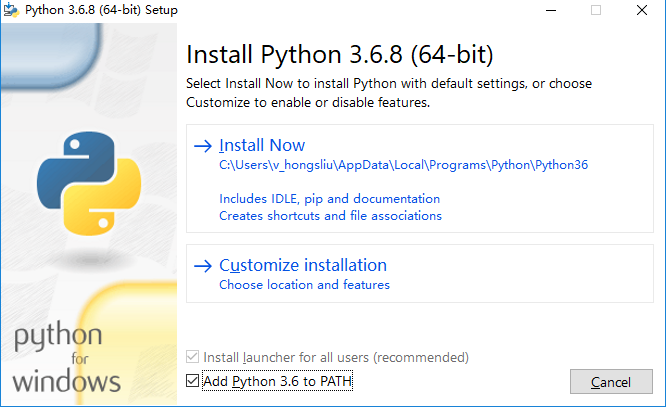

# Output Hello, World under Windows

`Windows 10` outputs `Hello, World!` based on `BlueKing Development Framework 2.0`

## Environment preparation

1. Build the BlueKing environment and configure the host to access BlueKing normally

2. Install Python 3.6.X, MySQL 5.X, git, and development tools (Pychram or Visual Studio code)

3. Create a project code repository, create a BlueKing application, download the development framework to the local and unzip

> Note: Paid tools need to be purchased by yourself

### Install Python 3.6.X

Download [Windows x86-64 executable installer](https://www.python.org/downloads/) of Python 3.6.X (now generally 64-bit system)

Check `Add Python 3.6 to PATH` and follow the prompts to install.



The installation package will automatically install `pip`


### Install MySQL 5.X

- [Download MySQL from the official website](https://dev.mysql.com/downloads/mysql/), select the `.msi` file to download, and follow the prompts to install.

- Database management tools

Navicat Premium, phpMyAdmin, DBeaver, MySQL Workbench, etc.

### Install git

- [Download git from the official website](https://git-scm.com/download/win), download the `Git-xxx-64-bit.exe` file, and follow the prompts to install. Please refer to [Official Installation Document](https://git-scm.com/book/zh/v2/Start-Installation-Git)

- git management tools

Sourcetree, GitHub Desktop, Fork, TortoiseGit, development tool Git plug-in, etc.

### Create a project code repository

Before creating an application, you need to prepare a code repository (Git/SVN) in advance. `Git` is recommended

Create a code repository, such as `GitHub` or `GitLab` or `Gitee`

### Create a BlueKing application

- Create an application in the Developer Center

Enter `BlueKing PaaS Platform` -> `Developer Center` -> `Application Creation`, fill in the `git` warehouse address and account obtained in the previous step, and after successful creation, you will get `Application ID:{APP_ID}`, `Application TOKEN:{SECRET_KEY}`, these two variables will be used later.

### Download the development framework to local

Go to [BlueKing Tool Download](../../../../downloads/7.0/Index.md), download the latest development framework to local, and unzip it

## Initialize the development framework

1. Configure local hosts

2. Configure virtual environment

3. Configure environment variables

4. Create a local database

5. Install framework dependencies

6. Initialize local database

7. Start local project

### Configure local hosts

- Modify local hosts first

```127.0.0.1 dev.{PAAS_URL}```

Example: `127.0.0.1 dev.paas.bktencent.com`

> To start the development framework, you need to use the domain name


### Configure the virtual environment

> Optional: Ignore if there is only one development project. Pycharm can help create a virtual environment.

- [Modify pip source](https://pip.pypa.io/en/stable/user_guide/#config-file) (domestic mirror)

Create a `pip` folder in the `C:\Users\{YOUR_USERNAME}\AppData\Roaming` directory (Windows 10 hides the `AppData` directory by default, you need to remove the hidden directory first), and create `pip.ini` in the pip folder

```bash
[global]
trusted-host = pypi.tuna.tsinghua.edu.cn
index-url = https://pypi.tuna.tsinghua.edu.cn/simple/
```

- Install [pipenv](https://zhuanlan.zhihu.com/p/37581807) or virtualenv (recommended)

```bash
pip3 install pipenv
```

- Create a virtual environment

```bash
pipenv install
```

- Activate virtual environment

```bash
pipenv shell
```

### Configure environment variables

Modify `BK_URL` in config/\_\__init\_\_.py
```bash
BK_URL = os.getenv("BK_PAAS_HOST")
```

Add environment variables

BK_PAAS_HOST=`PaaS_URL`
APP_ID=`APP_CODE`
APP_TOKEN=`SECRET_KEY`(Application TOKEN)

The methods for setting environment variables are different in different development environments. Commonly used ones are:
- [How to set environment variables on Mac](https://apple.stackexchange.com/questions/106778/how-do-i-set-environment-variables-on-os-x)
- [How to set environment variables on Windows](https://stackoverflow.com/questions/32463212/how-to-set-environment-variables-from-windows?noredirect=1&lq=1)

If you need to configure multiple sets of environment variables when developing different SaaS locally, you can use some project-based environment variable setting solutions. Commonly used ones are:
- [Set environment variables in PyCharm](https://stackoverflow.com/questions/42708389/how-to-set-environment-variables-in-pycharm): When running SaaS in PyCharm, PyCharm will read different environment variable values ​​according to different project configurations.
- [Setting environment variables in the postactive file in the virtualenv virtual environment](https://stackoverflow.com/questions/9554087/setting-an-environment-variable-in-virtualenv): This approach requires using different virtual environments in different projects, and the corresponding environment variable values ​​can be automatically loaded each time the virtual environment is activated.

### Create a local database

Open `MySQL` command line execution

```bash
CREATE DATABASE `{APP_CODE}` default charset utf8 COLLATE utf8_general_ci;
```

> If {APP_CODE} contains a hyphen (-), you need to use backticks (`) to translate it, otherwise an error will be reported

> `ERROR 1064 (42000): You have an error in your SQL syntax; check the manual that corresponds to your MySQL server version for the right syntax to use near '-blueking' at line 1`

And modify the `DATABASES` configuration item in `config/dev.py`

When multiple people are developing, local configurations that cannot be shared can be placed in the newly created local_settings.py file, and local_settings.py can be added to the version management ignore file

### Install framework dependencies

- Install framework dependency packages

```bash
pip3 install -r requirements.txt
```

### Initialize local database

- Initialize local database (in the project root directory)

```bash
python manage.py migrate
```

### Start local project

- Start

```bash
python manage.py runserver dev.{PAAS_URL}:8000
```

- Local access

Use a browser to access ```http://dev.{PAAS_URL}:8000``` , and you can see the development framework


## Hello,World

- Modify view home_application/views.py

```python
from django.http import HttpResponse
def hello(request):
return HttpResponse('Hello World!')
```

- Add route home_application/urls.py

```bash
url(r'^$', views.hello),
```

- Re-run `runserver`, or save in `Pycharm` to automatically re-run

