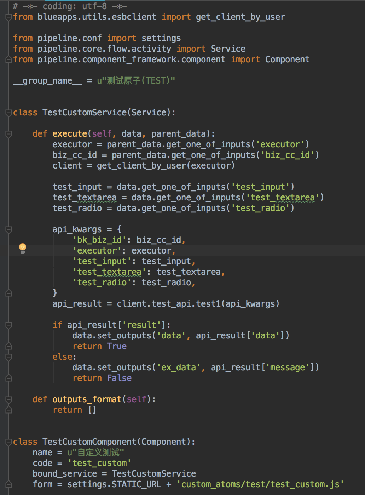
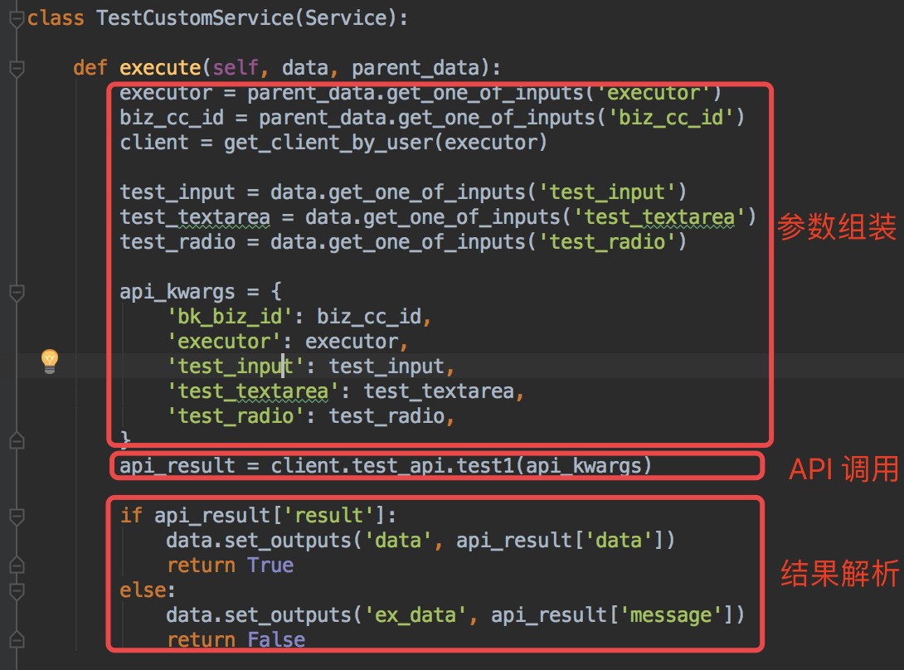
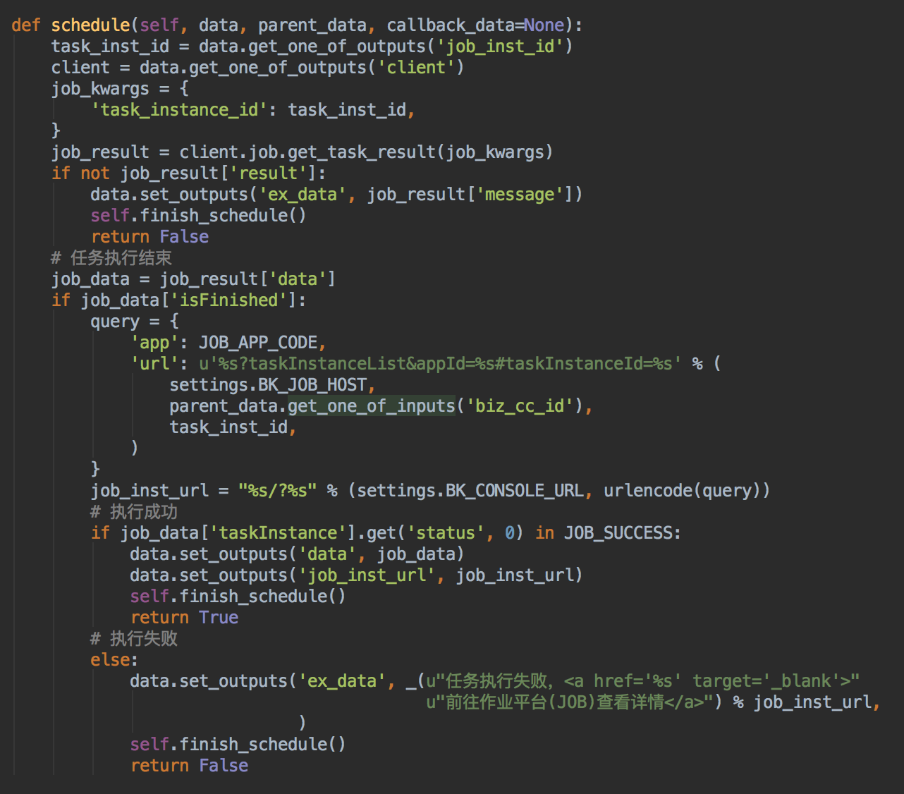

 # Standard Plugin Backend Develop 

 Create a test.py file in the custom_atoms/components/collections directory, where the attributes and classes to be definition are shown below. 

  

 test.py Detailed properties: 
 - **__group_name__** ： Service Classification of Standard Plugin (usually the system abbreviation of the corresponding API, such as CMDB (CC)) 
 - class TestCustomService(Service)： Standard Plugin background execute logic 
 - **__need_schedule__** = True： Whether it is execute asynchronously. Default is False. 
 - interval = StaticIntervalGenerator(5)： Polling Alert Rules for asynchronous Standard Plugin 
 - def execute： Front-end Parameter acquisition, API parameter assembly, result analysis, result Output 
 - def schedule： Polling logic, result Output 
 - def outputs_format： Output Parameters Format 
 - class TestCustomComponent(Component)： Standard Plugin definition 
 - name: Standard Plugin Name 
 - code: unique code 
 - bound_service： Binding backend Service 
 - form: path of front-end form definition file  

 Detailed explanation of execute Function in TestCustomService: 
 - It can be any Python Code. If it corresponds to ESB API call, it is generally divided into Parameter assembly, API call and result parsing. 
 - data is the Standard Plugin front-end Data, corresponding to the front-end form, you can use get_one_of_inputs to obtain One Parameters; execute is finish, the Return value and abnormal information (ex_data) can be written using set_outputs. 
 - parent_data is the Common Params of the Task, including extutor-execute, operator-Operation, and biz_CC_id serviceId  For details, view gcloud/taskflow3/utils.py. 
 - Return True to indicate SUCCEED of the Standard Plugin and False to fail. 

  

 Detailed explanation of execute Function in TestCustomService: 
 - Back to list format. 
 - Each item in the list format definition a Return Field, which is a subset of the fields Output by set_outputs in the execute Function; key-Output Field ID, name-output field meaning, type-output Type (str, int and other Python Data Schema). 

  

 Detailed explanation of the shedule Function in TestCustomService: 
 - The interval controls the invocation of Alert Rules, such as pipeline.core.flow.activity.StaticIntervalGenerator (how many Second to poll), DefaultIntervalGenerator (twice the Intervals of the previous poll). 
 - End the poll with self.finish_schedule. 
 - Return True to indicate SUCCEED of the Standard Plugin and False to fail. 

  