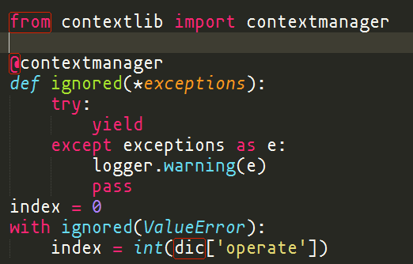
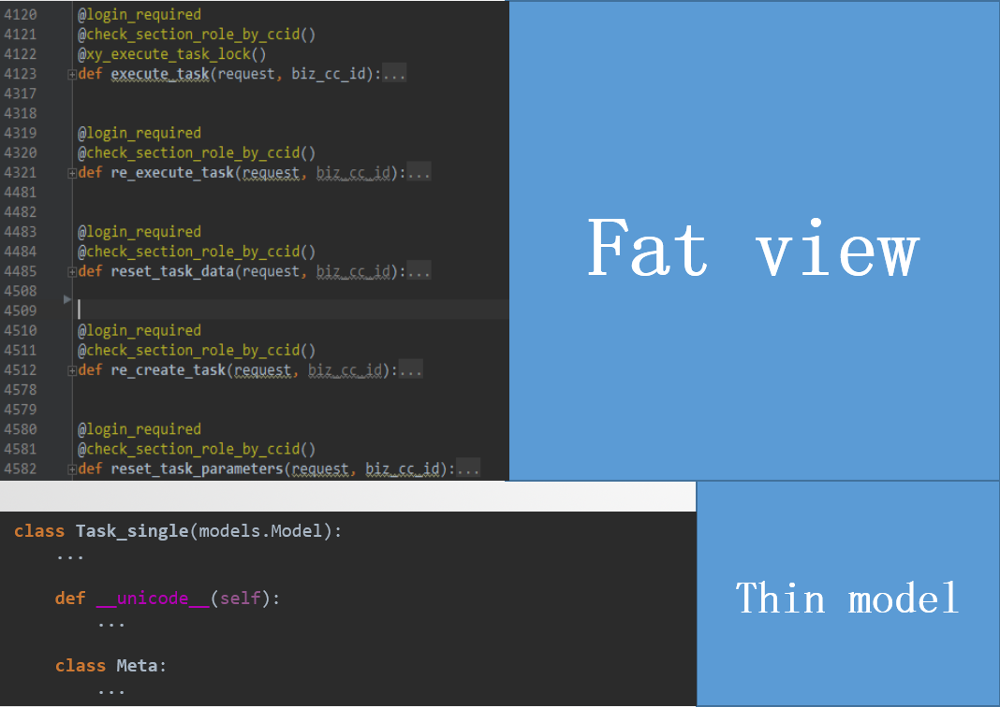

## 1.【必须】代码编码

1. 国际惯例，文件编码和 python 编码格式全部为 utf-8，例如：在 python 代码的开头，要统一加上 `#-*- coding: utf-8 -*-`，或者其他符合正则表达式`^[\t\v]*#.*?coding[:=][\t]*([-_.a-zA-Z0-9]+)`的编码声明方式。详情参考：<https://www.python.org/dev/peps/pep-0263/#defining-the-encoding>

2. python 代码中，非 ascii 字符的字符串，请需添加 u 前缀

        # -*- coding: utf-8 -*-plainplainplainplainplainplainplainplain
        a = u"中国"


3. 若出现 python 编码问题，可按照以下操作尝试解决

    在 python 的安装路径中下的/Lib/site-packages 下面创建文件 sitecustomize.py，内容如下：

        import sysplainplainplainplainplain
        sys.setdefaultencoding('utf-8')


    如果没有加入该文件，则在有编码问题的.py代码中，加入以下代码：plainplainplainplainplain

        import sys
        reload(sys)


### 2 Python 编码规范

#### 2.1 【必须】Python 命名规则

1. 包名、模块名、局部变量名、函数名: **全小写+下划线式驼峰**

    示例：`this_is_var`

2. 全局变量: **全大写+下划线式驼峰**

    示例：`GLOBAL_VAR`

3. 类名: **首字母大写式驼峰**

    示例：`ClassName()`

#### 2.2 变量命名规范

无论是命名变量、函数还是类，都可以使用很多相同的原则。我们可以把名字当做一条小小的注释，尽管空间不算很大，但选择一个好名字可以让它承载很多信息。
所以，命名的关键思想是“把信息装入名字中”，主要有以下一些技巧:

- 选择专业的词。
- 避免泛泛的名字（或者说要知道什么时候可以使用泛泛的名字）。
- 用具体的名字代替抽象的名字。
- 使用前缀或者后缀给名字附带更多信息。
- 决定名字的长度。
- 利用名字的格式来表达含义。
- 使用避免误解的名字。

##### 选择专业的词

“把信息装入名字中”包括要选择非常专业的词，并且避免使用“空洞”的词。

```python

# 例子 1
def get_size():
    # ...


# 例子 2
class Thread(object):
    def stop():
        # ...
```

例子 1 中， `get` 这个词非常不专业，可能是从本地缓存获取、从数据库获取、从远程数据源获取，更专业的名字应该是 `acquire`、`query`、`fetch` 等。 `size` 也没有承载很多信息，可能表示高度、数量、空间，更专业的词应该是 `height`、`num_nodes`、`memory_bytes` 等。

例子 2 中，`stop` 这个名字也不够专业，如果是个重量级操作，不可恢复，不如改为 `kill`；如果可以恢复，可以改为 `pause`，这样也许会有对应的 `resume` 方法。

选择专业的名字，一般也更有表现力，下面更多的例子，可能适合你的语境。

单词 | 更多专业的选择
---|---
send | deliver、dispatch、announce、distribute、route
find | search、extract、locate、recover
start | launch、create、begin、open
make | create、set up、build、generate、compose、add、new

##### 避免像 tmp 和 retval 这样泛泛的名字

使用像 `tmp`、`retval`、`foo` 这样的名字往往是“我想不出名字”的托辞，好的名字应该描述变量的目的或者它所承载的值。

例如 `tmp` 只应该应用于短期存在且临时性为其主要存在因素的变量。一般情况下，需要使用时最好带上类型，如 `tmp_file`。

另外，大家一般使用 `i`、`j`、`k`、`index` 做索引和循环迭代器。尽管这些名字很空泛，但是大家一看就知道他们的意思。不过有时候，适当优化会有更好效果。
如：

```python
for i in clubs:
    for j in i.members:
        for k in j.users:
            ...
```

把 `i`、`j`、`k` 改为 `ci`、`mi`、`ui` ，使迭代元素的首字符和数据的一致会更清晰，并且不易混淆。

##### 用具体的名字代替抽象的名字

在给变量、函数还是类命名时，要把它描述得更具体而不是更抽象。

例如 `def run_locally()` ，只能从名字看出来是要本地运行使用，但是不知道它的具体作用。如果是使用本地数据库，可以改为 `def use_local_database()` 。

##### 使用前缀或者后缀给名字附带更多信息

如果你的变量是一个度量的话，最好把名字带上单位。例如 `start_secs`、`size_md`、`max_kbps` 等。

这种给名字附带额外信息的技巧不限于单位，对于这个变量存在危险或者意外的时候都应该采用。下面有更多的例子可以参考。

背景 | 变量名 | 更好的名字
---  |  ---   | ---
一个“纯文本”的密码，需要加密后存储 | password | plaintext_password
一条用户输入的注释，需要转义后才能用于显示 | comment | unescaped_comment
已转换成 UTF-8 格式的 html | html | html_utf8

##### 决定名字的长

- 在小的作用域使用短的名字  
如 `if cond: ...print(m)...`
- “不方便输入”不应该作为避免使用长名字的理由  
各种编辑器已经能支持自动补全和快速导入。
- 首字母缩略词和缩写应该是通用的  
如 `doc` 可以代替 `document`，但是 `BEManager` 没法替换 `BackendManager`，新成员会很难理解。
- 丢掉没用的词  
如果名字中的某些单词拿掉后不会损失任何消息，可以直接去掉。如 `convert_to_string` 不如 `to_string` 简短。

##### 利用名字的格式来表达含义

在 Python 中，一般使用驼峰命名表示类，小写字母加下划线用来命名模块、文件、函数、普通变量，使用大写字母加下划线命名全局变量、常量。

##### 使用避免误解的名字

- 推荐使用 `min` 和 `max` 来表示极限。
- 推荐使用 `first` 和 `last` 来表示包含的范围。
- 推荐使用 `begin` 和 `end` 来表示左闭右开的范围。
- 给布尔值命名时加上像 `is`、`has`、`should`、`to` 这样的词或者使用过去式格式的单词。

#### 2.3 【必须】import 顺序

1. 标准库

2. 第三方库

3. 项目自身的模块

不同类型的库之间空行分隔

> 注：尽量不要引用 `*`，例如 `from xxx import *`

#### 2.4 【必须】models 内部定义顺序

1. All database fields

2. Custom manager attributes

3. class Meta

4. def \_\_str\_\_()

5. def save()

6. def get_absolute_url()

7. Any custom methods

#### 2.5 异常捕获处理原则

1. 尽量只包含容易出错的位置，不要把整个函数 try catch

2. 对于不会出现问题的代码，就不要再用 try catch 了

3. 只捕获有意义，能显示处理的异常

4. 能通过代码逻辑处理的部分，就不要用 try catch

5. 异常忽略，一般情况下异常需要被捕获并处理，但有些情况下异常可被忽略，只需要用 log 记录即可，可参考以下代码：

    

#### 2.6 return early 原则

提前判断并 return，减少代码层级，增强代码可读性

#### 2.7 Fat model， thin view

逻辑代码和业务代码解耦分离，功能性函数以及对数据库的操作定义写在 models 里面，业务逻辑写在 view 里面。



改为


#### 2.8 权限校验装饰器异常抛出问题

建议权限不足时直接抛出异常，可以使用 django 自带的：

`from django.core.exceptions import PermissionDenied`

权限不足时抛出异常 `PermissionDenied`，之后应该返回什么样的页面由 handler 或者中间件去处理

#### 2.9 分 method 获取 request 参数问题

一般可以分 method 获取 request 参数，这样能够使代码更可读，且之后修改 method 时不必每个参数都修改

```python
kwargs = getattr(request, request.method)
business_name = kwargs.get('business_name', '')
template_name = kwargs.get('template_name', '')
```

#### 2.10 使用数字、常量表示状态

两种的话改为 true/false，多种改为 enum 可读性更好

#### 2.11 其他注意问题

1. 【必须】去除代码中的`print`，否则导致正式和测试环境 uwsgi 输出大量信息

2. 逻辑块空行分隔

3. 变量和其使用尽量放到一起

4. 【必须】import 过长，要放在多行的时候，使用括号，不要用 \\ 换行

        from xxx import (plainplain
                a,
                b,
                c
            )

5. Django Model 定义的 choices 直接定义在类里面

6. 【必须】参考蓝鲸应用开发框架，把 Models 的初始化代码放到 migrations 里面
