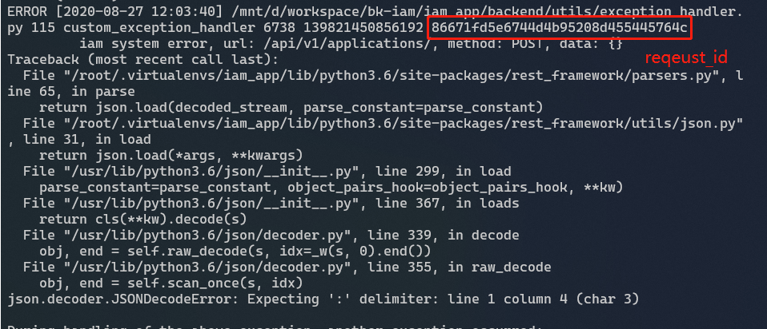
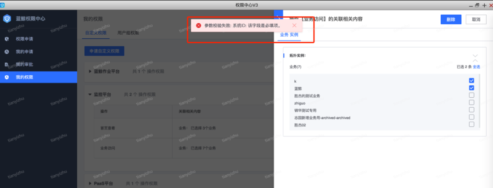
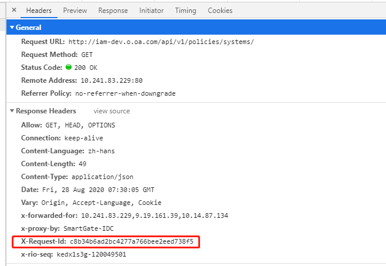

# 错误码

## 错误码总览

| 错误码 | 描述  |
| :--- | :--- |
| 1901002  | 参数错误  |
| 1901400  | 用户传入的参数非法 (bad request)  |
| 1901401  | 没有权限调用接口 (unauthorized)  |
| 1901403  | 无访问权限  |
| 1901404  | 资源不存在 (not found)  |
| 1901409  | 资源冲突 (conflict)  |
| 1901500  | 500 系统错误 (system error)  |
| 1902000  | 依赖系统 api 不可达  |
| 1902001  | ESB api 调用错误  |
| 1902101  | IAM 后台请求返回码非 0  |
| 1902102  | 请求 ENGINE 错误  |
| 1902301  | 用户管理 api 调用错误  |
| 1902400  | 请求通用错误  |
| 1902409  | 请求数据与已存在数据有冲突  |
| 1902412  | 请求参数校验错误  |
| 1902413  | 请求第三方接口失败  |
| 1902414  | 请求参数 JSON 格式错误  |
| 1902415  | 请求方法不支持  |
| 1902416  | 请求参数错误  |
| 1902417  | 操作数据检查错误  |
| 1902418  | 用户组转出错误  |
| 1902419  | 请求数值错误  |
| 1902401  | 用户未登录  |
| 1902403  | 用户无权限访问  |
| 1902404  | 数据不存在  |
| 1902200  | 接入系统资源接口请求失败  |
| 1902201  | 接入系统资源接口请求 API 认证失败  |
| 1902204  | 接入系统不存在请求的资源类型或未实现该资源的查询方法  |
| 1902206  | 搜索 Keyword 参数校验失败  |
| 1902222  | 接入系统需返回的资源内容过多，拒绝返回数据  |
| 1902229  | 请求频率超出接入系统 API 频率限制  |
| 1902250  | 接入系统自身接口异常  |
| 1902250  | 接入系统自身接口返回数据不符合要求  |
| 1902501  | ITSM 请求返回码非 0  |
| 1902502  | ITSM 流程里存在 IAM 不支持的流程处理者  |


## 后台错误码

注意, 如果想确认目前环境中注册的权限模型, 

可以用接口 [权限模型: 通用查询 Common Query API](../../Reference/API/02-Model/15-CommonQuery.md) 查询.

### 1901400

> bad request: {message}

用户传入的参数非法, 不符合规范. 详细信息在 message 中

需要仔细接口协议, 确保调用的 URL/参数等符合要求

举例: `bad request:json decode or validate fail, err=[0]: Key: 'commonActionSerializer.Actions' Error:Field validation for 'Actions' failed on the 'gt' tag` 常用操作`actions`必须至少一个 (使用了开源validation库的validate规则, 提示信息可能没那么清晰)


> bad request:action.id invalid

`action.id`非法, 确认下这个环境注册的权限模型中是否有这个操作

可以使用[权限模型: 通用查询 Common Query API](../../Reference/API/02-Model/15-CommonQuery.md) 查询确认

> bad request: ......Key: 'instanceSelectionSerializer.ID' Error: Field validation for 'ID' failed on the 'max' tag

id超过 32 位长度限制

> instance_selections should contain at least 1

注册操作时, 如果操作关联了资源类型(related_resource_types列表非空), 那么关联资源类型对应的实例视图不能为空(related_instance_selections)


> bad request:get system(xxxx) valid clients fail, err=[Cache:GetSystemClients] LocalSystemClientsCache.Get key=`xxx` fail => [SystemSVC:Get] saasManager.Get id=`xxx` fail => [Raw:Error] sql: no rows in result set

找不到这个注册的系统

确认系统是否注册

### 1901401

> unauthorized: app code and app secret required

请求 header 中没有传递 `X-Bk-App-Code/X-Bk-App-Secret`

> unauthorized: app code or app secret wrong

请求 header 中传递的 `X-Bk-App-Code/X-Bk-App-Secret` 错误, 无法在该环境找到匹配的.

需要确认:
- 是否传递了 `X-Bk-App-Code/X-Bk-App-Secret` 且非空
- 对应的 `app_code` 和 `app_secret` 是在同一个环境生成的
- 再次确认 `app_code/app_secret` 是否同应用详情页信息匹配(经常出现的是复制错/复制漏)`
- 由于认证存在缓存，第一次错误后，相同 AppCode 和 AppSecret 必须等待 5 秒以上才能再请求
- 如果无法确认, 请提供请求详情.

> unauthorized: app(xxx) is not allowed to call system (yyy) api" 

xxx 这个 app_code 不允许调用系统 yyy 的资源, 需要将 xxx 加入到 yyy 的 clients`中. 具体见  [系统(System) API](../../Reference/API/02-Model/10-System.md)

### 1901404

> not found: system(xxx) not exists 

系统 xxx 不存在, 请确认系统已注册(注意, system 是接入系统注册到权限中心的, `clients`中配置的是可以调用这个系统 API 的合法`app_code`, 不要混淆二者概念)

### 1901409

> conflict:instance selection name[xxxx] already exists

资源冲突, 接口创建的`xxxx`已存在.

可以使用[权限模型: 通用查询 Common Query API](../../Reference/API/02-Model/15-CommonQuery.md) 查询确认

> conflict:action name[业务访问] already exists

操作名称冲突, 已存在(系统内唯一)

> conflict:action has releated policies, you can't delete it or update the related_resource_types unless delete all the related policies. please contact administrator.

操作已经被使用配置了相关的权限, 不能删除 action 或者改变这个 action 的 related_resource_types. 联系管理员, 通过权限中心 SaaS 的 Django Command 进行`权限升级`或者`权限清理`;

### 1901500

> [SubjectSVC:GetPK] GetPK _type=user, id=xxx fail => [Raw:Error] sql: no rows in result set

原因: 用户在权限中心不存在, 新增用户未同步到权限中心, 或者用户被删除.

处理: 在用户管理新增用户后, 需要到权限中心做一次同步(同步所有组织架构需要 10 分钟左右)

默认权限中心从用户管理一天同步一次组织架构.

> request resources not match action =\u003e [Raw:Error] validateActionResource fail

用户请求查询时传入的资源(resources) 同接入系统注册操作的关联资源类型(related_resource_types)不匹配

例如注册查看主机关联的资源类型是`主机`, 但是查询策略的时候传入的`action=查看主机, resources=[集群]` 此时校验操作的资源类型失败

确认是否是以下场景:

- 操作关联了两个资源类型, 鉴权只传一个
- 操作关联资源类型 A, 鉴权时传递资源类型 B


> [Cache:GetActionPK] ActionPKCache.Get key={system_x}:{action_y} fail => [Raw:Error] sql: no rows in result set

用户请求传入的 action 在权限中心不存在(即 action 不在系统注册的操作列表中)

可能原因: 
1. 接入系统没有注册对应的`action`
2. 鉴权请求传入了错误的`action.id`
3. 接入系统变更了模型, 例如删除 action 

## 组件调用错误 1902XXX - 190230X

日志查询方法:

找到权限中心 SaaS 的 component.log 日志, 搜索对应的请求 request_id, 查询相关 api 调用的上下文


### 1902000

描述: 依赖系统(esb, 权限中心后台, 用户管理) api 调用不可达

错误信息:

> request esb api error

排查权限中心 SaaS 的主机是否能正常访问 ESB api

> request usermanger api error

排查权限中心 SaaS 的主机是否能正常访问用户管理的 ESB api

> request iam api error

排查权限中心 SaaS 的主机是否能正常访问权限中心后台 api

### 1902001

描述: 调用 ESB api 失败

提供错误信息与日志到 ESB 负责人排查

### 1902200

描述: 接入系统回调接口调用错误

错误信息:

> unreachable interface call

接入系统接口不可达

> interface status code:`xxx`error

接入系统接口返回状态码`xxx`错误

> Parameter error: The resource(system_id:bk_xxxx, type:page, id:244) display_name cannot be queried through the API - fetch_instance_info

回调接口, 查询 244 资源实例时报错; 需要到被调用系统确认

无权限申请, 对于传入的数据，我们需要严格校验，这时候会回调 接入系统资源 fetch_instance_info接口查询资源名称


### 1902201

`接入系统资源接口请求API认证失败`; 

逻辑:
- 接入系统注册系统信息及回调接口, 权限中心会生成一个 token
- 权限中心回调接入系统, 会使用 basic auth, `username=bk_iam, password={token}`, 具体文档见 [接口间调用鉴权](../../Reference/API/01-Overview/03-APIAuth.md)
- 接入系统接口, 会查询自己系统的 token,  [系统 token 查询 API](../../Reference/API/02-Model/16-Token.md), 进行比对
    - 如果使用的是 `iam-python-sdk`, 那么调用的是`IAM.get_token(system)`, 注意参数是`system`, 不是`app_code`
    - 如果使用了 `iam-python-sdk` 的 `DjangoBasicResourceApiDispatcher(iam, system)`, 注意参数是`system`, 不是`app_code`
- 比对失败, 返回 401, 权限中心报错误码 `1902201`

某些场景下, 例如上云环境, app_code 和 system 是不一致的, 如果出现这个错误码, 大概率是使用`DjangoBasicResourceApiDispatcher`传递`system`参数错误

### 1902250

> 接入系统自身接口异常

调用接入系统接口失败

> 接入系统自身接口返回数据进行JSON解析出错

返回数据非json或json数据有问题

> 接入系统自身接口返回数据不符合要求

没有按协议要求返回`list`/`dict`

出现以上问题, 需要找**对应接入系统的开发人员**排查解决

### 1902301

描述: 调用用户管理 api 失败

提供错误信息与日志到用户管理负责人排查

----

## 用户请求错误 19024XX

日志查询方法:

找到权限中心 SaaS 的 bk_iam-app.log 日志, 搜索对应的请求 request_id, 查询相关 api 调用的上下文



### 1902403

> app_code(bk_xxxx) do not be allowed to call api(group_list)

需要添加白名单

> creator authorization instance api don't support the (xxxxx] of system[yyyyy]

没有权限调用, 需要评估后, 添加白名单

> bad request:client(xxx) can not request system(yyy)

不是该系统合法 clients

需要找系统权限模型的维护者, 在模型注册阶段, 将`app_code`加入到其系统合法`clients`列表中

### 1902400 1902412 1902414 1902415 1902416

描述: 用户的请求数据错误
说明: 请仔细阅读错误信息, 信息中包含具体原因 (如无法确定, 提供请求数据/结果返回数据/日志信息等提单到权限中心负责人排查)


> 1902412 Parameter verification failed: related resource type(file_source), resource([ApplyPathNode(system_id='', type='file_source', id='53', name='')]) not satisfy instance selection"

权限中心会校验请求中传递的资源列表, 是否与操作关联的`实例视图`链路匹配


### 1902417

描述: 权限提交的数据与接入系统注册操作依赖的资源类型数据校验错误

错误信息:

> action xxx has no related resource type yyy

操作`xxx`不关联申请的资源类型`yyy`

> action xxx related resource types yyy are in the wrong order

操作`xxx`关联多个资源类型, 其中类型`yyy`与接入系统注册的操作关联资源类型顺序不一致

> action xxx lacks related resource type yyy

操作`xxx`缺少资源类型`yyy`

> Action check error: action `execute_script` related resource types `host` wrong

传递的资源错误, 或者顺序与注册action的`releated_resource_types`顺序不一致


----

## 附录: SaaS 错误码说明

### 1. 前端 api 调用错误时的提示



当权限中心 SaaS 页面出现如上红框弹出提示时
表示
1. 回调接入系统接口失败
2. 权限中心 SaaS api 调用报错

点击复制, 可以获取的到报错详细信息, 根据信息分析原因

1. 如果是回调接入系统失败, 可以查看  [常见: SaaS 回调接入系统失败](Debug/SaaS-Callback.md)
2. 如果是其他原因, 需要查看 api 返回的结果, 找到结果中的 code(错误码), 根据本页错误码索引确定原因


### 2. api 请求的 request_id



权限中心 SaaS 的每个 api 请求都有 request_id, 在排查前记录 request_id, 在排查日志过程中可以更方便定位到错误信息

### 3. api 返回结构说明

```json
{
  "code": 0,  // 返回code, 0表示成功, 其它为错误码
  "data": [],
  "message": "OK",  // 返回的错误信息
  "result": true  // 调用结果
}
```