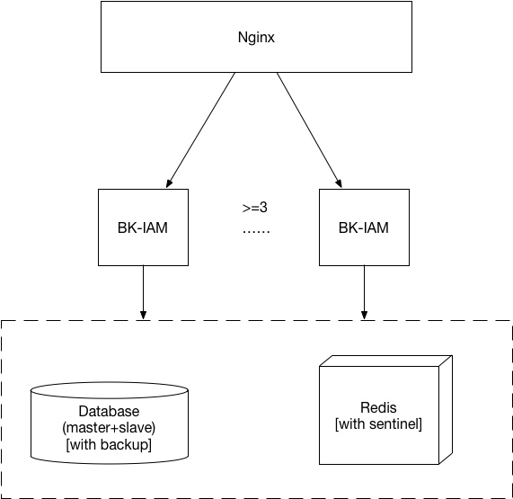
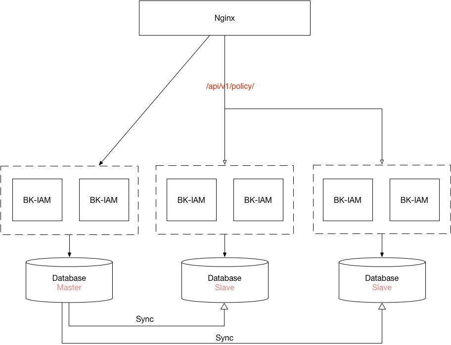

# 部署及运维说明

> VERSION: 1.1.1

## 背景

IAM, 权限中心; 作为蓝鲸智云基础服务之一, 整体服务对可用性要求非常高;

文档主要说明 IAM 的基础部署模式, 以及阐述监控项及故障点, 方便部署及运维.

## 交付包
- SaaS 包: bk_iam_V1.0.0.tar.gz  (app_code=`bk_iam`)
- 后台包: 
    - 部署目录: `__BK_HOME__/bkiam/`
    - 日志目录: `__BK_HOME__/logs/bkiam/`
    - 数据库: `bkiam`
    - 配置文件: `/etc/bkiam_config.yaml`
    - supervisor 配置: `/etc/supervisor-bkiam.conf`
    - consul 地址: `bkiam.service.consul`
    - sql 初始化执行目录: `support-files/sql/*.sql`

## 配置文件说明

```yaml
debug: false    # 启动模式, 生产环境请设为false! 
                # 如果是true, 请求的日志会全量打印, 记录完整信息, 对性能影响比较大

server:
  host: {IP}      # 监听IP
  port: {PORT}    # 监听端口

  readTimeout: 300
  writeTimeout: 300
  idleTimeout: 180

# use comma ”,“ separated when multiple app_code
superAppCode: "bk_iam"    # SaaS AppCode, 不需要修改

databases:
  - id: "iam"            # 权限中心IAM的数据库配置
    host: "{MYSQL_IP}"
    port: {MYSQL_PORT}
    user: "{MYSQL_USER}"
    password: "{MYSQL_PASSWORD}"
    name: "bkiam"
    maxOpenConns: 200
    maxIdleConns: 50
    connMaxLifetimeSecond: 600

  - id: "open_paas"      # OpenPaaS数据库配置
    host: "{MYSQL_IP}"
    port: {MYSQL_PORT}
    user: "{MYSQL_USER}"
    password: "{MYSQL_PASSWORD}"
    name: "open_paas"

redis:
  - id: "sentinel"      # redis配置, 生产环境建议使用sentinel模式
    addr: "{REDIS_SENTINEL_HOST}:{REDIS_SENTINEL_PORT}"  # redis sentinel的服务地址
    password: "{REDIS_PASSWORD}"  # redis实例的密码
    db: 0                         # redis使用的db实例
    poolSize: 160
    dialTimeout: 3
    readTimeout: 1
    writeTimeout: 1
    masterName: "{REDIS_MASTER_NAME}"  # sentinel模式下MansterName
    sentinelPassword: ""  # sentinel模式下支持配置sentinel密码

logger:    # 日志配置, 以下path字段可以自行更新为日志路径
  system:   
    level: info
    writer: file
    settings: {name: iam.log, size: 100, backups: 10, age: 7, path: ./}
  api:
    level: info
    writer: file
    settings: {name: iam_api.log, size: 100, backups: 10, age: 7, path: ./}
  sql:
    level: info
    writer: file
    settings: {name: iam_sql.log, size: 100, backups: 10, age: 7, path: ./}
  audit:
    level: info
    writer: file
    settings: {name: iam_audit.log, size: 500, backups: 20, age: 365, path: ./}
  web:
    level: info
    writer: file
    settings: {name: iam_web.log, size: 100, backups: 10, age: 7, path: ./}
  component:
    level: error
    writer: file
    settings: {name: iam_component.log, size: 100, backups: 10, age: 7, path: ./}
```

其中 redis 支持使用单实例(standalone 模式)

```yaml
redis:
  - id: "standalone"                   # redis配置
    addr: "{REDIS_HOST}:{REDIS_PORT}"  # redis的服务地址
    password: "{REDIS_PASSWORD}"       # redis实例的密码
    db: 0                              # redis使用的db实例
    poolSize: 160
    dialTimeout: 3
    readTimeout: 1
    writeTimeout: 1
    masterName: ""                     # 置空
```

---------

## 1. 高可用部署

### 1.1 对机器的要求

IAM 是一个 `CPU密集型`  + `IO密集型`的服务; 

- 流量大: 本身要处理请求, 同时依赖 Redis/MySQL; 需要确保带宽及网卡
- 计算密集: 建议提供 4C8G 的机器; 无状态可以多机水平扩展; 高可用至少部署 3 台机器
- IO 密集: 磁盘预留 15G 左右空间

### 1.2 依赖

由于权限中心是最基础的组件之一(几乎所有产品依赖), 数据重要性高, 同时对性能要求高; 

所以对`MySQL`和`Redis`的性能及可靠性有要求

1. 数据库: 
    - 要求: **独立实例**
    - 需要有**主从**, 且需要定时**数据备份**! 
    - 做好 MySQL 的监控及故障切换预案
    - 必要时, 考虑冷备方案
2. Redis: 
    - 要求: **独立实例**
    - 支持 Redis 单实例, 但是强烈建议生产环境使用**sentinel 模式**! 
    - 做好 Redis 的监控以及故障切换
    - `注意`: 不能使用 Redis twemproxy 集群方案, 因为 IAM 大量使用了 pipeline, 而 twemproxy 不支持
    - 仅做缓存用途, 不需要做数据持久化或备份;

独立实例, 隔离防止受其他因素影响, 也方便进行`高可用扩展`, `监控`, `扩容`, `问题排查`等

### 1.3 默认方案: 无状态多实例部署 

> 部署 3 个以上实例, 实例等价, 使用相同的 MySQL 和 Redis

建议: 使用高可用部署方案, 启动至少 3 个 IAM 实例, 配置统一的接入层, 支持负载均衡, 并确保接入层本身高可用



### 1.4 读写分离方案

正常情况下, 使用`默认方案: 无状态多实例部署`能满足大部分需求, 只有某些场景下才需要考虑`读写分离方案`; 由于复杂度较高, 需谨慎

> 当单一数据库成为瓶颈, 支持读写分离部署拓扑, 不同实例连接不同的 mysql

读写分离:
- 读流量: `/api/v1/policy`开头的请求流量, 转发到`连接从库`的实例
- 写流量: 非`/api/v1/policy`开头的请求流量, 转发到`连接主库`的实例





---------


## 2. 日志

日志目录: `__BK_HOME__/logs/bkiam/`


| 文件名 | 说明 | 日志级别 | 备注 |
|-----|----|------|----|
| iam.log    | 后台日志   |  info    |  IAM 系统本身进程打印日志, 包含基本运行信息 (IAM 后台服务报错) |
|  iam_api.log    | 鉴权 API 流水日志   |  info    |  接入系统使用`/api/v1/query`进行鉴权的流水日志; 默认记录所有鉴权请求日志 (接入系统鉴权报错)  |
|  iam_sql.log   |  SQL 日志  |  info    |  SQL 执行语句日志;  如果日志级别是 debug, 记录所有日志, 否则, 只记录执行时间大于 20ms 的 SQL 语句 **注意: 如果使用 debug 将导致服务性能大幅下降**  |
|  iam_audit.log   | 模型注册流水日志   |  info    | 接入系统使用`/api/v1/model`进行模型注册的流水日志 (接入系统注册模型报错)   |
|  iam_web.log   |  SaaS 访问流水日志  |  info    | IAM 前端 SaaS 调用后台接口`/api/v1/web/`的流水日志; 默认打印所有 SaaS 请求日志 (IAM SaaS App 访问后台报错)   |
|  iam_component.log   | 请求第三方接口日志   |  error    | 调用第三方系统接口流水日志;   如果日志级别是 debug, 打印所有日志, 否则, 只记录非 200 及发生报错的请求日志 **注意: 如果使用 debug 将导致跨系统资源依赖相关的鉴权性能下降** |

---------

## 3. 监控

> 确保所有服务有监控

请根据 IAM 提供的监控入口, 对 IAM 整体服务的可用性进行监控

### 3.1 实例是否可达 `/ping`

测试服务可达/网络 ok, 返回时间应`<100ms`

```bash
$ curl http://{IAM_HOST}/ping
{"message":"pong"}
```

### 3.2 实例是否健康 `/healthz`

测试服务健康度, 会检查 IAM 的依赖是否正常:
1. mysql
2. redis

返回值:
- 200: 正常
- 500: 异常, 消息体包含信息

```bash
$ curl http://{IAM_HOST}/healthz
ok
```

### 3.3 Prometheus `/metrics`

可以将多个实例的`/metrics`接入 Promethues, 做统一的监控

可以监控包括:
1. 实例是否存活
2. 实例的运行状态: 内存/gc 等 (单机性能/是否需要扩容)
3. 实例的请求处理数量/响应时间分布: 排查慢请求问题

```bash
curl http://{IAM_HOST}/metrics
```

可以配置图表:

Request Total

```bash
sum(increase(api_requests_total{job="bkiam", instance="${instance}"}[1m]))
```

API Response Time Quantile [1m]

```bash
histogram_quantile(0.95, sum(rate(api_request_duration_milliseconds_bucket{job="bkiam", instance="${instance}"}[1m])) by (le, instance))
```

### 3.4 数据库监控

监控 IAM 连接的对应数据库实例的 mysql

1. 慢查询, 详细日志
2. 事务及锁情况

监控表行数过大

- `policy` 策略表
- `expression` 表达式表
- `subject` 用户表
- `subject_relation` 用户组织关系表

### 3.5 Redis 监控

监控 IAM 使用 Redis 服务的

1. 服务可用
2. 响应速度
3. 连接数/key 数量/内存占用
4. key hit/miss 比例

### 3.6 日志监控

将 iam 的所有日志使用`日志采集`相关组件, 采集上报后做相关的日志关键字监控

例如:
- 可以监控 `iam.log` 中 `level=error` 的日志
- 监控`iam_api.log` 中 `status!=200` 的日志

### 3.7 Sentry 支持

如果有 Sentry 服务, 可以将权限中心后台服务接入, 异常及其详情会上报到 Sentry 中

```yaml
sentry:
  enable: true
  dsn: "{Sentry DSN}"
```

这里的 Sentry DSN 为在Sentry新建项目对应的DSN, 示例: `http://e85eaaa599c44cbbb6833c22c20bbbb@sentry.xx.com/123`


---------

## 4. 故障点

由于 IAM 作为基础服务, 被众多上层的平台及 SaaS 依赖; 所以一旦 IAM 出现故障, 将导致其他平台大规模不可用.

所以使用高可用部署方案的同时, 需要了解 IAM 所有的故障点

目前 IAM 强依赖:

- 数据库
- Redis

鉴权依赖:

- 跨系统资源依赖

### 4.1 数据库故障

如果 iam 依赖的数据库出现故障, 服务不可用, 将会导致 iam 本身服务不可用(无法提供鉴权请求);

**影响**:
- 依赖数据库: `bkiam`, 建议使用**主从部署**确保高可用, 一旦出问题, 优先确保 DB 查询正常, 确保鉴权服务正常
- 依赖数据库: `open_paas`, 用于对应用发起请求合法性鉴权(缓存 12 小时, 所以如果 open_paas 数据库不可用, 那么短时间内, 之前正常请求的合法性鉴权不会受到影响)

**紧急预案**:

- 如果对应的 MySQL 服务短时间内无法恢复, 为了保证所有鉴权服务可用, 那么可以切换到冷备服务器, 或者紧急将`备份数据`导入到某个 MySQL 实例, 将权限中心依赖切过去
   - 将`备份数据`导入
   - 修改配置文件中 MySQL 配置
   - 重启服务, 确认服务正常
   - 待生产环境 MySQL 服务恢复后, 再切换回去
   - 注意:
       - 期间写入的数据会丢失, 例如配置的新权限等
       - 由于冷备服务或者备份数据的`权限数据`可能不是最新的, 可能导致部分鉴权结果差异; 差异多少取决于临时服务数据同生产环境数据差异有多大
    - 建议: 建议此时周知使用者, 不使用权限中心 SaaS 配置权限/审批权限等等

### 4.2 Redis 故障

如果 Redis 不可用, 将导致 IAM 无法使用缓存服务, 不影响鉴权的正确性, 但是影响整体服务的性能(无缓存请求会查询 db)

**影响**:

- 不影响鉴权的正确性(IAM 无法使用缓存服务, 会查询 db)
- 接口响应慢
- 如果请求量很大, 可能给 db 带来很大的压力, 最终导致 db 负载过大

**紧急预案**:

- [预案 1] IAM 本身启动时会检查配置 Redis 服务可用(如果此时 redis 服务不可用, 进程将拉起失败). 如果短时间内无法恢复 Redis 服务, 可以将配置文件中`debug: false`改成`debug: true`, 进程拉起
    - 注意: 此时服务可用, 无缓存, 对 db 压力会比较大

- [预案 2] 如果原先的生产 Redis 服务不可用, 可以配置一个临时的 Redis 服务先顶着(纯缓存, 不需要做数据持久化及备份) 
    - 修改配置文件中 Redis 配置
    - 重启服务, 确认服务正常
    - 待生产 Redis 服务恢复后, 再切换回去
    - 注意, 所有实例配置同一个临时 Redis!(确保缓存数据一致性); 并且, 必须隔离(不能同其他环境, 例如测试环境的 IAM 共用一个 Redis db);

### 4.3 跨系统资源依赖的被依赖方故障

跨系统资源依赖, 典型场景是 `Job执行作业A的权限依赖于CMDB的某个主机资源`, 在 IAM 鉴权时, 会到`被依赖方` CMDB 查询对应的主机资源信息

**影响**:

- 如果此时 CMDB 服务不可用(无法查询主机资源), 将导致 JOB 此类的鉴权请求全部报错

**建议**:

- 需要监控: cmdb 整体服务可用

**紧急预案**:
- 无, 必须恢复被依赖方的服务

### 4.4 IAM 所在服务器磁盘空间满

**影响**:
- 磁盘空间写满会导致服务日志无法落地, 进而影响服务可用性

**建议**:
- 需要监控 IAM 部署所在服务器的磁盘空间
