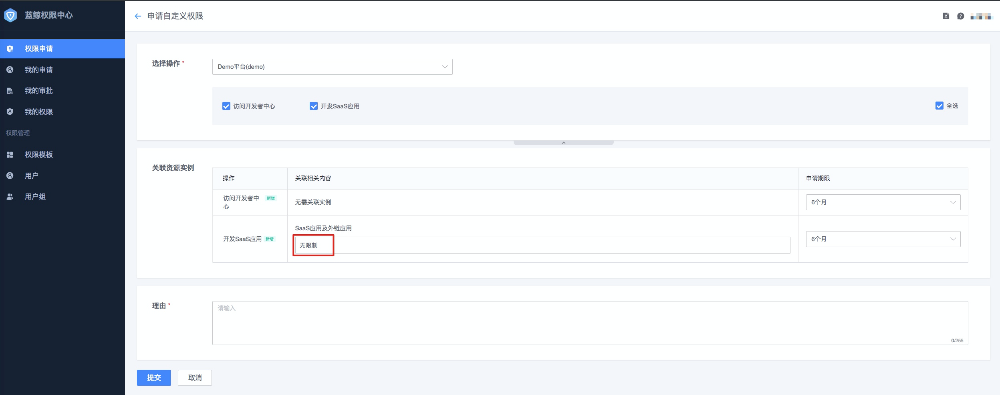

# 模型注册

## 1. 注册系统

[注册系统 API 文档](../Reference/API/02-Model/10-System.md)

注意: `system_id`必须等于 app_code； 

```bash
curl -XPOST 'http://{IAM_HOST}/api/v1/model/systems' \
-H 'X-Bk-App-Code: demo' \
-H 'X-Bk-App-Secret: c2cfbc92-28a2-420c-b567-cf7dc33cf29f' \
-H 'Content-Type: application/json' \
-d '{
	"id": "demo",
	"name": "Demo平台",
	"name_en": "Demo",
	"description": "A demo SaaS for quick start",
	"description_en": "A demo SaaS for quick start.",
	"clients": "demo",
	"provider_config": {
		"host": "http://demo_callback_host",
		"auth": "basic",
		"healthz": "/healthz/"
	}
}'
```

## 2. 注册资源类型

某些权限会与具体的资源关联，在这里，`develop_app`开发应用的权限，跟具体的应用绑定； 整个 PaaS 平台可能有 100 个应用，但是某个人只有某几个应用的开发权限；

[注册资源类型 API 文档](../Reference/API/02-Model/11-ResourceType.md)

```bash
curl -XPOST 'http://{IAM_HOST}/api/v1/model/systems/demo/resource-types' \
-H 'X-Bk-App-Code: demo' \
-H 'X-Bk-App-Secret: c2cfbc92-28a2-420c-b567-cf7dc33cf29f' \
-H 'Content-Type: application/json' \
-d '[
    {
        "id": "app",
        "name": "SaaS应用",
        "name_en": "application",
        "description": "SaaS应用",
        "description_en": "SaaS application",
        "provider_config": {
            "path": "/iam/api/v1/resources/"
        },
        "version": 1
    }
]'
```

## 3. 注册实例视图

[注册实例视图 API 文档](../Reference/API/02-Model/12-InstanceSelection.md)

在配置`开发应用`权限的时候，由于这个操作关联了`应用`，所以需要配置`实例视图`

- [主要名词概念说明: 实例视图(instance_selections)](../Reference/API/02-Model/00-Concepts.md)
- [说明: 实例视图](../../Explanation/01-instanceSelection.md)


```bash
curl -XPOST 'http://{IAM_HOST}/api/v1/model/systems/demo/instance-selections' \
-H 'X-Bk-App-Code: demo' \
-H 'X-Bk-App-Secret: c2cfbc92-28a2-420c-b567-cf7dc33cf29f' \
-H 'Content-Type: application/json' \
-d '[
    {
        "id": "app_view",
        "name": "应用视图",
        "name_en": "app_view",
        "resource_type_chain": [
            {
                "system_id": "demo",
                "id": "app"
            }
        ]
    }
]'
```

## 3. 注册操作

[注册操作 API 文档](../Reference/API/02-Model/13-Action.md)

涉及两个操作，第一个操作`访问开发者中心`，第二个操作`开发应用`

访问开发者中心(access_developer_center):
- 管理类权限
- 没有关联资源
- 没有依赖操作

开发应用(develop_app):
- 关联实例 `system_id=demo and id=app`(第 2 步注册的)
- 关联实例对应的选择视图是 `system_id=demo and id=app_view`(第 3 步注册的)
- 相关操作 `access_developer_center`，即申请`develop_app` 会一并申请 `access_developer_center`； (这样用户开发应用时，不需要单独再申请访问开发者中心的权限)


```bash
curl -XPOST 'http://{IAM_HOST}/api/v1/model/systems/demo/actions' \
-H 'X-Bk-App-Code: demo' \
-H 'X-Bk-App-Secret: c2cfbc92-28a2-420c-b567-cf7dc33cf29f' \
-H 'Content-Type: application/json' \
-d '[
    {
        "id": "access_developer_center",
        "name": "访问开发者中心",
        "name_en": "access developer center",
        "description": "一个用户是否能访问开发者中心",
        "description_en": "Is allowed to access the developer center",
        "type": "create",
        "related_resource_types": [],
        "version": 1
    },
    {
        "id": "develop_app",
        "name": "开发SaaS应用",
        "name_en": "develop app",
        "description": "一个用户是否能够开发SaaS",
        "description_en": "Is allowed to develop SaaS app",
        "type": "",
        "related_actions": [
            "access_developer_center"
        ],
        "related_resource_types": [
            {
                "system_id": "demo",
                "id": "app",
                "name_alias": "",
                "name_alias_en": "",
                "related_instance_selections": [
                    {
                        "system_id": "demo",
                        "id": "app_view"
                    }
                ]
            }
        ],
        "version": 1
    }
]'
```

## 4. 查看注册模型的展示

注册成功后，打开 [权限中心]-[权限申请]-[申请自定义权限]，可以看到刚才注册的模型

由于还没有实现 [资源反向拉取](../Reference/API/03-Callback/01-API.md)，申请权限时，资源实例可以选择`无限制`


