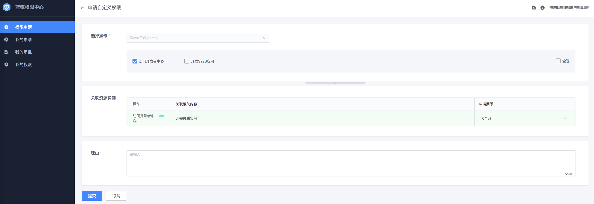

# 无权限申请


具体的 [无权限交互方案](../HowTo/NoPermissionApply.md)


在前端展示用户无权限的相关列表, 当用户点击`去申请`按钮时, 需要跳转到权限中心申请对应权限.

接入系统需要提前将相关数据到权限中心生成一个`权限申请URL`, 引导用户跳转过去申请对应权限. [生成无权限申请 URL](../Reference/API/05-Application/01-GenerateURL.md)


使用 sdk 实现

```python
from iam.apply.models import ActionWithoutResources, ActionWithResources, Application, RelatedResourceType
from iam.apply.models import ResourceInstance, ResourceNode

class Permission(object):
    def __init__(self):
        self._iam = IAM(APP_CODE, APP_SECRET, BK_IAM_HOST, BK_PAAS_HOST)

    def make_no_resource_application(self, action_id):
        # 1. make application
        action = ActionWithoutResources(action_id)
        actions = [action]

        application = Application(SYSTEM_ID, actions)
        return application

    def make_resource_application(self, action_id, resource_type, resource_id, resource_name):
        # 1. make application
        # 这里支持带层级的资源, 例如 biz: 1/set: 2/host: 3
        # 如果不带层级, list中只有对应资源实例
        instance = ResourceInstance([ResourceNode(resource_type, resource_id, resource_name)])
        # 同一个资源类型可以包含多个资源
        related_resource_type = RelatedResourceType(SYSTEM_ID, resource_type, [instance])
        action = ActionWithResources(action_id, [related_resource_type])

        actions = [action, ]
        application = Application(SYSTEM_ID, actions)
        return application

    def generate_apply_url(self, bk_token, application):
        """
        处理无权限 - 跳转申请列表
        """
        # 2. get url
        ok, message, url = self._iam.get_apply_url(application, bk_token)
        if not ok:
            logger.error("iam generate apply url fail: %s", message)
            return IAM_APP_URL
        return url

    # def generate_apply_url(self, bk_username, application):
    #     """
    #     处理无权限 - 跳转申请列表, 使用bk_username
    #     """
    #     # 2. get url
    #     ok, message, url = self._iam.get_apply_url(application, bk_username=bk_username)
    #     if not ok:
    #         logger.error("iam generate apply url fail: %s", message)
    #         return IAM_APP_URL
    #     return url
```

使用

```python
# bk_token从cookie中获取, 测试时可以使用Chrome浏览器登录蓝鲸, F12, Application-Storage-Coolies复制bk_token
# 如果拿不到bk_token, 可以直接改成传递bk_username; 见上面代码块中被注释的方法
access_application = make_no_resource_application("access_developer_center")
url = Permission().generate_apply_url(bk_token, access_application)

# 开发app权限
app_application = Permission().make_resource_application("develop_app", "app", "saas_test", "saas_test")
url = Permission().generate_apply_url(bk_token, app_application)
```

点击跳转到权限中心申请对应的权限




