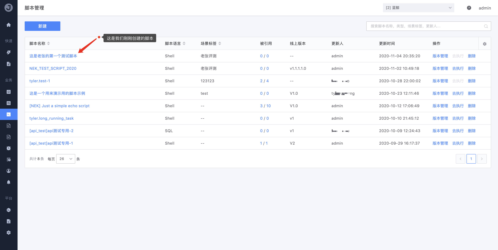

# 2. 创建一个脚本

## 前置条件

```plain
无
```

## 操作步骤

1. 前往 **脚本管理** 页面，点击「新建」按钮进入

   

2. 按照页面提示，填写完整的脚本相关内容

   

3. 点击提交，脚本创建完成

   

4. 点击脚本名进入查看脚本详情

   

5. 点击具体的版本号进入查看该版本的脚本内容以及版本日志

   

   脚本的版本管理提供了类似 SVN 的版本管理功能，帮助用户有效的管理脚本的各个版本分支；关于版本各个状态的含义说明，详见脚本管理的功能介绍文档（传送门：[脚本管理功能介绍](../Features/Scripts.md)）。

6. 将版本置为『**已上线**』状态，以供我们后面测试使用

   

