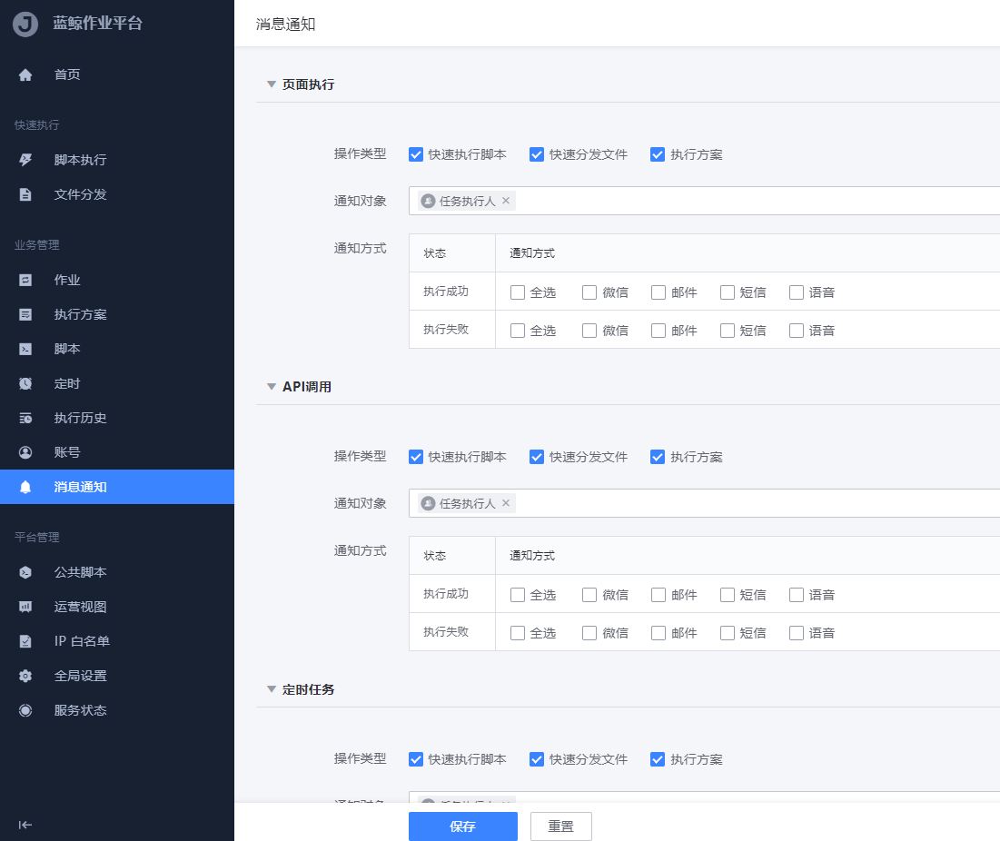
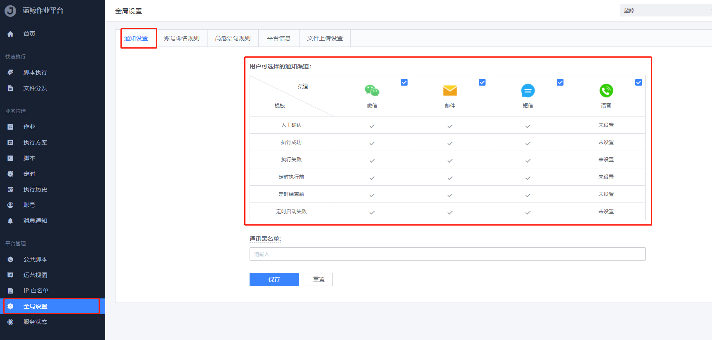
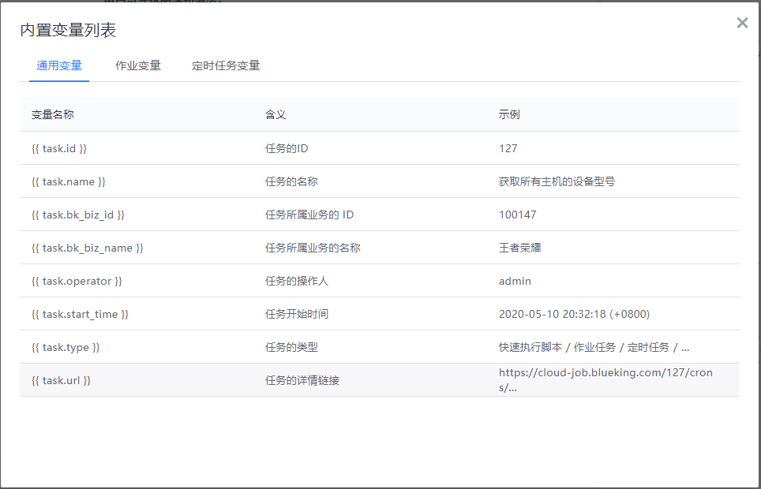
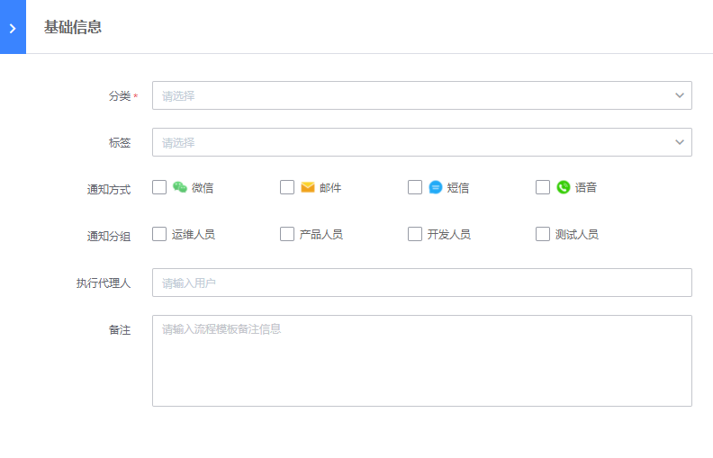
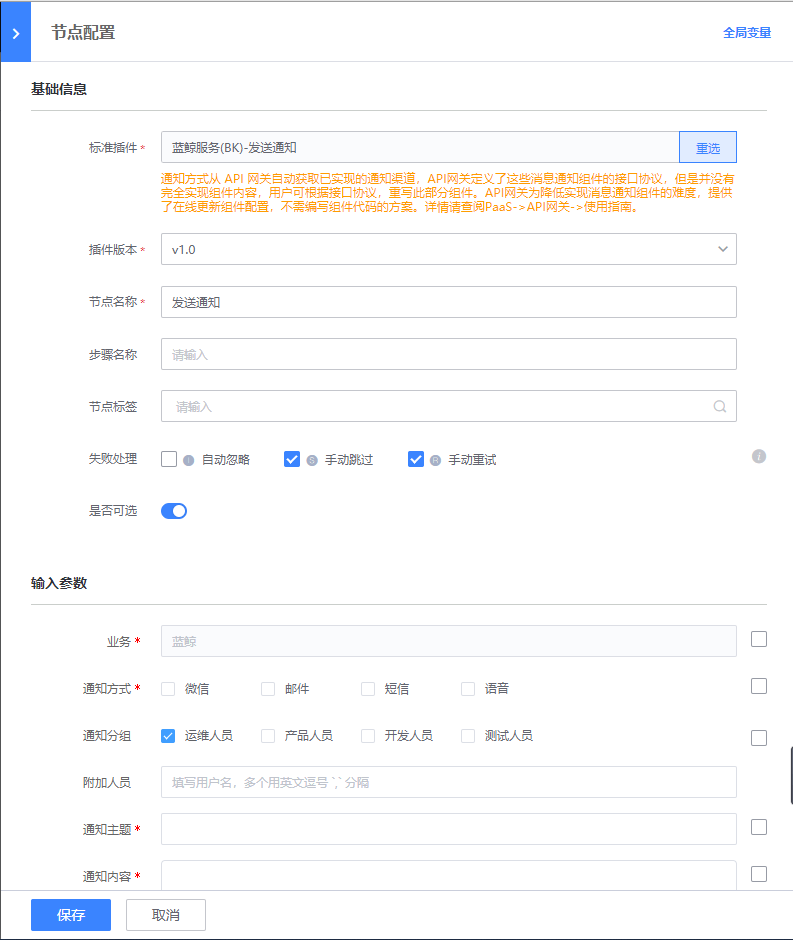
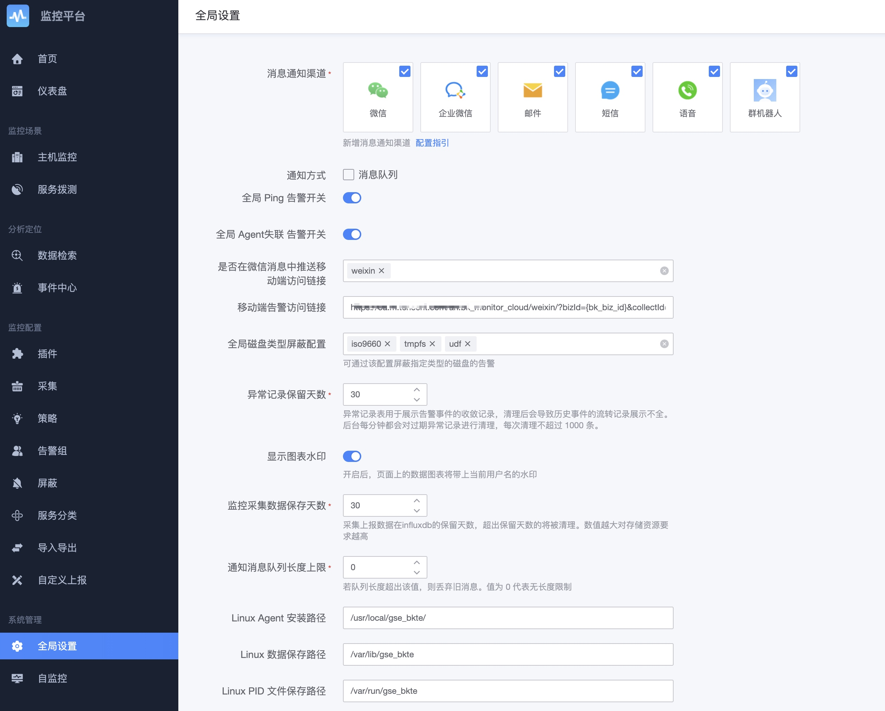
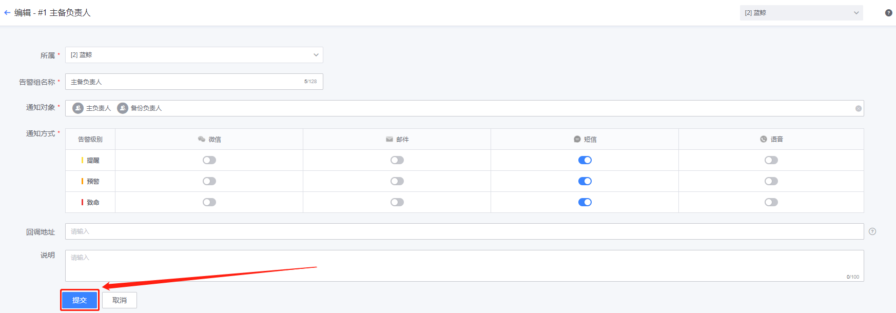
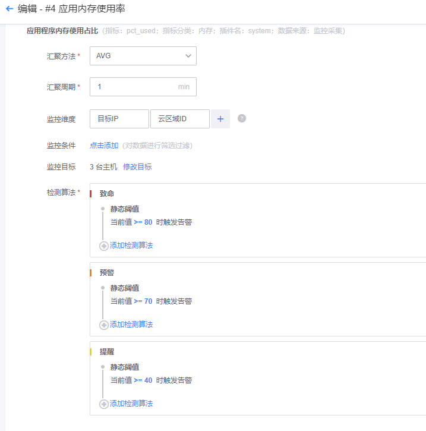
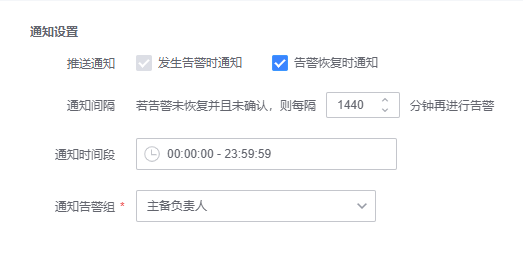
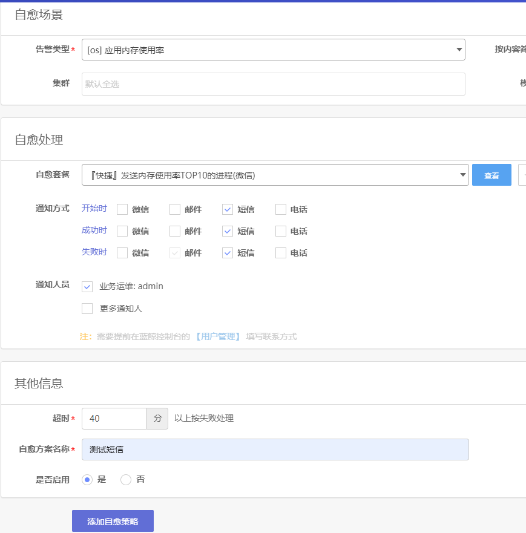

# 配置消息通知

蓝鲸内置了邮件、短信、语音消息、微信的通知渠道，

> 若想接入第三方消息通知（例飞书，钉钉），请参考 [组件编码](../../开发指南/扩展开发/API网关/chapter1.md)，将新接口接入至`CMSI蓝鲸消息管理`，并能通过 `[CMSI] 查询消息发送类型` 接口查到即可。

配置方法请参考

* [配置消息通知：邮件](../../PaaS平台/产品白皮书/场景案例/send_mail.md)
* [配置消息通知：短信](../../PaaS平台/产品白皮书/场景案例/send_sms.md)
* [配置消息通知：语音消息](../../PaaS平台/产品白皮书/场景案例/send_voice_msg.md)
* 配置消息通知：微信，敬请期待

# 人员信息配置

## 联系方式配置

用户管理 -> 组织架构 -> 选择用户 -> 编辑 -> 填好相应的用户信息 -> 保存

## 用户角色配置

配置平台 -> 资源 -> 业务 -> 选择相应业务 -> 编辑角色 -> 保存

# 短信

以腾讯云为例

## 前提条件

- 配置好蓝鲸短信渠道，接口能调用成功，参考 [配置消息通知：短信](../../PaaS平台/产品白皮书/场景案例/send_sms.md)

- 配置好人员联系方式

## 短信模板配置

进入 腾讯云云产品 -> 短信 -> 国内短信 -> 正文模板管理 -> 创建正文模板


注意事项：
1. 国内短信由签名+正文组成，签名符号为【】（注：全角），发送短信内容时必须带签名;
2. 短信模板内容不能含有【】符号。

提示：腾讯云短信模板内容不能含有【】符号，但是不代表自定义内容不能带有【】。

> 模板示例：{1}为您的登录验证码，请于{2}分钟内填写。如非本人操作，请忽略本短信。
> 
> （其中{1}、{2}为可**自定义的内容**，须从 1 开始连续编号，如{1}、{2}等）

## 常见问题

问题 1. 没有收到短信通知，怎么排查？
解决方法：
1. 检查蓝鲸消息通道是否配置好，调用接口即可测试，若不成功，请参考 [配置消息通知：短信](../../PaaS平台/产品白皮书/场景案例/send_sms.md)
2. 检查平台是否开启了消息通知，去相应平台的消息通知配置查看
3. 检查平台是否创建相应的短信模板，去作业平台 -> 全局配置 -> 通知设置
4. 检查是否创建相应的腾讯云短信模板，去腾讯云云产品 -> 短信 -> 国内短信 -> 正文模板管理
5. 去腾讯云云产品 -> 短信 -> 统计分钟 -> 国内短信 -> 短信记录查看失败原因
6. 去腾讯云云产品 -> 应用管理 -> 基础配置 -> 频率限制白名单 -> 添加手机号 -> 设置

问题 2. 腾讯云短信有频率限制吗？
1. 对同一个手机号，1 自然日内发送短信条数不超过10条
2. 相同内容短信对同一个手机号，30 秒内发送短信条数不超过1条

## 作业平台配置

### 消息通知配置

作业平台 -> 消息通知 -> 勾选需要的消息通知服务



### 通知模板配置

作业平台 -> 全局配置 -> 通知设置 -> 编辑需要的模板



提示：腾讯云短信模板内容不能含有【】符号，但是不代表自定义内容不能带有【】。

可根据已有的内置变量，自定义模板内容。



若腾讯云审核生效完毕，即可点击消息预览，测试发送通知效果，记得保存模板。

### 短信模板示例

- 示例一：执行失败

蓝鲸模板内容

```bash
作业平台通知：您的业务[{{task.app.name}}]当前有一个任务:{{task.name}}({{task.detail.url}})执行失败，请尽快查看。
```

腾讯云短信内容

```bash
作业平台通知：您的业务[{1}]当前有一个任务:{2}({3})执行失败，请尽快查看。
```

- 示例二：执行成功

蓝鲸模板内容

```bash
作业平台通知：您的业务[{{task.app.name}}]当前有一个任务:{{task.name}}({{task.detail.url}})已执行成功，请尽快查看。
```

腾讯云短信内容

```bash
作业平台通知：您的业务[{1}]当前有一个任务:{2}({3})已执行成功，请尽快查看。
```

## 标准运维配置

### 消息通知配置

方法一：使用标准运维自带消息通知

该方法为标准运维固定模板，需要去腾讯云提交短信模板

标准运维 -> 选择业务 -> 项目流程 -> 新建 -> 基础信息（右上角第二个按钮）



方法二：使用标准运维插件`蓝鲸服务(BK)-发送通知`

添加标准插件节点 -> 选择插件：蓝鲸服务(BK)-发送通知 -> 选择相应通知方式、通知分组、通知主题、通知内容 -> 保存

该方法为用户自定义模板，需要先去腾讯云提交短信模板



### 短信模板示例

- 示例一：执行失败

腾讯云短信内容

```bash
您在{1}业务中的任务{2}执行失败，当前失败节点是{3}，操作员是{4}，请前往标准运维APP({5})查看详情！
```

- 示例二：执行成功

腾讯云短信内容

```bash
您在{1}业务中的任务{2}执行成功，操作员是{3}，请前往标准运维APP({4})查看详情！
```

## 监控平台配置

### 消息通知配置

监控平台 -> 全局设置 -> 开启需要的消息通知渠道及消息队列 -> 提交



监控平台 -> 告警组 -> 根据不同角色编辑相应通知方式 -> 提交




> 告警需要开启相关策略配置

### 监控告警示例

以下用 应用内存使用率 策略来配置

策略 -> 找到 应用内存使用率 -> 编辑

设置 检测算法



设置 通知设置



记得保存

### 短信模板示例

- 模板：通用告警

腾讯云短信内容

```bash
监控通知{1}
```

- 实际收到短信

```bash
【腾讯蓝鲸】监控通知，[提醒]应用内存使用率
内容: 已持续3 m, avg(应用程序内存使用占比) >= 40.0%, 当前值49.11%
目标: 蓝鲸 10.0.0.1
告警ID: 1
关联信息: 集群(日志平台,公共组件,配置平台,PaaS平台,作业平台v3,节点管理) 模块(job-config,nodeman-api,login,cmdb-web,consul,zookeeper,mysql,job-manage,cmdb-admin,cmdb-topo,paas,kafka,appengine,cmdb-op,esb,cmdb-event,consul-template,bklog-api,cmdb-host,cmdb-api,cmdb-cloud,appt,job-gateway,apigw,job-crontab,cmdb-proc,job-backup,cmdb-core,cmdb-task,job-execute,cmdb-datacollection,cmdb-auth,job-logsvr)
```
```bash
【腾讯蓝鲸】监控通知，[预警]应用内存使用率
内容: 已持续3 m, avg(应用程序内存使用占比) >= 50.0%, 当前值78.72%
目标: 蓝鲸 10.0.0.1
告警ID: 2
关联信息: 集群(公共组件,监控平台v3,用户认证平台,管控平台) 模块(elasticsearch,gse_btsvr,gse_dba,gse_syncdata,usermgr,bk-ssm,gse_api,gse_alarm,gse_proc,gse_data,redis,bk-iam,monitor,grafana,license,gse_task,influxdb-proxy,consul)
```
```bash
【腾讯蓝鲸】监控通知，[致命]应用内存使用率
内容: 已持续3 m, avg(应用程序内存使用占比) >= 80.0%, 当前值84.96%
目标: 蓝鲸 10.0.0.1
告警ID: 3
关联信息: 集群(PaaS平台,公共组件,监控平台v3,故障自愈) 模块(appo,nginx,influxdb,rabbitmq,fta-api,transfer,consul-template,mongodb,beanstalk,consul)
```

## 故障自愈配置

### 消息通知配置

- 故障自愈 -> 选择业务 -> 接入自愈 -> 添加接入自愈 -> 选择告警类型、自愈套餐、通知方式、通知人员、其他信息 -> 添加自愈策略




### 短信模板示例

- 模板一：通用模板

腾讯云短信内容
```bash
《故障自愈》{1}该信息如非本人订阅，请忽略本短信。
```
- 实际收到短信

```bash
【腾讯蓝鲸】《故障自愈》 自愈开始  [蓝鲸]业务[应用内存使用率]告警,IP[10.0.0.1]: avg(应用程序内存使用占比) >= 80.0%, 当前值86.78%
该信息如非本人订阅，请忽略本短信。


【腾讯蓝鲸】《故障自愈》 自愈成功  [蓝鲸]业务[应用内存使用率]告警,IP[10.0.0.1]: avg(应用程序内存使用占比) >= 40.0%, 当前值49.09%
该信息如非本人订阅，请忽略本短信。
```

- 模板二

故障自愈通知，您的业务{1}下主机{2}，于{3}{4}自愈失败，详情请前往{5}查看，如非本人订阅，请忽略。
