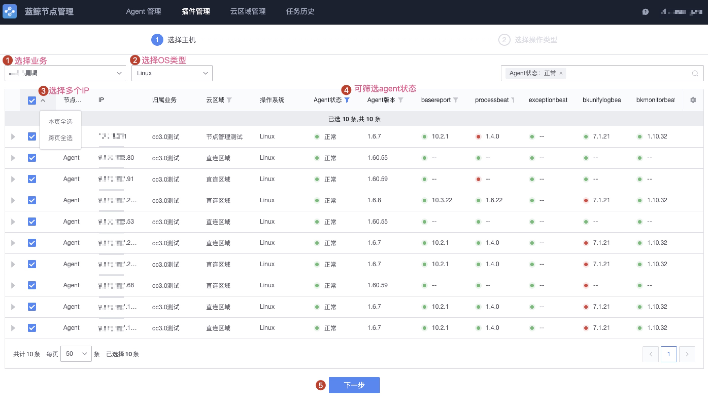

# 准备工作

在正式使用监控之前有些准备工作做好了会事半功倍。

## 了解监控平台

基本的一个监控平台了解可以阅读下：

* [架构图](../concepts/architecture.md)
* [数据模型](../concepts/datamodule.md)
* [术语解释](../concepts/glossary.md)

## 创建一个业务或者申请一个业务

监控平台的数据都是以**业务**为命名空间。所以要开始使用监控平台先需要申请一个已有业务，或者创建一个新业务。

创建一个业务：[如何创建业务并导入主机到业务中](../../../配置平台/产品白皮书/快速入门/case1.md)

申请一个业务：通过权限中心申请业务的查看或者编辑权限。

## 监控平台权限申请

监控平台已经对接了权限中心，不再依赖配置平台的角色，需要根据提示去权限中心进行权限的申请，权限的粒度可以比以前更细。 

具体可以查看 [权限申请](perm.md)

## CMDB 配置信息

监控平台的主机监控，进程监控，多实例的监控都依赖 CMDB 的配置。配置好 CMDB 才能正确的使用监控平台。

 * [CMDB 如何管理进程](https://bk.tencent.com/docs/document/6.0/152/7303)
 * [CMDB 如何配置服务实例](../../../配置平台/产品白皮书/产品功能/Instance.md)

## 监控的数据采集器插件安装

监控功能的数据采集依赖于插件，部分插件为默认开启，其他按需开启。 

| 功能	 | 依赖插件 | 	安装情况 | 	操作方法 | 
|---|---|---|---|
|主机-操作系统	| basereport	| 默认安装	| 如发现无数据上报需要在节点管理进行确认
|主机-进程 | 	processbeat |	默认安装 | 	节点管理安装
|主机-系统事件 |	exceptionbeat | 	默认不安装 | 	节点管理手动安装
|自定义字符型 |	gsecmdline	| 默认安装 | 
|日志关键字事件， 插件和采集，服务拨测 | 	bkmonitorbeat	| 默认不安装	| 节点管理手动安装
|自定义上报(事件/指标)	| bkmonitorproxy | 	直连不需要安装，云区域需要进行手动安装	|云区域的通过节点管理手动安装
|日志文件采集 | 	bkunifylogbeat	| 默认不安装 | 	节点管理手动安装

节点管理 SaaS 安装插件界面

