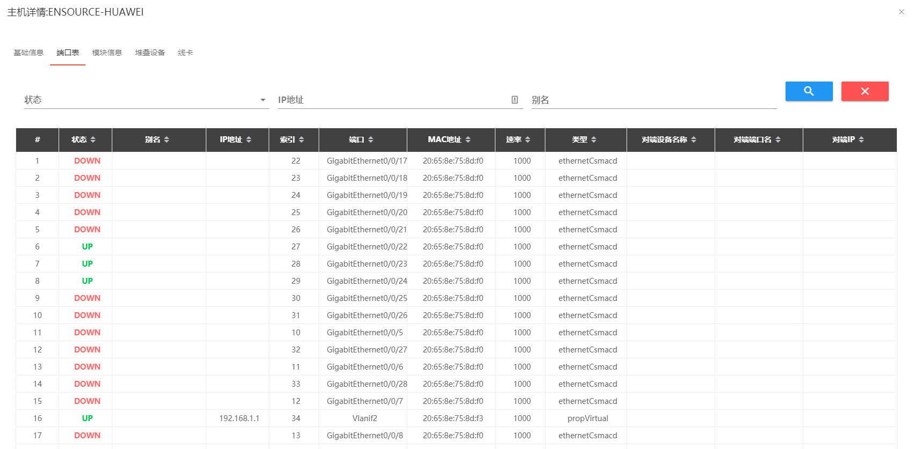
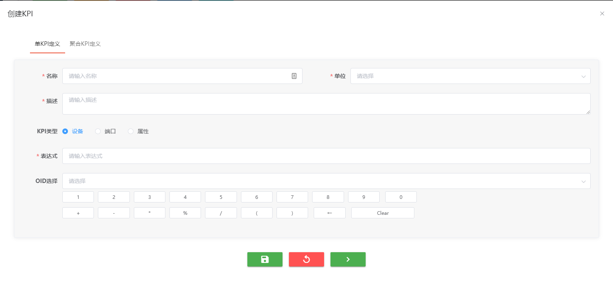
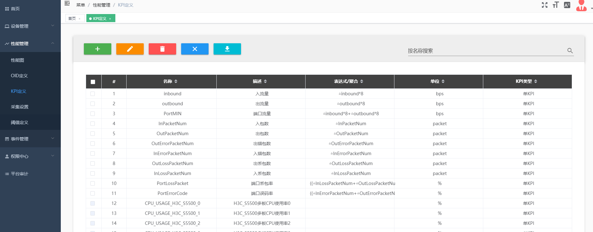
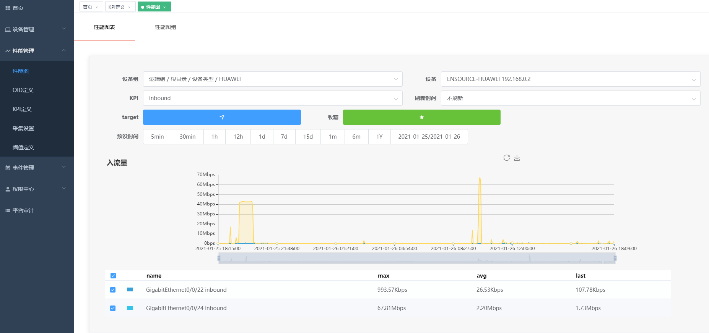
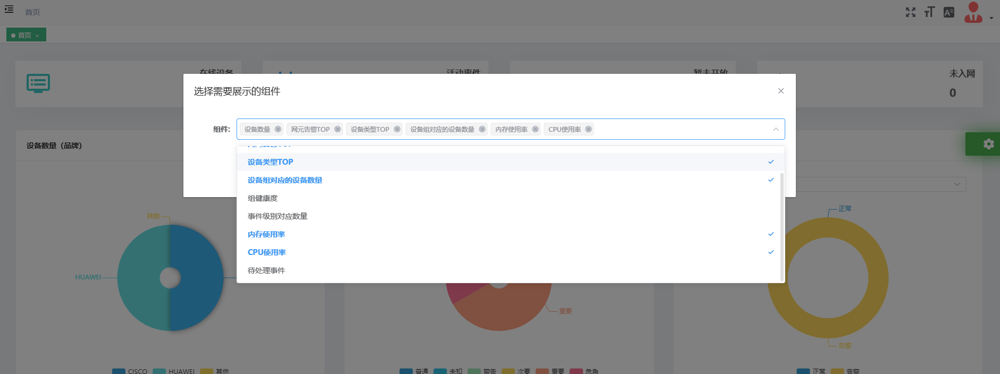
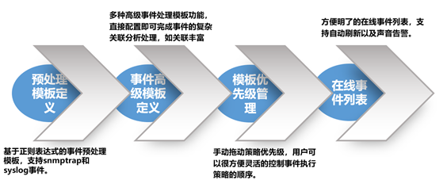
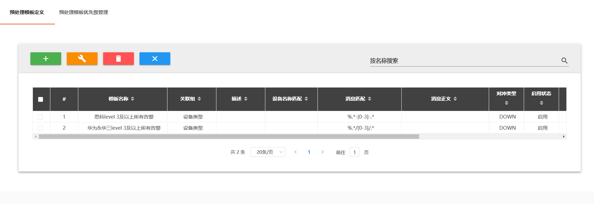

## 产品功能

### 设备管理

网络设备管理中对设备定义了六种状态，分别是待入网、运行中、维护中、待拆除、已下线、手动维护这六种状态。通过自动发现被管设备，自动实时发现设备状态变化；自动实时轮询设备状态；将新发现的设备置于待入网状态，由管理员确认后进入运行中状态；当设备在预设的时间段内离线时，自动将设备置于维护中状态；当设备在更长的预设时间段内离线时，自动将设备置于待拆除状态。待拆除状态经过一段时间未处理就会变成已下线状态。手动维护状态则可以帮助用户出于维护需要将设备手动修改成维护状态，标记该设备处于维护中。每种状态都以不同颜色标识以提醒管理员关注。

在发现方式上，用户可选择根据管理IP网段或指定种子节点（如核心设备IP）等方式自动发现各种在线设备。设备自动发现功能支持用户自定义厂商的snmp oid等参数，可以支持各厂商的设备。设备自动发现入网的设备，可同时将设备序列号，型号，软件版本等基础数据自动采集至资产库。用户还可通过外部文件批量导入或手动输入的形式关联设备入库线下数据（如安装位置、供电方式、冗余电源、资产编号）。

通过设备自动发现，设备入网，在线设备管理，待确认事件管理等实现了设备管理的流程闭环。目前系统可以管理的设备类型囊括了路由器、交换机、防火墙、负载均衡设备、无线AP以及其他支持snmp协议的设备。通过后台扫描网络设备的管理IP自动更新网络设备信息。能够自动获取设备下的端口信息和模块信息。

除了设备自动添加，NOP还支持设备的手动添加，可以设置设备的安装位置、供电方式和资产编号等。

针对某些大型企业网络规模巨大（设备数量甚至超过万台），种类繁多（路由器、交换机、防火墙、负载均衡、无线接入设备等等），厂家众多。为方便网络运维人员对大规模数量的设备及端口进行管理，平台支持将节点、端口按照逻辑关系分组，易于分类分批管理，同时方便性能管理模块、报表模块等的个性化统计与展示。

NOP系统提供节点树操作，可方便查看节点组、节点、端口各层级关系，并支持在树节点上的快捷操作。

### 性能管理

性能管理也是网络管理领域的重要部分。设备的运行性能及端口、链路的流量、带宽利用率、丢包、延时等等与网络各环节运行状态相关的性能数据复杂而多样。及时而全面的性能数据采集与展示是性能管理部分的关键要素。性能数据库采用开源时序数据库InfluxDB，特别适合用于处理和分析资源监控数据这种时序相关数据。而InfluxDB自带的各种特殊函数如求标准差，随机取样数据，统计数据变化比等，使数据统计和实时分析变得十分方便。NOP开放的可自定义的KPI指标体系帮助性能指标的灵活扩展；灵活的多级性能阈值定义及告警。系统中通过完全自定义的KPI，动态表达式让网管人员能更轻松自如配置各复杂指标。

KPI定义列表展示页面效果如图：

网络管理人员可以按照节点选择一定时间段内的流量情况：

### Portal管理

为网络管理人员提供更为便捷直观的管理视图，本系统提供了可灵活定制的主页数据展示功能。如下图示例：

- 页面最上部分展示关注的汇总数据指标。如在线设备数，当前活动事件数，数等，每个Tab可以点击进入专项页面查看数据明细等详情

- 页面图形展示区域可以由管理员自行定义，这里分四个区域展示了关键端口流量，按客户的流量及占比排名图形。这两个是在性能管理模块里定义好性能监控组合后直接在页面选择加入Portal主页即可生效。资产占用汇总图在统计报表模板中选择加入Portal主页；待处理事项列表在流程管理页面定义选择加入Portal主页

### 事件告警管理

告警事件处理是网络管理中几乎最为重要的工作。告警的准确性、及时性直接影响到网络管理的效率和用户服务水平。简单来说，告警事件处理需要做到不错报，不漏报，及时报。对于告警事件的产生判断流程如下图所示：

网络告警事件的数据来源有三个方面：

- 网络设备的Syslog

- 网管平台主动发起的ICMP报文检测和SNMP连通性反馈

- 性能KPI触发了阈值产生的健康度告警

对于syslog产生的原始数据，事件处理平台通过预处理模板定义对原始的Syslog执行过滤策略，格式化策略。事件过滤：如果不是用户关心的事件或不能通过事件过滤器，则该事件会被丢弃，从而节省大量的处理时间和存储空间。用户可在管理控制台上建立过滤规则、修改过滤规则以及删除过滤规则等。

NOP平台已经预先包含有关联逻辑的模版，对于最常见的关联逻辑都可以在这些模版上作适当的修改快速实现，为关联逻辑的开发、调整、部署提供了基础。可以丰富增加额外的事件属性，对重复事件进行处理，压缩满足某种条件的事件等。除了上述预先定义的关联模版，用户还能够通过用户关联定义模版配置自己的关联逻辑。