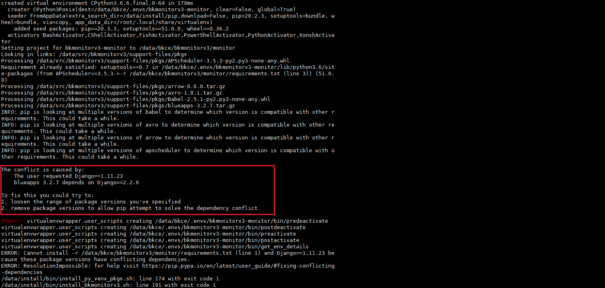

# 社区版 6.0.3 Patch 升级指引

## 适用范围

6.0.2 - 6.0.3

## 说明

- 如无特殊说明，所述操作均在中控机执行。
- 文中所述的目录路径均以默认为主，如与实际有出入，请以升级实际路径为准。
- 本次升级会停止部分服务，请避开业务高峰期进行升级，以免影响业务正常运行。
- 本次升级仅面向涉及到的产品，未更新的产品不做阐述，请知悉。详细请见官网文档：[组件更新](https://bk.tencent.com/docs/document/6.0/127/7774)。

## 获取更新产品信息

本次社区版 6.0.3 更新涉及产品：PaaS 平台、节点管理、作业平台、监控平台、日志平台、流程服务、故障自愈、权限中心、配置平台、标准运维、管控平台以及用户管理。如需了解本次更新详情，请查看 [版本日志](https://bk.tencent.com/docs/document/6.0/156/6976)。

获取当前环境下版本：

```bash
# 获取版本
cd /data/src; grep . VERSION

# 蓝鲸各产品版本
cd /data/src; grep . */*VERSION */*/VERSION
```

## 前置准备

1.下载相关产品包。请前往 [蓝鲸官网下载页-版本列表](https://bk.tencent.com/download_version_list/) 下载。

- patch 包：bkce_patch_6.0.2-6.0.3.tgz

2.将相关产品包上传至服务器 /data 目录。

3.备份 install、src 目录

```bash
cp -a -r /data/install /data/install_$(date +%Y%m%d%H%M)
mv /data/src /data/src.bak
```

4.准备新版本部署脚本以及产品包

```bash
# 创建新版本产品临时存放目录
mkdir /data/tmp

# 将 patch 包解压至临时存放目录
tar xf bkce_patch_6.0.2-6.0.3.tgz -C /data/tmp

# 解压 install 部署脚本包
tar xf /data/tmp/install_ce-v3.0.8.tgz -C /data/tmp/
```

5.替换 install、src。

- 替换 src 目录

	```bash
	mv /data/tmp/src /data/
	```

- 替换 install

	```bash
    # 替换部署脚本
    rsync -avz --delete --exclude=".*" --exclude="install.config" --exclude="bin/0[1234]-*" /data/tmp/install/ /data/install/

    # 解压 src 下各个产品软件包
    cd /data/src/; for f in *gz;do tar xf $f; done

    # 还原证书
    cp -a /data/src.bak/cert /data/src/

    # 还原 backup 目录
    cp -a /data/src.bak/backup /data/src/

    # 还原 python、yum、license 等
    cp -a -r /data/src.bak/{bkssm,python,yum,license,blueking.env,COMMON_VERSION,VERSION,java8.tgz,paas_agent} /data/src
	
    cp -a -r /data/src.bak/gse_plugins/gsecmdline-2.0.3.tgz /data/src/gse_plugins/
    echo "6.0.3" > /data/src/VERSION
	```

## 特殊操作

**重要：** 因配置平台、作业平台、日志平台新增了进程以及对应的后台变量，所以需要在升级前做特殊操作。 `6.0.3 之前版本均需要操作`

### 配置平台

```bash
echo "BK_CMDB_EVENTS_MONGODB_PASSWORD=$(</dev/urandom tr -dc _A-Za-z0-9"$2" | head -c"${1:-12}")" >> /data/install/bin/03-userdef/cmdb.env
```

### 作业平台

```bash
source /data/install/utils.fc

cat >> /data/install/bin/03-userdef/job.env  << EOF
BK_JOB_ANALYSIS_MYSQL_PASSWORD=${BK_JOB_BACKUP_MYSQL_PASSWORD}
BK_JOB_ANALYSIS_RABBITMQ_PASSWORD=${BK_JOB_BACKUP_RABBITMQ_PASSWORD}
BK_JOB_ANALYSIS_REDIS_SENTINEL_PASSWORD=${BK_JOB_BACKUP_REDIS_SENTINEL_PASSWORD}
BK_JOB_ANALYSIS_REDIS_PASSWORD=${BK_JOB_BACKUP_REDIS_PASSWORD}
EOF
```

### 日志平台

- install.config 文件新增 log(grafana) 模块
可参考 install.config.3ip.sample 文件中 log(grafana) 的分布。

```bash
# 默认与 log(api)同一台机器，添加时请确保该主机上的资源富余
sed -i 's/log(api)/&,log(grafana)/' /data/install/install.config
```

```bash
echo "BK_BKLOG_MYSQL_PASSWORD=$(</dev/urandom tr -dc _A-Za-z0-9"$2" | head -c"${1:-12}")" >> /data/install/bin/03-userdef/bklog.env

# 授权 bklog 的 login-path
source /data/install/utils.fc
/data/install/bin/setup_mysql_loginpath.sh -n mysql-log -h $BK_MYSQL_IP -u root -p $BK_MYSQL_ADMIN_PASSWORD

# 授权 MySQL bklog 用户
./bkcli initdata mysql
```

### 重新渲染变量

```bash
./bkcli install bkenv
./bkcli sync common

# 新增 cmdb_events mongodb 用户
source /data/install/tools.sh
grant_mongodb_pri cmdb_events
```

## 开始更新

### PaaS 平台

```bash
./bkcli upgrade paas
```

### 权限中心

```bash
./bkcli upgrade bkiam
./bkcli install saas-o bk_iam
```

### 用户管理

如用户管理低于 2.2.4 版本，更新过程会有已知问题，详情请参考 [【缺陷修复】用户管理接入 AD/LDAP 无法正常同步用户](https://bk.tencent.com/s-mart/community/question/1669)

```bash
# 停止用户管理
source /data/install/utils.fc
./bkcli stop usermgr

# 删除用户管理虚拟环境
ssh $BK_USERMGR_IP 'rmvirtualenv usermgr-api'

# 开始更新
./bkcli install usermgr
./bkcli start usermgr
./bkcli install saas-o bk_user_manage
```

### 配置平台

```bash
./bkcli stop cmdb
./bkcli sync cmdb
# 开始升级
./bkcli install cmdb
./bkcli initdata cmdb
./bkcli restart cmdb
# 检查 cmdb 进程
./bkcli check cmdb
```

### 作业平台

```bash
./bkcli stop job
./bkcli sync job

# 开始升级
# 由于 job 新增了一个进程，请在升级前，确认 job 所在机器上的内存是否足够。否则将会影响进程启动。

./bkcli install job

# 检查 cmdb 进程
./bkcli check job
```

### 管控平台

```bash
./bkcli upgrade gse
```

### 节点管理

```bash
./bkcli install saas-o bk_nodeman
./bkcli stop bknodeman
ssh $BK_NODEMAN_IP 'rmvirtualenv bknodeman-nodeman'

./bkcli sync bknodeman
./bkcli install bknodeman
./bkcli start bknodeman

# 更新采集器相关插件
./bkcli initdata nodeman
```

### 监控平台

```bash
./bkcli install saas-o bk_monitorv3
./bkcli stop bkmonitorv3
 ssh $BK_MONITORV3_IP 'rmvirtualenv bkmonitorv3-monitor'

./bkcli sync bkmonitorv3
./bkcli install bkmonitorv3
./bkcli start bkmonitorv3
./bkcli status bkmonitorv3
```

如在升级过程中，如果出现了如下报错，请按照该方式解决：

```bash
./pcmd.sh -m monitorv3 "rmvirtualenv bkmonitorv3-monitor"
./pcmd.sh -m monitorv3 "rm -rf /root/.local/share/virtualenv/"
```



### 日志平台

```bash

./bkcli install saas-o bk_log_search
./bkcli stop bklog
ssh $BK_LOG_IP 'rmvirtualenv bklog-api'

./bkcli sync bklog
./bkcli install bklog
./bkcli start bklog
./bkcli status bklog
```

### 故障自愈

```bash
./bkcli install saas-o bk_fta_solutions
./bkcli upgrade fta
```

### 标准运维

```bash
./bk_install saas-o bk_sops
```

### 流程服务

```bash
# 加载 itsm 新增的环境变量
source tools.sh
add_saas_environment

./bk_install saas-o bk_itsm
```

### 更新蓝鲸业务拓扑

- JOB 新增 `analysis`， 在执行完 JOB 模块升级后执行

- cmdb 对于服务模板,`监听信息` 相关的 `IP` 字段数据变更，agent 的 processbeat 插件版本更新到 `1.15.61` 版本及以上
    - 方案一： 删掉现有的蓝鲸业务下所有的模块和模板数据，重新注册. 脚本操作，所以会删掉用户已经在蓝鲸业务中自定义添加的相关数据
	```bashplainplain
	# step1: 开启页面删除蓝鲸集群选项
	source /data/install/utils.fc
	curl -H 'BK_USER:admin' -H 'BK_SUPPLIER_ID:0' -H 'HTTP_BLUEKING_SUPPLIER_ID:0' -X POST $BK_CMDB_IP0:9000/migrate/v3/migrate/system/user_config/blueking_modify/true
	
	# step2: 转移蓝鲸业务后台业务拓扑相关服务器到主机资源池(删掉转移过程中的进程实例)
	
	# step3: 通过页面 业务拓扑 -> 集群 -> 节点信息 ，删掉现有的所有蓝鲸集群
	
	# step4: 删掉所有的蓝鲸集群模板与进程模板
	cd /data/install && source utils.fc && /opt/py36/bin/python ${CTRL_DIR}/bin/create_blueking_set.py -c ${BK_PAAS_APP_CODE}  -t ${BK_PAAS_APP_SECRET} --delete
	
	# step5: 删除原拓扑标记文件中对于日志平台的标记
	pcmd -m log "sed -i '/log/d' /data/bkce/.installed_module"
	
	# step5: 重新注册蓝鲸业务拓扑
	cd /data/install && ./bkcli initdata topo
	```

    - 方案二： 用户通过页面手动更改所有监控信息异常的进程模板，并同步到现有进程实例，完成``IP``字段的变更

	**需将之前`ip`为空的字段，变更``第一内网IP``或者是``0.0.0.0``，具体情况根据进程实际监听地址修改**

### 刷新版本信息

```bash
source /data/install/tools.sh
_update_common_info
```
## 升级后操作

- 升级完成后，请前往节点管理页面升级/重装 agent、Proxy 以及采集器相关插件。

- 如果之前有部署 bkci 以及 bcs 的用户，请按照该方式将相关包进行还原 (`没有部署请忽略该步骤`)

```bash
# bkci
mv /data/src.bak/ci/ /data/src/

# bcs
mv /data/src.bak/public-images-community.tar.gz /data/src/
mv /data/src.bak/bcs_cc-ce-1.0.28.tar.gz /data/src/
mv /data/src.bak/python.tar.gz /data/src/
mv /data/src.bak/docker-18.09.5.tgz /data/src/
mv /data/src.bak/etcd-v3.3.12-linux-amd64.tar.gz /data/src/
mv /data/src.bak/mongodb-linux-x86_64-2.4.10.tgz /data/src/
mv /data/src.bak/jdk8.tar.gz /data/src/
mv /data/src.bak/bk_bcs_app_V1.3.21.tar.gz /data/src/
mv /data/src.bak/bcs-prom-k8s-ce-1.1.1.tar.gz /data/src/
mv /data/src.bak/harbor_api_ce-1.1.1.tgz /data/src/
mv /data/src.bak/docker-compose /data/src/
mv /data/src.bak/kubeops-ce_v1.tar.gz /data/src/
mv /data/src.bak/cryptools /data/src/
mv /data/src.bak/etcd-v3.4.13-linux-amd64.tar.gz /data/src/
mv /data/src.bak/harbor_charts-1.0.6.tar.gz /data/src/
mv /data/src.bak/bcs-service.ce.1.18.10-20.11.05.2011052349.tar.gz /data/src/
mv /data/src.bak/harbor_server-v1.7.6.tar.gz /data/src/
mv /data/src.bak/bk_bcs_monitor_V1.5.4.tar.gz /data/src/
mv /data/src.bak/devops-ce-1.0.29.11.tgz /data/src/
mv /data/src.bak/bcs_web_console-ce-V1.3.21.tar.gz /data/src/
mv /data/src.bak/java8.tgz /data/src/
mv /data/src.bak/bcs-monitor-ce-1.2.12-1.el7.x86_64.rpm /data/src/
mv /data/src.bak/bcs-thanos-ce-1.2.12-1.el7.x86_64.rpm /data/src/
```

如升级过程有任何疑问及问题，请前往蓝鲸社区群 (495299374) 联系蓝鲸助手获取技术支持。
