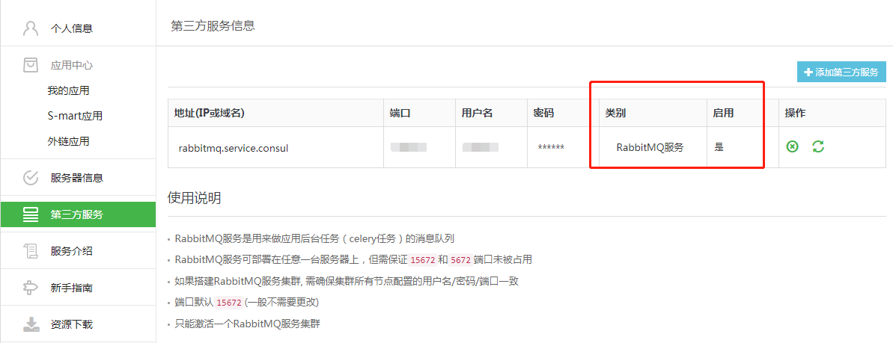
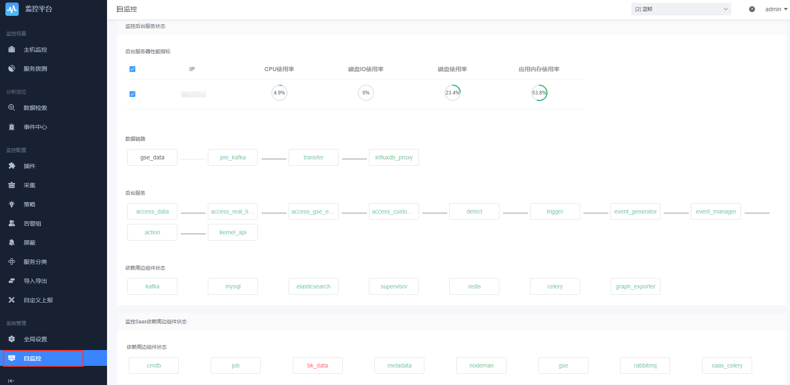

# 环境验证

## 后台环境验证

- 加载环境变量和蓝鲸安装维护的函数

```bash
source /data/install/utils.fc
```
- 执行以下命令，检查蓝鲸的服务状态

```bash
echo bkssm bkiam usermgr paas cmdb gse job consul bklog | xargs -n 1 ./bkcli check
```

- 检查开源组件状态

  可以使用 bkcli 或者 systemctl 查看运行的状态

    - bkcli

  ```bash
  # 这里以 es7 为例，其余 kafka，zookeeper，elasticsearch 同理
  ./bkcli status es7
  ```

    - systemctl
    相关组件服务名称可见 [组件维护](../../维护手册/日常维护/start_stop.md)

  ```bash
  # 这里以 es7 为例，其余kafka，zookeeper，elasticsearch 同理
  # 需要登录至模块分布的机器上
  systemctl status elasticsearch.service 
  ```

## 前台环境验证

请先 **配置 host 或者 DNS** 解析后，确认访问社区版域名(部署完成后提示的域名)是否正常。

- 从蓝鲸工作台-开发者中心-服务器中检查 `正式服务器` 是否激活。


- 从蓝鲸工作台-开发者中心-第三方服务中检查 **RabbitMQ 服务** 是否激活。



- 打开蓝鲸监控平台，查看蓝鲸的数据链路是否正常

  如果只有 bk_data 为红色则正常。否则需要针对显红的地方进行排查直至变为绿色。



最后在蓝鲸工作台打开各个 SaaS 验证各产品功能是否能运行正常。