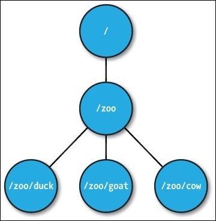
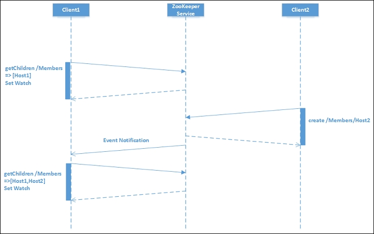
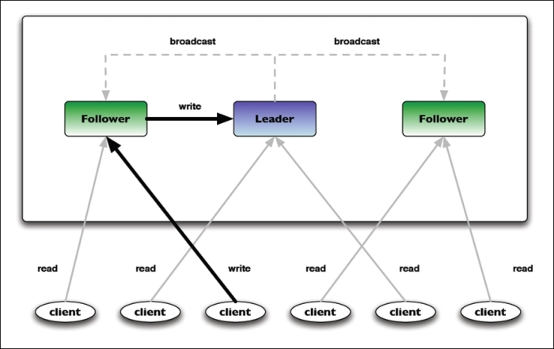

# Zookeeper

Apache ZooKeeper是Apache软件基金会的一个软件项目，为大型分布式计算提供开源的分布式配置服务、同步服务和命名注册。

蓝鲸后台产品中，使用到 Zookeeper 的有：

- cmdb 用作服务发现
- gse 用作服务发现和dataid数据存储
- 蓝鲸监控metadata后台 读取gse 的dataid数据部分

## Zookeeper入门

这一节介绍如何安装zookeeper，从单节点模式开始，熟悉一些基础的zookeeper shell操作。最后介绍如何搭建一个多节点的Zookeeper集群。

### Zookeeper 搭建

Zookeeper 的 rpm 安装包在蓝鲸基础包中已经包含，可以方便的使用 yum 安装

1. 安装JDK

    ```bash
    /data/install/bin/install_java.sh -p /data/bkce -f /data/src/java8.tgz
    ```

2. 安装 Zookeeper

    ```bash
    /data/install/bin/install_zookeeper.sh -j zk_ip1 -b <zk本机监听网卡地址> -n 1
    ```

3. 根据需要注册 consul 的服务名

    ```bash
    /data/install/bin/reg_consul_svc -n zk -p 2181 -a <zk本机监听的网卡地址> -D > /etc/consul.d/service/zk.json
    consul reload
    ```

### Zookeeper 主要配置说明

zookeeper 安装后，主配置在 /etc/zookeeper/zoo.cfg 

    ```bash
    $ cat /etc/zookeeper/zoo.cfg 
    tickTime=2000
    dataDir=/var/lib/zookeeper
    clientPort=2181
    ```

配置项的含义分别是：

- tickTime: 它的单位是毫秒。用于会话注册以及客户端和zookeeper服务之间的心跳。最小的会话超时时间是两倍的tickTime值，上述配置即最小会话超时时间为4秒。

- dataDir: 用于存储Zookeeper内存的状态数据；包括数据库的快照以及数据库更新的事务日志。解压zookeeper安装后不会自动生成dataDir，你需要自己创建指定的目录，并赋予正确的读写权限。

- clientPort: 用于监听客户端链接的端口。默认为2181

### 启停 Zookeeper

手动启动 Zookeeper:

```bash
systemctl start zookeeper
```

等待几秒后，验证 Zookeeper 是否启动正常：

```bash
systemctl status zookeeper

/opt/zookeeper/bin/zkServer.sh status /etc/zookeeper/zoo.cfg
ZooKeeper JMX enabled by default
Using config: /etc/zookeeper/zoo.cfg
Mode: standalone
```

停止 Zookeeper：

```bash
systemctl stop zookeeper
```

### 用java客户端连上zk shell

我们运行zkCli.sh 来启动 Zookeeper的命令行java客户端：

```bash
/opt/zookeeper/bin/zkCli.sh -server $ip:$port
```

当我们连上Zk server后，我们会看到终端上有如下类似的输出：

```txt
Connecting to ....
....
Welcome to ZooKeeper!
JLine support is enabled

WATCHER::

WatchedEvent state:SyncConnected type:None path:null
[zk: x.x.x.x:2181(CONNECTED) 0] 
```

连上终端后，输入help命令，可以看到支持的命令和简明用法。

```bash
[zk: x.x.x.x:2181(CONNECTED) 0] help
ZooKeeper -server host:port cmd args
	stat path [watch]
	set path data [version]
	ls path [watch]
	delquota [-n|-b] path
	ls2 path [watch]
	setAcl path acl
	setquota -n|-b val path
	history 
	redo cmdno
	printwatches on|off
	delete path [version]
	sync path
	listquota path
	rmr path
	get path [watch]
	create [-s] [-e] path data acl
	addauth scheme auth
	quit 
	getAcl path
	close 
	connect host:port

```

我们做一些简单的增删操作如下：

```bash
[zk: x.x.x.x:2181(CONNECTED) 0] ls /               
[cc, gse, zookeeper]
[zk: x.x.x.x:2181(CONNECTED) 1] create /helloworld ""  
Created /helloworld
[zk: x.x.x.x:2181(CONNECTED) 2] ls /
[cc, gse, helloworld, zookeeper]
[zk: x.x.x.x:2181(CONNECTED) 3] delete /helloworld
[zk: x.x.x.x:2181(CONNECTED) 4] ls /
[cc, gse, zookeeper]
[zk: x.x.x.x:2181(CONNECTED) 5] 
```

其实要理解这些命令的操作，需要适当了解下zookeeper的内部机制和数据模型。后面会简单介绍一下。

下面我们先看看如何从单节点模式到集群模式的Zookeeper

## 搭建多节点Zookeeper集群

单节点模式的话，如果这个实例挂了，依赖它的应用都会受到影响。所以生产环境下，我们一般使用集群模式保证高可用。生产环境下，多个zk节点部署在不同的服务器上，组成一个集群。最小的节点数为3，正式环境一般使用5台。组成的集群中，zk实例以leader/follower的模式运行，一个节点会被选举为leader，其余则为follower。如果leader节点挂了，leader重新选举，另外一个运行节点被选举为新的leader。


### 多实例配置说明

多节点集群的zk配置和单实例的类似，只是多了几行，示例如下：

```bash
tickTime=2000
dataDir=/var/lib/zookeeper
clientPort=2181
initLimit=5
syncLimit=2
server.1=zoo1:2888:3888
server.2=zoo2:2888:3888
server.3=zoo3:2888:3888
```

新增的2个配置参数为：

- initLimit: follower和leader之间初始链接时限，单位是tick（tickTime），超时则链接失败。
- syncLimit: follower和leader请求和应答的时限，单位是tick，超时则follower会被丢弃。链接到这台follower的客户端将链接到另外一个可用的follower
- 另外新增的三行配置是 `server.id=host:port:port` 形式。其中`.id`是集群中主机的数字标识，在我们的例子中，zoo1这台主机分配了数字`1`作为标识。

这个数字标识需要通过zk服务器的数据目录（dataDir）下一个名为`myid`的配置文件指定。它里面应该仅仅包含一行文本，仅写入ID信息。id的取值范围是1到255

host字段可以是主机名（需要能解析到ip），也可以直接填写ip地址。

两个端口号2888和3888，分别表示：

- 第一个是2888，集群内节点间通信用的端口，比如leader和follower之间交换信息用的端口。
- 第二个是3888，用于leader选举。

### 启动多台实例

在配置好多台实例的zoo.cfg和myid配置文件后，我们依次启动它们。启动方式和单台节点的操作完全一摸一样。依次登陆zoo1,zoo2,zoo3，然后运行下面的命令

```bash
systemctl start zookeeper
/opt/zookeeper/bin/zkServer.sh status /etc/zookeeper/zoo.cfg
```

下面是在一个三台节点集群的status的输出：

```txt
[zoo1] # /opt/zookeeper/bin/zkServer.sh status /etc/zookeeper/zoo.cfg
ZooKeeper JMX enabled by default
Using config: /etc/zookeeper/zoo.cfg
Mode: follower
[zoo2] # /opt/zookeeper/bin/zkServer.sh status /etc/zookeeper/zoo.cfg
ZooKeeper JMX enabled by default
Using config: /etc/zookeeper/zoo.cfg
Mode: leader
[zoo3] # /opt/zookeeper/bin/zkServer.sh status /etc/zookeeper/zoo.cfg
ZooKeeper JMX enabled by default
Using config: /etc/zookeeper/zoo.cfg
Mode: follower
```

可以看到zoo2这台机器被选举为集群leader，而zoo1和zoo3为follower

用命令行客户端链接集群和单节点一样，只不过连接串可以换成host1:port1,host2:port2...这样的参数传递给-server:


```bash
./zkCli.sh -server zoo1:2181,zoo2:2181,zoo3:2181
Welcome to ZooKeeper!
… … … …
[zk: zoo1:2181,zoo2:2181,zoo3:2181 (CONNECTED) 0]
```

zk集群启动正常后，可以通过JMX（Java Management Extensions）或者“四字命令“来监控集群信息。后面会简单介绍下。

### 在单台机器上启动多实例组成集群

在单台机器上启动多实例也是可行的，用来做一些集群测试时有用。这里简单介绍下。下面是一个示例配置文件：

```bash
tickTime=2000
initLimit=5
syncLimit=2
dataDir=/var/lib/zookeeper
clientPort=2181
server.1=localhost:2666:3666
server.2=localhost:2667:3667
server.3=localhost:2668:3668
```

既然时单机，我们直接用localhost主机名，其次两个port号为了避免冲突，每个实例都改得不一样。最后最重要的一个dataDir配置，因为在同一台机器上，我们需要区分目录。

第一个实例配置zoo1.cfg

```bash
...
clientPort=2181
dataDir=/var/lib/zookeeper/zoo1
...
```

第二个实例配置zoo2.cfg

```bash
...
clientPort=2182
dataDir=/var/lib/zookeeper/zoo2
...
```

第三个实例配置zoo3.cfg

```bash
...
clientPort=2183
dataDir=/var/lib/zookeeper/zoo3
...
```

然后我们将zoo1.cfg,zoo2.cfg,zoo3.cfg都放到/opt/zookeeper/conf/下。并创建/var/lib/zookeeper/zoo{1,2,3}目录，然后生成myid文件：

```bash
mkdir -p /var/lib/zookeeper/zoo{1,2,3}
echo 1 > /var/lib/zookeeper/zoo1/myid
echo 2 > /var/lib/zookeeper/zoo1/myid
echo 3 > /var/lib/zookeeper/zoo1/myid
```

然后指定配置文件启动实例：

```bash
/opt/zookeeper/bin/zkServer.sh start /opt/zookeeper/conf/zoo1.cfg
/opt/zookeeper/bin/zkServer.sh start /opt/zookeeper/conf/zoo2.cfg
/opt/zookeeper/bin/zkServer.sh start /opt/zookeeper/conf/zoo3.cfg
```

启动成功后，我们使用命令行连上本地集群：

```bash
./zkCli.sh -server localhost:2181,localhost:2182,localhost:2183
```

## 理解Zookeeper内部工作机制

### ZooKeeper服务架构

Apache ZooKeeper是用来解决分布式应用得各组件之间的协调问题。它提供的是一些简单但是够用的原子接口，实际应用根据自身需要调用这些接口来实现分布应用中的状态同步、集群配置管理、集群成员管理等问题。


从图中可以看出，ZooKeeper Service是一组Server组成的集群对外提供的服务。client访问这个服务时通过TCP连上其中的一台server，发生请求，收到返回，收到通知，定时发送心跳。

### ZooKeeper数据模型

ZooKeeper提供一个分层的命名空间，让分布式进程共享数据寄存，从而达到协调的作用。这个分层命名空间很像Unix的文件系统结构。数据寄存器（data register）在ZooKeeper的术语中叫做 Znode。下图是一个示例



从图中可以看出：

- 根节点有一个叫/zoo的子节点，而它下面有三个子节点
- 每个znode都通过路径来标识，路径通过/来分隔
- znode叫做数据寄存器，是因为它能存储数据。因此，一个znode节点可以既有数据，又有子znode节点。这点和文件系统更像了。

znode中的数据用byte形式存储，每个znode节点能存储的最大数据大小不超过1MB。因为Zookeeper应用场景不是存储大量数据。单节点存储不超过1M对于zookeeper的场景足够适用。

znode的路径必须是绝对路径开始，不支持相对路径。znode的名称中不能包含"."，

和文件系统一样，znode维护一个数据结构来描述自身的状态，包含记录数据变化的版本号和访问权限控制列表等。

### znode的类型

ZooKeeper有两种znode：持久节点和临时节点。还有一种类型，更准确说是前两种节点类型的一个属性，叫做顺序节点。持久节点和临时节点都可以是顺序节点，这样一组合就有四种节点类型了。znode节点的类型是在创建时确定的。

#### 持久节点

持久节点在ZooKeeper的命名空间中一直存在，除非被删除。znode节点的删除，可以调用`delete`的API。并不只有创建这个节点的客户端才能删除，任何授权客户端都能删除一个znode。

我们实践一下：

```bash
[zk: localhost(CONNECTED) 1] create /bk "blueking"
Created /bk
[zk: localhost(CONNECTED) 2] get /[bk]
blueking
```

持久节点适用于需要高可用，能被所有应用访问获取的数据信息。例如应用的配置信息。这些信息在客户端断开后，也会一直保留在znode节点中。

#### 临时节点

临时节点和持久节点相反，创建它的客户端会话结束后，该节点会被ZooKeeper删除。客户端的会话结束可能是客户端异常，或者网络连接断开。虽然临时节点和客户端会话有关，但是它在权限范围内对其他客户端都是可见的。

临时节点也可以显式的用`delete`方法删除。由于临时节点在客户端会话结束后会自动删除，当前版本的Zookeeper不允许创建临时节点的子节点。

要创建临时节点，在create方法后加上"-e"参数：

```bash
[zk: localhost:2181(CONNECTED) 1] create -e /bk "blueking"
Created /bk
```

验证下是否可以创建子节点：
```bash
[zk: localhost:2181(CONNECTED) 2] create -e /bk/paas "blueking"
Ephemerals cannot have children: /bk/paas
```

临时节点的概念很适合用做分布式集群的管理。当一个客户端退出时，断开zk的会话，zk自动删除它创建的临时节点，从而集群中其他节点知道这个客户端离开了集群。

#### 顺序节点

顺序节点类型，在Zookeeper创建时，会自动在znode名字后加上序列号。序列号由父节点维护，它是全局自增的。
序列的计数器由10个数字（用0填充）组成。例如：/path/to/znode-0000000001

由于持久和临时节点都是顺序节点，所以我们一共有四种节点：

* 持久节点
* 临时节点
* 持久顺序节点
* 临时顺序节点

使用命令行创建顺序节点，我们使用`-s`参数：

```bash
[zk: localhost:2181(CONNECTED) 1] create /bk_seq ""             
Created /bk_seq
[zk: localhost:2181(CONNECTED) 2] create -s /bk_seq/node "foo"
Created /bk_seq/node0000000000
[zk: localhost:2181(CONNECTED) 3] create -s -e /bk_seq/node "bar"
Created /bk_seq/node0000000001
```

### ZooKeeper Watches

ZooKeeper实现了一种机制，当有znode发送变化时，主动通知客户端，而不是客户端轮询Zookeeper。

客户端可以向Zk注册有关任意znode的事件通知。这种注册，在zk术语里叫做setting a watch。watch是一次性的操作，意味着只触发一次通知。如果需要继续收到主动推送的通知，客户端需要重新注册需要watch的事件。

我们以一个集群的节点模型来展示watch和通知的概念：

- 在集群中，一个节点，假设名为Client1，想在集群有新节点加入时收到这个事件的通知。这里的设计是，任一节点加入集群会在/Members下创建一个临时节点。
- 现在，第二个节点，名为Client2，加入了集群然后在/Members下创建了一个临时节点叫node2
- Client1，向Zk的/Members节点发起`getChild`的指令，然后对/Members设置了一个任意事件的watch。当Client2在/Members下创建了znode：/Members/Host2时，这个watch触发，于是Client1从Zk服务收到了通知，于是它看到了集群新增了Host2这个znode。下图说明了整个流程



Zk的watch是一次性的。如果一个客户端收到了一个watch的通知后，还想接受后续事件通知，它必须重新设置一个watch。

在znode发生以下三种改变时，会触发通知：

1. 任何改变znode data的操作。例如使用set命令来设置znode的data数据时。
2. 任何改变znode子节点的操作。例如一个znode的子节点被delete删除。
3. znode创建或删除。

### ZooKeeper 操作

Zookeeper的数据模型和API支持下列9种基本操作：

- create： 创建znode
- delete：删除znode
- exists: 判断znode是否存在
- getChildren：返回子节点列表
- getData: 获取znode的数据
- setData: 设置znode的数据
- getACL: 获取znode的ACL
- setACL: 设置znode的ACL
- sync：使当前client连接的zookeeper server从leader节点同步下数据

我们使用zk的命令行来演示基本操作：

1. 创建名为/blueking的znode，设置它的数据为"Tencent Blueking"

    ```bash
    [zk: localhost(CONNECTED) 0] create /root "ThisIsTheRootNode"
    Created /root
    ```

2. 获取刚才创建的znode /blueking的数据

    ```bash
    [zk: localhost:2181(CONNECTED) 1] get /blueking
    Tencent Blueking
    ```

3. 给/blueking增加一个名为paas的子节点，数据为"This is PaaS"

    ```bash
    [zk: localhost:2181(CONNECTED) 2] create /blueking/paas "This is PaaS"
    Created /blueking/paas
    ```

4. 给/blueking增加一个名为cmdb的子节点，数据为"This is CMDB"

    ```bash
    [zk: localhost:2181(CONNECTED) 3] create /blueking/cmdb "This is CMDB"
    Created /blueking/cmdb
    ```
    
5. 列出/blueking的子节点

    ```bash
    [zk: localhost:2181(CONNECTED) 4] ls /blueking
    [cmdb, paas]
    ```
    
6. 列出/blueking的访问控制列表信息

    ```bash
    [zk: localhost:2181(CONNECTED) 5] getAcl /blueking
    'world,'anyone
    : cdrwa
    ```
    
7. 删除/blueking节点，会报错，因为它还有子节点

    ```bash
    [zk: localhost:2181(CONNECTED) 6] delete /blueking
    Node not empty: /blueking
    ```

8. 删除paas和cmdb两个子节点

    ```bash
    [zk: localhost:2181(CONNECTED) 7] delete /blueking/paas
    [zk: localhost:2181(CONNECTED) 8] delete /blueking/cmdb
    [zk: localhost:2181(CONNECTED) 9] ls2 /blueking
    []
    ```
    
9. 删除blueking节点

    ```bash
    [zk: localhost:2181(CONNECTED) 10] delete /blueking
    ```

下图显示ZooKeeper的读写操作



图中可以看出2点非常重要的：

- 读请求：client连接的zookeeper server本地直接返回
- 写请求：在返回写入成功的相应之前，会将写请求传递给集群leader，并确保多数节点成功。


### ZooKeeper访问控制列表

### ZooKeeper运维的最佳实践

1. zookeeper的datadir存储了快照和事务日志文件。最好定时清理，如果autopurge选项没有设置的话。运维可以根据开发要求与否，备份这些文件。不过由于zookeeper集群是数据冗余的，所以备份一台server节点的即可。
2. zookeeper使用apache log4j作为日志框架。日志文件建议配置好自动轮滚，防止占用太多空间。
3. zookeeper集群zoo.cfg里配置的server list应该每台机器保持一致
4. 客户端连接zookeeper集群用的连接串应该和配置的server list保持一致，否则可能会有奇怪的问题产生。
5. transaction的日志最好存储在性能比较好的磁盘分区上。
6. java的heap size设置正确。zookeeper机器上不应该发生Swapping。


### ZooKeeper监控

## 蓝鲸使用 Zookeeper 中的关键路径说明

- CMDB的服务发现：/cc/services/endpoints/
- GSE的基础节点信息，参考创建的脚本：`bin/create_gse_zk_base_node.sh`
- GSE的dataid存储信息，/gse/config/etc/dataserver/data/<dataid>
