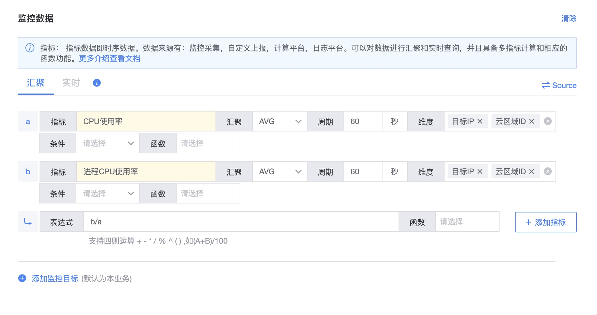
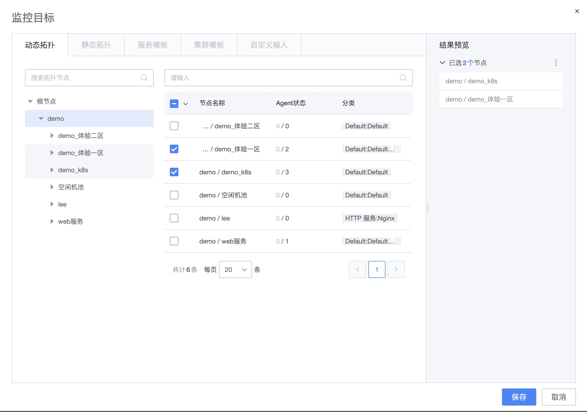
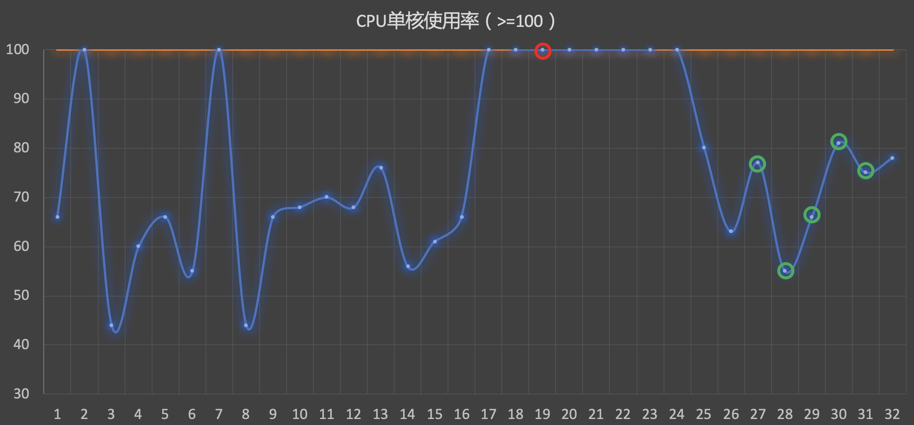
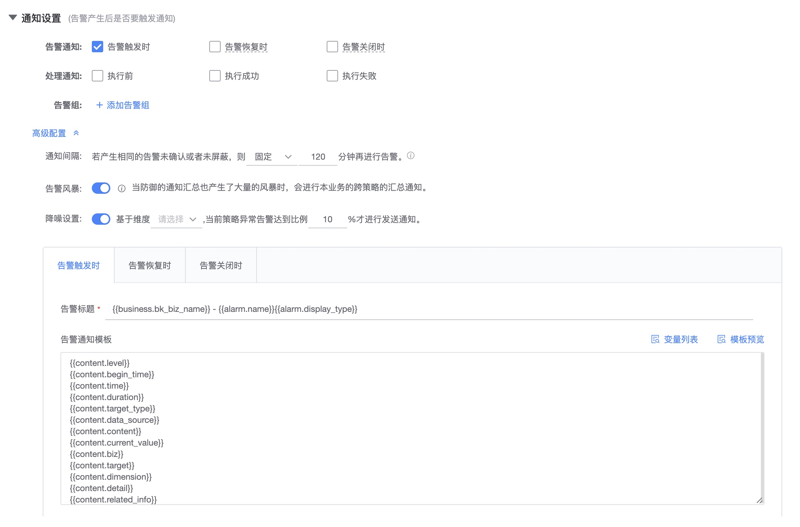
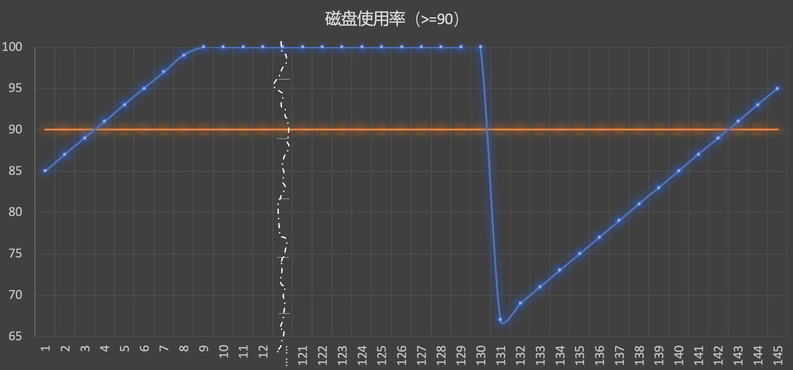
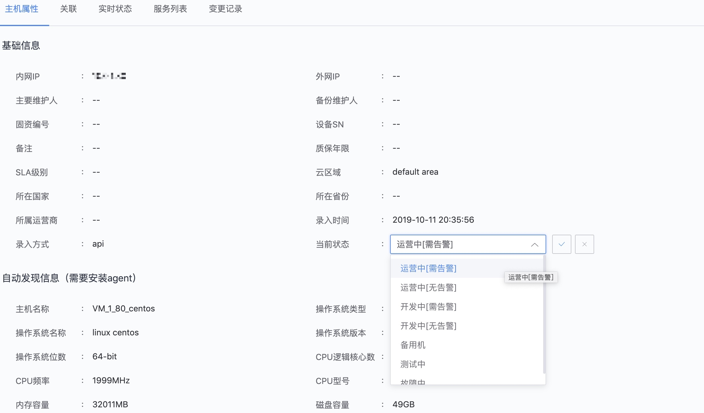

# 告警策略配置

监控平台所有的监控策略都可以在 配置->告警策略 中进行管理和创建。 

* 支持五种数据类型：监控平台接收了五种数据，指标数据Metrics、事件数据Events、日志数据Logs、告警数据Alerts、调用链数据Traces. 这五种数据都可以在告警策略中完成监控和配置。 
* 支持不同的数据来源： 监控平台自身、计算平台、日志平台
* 支持8种检测算法和2种智能检测
* 支持丰富的告警通知设置和完全自定义的通知模版
* 支持便利的周边服务联动，实现故障自愈的目的
* 支持无数据告警
* 支持秒级监控
* 支持多指标计算兼容PromQL

## 策略列表

* 增加了各种策略的状态： 
    * 告警中： 当前告警中的时候可以点击跳转到事件中心查看
    * 已失效： 失效的策略就是虽然是开启生效状态，但因为数据源不存在了或者配置不合理导致没有策略没有意义了。
    * 已停用/已启用
* 有各种批量修改能力

## 策略功能说明

### 基本信息设置

* **策略名称**：用于形容告警策略的具体意义，便于在发出告警时，用户能从告警的标题快速的确认问题的来源。
* **监控对象**：具体分类及概念查看[术语解释](../../concepts/glossary.md)。有两个作用：
    * 确定策略的分类属于哪一处。
    * 帮助指标，事件和日志做一个分类的筛选

### 监控数据设置

每一种数据的策略查询数据的方式不一样和对应的能力也有所区别。

**指标数据**：监控项为指标 Metrics，监控指标的来源有，监控默认采集和监控用户采集，计算平台，自定义上报，日志平台

**事件数据**：监控项为事件名称 Events，事件名称的来源有，系统事件，自定义事件上报

**日志关键字**：日志关键字有两个来源： 在客户端采集的日志关键字事件 ， 基于ES存储查询的日志关键字告警。

**关联告警**：对于不同的告警事件，或者来源于其他平台的告警事件，再进行关联的配置是否要进行处理，如当两个告警同时产生时才进行打电话等。

#### 指标数据

指标选择器

指标数据查询和计算，更多查看[多指标查询及函数](../data-visualization/mutil_metric.md)

监控目标，可以锁定策略生效的数据范围，只有与CMDB产生联动的才会有，其他的默认都是本业务的数据范围。 

检测规则：

* 提供了8种自带的检测算法
* 提供了单指标智能异常检测和单指标预测，依赖计算平台和AIOps平台，并且只有单指标的时候才会有，每种算法又对应AIOps多种模型，模型可自定义。 
* 各算法之间可以使用同时生效，也可以分别生效

具体算法的说明查看附录 [算法说明](../addenda/algorithms.md)

### 判断条件

* **触发条件**：是一种防抖机制，控制数据的敏感度，当然越不敏感告警通知的及时性越差，越敏感告警通知越多
* **恢复条件**：是判断问题恢复的方法，也是决定了事件恢复的结束时间
* **无数据**： 可以基于指标或者基于某个维度是否有无数据进行判断，维度选择的范围就是数据查询的范围（汇聚维度）。 
* **通知时间段**：如果能确认每个时间段不需要接收通知也没有问题，那就设置吧。默认是整天。还可以关联日历服务做更复杂的通知敲定。

#### 触发条件、恢复条件工作原理

数据经过算法检测后，会得到一个个的异常点。如果每一个异常点，都发送通知的话，那么在数据抖动或持续异常的场景下，一段时间内会多次收到通知，造成告警风暴。为了防止因为数据抖动等场景导致的告警骚扰，可以通过设置触发条件、恢复条件，以及通知间隔这三种方式来进行告警抑制。

- 页面设置

- 触发条件

    只有在连续多个检测周期中满足多次检测算法，才触发告警通知。

    如设置触发条件为 5 个周期满足 3 次检测算法。则表示在连续 5 次数据检测中，有 3 次或 3 次以上检测结果满足检测算法，那么则触发告警。

如上图，2、7、17、18、19、20、21...等这些点都满足检测算法，但是从检测窗口来看。

> 注：检测窗口，当前点往前看 5 个周期，在这 5 个周期内看有多少个点满足条件。

只有 19、20、21...等这些才满足触发条件(5 个周期满足 3 次)，满足条件的才触发告警通知。从而可以有效的避免因抖动而产生的多次告警。

- 恢复条件

    恢复条件，是在触发条件的基础上来判断，只有**连续**多次不满足触发条件则表示恢复。

    如设置恢复条件为连续 5 个周期不满足触发条件，表示在连续 5 次触发条件检测中，没有一次满足触发条件，则告警恢复。

如上图，19、20、21、22、23、24、25、26 等这些点都是满足触发条件(5 个周期满足 3 次)，那么从 27 开始，27、28、29、30、31、32 这些点都是不满足触发条件的。那么告警会在 31 这个点恢复，因为这个点首次达到连续 5 次不满足触发条件。

> 注意：
> 触发条件里的周期，分两种情况：
> 时序类：按用户配置的聚合周期来
> 事件类：事件只有异常的时候才有数据，没有周期的概念，所以这里的周期固定为 1 分钟，5 个周期，即 5 分钟

#### 无数据工作原理

无数据检测是在策略配置中的附加功能，在高级选项下配置，当连续 n 个周期未拉取到数据后，则触发告警。

假如配置连续 5 个周期未上报数据，

如图：

|时间| 无数据检测(连续 5 个周期无数据) | 是否告警|
|---|---|---|
|第 1 分钟|有数据|无|
|... ...|有数据|无|
|第 6 分钟|1 个周期无数据，不满足条件|无|
|第 7 分钟|2 个周期无数据，不满足条件|无|
|第 8 分钟|3 个周期无数据，不满足条件|无|
|第 9 分钟|4 个周期无数据，不满足条件|无|
|第 10 分钟|5 个周期无数据，满足条件|产生告警|

> 注：无数据告警同样有触发条件、恢复条件、告警间隔等这些。会跟随策略的配置。

### 告警处理设置

###  告警通知设置

* **告警通知**：指发生告警时，告警恢复时，告警关闭时，有相应的通知能力。
* **处理通知**：指在配置了告警处理动作的时候，才会需要确定是否使用。 
* **通知间隔**：指的是未恢复或未确认前则每隔多久将再进行告警。有固定和递增两种方式。
* **告警组**：默认是告警组，一般情况下接收告警的人都是相对固定的。通过告警组的设置和变更将更加的方便，还可以支持多个告警组。告警组的使用方法详细查看[告警组说明](./alarm-group.md)
*  **告警风暴**：指的是当同一时刻达到了某个平台设置的最大上限将进行跨策略汇总告警通知
    *  配置方法：导航 →  系统管理 →  全局配置 →  告警通知汇总设置
    *  更多告警汇聚和收敛说明请查看附录[通知收敛&汇总机制说明](../alarm-configurations/coverge.md)
* **告警降噪**： 可以基于某些维度情况达到一定量后才真正产生告警通知。 
* **告警通知模版**：影响告警通知查看的内容，因为不同的通知渠道都有字符的限制，所以默认的告警通知是做了自动转换和截段处理等。目的是在有限的字符限制内提供更有用的信息。通知的种类有：
    * 异常单条告警 按级别
    * 同策略不同目标 按级别
    * 异常跨策略汇总告警 按级别)
    * 以上对应的恢复通知
> 更多告警通知模版的配置请查看场景案例[如何设置自己的通知模版](../alarm-configurations/notify_case.md)

#### 设置通知间隔工作原理

- 页面设置

- 说明

    在持续异常的情况下，前面的触发条件会一直满足，则会一直触发告警，称为[持续事件]，为了防止频繁的收到告警，可以设置两次通知之间的最小间隔。如上图，通知间隔设置 2 个小时，一直产生告警的话，只要是未恢复，那么会按 2 个小时的最小间隔来发送。

这里引用触发条件里的图片，19、20、21、22、23、24 等都是满足触发条件，则都会触发告警通知，如果设置了告警间隔 120 分钟，那么只有在 19 会发送一次通知，后面的都不会发送，如果一直持续满足触发条件的话，那么下一次就是 139 这个点之后再通知一次。

#### 事件生成原理

- 如下图，磁盘使用率告警，配置如下
    - 检测算法：>= 90
    - 触发条件：5 个周期满足 1 次
    - 恢复条件：连续 5 个周期不满足触发条件
    - 通知间隔：120 分钟

- 数据点

- 异常点

- 每个时间点判断结果

|时间|检测算法(>= 90)|触发条件(5 个周期满足 1 次)|通知(间隔 120 分钟)| 是否恢复 |
|---|---|---|---|---|
|第 1 分钟|无|无|无|无|
|第 2 分钟|无|无|无|无|
|第 3 分钟|无|无|无|无|
|第 4 分钟|满足>90|5 个周期满足 1 次|产生新的事件，并通知。 下一次通知时间第 124 分钟|无|
|第 5 分钟|满足>90|5 个周期满足 2 次|被收敛，不通知|无|
|... ...|满足>90|... ...|... ...|... ...|
|第 123 分钟|满足>90|5 个周期满足 5 次|被收敛，不通知|无|
|第 124 分钟|满足>90|5 个周期满足 5 次|产生通知。 下一次通知时间第 244 分钟|无|
|第 125 分钟|满足>90|5 个周期满足 5 次|被收敛，不通知|无|
|... ...|满足>90|... ...|... ...|... ...|
|第 130 分钟|满足>90|5 个周期满足 5 次|被收敛，不通知|无|
|第 131~134 分钟|无|5 个周期分别满足 4~1 次|被收敛，不通知|无|
|第 135~138 分钟|无|无|被收敛，不通知|不满足触发条件 1~4 次|
|第 139 分钟|无|无|结束通知，重置下次告警时间|不满足触发条件 5 次，事件恢复|
|第 140 分钟|无|无|无|无|
|... ...|无|... ...|... ...|... ...|
|第 143 分钟|满足>90|5 个周期满足 1 次|产生新的事件，并通知。 下一次通知时间第 263 分钟|无|
|第 144 分钟|满足>90|5 个周期满足 2 次|被收敛，不通知|无|

该事件变化情况可以在事件详情的事件流水中查看。

## 高级告警联动

### 主机运营字段

在 CMDB 进行主机运营字段的设置，默认会与监控进行联动，不会进行告警通知。所以该字段可以与发布相关操作进行联动。

具体的区别：在监控的全局设置中可以设置更多的状态。

* 主机不监控字段列表：该主机下的策略不会产生任何告警事件
* 主机不告警字段列表：该主机下的策略会产生告警事件，在事件中心中可以查看到，但不会有告警通知发送到人，是被屏蔽状态

### 监控目标范围抑制

对于监控采集的，基于 CMDB 采集的数据可以做到监控目标范围的抑制。举一个例子：

* 环境：一个集群下面机器 90%都是 500G，但是某些机器或某个模块是 2T，那么统一设置磁盘空间的告警策略超过 80%时进行告警，这个对于 2T 的服务器就不太合理，因为按百分比剩余的空间太多
* 配置方法：
    * 先创建一个全局的 A 策略，监控目标为该集群，静态阈值超过 80%进行告警
    * 再创建一个小范围的 B 策略，监控目标为那几个特殊的服务器或者那个模块，静态阈值就可以设置超过 90%才进行告警
* 效果就是：
    * A 策略和 B 策略配置的内容都一样，只是监控目标的范围区别，那么小范围中的服务器会优先大范围生效。达到告警抑制的效果

### 监控等级抑制

监控默认有三个等级，从低到高依次是：提醒、预警、致命。

那么在策略判断的时候会先以高等级进行判断，一旦符合高等级的条件，就不再再检查低等级的。达到等级抑制效果而不会进行重复的告警。

### 更多相关的场景案例

* [如何对进程进行监控](../scene-process/process_monitor.md)
* [如何监控日志平台的数据](./log_monitor.md)
* [如何监控计算平台的数据](./bigdata_monitor.md)

