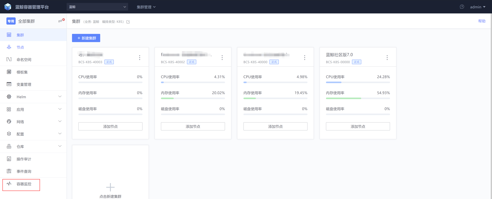
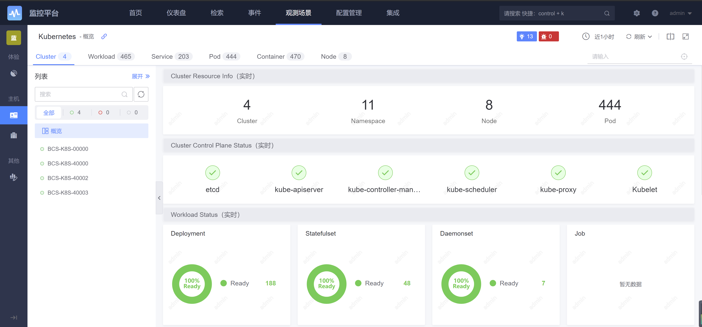
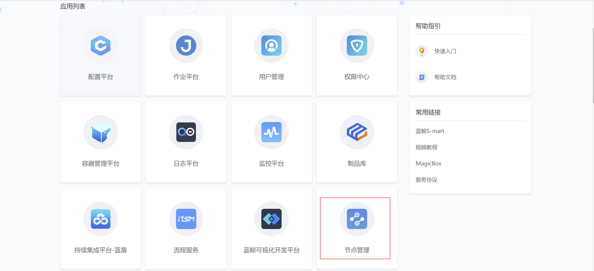

# 容器监控

## 概述

社区版7.0的容器监控已从prometheus切换到了蓝鲸容器监控





蓝鲸容器监控使用依赖两个组件bcs-k8s-watch与bkmonitor-operator，否则会没有数据

## bcs-k8s-watch组件安装

- 选择其中一台master角色服务器，如果master服务器上没有安装helm，可以执行下面命令安装，也可以自己去网上下载

  `wget https://bkopen-1252002024.file.myqcloud.com/ce7/tools/helm && chmod +x helm && mv helm /usr/bin/`

- 添加chart包镜像仓库
```shell
helm repo add blueking https://hub.bktencent.com/chartrepo/blueking
```

- 如果命名空间bcs-system不存在，则需要创建命名空间

  `kubectl create ns bcs-system`

- bcs-gateway绑定hosts，解决bcs网关访问问题，可以把域名bcs-api-gateway绑定到集群“蓝鲸社区版7.0”任意一台node上，这个node最好是master角色

  `kubectl edit cm coredns -n kube-system`

  添加以下内容：

  ```
          hosts {
            1.1.1.1 bcs-api-gateway
            fallthrough
          }
          # 1.1.1.1 是集群“蓝鲸社区版7.0”任意一台node，最好是master
  ```

  

- 创建bcs-k8s-watch所需证书

  把以下内容保存到集群master服务器上，文件名为：bcs-client-bcs-k8s-watch.yaml

  ```
  apiVersion: v1
  data:
    ca.crt: 
    tls.crt: 
    tls.key: 
  kind: Secret
  metadata:
    name: bcs-client-bcs-k8s-watch
    namespace: bcs-system
  type: kubernetes.io/tls
  ```

  通过webconsole或ssh到集群“蓝鲸社区版7.0”

  

  ```shell
  # 在集群中执行如下命令
  kubectl get secret bcs-gateway-bcs-services-stack -n bcs-system -o yaml
  ```

  把里面的ca.crt、tls.crt、tls.key里面的内容填充到bcs-client-bcs-k8s-watch.yaml里

  执行 `kubectl apply -f bcs-client-bcs-k8s-watch.yaml `创建好证书

- 通过helm chart安装bcs-k8s-watch

  把以下内容保存文件为bcs-k8s-watch-values.yaml，把 {集群ID} 替换为目前你操作的集群ID，例如：BCS-K8S-40000

  ```
  global:
    serviceMonitor:
      enabled: false
    env:
      BK_BCS_clusterId: {集群ID}
    telnet:
      registry: "hub.bktencent.com"
      repository: blueking/bcs-telnet
      tag: "v1.21.1"
  storage:
    zookeeper:
      endpoints: ["bcs-api-gateway:31746"]
  image:
    registry: hub.bktencent.com
    repository: blueking/bcs-k8s-watch
    tag: v1.26.0-alpha.1
  env:
    BK_BCS_customStorage: "https://bcs-api-gateway:31024"
  ```

  执行以下命令安装bcs-k8s-watch

  ```
  helm repo update
  helm upgrade --install bcs-k8s-watch blueking/bcs-k8s-watch -f ./bcs-k8s-watch-values.yaml -n bcs-system --devel
  Release "bcs-k8s-watch" does not exist. Installing it now.
  NAME: bcs-k8s-watch
  LAST DEPLOYED: Thu Apr 14 18:58:24 2022
  NAMESPACE: bcs-system
  STATUS: deployed
  REVISION: 1
  TEST SUITE: None
  
  kubectl get pod -n bcs-system|grep bcs-k8s-watch
  bcs-k8s-watch-58ccdb4894-9fwbv   1/1     Running   0          25s
  
  kubectl logs  bcs-k8s-watch-58ccdb4894-9fwbv -n bcs-system
  ```

  ## gse_agent安装

  容器监控依赖gse_agent做数据管道，在部署容器监控后要安装好gse_agent，如果集群master与node都已经安装好gse_agent，可以忽略此步骤

  判断节点上是否安装gse_agent命令：`ps -ef|grep gse_agent`

  


## bkmonitor-operator安装

bkmonitor-operator使用helm chart安装，首先把以下内容保存为文件bkmonitor-operator-values.yaml

```
bkmonitor-operator-charts:
  bkmonitor-operator:
    image:
      registry: hub.bktencent.com
      repository: blueking/bkmonitor-operator
    targetNamespaces:
    - default
    - kube-system
    - blueking
    - bcs-system
  bkmonitorbeat:
    bkmonitorbeatReloader:
      image:
        registry: hub.bktencent.com
        repository: blueking/bkmonitorbeat-reloader
    image:
      registry: hub.bktencent.com
      repository: blueking/bkmonitorbeat
  bkmonitorbeat-event:
    bkmonitorbeatReloader:
      image:
        registry: hub.bktencent.com
        repository: blueking/bkmonitorbeat-reloader
    image:
      registry: hub.bktencent.com
      repository: blueking/bkmonitorbeat
  enabled: true
```

执行以下安装命令：

```
# 如果不存在bkmonitor-operato命名空间则创建bkmonitor-operator命名空间
kubectl create ns bkmonitor-operator

helm repo update
helm upgrade --install bkmonitor-operator-stack blueking/bkmonitor-operator-stack --version=3.5.98 -f ./bkmonitor-operator-values.yaml -n bkmonitor-operator
Release "bkmonitor-operator-stack" does not exist. Installing it now.
NAME: bkmonitor-operator-stack
LAST DEPLOYED: Thu Apr 14 20:18:00 2022
NAMESPACE: bkmonitor-operator
STATUS: deployed
REVISION: 1
TEST SUITE: None
NOTES:
本chart包安装内容及检查方式如下:
0.检查部署的所有pod
kubectl get pods -n bkmonitor-operator -o wide

1.bkmonitor-operator
检查deployment下是否存在bkmonitor-operator实例
kubectl get deployments -n bkmonitor-operator -o wide -l app.kubernetes.io/name=bkmonitor-operator
kubectl get pods -n bkmonitor-operator -o wide -l app.kubernetes.io/name=bkmonitor-operator

2.bkmonitorbeat
检查daemonset下是否存在bkmonitorbeat实例
kubectl get daemonsets -n bkmonitor-operator -o wide -l app.kubernetes.io/name=bkmonitorbeat
kubectl get pods -n bkmonitor-operator -o wide -l app.kubernetes.io/name=bkmonitorbeat

3.检查采集配置是否正确下发
登录bkmonitorbeat其中一个pod，检查是否正确下发了子任务配置文件
kubectl exec  {bkmonitorbeat的pod名} -n bkmonitor-operator -- ls /data/bkmonitorbeat/config/child_configs

4.检查各pod是否在持续报错
kubectl logs {pod名} {container名} -n bkmonitor-operator
```

因为目前bkmonitor-operator是使用轮询的方式生效，预计可以看到数据上报时间为10-20分钟，后续会在这方面有所优化