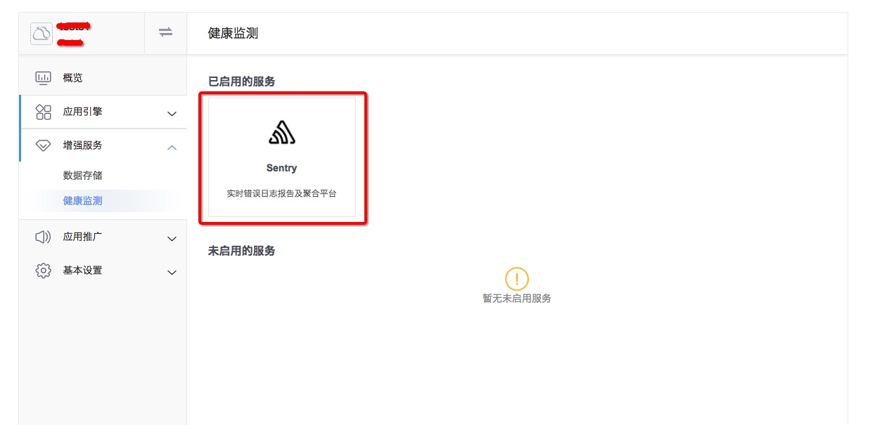
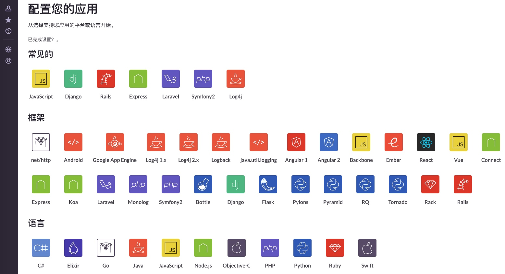
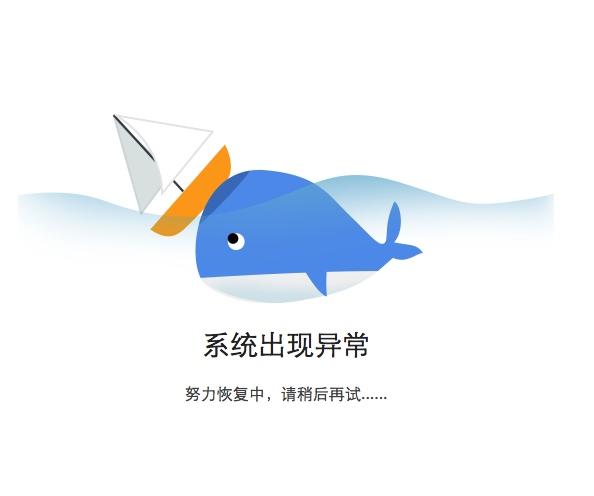
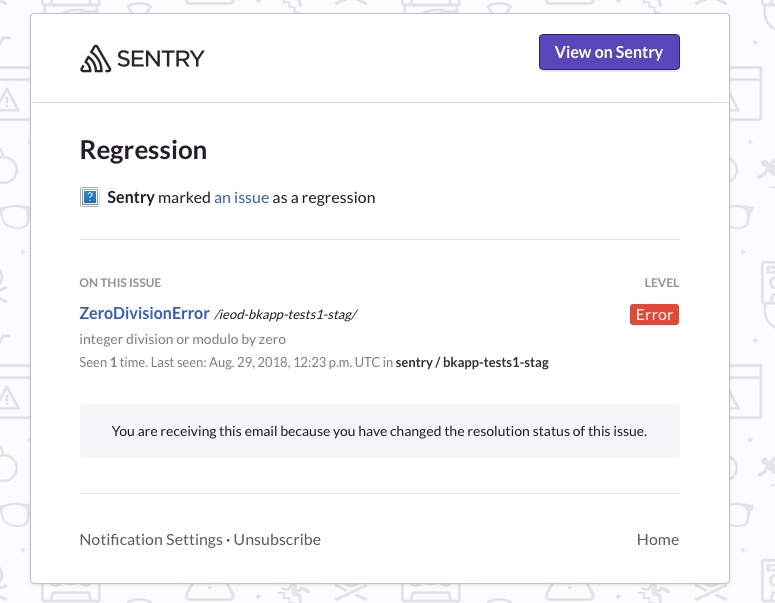

# 增强服务：sentry

> 蓝鲸 PaaS 3.0 作为新一代 PaaS 平台, 相对于 PaaS 2.0 做了很多优化工作, 在优化开发者开发及部署体验的同时, 也针对性开发了一些"增强服务", 帮助开发者进一步提升效率.

## Sentry 是什么

> Sentry is cross-platform application monitoring, with a focus on error reporting.

> Sentry fundamentally is a service that helps you monitor and fix crashes in realtime

简单来说, 接入 sentry 后, 你可以

- 实时查看异常及错误的统计及概览, 了解应用的健康状态
- 实时查看错误详情, 快速定位问题
- 邮件接收到异常告警
- 多语言/多框架支持
- 可以自行调用 sentry sdk, 上报自己关注的内容, 不仅限于异常

注意:

- 已捕获的异常不会上报到 sentry


## PaaS 3.0 对 Sentry 的支持

PaaS 3.0 已经默认搭建了 Sentry 服务, 应用可以在开发者中心开启后接入.

### 1. 启用 Sentry



启用 Sentry 后, 可以通过环境变量`SENTRY_DSN`获取, 下面是 Python 的例子：

```python
SENTRY_DSN = os.environ.get("SENTRY_DSN")
```

### 2. 应用变更

通过 PaaS 3.0 新建的 Python 应用(蓝鲸应用开发框架/蓝鲸应用开发样例)。

查看 `requirements.txt`, 确认`blueapps`版本。

#### 2.1 blueapps==1.0.17 及以上版本

新建应用生成的应用代码中已包含, 无需配置。

> **注意**: 如果是手工从`1.0.17`以下版本升级到`1.0.17`及以上版本, 此时自动生成代码不包含相关配置, 需要自行增加`2.1 修改并确认代码中 APM 相关配置`中的`requirements.txt`变更部分。

#### 2.2 blueapps==1.0.16 及以下版本变更

(如果 blueapps 低于`1.0.16`, 请先升级至`1.0.16`; 即直接修改`requirements.txt`中版本号)

检查`requirements.txt`及`config/default.py`中对应配置是否存在

修改 requirements.txt

```bash
# 加入raven包依赖
raven==6.1.0
```


修改 config/default.py

```bash
# 请在这里加入你的自定义 APP 或者删除初始化默认 APP
INSTALLED_APPS += (
    'home_application',
    'mako_application',
    # 加入这行
    'raven.contrib.django.raven_compat',
)

# 加入如下代码
SENTRY_DSN = os.environ.get("SENTRY_DSN")
if SENTRY_DSN:
    RAVEN_CONFIG = {
        'dsn': SENTRY_DSN,
    }
```

#### 2.3 其他语言及框架变更



- 非开发框架 Python 应用, 参照 [https://docs.sentry.io/clients/python/](https://docs.sentry.io/clients/python/) 指引配置
- 其他语言及语言对应框架, 参照 [https://docs.sentry.io/clients/](https://docs.sentry.io/clients/) 指引配置

步骤

1. 在 settings 等配置位置, 环境变量获取 `SENTRY_DSN`
2. 如果对应框架存在适配, 安装对应 sdk 包后, 直接根据文档配置
3. 如果没有适配, 安装对应语言的 sdk, 通过 sdk 调用

### 3. 加入测试代码

以 python 应用为例，

可以加一段代码到某个请求中的 view 函数中, 用于测试, `1/0`, 访问这个链接将 500 。

```python
def test(request):
    """
    首页
    """
    1 / 0

    return render(request, 'home_application/home.html')
```

### 4. 重新部署

部署时, 申请的`DSN` 会通过环境变量注入给应用，发布后生效。

### 5. 测试

访问测试请求, 500



然后访问 [Sentry]


这里, 可以清晰地看到导致 500 的问题

此时, 你也会收到一封邮件. sentry 会自动做汇聚收敛, 不会出现告警风暴



## PaaS 2.0 旧应用迁移

目前蓝鲸 PaaS 3.0 提供了应用迁移功能, 可以快速将 v2 的应用迁移至 v3

[【应用迁移文档】](../../../topics/paas/legacy_migration.md)


旧应用迁移后, 迁移过程中, 默认在旧应用的代码中 patch 了 sentry 的配置.

所以, 迁移过程中或迁移后

1. 在开发者中心 - 应用 - 增强服务 - 健康监测 中启用 `Sentry`
2. 重新部署应用至预发布/生产环境

此时, 会自动申请 sentry 项目, 并将相关信息注入运行时环境.

附: 应用迁移 patch 的代码

requirements.txt

```bash
# WARNING: CODE BLOCK FOR PAAS 3.0 ADAPTATION BEGIN
gunicorn==19.6.0
pymysql==0.6.7
python-json-logger==0.1.7
raven==6.1.0

# WARNING: CODE BLOCK FOR PAAS 3.0 ADAPTATION END
```

conf/settings_patch.py

```bash
# Sentry
SENTRY_DSN = os.environ.get("SENTRY_DSN")
if SENTRY_DSN:
    INSTALLED_APPS_PATCH.append('raven.contrib.django.raven_compat')
    RAVEN_CONFIG = {
        'dsn': SENTRY_DSN,
    }
```

## 其他

如果在使用过程中有任何问题, 可以联系管理员
