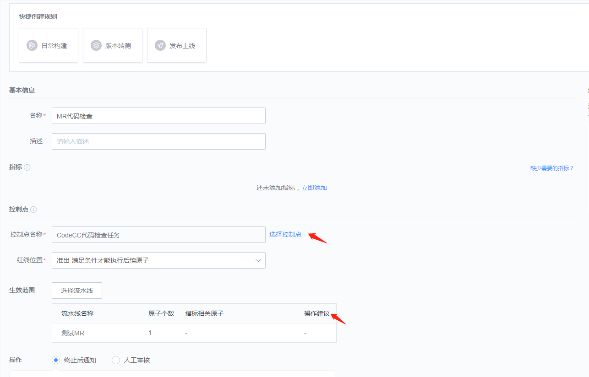
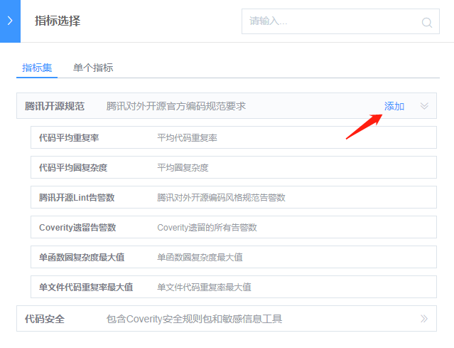

# 在Merge Request时使用质量红线

## 关键词：MR、质量红线 

## 业务挑战 

在实际开发中，我们进行分支管理如下：

● master分支是非常稳定的，仅用来发布新版本，平时不在上面做开发；

● 代码开发都在dev分支上，dev分支是不稳定的，到某个时候，比如版本发布时，再把dev分支合并到master上；

● 开发人员每个人都在dev分支上做代码开发，每个人都有自己的分支，时不时地往dev分支上合并就可以了。

那么当开发人员的分支合并到dev时，需要发起Merge Request请求和代码检视。

## 蓝盾优势 

蓝盾质量红线通过设置质量标准，控制流水线的行为，使得其产出物必须符合质量标准要求。它能够支持Git Merge Request、日常构建、版本转测、版本发布等场景下对软件产品质量的保证。

## 解决方案 

1、创建一条流水线，并添加“Git事件触发”。其中Git事件类型选择Merge Request Hook，并勾选“同时提交锁定”。

2、在CodeCC等可配为质量红线控制点的原子会有一个快捷入口，用于快速创建一条质量红线规则。

点击“返回”后进入创建质量红线的界面，此时控制点和生效范围都已经自动选择好。

选择需要的指标，例如可以选择腾讯对外开源规范的指标集，能够确保合入的代码符合腾讯对外开源代码规范。

此时发起MR和代码检视，将会触发流水线扫描，如果代码不符合质量红线的要求，将会显示流水线执行失败，可以点击详情前往查看具体原因。

