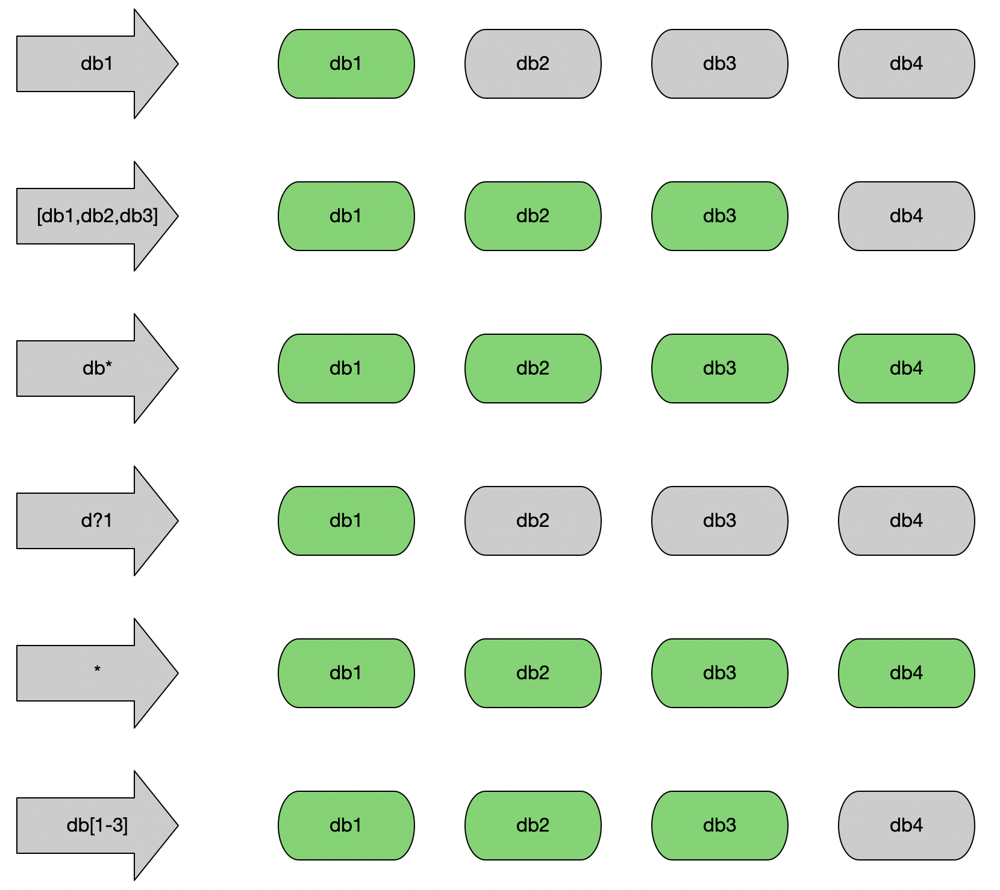

在进行进程操作时，可以通过集群、模块筛选框，对想要操作的进程进行过滤筛选。在一些特定场景下，使用表达式来进行筛选，可以更加灵活地对进程范围进行过滤

例：某集群下，共有 db1、 db2、 db3、 db4 四个模块

### 语法一：简单枚举

和普通的筛选框一样，在表达式中输入 db1，则可匹配到 db1 模块

### 语法二：使用列表枚举

[db1,db2,db3] ，可以匹配到db1、 db2、 db3 三个模块

### 语法三：使用通配符

db*，可以匹配到db1、 db2、 db3、 db4 四个模块
d?1，可以匹配到db1 一个模块
*，可以匹配到db1、 db2、 db3、 db4 四个模块（即所有模块）

### 语法四：使用列表扩展

db[1-3] ，可以匹配到db1、 db2、 db3 三个模块

### 语法五：使用切片语法框选实例

在集群、模块、服务实例的范围筛选结果之上，可以通过 切片语法 对筛选结果进行进一步的过滤。

切片语法 [start: end] 表示取出从 start 至 end 范围间的所有实例，但不包括 end（即左闭右开）

其中，start、end 均可省略，start 缺省则表示从头开始，end 缺省表示筛选至末尾

示例：

