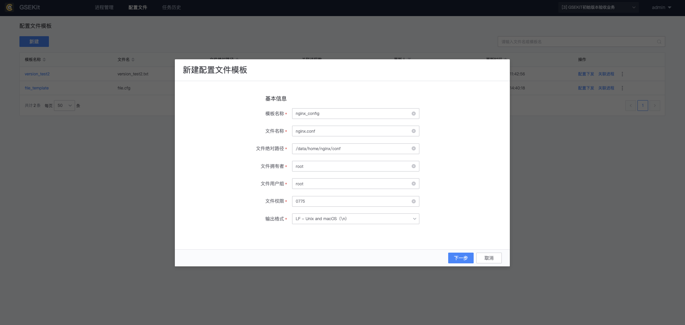
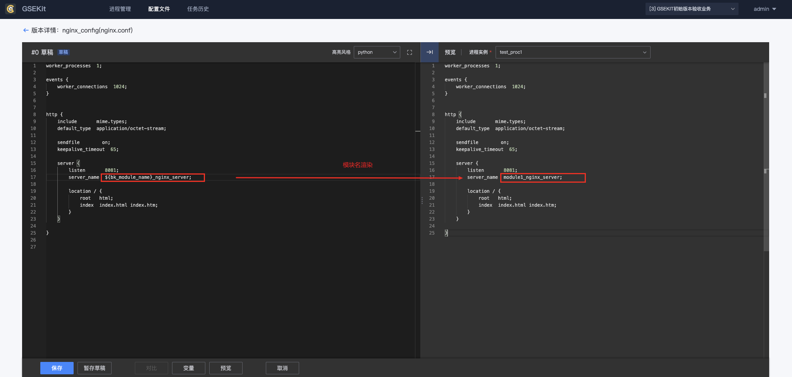
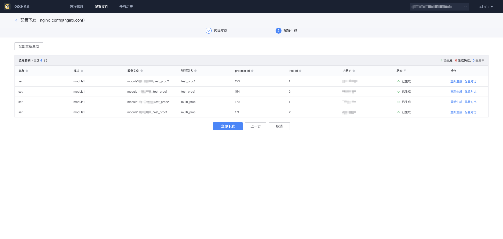
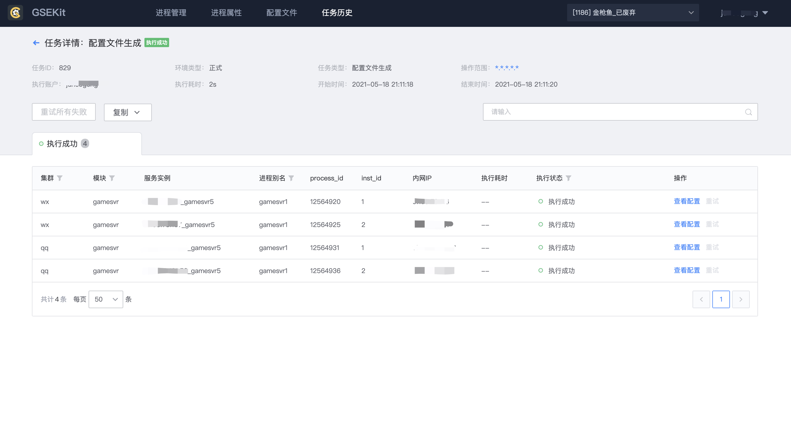

> ### 什么是 GSEKit
> 
> GSEKit 是一个专注于进程和配置文件管理的 SaaS 工具。
> 
> 进程管理功能可以批量对业务进程进行管控；配置管理功能可以应对各种复杂的配置场景，屏蔽进程间的配置差异，高效生成所需配置。

GSEKit 核心功能分为进程管理和配置管理两大部分。所有进程相关数据全部注册在 配置平台 中，因此在使用GSEKit前，您需要到 配置平台 中注册进程信息

### 1. 进程管理

通过进程管理功能，您可以快速掌握所有已注册进程的运行状态，并对其进行操控。

目前已支持对进程进行的操作有：

- 启动（start）
- 停止（stop）
- 重启（restart）
- 重载（reload）
- 强制终止（kill）
- 托管（auto）
- 取消托管（noauto）

> 提示
> 
> 在使用对应的操作前，需要对各项操作所对应的脚本进行配置。如未配置操作对应的脚本，则无法执行该项操作。

### 2. 配置管理

配置管理功能允许您自定义配置模板，并将配置模板和指定的进程进行关联。

在配置模板中，您可以自由编写模板内容。

模板支持python mako语法，并与配置平台数据打通。最终模板会根据进程实例自身所处的拓扑结构，渲染出差异化的配置文件。

对于配置模板的每一次修改，系统都会将历史版本进行归档。您可以在版本列表页内查看任一历史版本内容，并进行版本间的差异对比。

编写好配置模板后，可以通过“配置下发”功能，将配置文件渲染并下发到与之关联的进程所在机器上。

下发路径则为配置模板中指定的“配置文件路径”。

### 3. 任务历史

对于上述提到的进程操作与配置操作，每一次执行都会生成一条相应的任务历史记录

在任务历史详情页，可以查看任务具体的执行状态，方便对问题进行定位和原因分析。

