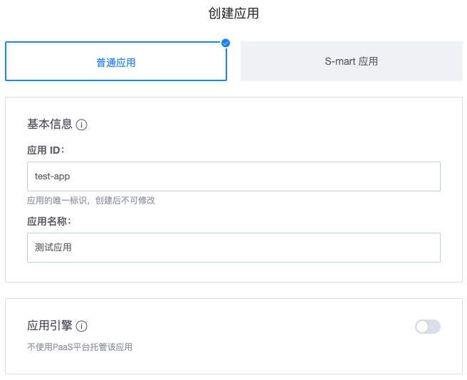
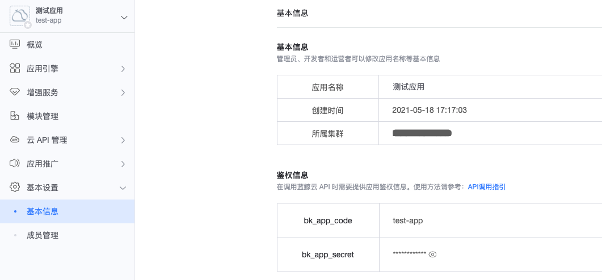

# 创建组件 API

当无法直接将接口[接入网关 API](../../apigateway/quickstart/create-api-with-http-backend.md)，比如为非 HTTP 接口，需要对接口进行自定义处理时，
可以通过编写代码，将接口接入组件 API，以提供统一的云 API，方便管理和使用。

本文将引导您在 API 网关中，通过编码的方式，创建一个组件 API，并使用蓝鲸应用账号，访问该组件 API。

## 概述

本文的主要操作步骤如下：
- 准备开发环境
- 编写组件代码
- 发布组件代码
- 新建系统
- 新建组件
- 调用组件 API

## 准备开发环境

目前，网关支持使用 Python 语言开发自定义组件。开始开发前，请准备一个 Python 虚拟环境，
并下载组件开发模板，便于开发调试。

### 准备 Python 虚拟环境

Python 版本支持 3.6.x，可使用 [pyenv](https://github.com/pyenv/pyenv)、[pyenv-virtualenv](https://github.com/pyenv/pyenv-virtualenv) 管理 Python 虚拟环境。

```
# 假定已安装 pyenv、pyenv-virtualenv

# 安装 python 3.6.6
pyenv install 3.6.6

# 创建 virtualenv
pyenv virtualenv 3.6.6 api_dev_template

# 激活 virtualenv
pyenv activate api_dev_template
```

### 下载组件开发模板并安装依赖包

下载<a href="../../assets/component/file/api_dev_template.tar.gz" target="_blank">组件开发模板</a>，
解压并安装依赖包。

```
# 解压
tar xzvf api_dev_template.tar.gz

# 进入模板目录
cd api_dev_template

# 安装依赖包
pip install -r requirements.txt
```

## 编写组件代码

假定待接入的接口信息如下：
- 系统名称：主机配置平台，英文名称 HCP
- 接口名称：查询主机列表，英文名称 get_host_list
- 接口地址：http://hcp.example.com/api/get_host_list/

### 创建系统及组件文件

在模板项目的 components/generic/apis/ 模块下，按照下面结构创建目录及文件，可参考<a href="../../assets/component/file/hcp.tar.gz" target="_blank">组件样例</a>：

```
components/generic/apis/
|-- __init__.py
|-- hcp
|   |-- __init__.py
|   |-- toolkit
|   |   |-- __init__.py
|   |   |-- configs.py
|   |   |-- tools.py
|   |-- get_host_list.py
```

- hcp 为组件系统包，包名为组件系统英文名小写
- hcp/toolkit 为组件系统工具包，包含组件系统配置及共用方法
- hcp/toolkit/configs.py 为组件系统配置模块，可配置系统名称，系统接口地址等
- hcp/toolkit/tools.py 为组件系统共用方法模块
- hcp/get_host_list.py 为接口“查询主机列表”对应的组件模块，模块名即为组件名

### 更新组件系统配置模块

在配置模块 components/generic/apis/hcp/toolkit/configs.py 中，添加组件系统配置，样例如下：

```python
# -*- coding: utf-8 -*-
from esb.utils import SmartHost


# 组件系统名的小写要与系统包名保持一致
SYSTEM_NAME = "HCP"

host = SmartHost(
    # 系统接口正式环境的域名
    host_prod="http://hcp.example.com",
)
```

### 编写组件代码

在组件模块 components/generic/apis/hcp/get_host_list.py 中，添加组件代码，样例如下：

```python
# -*- coding: utf-8 -*-
import json

from django import forms

from common.forms import BaseComponentForm, TypeCheckField
from components.component import Component
from .toolkit import configs


# 组件类名，由组件英文名去掉下划线（_），各单词首字母转为大写拼接而成，如 get_host_list 组件类名应为 GetHostList
class GetHostList(Component):

    # 组件所属系统的系统名
    sys_name = configs.SYSTEM_NAME

    # Form 处理参数校验
    class Form(BaseComponentForm):
        bk_biz_id = forms.CharField(label="业务 ID", required=True)
        ip_list = TypeCheckField(label="主机 IP 地址", promise_type=list, required=False)

        # clean 方法返回的数据可通过组件的 form_data 属性获取
        def clean(self):
            return self.get_cleaned_data_when_exist(keys=['bk_biz_id', 'ip_list'])

    # 组件处理入口
    def handle(self):
        # 获取 Form clean 处理后的数据
        data = self.form_data

        # 请求系统后端接口
        response = self.outgoing.http_client.post(
            host=configs.host,
            path="/api/get_host_list/",
            data=json.dumps(data),
            headers={
                # 将当前操作者添加到请求头
                "Bk-Username": self.current_user.username,
                # 将当前请求应用的 bk_app_code 添加到请求头
                "Bk-App-Code": self.request.app_code,
            },
        )

        # 对结果进行解析
        code = response["code"]
        if code == 0:
            result = {
                "result": True,
                "data": response["data"],
            }
        else:
            result = {
                "result": False,
                "message": result["message"]
            }

        # 设置组件返回结果，payload 内容为组件实际响应结果
        self.response.payload = result
```

更多编写自定义组件类的信息，请参考[组件类开发](../reference/component-development.md)

### 本地测试组件 API

启动本地服务，并用 curl 测试编写的组件代码
```
# 启动本地服务，服务默认地址为：http://10.0.0.1:8000
python manage.py runserver

# 使用 curl 测试组件 API，组件请求路径中，/api/c/compapi/ 为统一前缀，hcp 为系统英文名小写，get_host_list 为组件英文名
curl "http://10.0.0.1:8000/api/c/compapi/hcp/get_host_list/" \
    -d '{"bk_biz_id": 1, "ip_list": ["10.0.0.1"]}'
```

## 发布组件代码

以上步骤，利用组件开发模板，编写完成了组件代码，需要将这些自定义的组件代码发布到组件项目 `bk-esb`，才能真正对外提供组件 API 服务。

目前，项目 `bk-esb` 采用容器化的部署方案，具体发布组件代码的操作步骤如下：

TODO: 因方案待更新，此部分文档待更新，2021-06-28

## 新建系统

访问`蓝鲸 API 网关`，在顶部导航菜单**组件管理**下，点击左侧菜单**系统管理**，点击**新建系统**，填写所需配置，然后保存，即可新建系统。


## 新建组件

在**组件管理**菜单下，点击左侧菜单**组件管理**，打开组件管理页，点击**新建组件**，填写所需配置，然后保存，即可新建组件。


至此，我们已经编写并发布了组件代码，新建了组件系统及组件的配置。已完成了该组件 API 的完整创建流程。接下来，我们将调用该组件 API。

## 调用组件 API

调用组件 API，需要申请一个蓝鲸应用账号，但由于新建组件时，权限级别设置为“无限制”，因此，不需要为应用授权该组件 API 的访问权限。

### 创建蓝鲸应用

访问`蓝鲸开发者中心`创建应用。

- 应用ID：为应用唯一标识，示例中，可设置为：test-app。
- 应用引擎：为简化创建流程，关闭应用引擎
- 应用市场：访问地址可设置为"暂不设置"




### 获取蓝鲸应用账号

访问`蓝鲸开发者中心`，点击导航菜单**应用开发**，搜索并进入上一步创建的应用。


在应用管理页，展开左侧菜单**基本设置**，点击**基本信息**。鉴权信息中的`bk_app_code`和`bk_app_secret`，即为访问网关 API 所需的蓝鲸应用账号。



### 访问组件 API

在组件管理页，先筛选系统 HCP，在组件列表中，可查看组件的 API 地址。


请求组件 API 时，将蓝鲸应用账号（`bk_app_code + bk_app_secret`）信息放在请求头 **X-Bkapi-Authorization** 中，值为 JSON 格式字符串。

假定组件 API 的请求地址为：http://bkapi.example.com/api/c/compapi/hcp/get_host_list/，则用 curl 访问组件 API 示例如下：

```powershell
curl 'http://bkapi.example.com/api/c/compapi/hcp/get_host_list/' \
    -H 'X-Bkapi-Authorization: {"bk_app_code": "test-app", "bk_app_secret": "test-app-secret"}'
```
