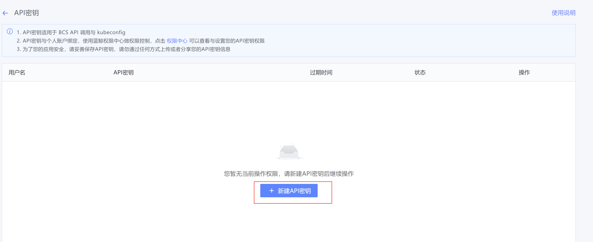
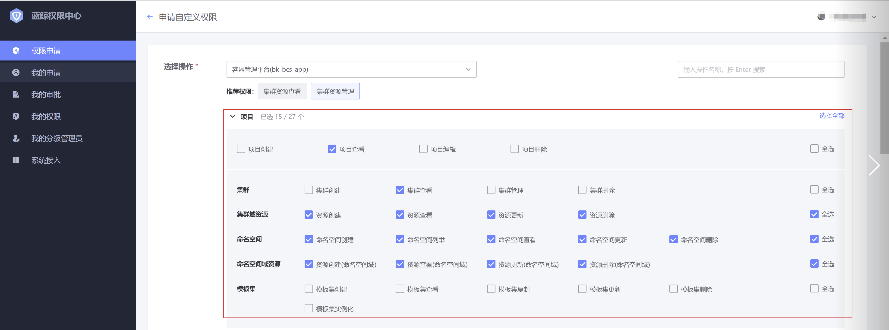
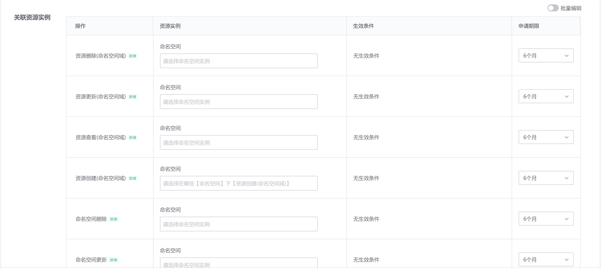
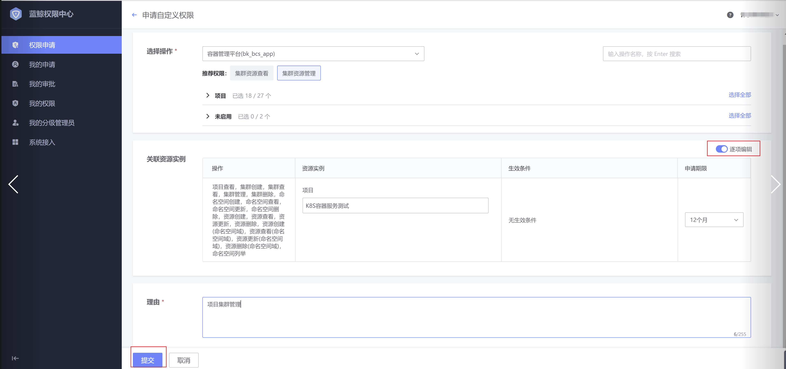

## BCS API密钥使用场景
BCS API密钥是调用BCS API的身份凭证，主要有以下使用场景：
* kubectl的kubeconfig文件
* K8S原生API调用
* BCS API调用（开发中，待上线）

## BCS API密钥使用流程
1. BCS平台创建API密钥
    通过菜单按钮或直接通过URL：http(s)://bcs.xxxxxx/project-en-name/api-key  进入到API密钥管理页面

    

    点击“新建API密钥”按钮

    

    选择申请期限，如果长期使用选择“永久”，如果是临时使用选择您要使用的时间期限，到期提后则密钥无法使用

    

    密钥创建成功

    

2. 蓝鲸权限中心申请权限
    点击“权限中心”超链接
    

    

    点击“申请权限”按钮，点击“申请自定义权限”
    
    

    

    选择“容器管理平台”，如果只需要查看集群（只读），推荐权限选择“集群资源查看”，如果要操作集群，推荐权限选择“集群资源管理”（读写），如果要申请更细粒度的权限，请展开项目标签进行选择
    

    

    

3. 选择“关联资源实例”，如果要精细化申请实例权限，可以编辑每一个资源操作项，如果实例太多，可以开启“批量编辑”，申请整个项目的权限，提交权限申请

    

    

    

    最后走完审批流程即可
    

    

4. kubeconfig使用流程
    在权限中心申请完权限可以把API密钥作为kubeconfig token使用，在一台中心的服务器（例如：运维机）上使用kubectl命令管控相关集群，kubeconfig使用文档请见：https://kubernetes.io/zh/docs/concepts/configuration/organize-cluster-access-kubeconfig/
    具体使用步骤如下：
* 如果中心服务器不存在kubectl二进制文件，可以从现有服务器复制kubectl二进制文件，也可以从https://kubernetes.io/docs/tasks/tools/下载对应环境的kubectl二进制到/usr/bin/ PATH环境变量路径下，并添加可执行权限：chmod +x /usr/bin/kubectl

    

* 在中心服务器上创建kubeconfig文件，kubectl默认使用的kubeconfig文件为：在/root/.kube/config，也可以把kubeconfig文件内容存在某个文件，然后在使用kubectl命令时指定kubeconfig文件，例如，把kubeconfig内容存在文件/root/.kube/demo_config中，使用如下命令使用kubeconfig文件。注意，使用示例中kubeconfig内容时需要把里面的 `${cluste_id}` 变量替换为实际的集群ID，例如：BCS-K8S-40001，把`${API密钥}`替换为你刚刚创建的API密钥
  
    ```
    kubectl --kubeconfig=/root/.kube/demo_config get node
    ```
    


5. K8S原生API使用流程
    如果在一些应用中无法使用kubectl命令的时候，可以使用API密钥调用Kubernetes API，来完成对集群的管控，以下介绍下常用的使用场景：

* 获取kubelet版本号
  kubectl命令
    ```
    kubectl version
    ```
  
  
  Kubernetes API
  
    ```
    curl -X GET -H "Authorization: Bearer ${API密钥}" -H "accept: application/json" "https://{bcs-api-gateway}/clusters/${cluster_id}/version"
    ```
* 获取命名空间列表
  kubectl命令
    ```bash
    kubectl get ns
    ```
  
  
  Kubernetes API
  
    ```
    curl -X GET -H "Authorization: Bearer ${API密钥}" -H "accept: application/json" "https://{bcs-api-gateway}/clusters/${cluster_id}/api/v1/namespaces"
    ```
* 获取节点列表
  kubectl命令
    ```bash
    kubectl get node
    ```
  
  
  Kubernetes API
  
    ```
    curl -X GET -H "Authorization: Bearer ${API密钥}" -H "accept: application/json" "https://{bcs-api-gateway}/clusters/${cluster_id}/apis/metrics.k8s.io/v1beta1/nodes"
    ```
* 更多Kubernetes API使用文档请参考：
https://kubernetes.io/docs/reference/kubernetes-api/

## FAQ
1. 如何申请到平台使用的API密钥？
目前蓝鲸权限中心只提供个人实名权限申请功能，暂不支持平台权限申请，如果平台要申请API密钥，先申请个人实名权限，待蓝鲸权限中心支持平台权限申请后再做权限切换