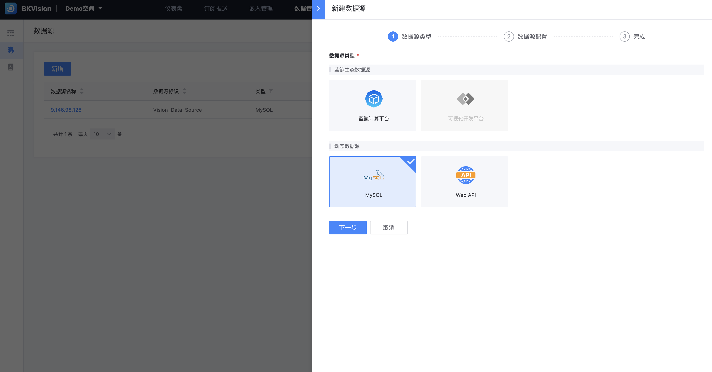
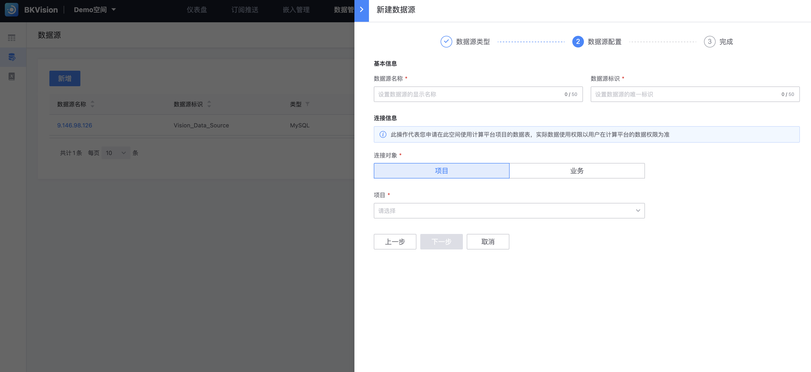
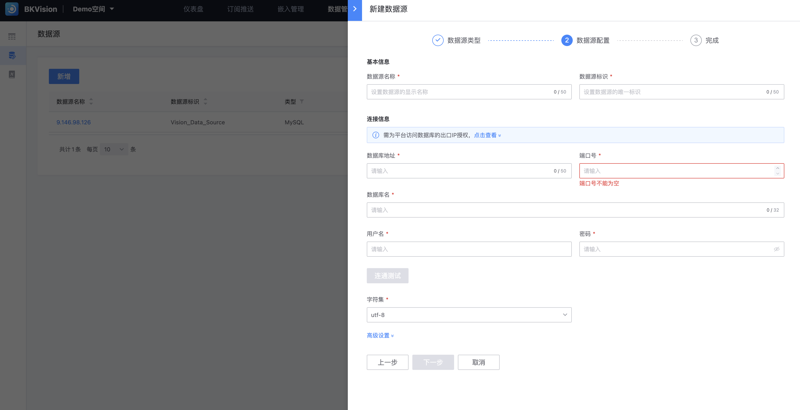

## 数据源

在图表平台中，数据源的本质是数据库，用于存储和管理数据；用户想要将自己的数据通过图表平台展示出来，第一步就是先将保管各种数据的数据库接入图表平台中；

用户可通过列表查看、检索已接入到该空间的数据源信息；

点击 **`新建`**，进入「新建数据源」页面；

1. **选择数据源类型**

2. **填写数据源配置信息**：数据源类型不同填写数据源配置信息不同

- **计算平台**

  

​         **基本信息**：包括 **`数据源名称`** 和 **`数据源标识`**，帮助用户更高效地定位和识别所需数据源

​                  **`数据源名称`**：数据源显示名称，为数据源分配一个清晰、易懂的名称；

​                  **`数据源标识`**：唯一标识数据源的编码或符号，只允许包含这些字符：**`a-z 0-9 _`** ，具有唯一性

​         **连接信息**：包括 **`选择对象`**和 **`具体对象名称`**，此操作代表申请连接计算平台项目的数据表（实际数据使用权限以用户在计算平台的权限为准）；

​                   **`选择对象`**：分为 **`项目`** 和 **`业务`**；

​                   **`项目/业务`**：确定项目/业务后，即可选择相对应的项目/业务名称；

- **MySql**

​      **基本信息**：包括 **`数据源名称`** 和 **`数据源标识`**，帮助用户更高效地定位和识别所需数据源

​              **`数据源名称`**：数据源显示名称，为数据源分配一个清晰、易懂的名称；

​              **`数据源标识`**：唯一标识数据源的编码或符号，只允许包含这些字符：`a-z 0-9 _` ，具有唯一性；

​      **连接信息**：填写平台访问数据库的相关信息，其中包括：

​              数据库地址`**：数据库服务器的位置，通常表示为IP地址或域名。例如，“192.168.1.1

​              **`端口号`**：端口号是与特定数据库服务相关联的数字，当平台尝试连接到数据库时，它需要指定正确的端口号

​              **`数据库名`**：用于区分同一服务器上的多个数据库

​              **`用户名`**：用于连接到数据库的用户凭据之一。数据库管理员会创建具有不同权限的用户账户，平台使用正确的用户名和密码组合来获得访问权限

​              **`密码`**：与用户名配对使用的凭据，用于验证应用程序的身份并授予访问数据库的权限

​              **`字符集`**：定义了数据库中可以存储和使用的字符类型

- **Web API**

​      **基本信息**：包括 **`数据源名称`** 和 **`数据源标识`**，帮助用户更高效地定位和识别所需数据源

​              **`数据源名称`**：数据源显示名称，为数据源分配一个清晰、易懂的名称；

​              **`数据源标识`**：唯一标识数据源的编码或符号，只允许包含这些字符：**`a-z 0-9 _`**具有唯一性

​      **连接信息**：指定请求的资源；

​              **`请求方法&链接`**：支持 **`GET`**、**`POST`** 两种请求方法，并输入链接，如：https://bkvision.blueking.com/rest_api/demo；

​               **`header`**:HTTP请求的头部信息，也称为HTTP头,它包含有关请求或响应的应用程序特定信息；

​                **`请求参数`**:与HTTP请求一起发送的数据,用于向服务器传递额外的信息，以便服务器可以根据这些信息执行相应的操作；

3. **完成**