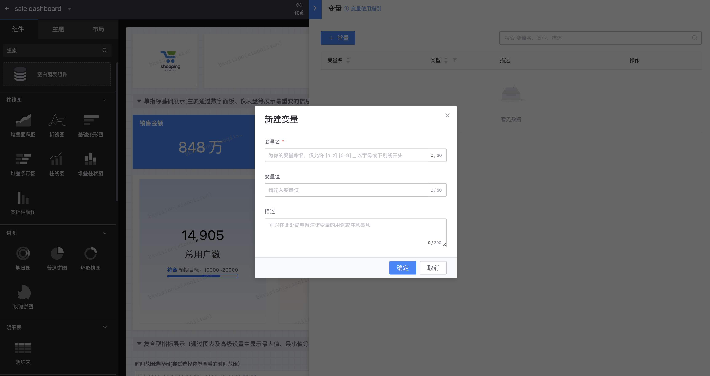

## 编辑模式

进入编辑模式后，用户可自由选择「组件」、「主题」、「布局」、「联动」等进行仪表盘的全局配置；

- **组件/主题/布局设置**

1. **组件**

​        **内容**：现支持27种组件，组件类型和功能描述可以参考[组件分类及功能描述](Chart-Classification-and-Function-Description.md)；

​        **空白图表组件**： 图表平台支持 **`空白图表组件`**，适用于已经明确数据对象和查询逻辑，但用什么图形还不确定的场景；

​        **位置**：支持组件拖拽功能，点击任一组件拖拽到画布上，或者鼠标hover组件顶部会出现灰色框，点击灰色框即可拖拽组件移动位置；

​        **尺寸**：支持拖拽图表蓝色边框的右下角部位来调节组件的尺寸；

​        **单个图表编辑**：hover图表顶部，右上角显示**`编辑图表`**、**`删除图表`**、**`全屏显示`**、**`刷新`**、**`复制到剪切板`**、**`导出Excel`**、**`查看SQL`**等功能可对单个图表进行编辑；

2. **主题**

改变整体仪表盘色系、风格，符合多种场景应用，现支持6种主题分别为：明亮、沉稳、梦幻、清新、炫彩和复古；

3. **布局**

提供4种可选择的布局模式，分别是 **`单栏`**、**`双栏`**、**`三栏`**和 **`四栏`**，简化页面布局排版，不需要手动调节图表边框大小；

- **全局功能设置**

​       **预览**: 支持仪表盘全屏展示，右上角可点击刷新并设置刷新时间；

​         **联动**：一种数据可视化的交互功能，它允许用户在查看一个数据视图时，所做的选择或操作能够实时影响到其他相关联的数据视图；具体如何设置联动可参考[不同图表之间如何做数据数据联动查询？](/UserGuide/Best-Practices/Creat-Link.md);

​         **变量**：即常量，不会展示在仪表盘中，只是作为数据查询逻辑的参数配置，只在仪表盘渲染时作用，不可交互和动态变更；“常量”一般适用于图表的全局参数设定场景，如项目ID、业务ID等等；

​            **`变量名`**：为变量命名，方便在SQL语句中直接获取查询

​            **`变量值`**：选定变量名对应的值

​            **`描述`**：备注变量的用途和注意事项

​        **历史、帮助**暂未开放
