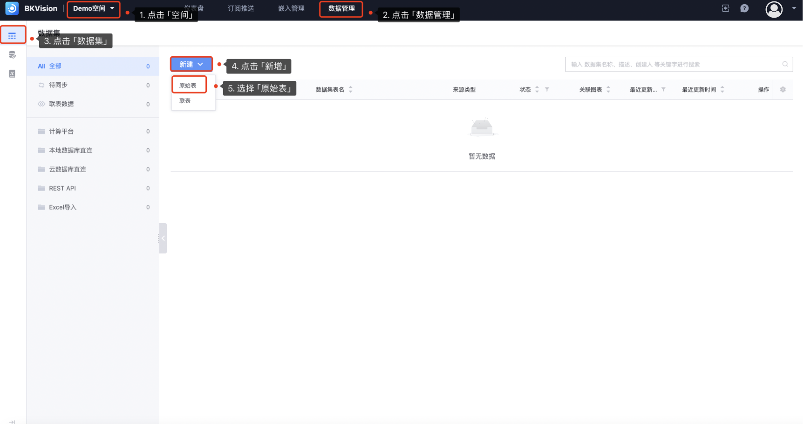
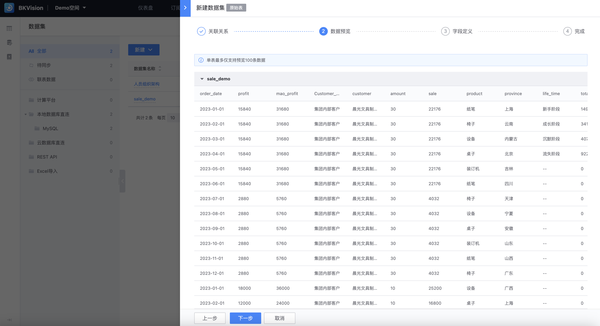
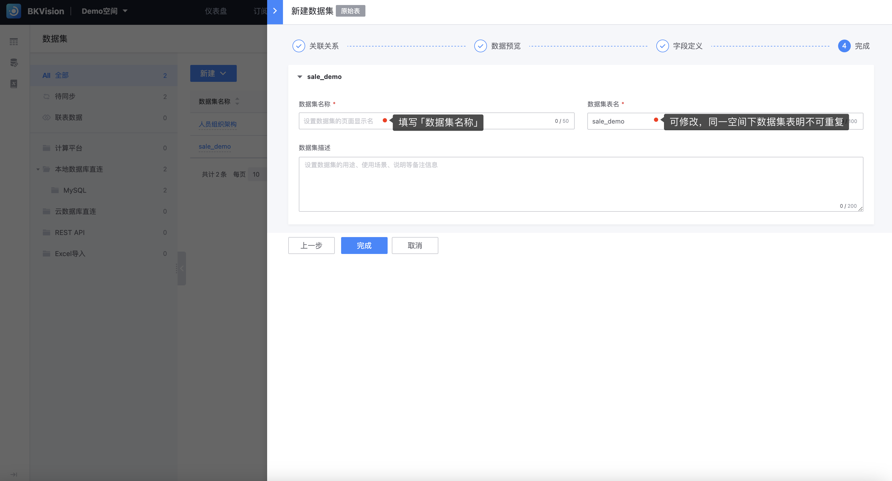

## 2.新建数据集

1. 前往 **空间**，确定新建数据集的空间范围

​       点击 **`数据管理`** — 点击左侧导航栏  **`数据集`** — 点击 **`新增`**-选择 **`原始表`**

2.**填写数据集信息**

进入「新建数据集」页面后，依次选择填写「关联关系」、「数据预览」和「字段定义」信息

- **关联关系**：锁定新建数据集(数据表)的数据源

  ​        **`来源类型`**：分为**`计算平台`**、**`本地数据库直连`**、**`REST API`**、**`云数据库直连`**、**`Excel导入`**、**`MySQL`**（后三个还未开发），通过选定数据源的信息方可快速锁定数据表；

  ​        **`数据源`**：选择已接入的数据源；

  ​        **`数据表`**：选择该数据源的数据表，可一次接入多个数据表；

- **数据预览**：当数据库中的表成功接入后，展示接入的数据表；

- **字段定义**：除**`原始字段名`**外，其他均可自定义

  ​        **`原始字段名`**：数据源中实际存在的字段名称，数据库表中的列名；

  ​        **`字段名`**：适应不同场景对原始字段名进行重新命名或翻译后的名称，默认原始字段名；
  
  ​        **`显示名`**：最终展示给用户的字段名称；
  
  ​        **`字段类型`**：标识字段数据的类型，如字符串、数字（整型）、数字（浮点型）、时间等；
  
  ​        **`数据分类`**：分为“维度”和“指标”，便于图表配置时直接选择；

- **完成**：

  ​        **`数据集名称`**：即数据集的页面显示名；
  
  ​        **`数据集表名`**：数据集在数据库中的实际表名；
  
  ​        **`数据集描述`**：用于描述该数据集的用途、使用场景、说明等备注信息；

 
