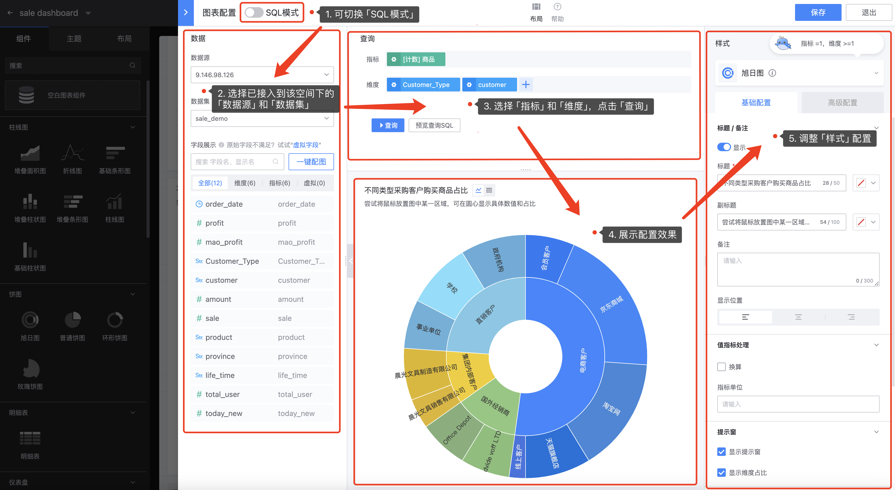

### 5.如何配置图表

所谓“万事俱备只欠东风”，当空间、数据源、数据集和目录/仪表盘都创建之后，接下来开始在仪表盘上大展身手吧！

1. 在「仪表盘」页面 — 点击  **`编辑`** 进入「编辑模式」：

2. **图表配置**

「编辑模式」下，点击 **`组件`** — 选择任一组件拖拽到画布上，如何选择组件可参考 [图表分类及功能描述](../7.Chart-Classification-and-Function-Description.md) ;

拖拽任意组件到画布上即可立即跳转到「图表配置」页面，用户通过该页面完成单个图表的配置信息，其中「图表配置」页面包括四大模块，分别为「数据」、「查询」、「展示」、「样式」

- **数据**：选择接入的数据源和数据集，查看可配置的字段

  **`数据源`**：查找配置该图表的数据源

  **`数据集`**：查找配置该图表的数据集

  **`字段展示`**：基于选定的数据集，展示数据集的字段名和显示名

  **`虚拟字段`**：在数据库中并不实际存储数据的字段，而是通过计算或转换现有字段的数据来得到的，可以基于其他字段的值、函数、表达式来创建。

  **`一键配图`**：帮助用户根据数据集自动化匹配合适的图表

- **查询**

   通过展示的字段，选择该图表的 **`指标`** 和 **`维度`**，并通过高级筛选？进行数据的筛选，最后点击 **`查询`** 按键

- **展示框**

  基于 **`查询`** 操作之后，可在该展示框内直观地查看配置的图表，便于及时调整和更改配置

- **样式**

  分为 **`基础配置`** 和 **`高级配置`**，用户可根据需求自定义样式，满足不同场景应用，当然除了通用的配置例如：标题、值指标处理等，针对不同的图表提供不同的配置。

  

3. **仪表盘整体布局设置**

- **组件**

​        现支持27种组件，可拖拽任意组件到画布上调节位置，并在画布上通过图表的边框调节组件的尺寸

- **边框尺寸**：拖拽图表蓝色边框右下角位置即可随意改变图表在画布上的尺寸
- **单个图表编辑**：hover图表顶部，右上角显示 **`编辑图表`**、 **`删除图表`**、**`全屏显示`**、**`刷新`**、**`复制到剪切板`**、**`导出Excel`**、**`查看SQL`**
- **全局功能**：**`预览`**、**`联动`**、**`变量`**、**`历史`**、**`帮助`**

- **主题**：改变整体仪表盘色系、风格，符合场景应用

  

  

- **布局**：提供4种可选择的布局模式，分别是 **`单栏`**、**`双栏`**、**`三栏`**和**`四栏`**，简化页面布局排版，不需要手动调节图表边框大小；

