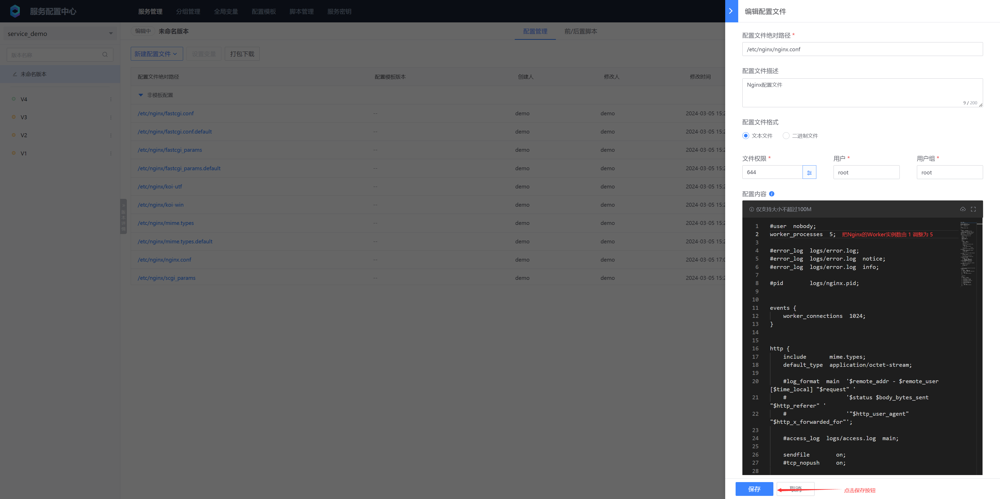
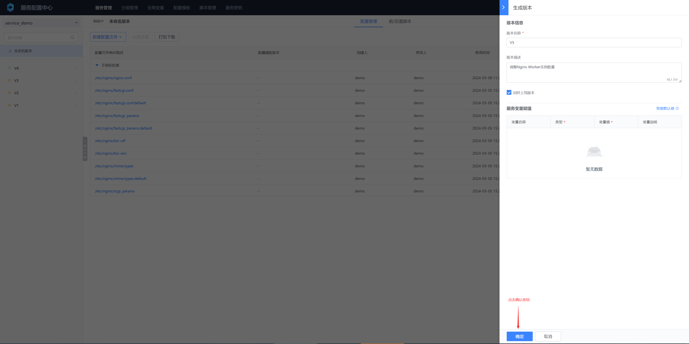
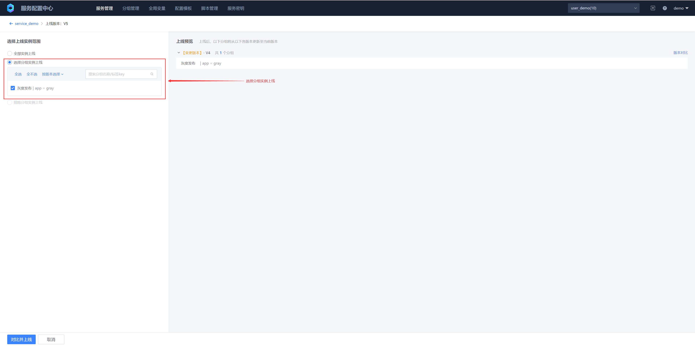
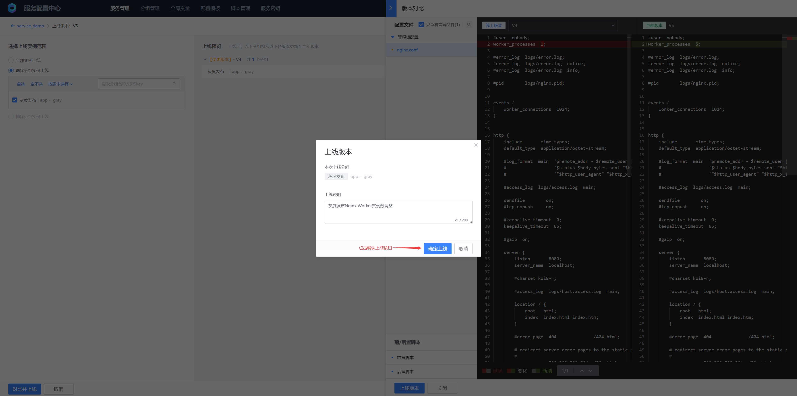

# 分组管理

分组由一个或多个标签选择器组成，多个标签是 **AND** 关系，与客户端配置的标签（labels）配合使用，主要用于服务实例灰度场景与不同实例配置多版本场景

## 一、创建分组


- 分组名称

  标识一个分组，业务下的分组名称需要保持唯一

- 服务可见范围
  “公开”为当前业务下所有服务可见，也可以指定一个或多个服务可见

- 标签选择器
  格式为key = value，一个分组支持多个标签选择器，多个标签为 **AND** 关系，标签选择器支持的操作符有：=（等于）、!=（不等于）、>（大于）、≥（大于等于）、<（小于）、≤（小于等于）、IN（包含多个value用逗号分隔["a", "b"]）、NOT IN（不包含多个value用逗号分隔["a", "b"]）、RE（正则匹配^[0-9]+$）、NOT RE（正则不匹配^[0-9]+$）


## 二、灰度上线实例

把示例中Nginx Worker数量由 1 调整为 5













## 三、验证灰度结果
* 部署不带标签：app = gray 的客户端，demo.yaml
  ```yaml
  apiVersion: apps/v1
  kind: Deployment
  metadata:
    name: test-listener
    namespace: default
  spec:
    selector:
      matchLabels:
        app: test-listener
    template:
      metadata:
        labels:
          app: test-listener
      spec:
        initContainers:
          # BSCP init 容器，负责第一次拉取配置文件到指定目录下
          - name: bscp-init
            image: ccr.ccs.tencentyun.com/blueking/bscp-init:latest
            env:
              # BSCP 业务 ID
              - name: biz
                value: "10"
              # BSCP 服务名称
              - name: app
                value: "service_demo"
              # BSCP 服务订阅地址，在BSCP后台部署的集群上执行（默认在容器平台的“蓝鲸”项目下）,执行以下命令获取：
              # kubectl get svc bk-bscp-feed-feedserver-nodeport -n bk-bscp
              # 如果客户端到集群Node网络不通，可以自行给feedserver配置LoadBalancer
              - name: feed_addrs
                value: "10.0.0.1:31510"
              # 服务秘钥，填写上一步创建的服务密钥
              - name: token
                value: "ABCDEFGHIJKLMNOPQRSTUVWXYZ1234"
              # 配置文件临时目录，文件将下发到 {temp_dir}/files 目录下
              - name: temp_dir
                value: '/data/bscp'
            # 需要同时挂载文件临时目录到 init 容器，sidecar 容器，业务容器
            volumeMounts:
              - mountPath: /data/bscp
                name: bscp-temp-dir
        containers:
          # 业务容器
          - name: test-listener
            image: alpine
            command:
            - "/bin/sh"
            - "-c"
            - |
              apk add --no-cache inotify-tools
              echo "start watch ..."
              while true; do
              # 监听 /data/bscp/metadata.json 的写入事件
              inotifywait -m /data/bscp/metadata.json -e modify |
                  while read path action file; do
                      # 递归遍历 /data/bscp/files 目录下的所有文件，输出其绝对路径
                      find /data/bscp/files
                  done
              done
            resources:
              limits:
                memory: "128Mi"
                cpu: "500m"
            # 需要同时挂载文件临时目录到 init 容器，sidecar 容器，业务容器
            volumeMounts:
              - mountPath: /data/bscp
                name: bscp-temp-dir
          # BSCP sidecar 容器，负责监听版本变更时间，并更新临时目录下的配置文件，更新完成后向 metadata.json 写入事件
          - name: bscp-sidecar
            image: ccr.ccs.tencentyun.com/blueking/bscp-sidecar:latest
            env:
              # bscp-sidecar 容器的环境变量配置和 bscp-init 容器完全一致
              - name: biz
                value: "10"
              - name: app
                value: "service_demo"
              - name: feed_addrs
                value: "10.0.0.1:31510"
              - name: token
                value: "ABCDEFGHIJKLMNOPQRSTUVWXYZ1234"
              - name: temp_dir
                value: '/data/bscp'
            resources:
              limits:
                memory: "128Mi"
                cpu: "500m"
            volumeMounts:
              - mountPath: /data/bscp
                name: bscp-temp-dir
        volumes:
          - name: bscp-temp-dir
            emptyDir: {}
  ```

  ```bash
  # 部署示例Deployment
  kubectl apply -f demo.yaml
  
  # 进入bscp-sidecar容器查看nginx.conf中的Worker实例数
  kubectl exec -it test-listener-658f478944-5vzw8 -c bscp-sidecar -- /bin/bash
  grep 'worker_processes' /data/bscp/10/service_demo/files/etc/nginx/nginx.conf 
  worker_processes  1;
  ```

* 部署带标签：app = gray 的客户端（灰度客户端实例），gray.yaml

  调整 .metadata.name 为：test-listener-gray

  在 .spec.template.spec.initContainers.env 与 .spec.template.spec.containers['bscp-sidecar'].env 下新增客户端配置标签：

  ```yaml
    - name: labels
            value: '{"app": "gray"}'
  ```

  ```yaml
  apiVersion: apps/v1
  kind: Deployment
  metadata:
    name: test-listener-gray
    namespace: default
  spec:
    selector:
      matchLabels:
        app: test-listener
    template:
      metadata:
        labels:
          app: test-listener
      spec:
        initContainers:
          # BSCP init 容器，负责第一次拉取配置文件到指定目录下
          - name: bscp-init
            image: ccr.ccs.tencentyun.com/blueking/bscp-init:latest
            env:
              # BSCP 业务 ID
              - name: biz
                value: "10"
              # BSCP 服务名称
              - name: app
                value: "service_demo"
              # BSCP 服务订阅地址，在BSCP后台部署的集群上执行（默认在容器平台的“蓝鲸”项目下）,执行以下命令获取：
              # kubectl get svc bk-bscp-feed-feedserver-nodeport -n bk-bscp
              # 如果客户端到集群Node网络不通，可以自行给feedserver配置LoadBalancer
              - name: feed_addrs
                value: "10.0.0.1:31510"
              # 服务秘钥，填写上一步创建的服务密钥
              - name: token
                value: "ABCDEFGHIJKLMNOPQRSTUVWXYZ1234" 
              # 配置客户端标签
              - name: labels
                value: '{"app": "gray"}'
              # 配置文件临时目录，文件将下发到 {temp_dir}/files 目录下
              - name: temp_dir
                value: '/data/bscp'
            # 需要同时挂载文件临时目录到 init 容器，sidecar 容器，业务容器
            volumeMounts:
              - mountPath: /data/bscp
                name: bscp-temp-dir
        containers:
          # 业务容器
          - name: test-listener
            image: alpine
            command:
            - "/bin/sh"
            - "-c"
            - |
              apk add --no-cache inotify-tools
              echo "start watch ..."
              while true; do
              # 监听 /data/bscp/metadata.json 的写入事件
              inotifywait -m /data/bscp/metadata.json -e modify |
                  while read path action file; do
                      # 递归遍历 /data/bscp/files 目录下的所有文件，输出其绝对路径
                      find /data/bscp/files
                  done
              done
            resources:
              limits:
                memory: "128Mi"
                cpu: "500m"
            # 需要同时挂载文件临时目录到 init 容器，sidecar 容器，业务容器
            volumeMounts:
              - mountPath: /data/bscp
                name: bscp-temp-dir
          # BSCP sidecar 容器，负责监听版本变更时间，并更新临时目录下的配置文件，更新完成后向 metadata.json 写入事件
          - name: bscp-sidecar
            image: ccr.ccs.tencentyun.com/blueking/bscp-sidecar:latest
            env:
              # bscp-sidecar 容器的环境变量配置和 bscp-init 容器完全一致
              - name: biz
                value: "10"
              - name: app
                value: "service_demo"
              - name: feed_addrs
                value: "10.0.0.1:31510"
              - name: token
                value: "ABCDEFGHIJKLMNOPQRSTUVWXYZ1234"
              - name: labels
                value: '{"app": "gray"}'
              - name: temp_dir
                value: '/data/bscp'
            resources:
              limits:
                memory: "128Mi"
                cpu: "500m"
            volumeMounts:
              - mountPath: /data/bscp
                name: bscp-temp-dir
        volumes:
          - name: bscp-temp-dir
            emptyDir: {}
  ```

  ```bash
  kubectl apply -f gray.yaml
  kubectl exec -it test-listener-gray-5659f5488-wxxsj -c bscp-sidecar -- /bin/bash
  grep 'worker_processes' /data/bscp/10/service_demo/files/etc/nginx/nginx.conf 
  worker_processes  5;
  ```
