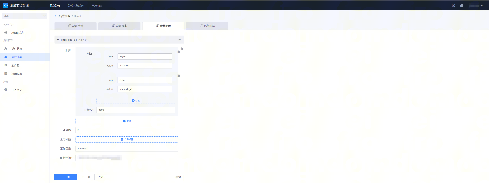
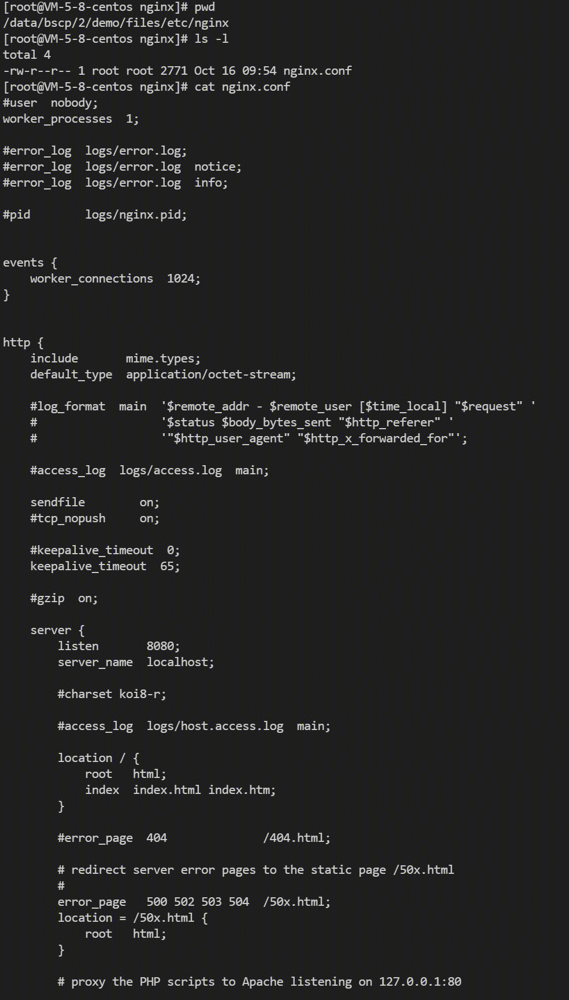

# 客户端拉取配置

目前支持容器Sidecar、节点管理插件、命令行、SDK 四种客户端，每种客户端的使用场景不一样，具体如下：

* 容器Sidecar主要用于容器化应用程序拉取文件型配置
* 节点管理插件主要用于非容器化应用程序（传统主机）拉取文件型配置
* 命令行不会监听配置版本变化，手动拉取应用程序配置，同时支持文件型配置与键值型配置拉取
* SDK 主要用于应用程序拉取键值型、表格型配置，目前支持的语言类型有：Go、Python、Java、C++

## 一、容器Sidecar客户端拉取配置

容器Sidecar示例

```yaml
apiVersion: apps/v1
kind: Deployment
metadata:
  name: test-listener
  namespace: default
spec:
  selector:
    matchLabels:
      app: test-listener
  template:
    metadata:
      labels:
        app: test-listener
    spec:
      initContainers:
        # BSCP init 容器，负责第一次拉取配置文件到指定目录下
        - name: bscp-init
          image: ccr.ccs.tencentyun.com/blueking/bscp-init:latest
          env:
            # BSCP 业务 ID
            - name: biz
              value: "10"
            # BSCP 服务名称
            - name: app
              value: "file_demo"
            # BSCP 服务订阅地址，在BSCP后台部署的集群上执行（默认在容器平台的“蓝鲸”项目下）,执行以下命令获取：
            # kubectl get svc bk-bscp-feed-feedserver-nodeport -n bk-bscp
            # 如果客户端到集群Node网络不通，可以自行给feedserver配置LoadBalancer
            - name: feed_addrs
              value: "10.0.0.1:31510"
            # 服务秘钥，填写上一步创建的服务密钥
            - name: token
              value: "ABCDEFGHIJKLMNOPQRSTUVWXYZ1234"
            # 实例标签，一般用于多配置版本场景与灰度发布场景
            - name: labels
              value: '{"city":"shanghai"}'
            # 配置文件临时目录，文件将下发到 {temp_dir}/files 目录下
            - name: temp_dir
              value: '/data/bscp'
          # 需要同时挂载文件临时目录到 init 容器，sidecar 容器，业务容器
          volumeMounts:
            - mountPath: /data/bscp
              name: bscp-temp-dir
      containers:
        # 业务容器
        - name: test-listener
          image: alpine
          command:
          - "/bin/sh"
          - "-c"
          - |
            apk add --no-cache inotify-tools
            echo "start watch ..."
            while true; do
            # 监听 /data/bscp/metadata.json 的写入事件
            inotifywait -m /data/bscp/metadata.json -e modify |
                while read path action file; do
                    # 递归遍历 /data/bscp/files 目录下的所有文件，输出其绝对路径
                    find /data/bscp/files
                done
            done
          resources:
            limits:
              memory: "128Mi"
              cpu: "500m"
          # 需要同时挂载文件临时目录到 init 容器，sidecar 容器，业务容器
          volumeMounts:
            - mountPath: /data/bscp
              name: bscp-temp-dir
        # BSCP sidecar 容器，负责监听版本变更时间，并更新临时目录下的配置文件，更新完成后向 metadata.json 写入事件
        - name: bscp-sidecar
          image: ccr.ccs.tencentyun.com/blueking/bscp-sidecar:latest
          env:
            # bscp-sidecar 容器的环境变量配置和 bscp-init 容器完全一致
            - name: biz
              value: "10"
            - name: app
              value: "file_demo"
            - name: feed_addrs
              value: "10.0.0.1:31510"
            - name: token
              value: "ABCDEFGHIJKLMNOPQRSTUVWXYZ1234"
            - name: labels
              value: '{"city":"shanghai"}'
            - name: temp_dir
              value: '/data/bscp'
          resources:
            limits:
              memory: "128Mi"
              cpu: "500m"
          volumeMounts:
            - mountPath: /data/bscp
              name: bscp-temp-dir
      volumes:
        - name: bscp-temp-dir
          emptyDir: {}
```

示例包含 3 个容器，1个bscp-init初始化容器，1个业务容器，1个bscp-sidecar容器，3个容器间共享文件目录使用emptyDir卷

```yaml
      volumes:
        - name: bscp-temp-dir
          emptyDir: {}
```

* bscp-init 初始化容器
  先于业务容器与 bscp-sidecar 容器启用，用于业务Pod启动时拉取业务容器进程启动所需配置文件
* 业务容器
  业务容器，提供业务逻辑处理
* bscp-sidecar 容器
  监听服务配置的版本变化，有新的配置版本发布，拉取最新版本的配置文件

bscp-init 初始化容器、Sidecar 容器所需参数

- biz
  需获取配置文件的业务ID，例如：10

  

- app

  需获取配置文件的服务名称，例如：service_demo
  

- feed_addrs

  服务订阅地址，客户端连接服务配置中心后台地址与端口，例如：10.0.0.1:31510

  在BSCP后台部署的集群上执行（默认在容器平台的“蓝鲸”项目下）,执行以下命令获取：

  ``` kubectl get svc bk-bscp-feed-feedserver-nodeport -n bk-bscp```
  如果客户端到集群Node网络不通，可以自行给feedserver配置LoadBalancer

- token

  服务密钥，用于客户端身份验证

  

- labels

  实例标签，与 [分组管理](./group_management.md) 配合使用实现服务实例灰度发布场景，如果无需灰度发布，此环境变量可以不配置

- temp_dir

  配置文件临时存储目录，因为客户端需要支持拉取多业务、多服务下的配置，所以路径里带业务ID与服务名称

  客户端拉取配置文件后的存储文件的路径为：temp_dir + 业务ID + 服务名称 + files + 配置文件绝对路径

  例如：temp_dir 配置为：/data/config，业务ID为：10，服务名称为：service_demo，配置项路径为：/etc/nginx/nginx.conf，那客户端拉取配置文件存储目录为：/data/config/10/serivce_demo/files/etc/nginx/nginx.conf

部署以上示例Deployment后，进入容器查看拉取到的配置

```bash
# 把以上示例文件根据实际情况调整完参数后保存为文件：demo.yaml，然后在k8s集群上部署该示例deployment
kubectl apply demo.yaml

# 等Pod下所有容器就绪后，进入bscp-sidecar容器
kubectl exec -it test-listener-658f478944-stwps -c bscp-sidecar -- /bin/bash

# cd到临时存储文件目录
cd /data/bscp/10/service_demo/files

# 查看拉取到的配置文件
ls -lR
.:
total 8
drwxr-xr-x    3 root     root          4096 Mar  6 08:09 etc
drwxr-xr-x    3 root     root          4096 Mar  6 08:09 usr

./etc:
total 4
drwxr-xr-x    2 root     root          4096 Mar  6 08:09 nginx

./etc/nginx:
total 64
-rw-r--r--    1 root     root          1077 Mar  6 08:09 fastcgi.conf
-rw-r--r--    1 root     root          1077 Mar  6 08:09 fastcgi.conf.default
-rw-r--r--    1 root     root          1007 Mar  6 08:09 fastcgi_params
-rw-r--r--    1 root     root          1007 Mar  6 08:09 fastcgi_params.default
-rw-r--r--    1 root     root          2837 Mar  6 08:09 koi-utf
-rw-r--r--    1 root     root          2223 Mar  6 08:09 koi-win
-rw-r--r--    1 root     root          5231 Mar  6 08:09 mime.types
-rw-r--r--    1 root     root          5231 Mar  6 08:09 mime.types.default
-rw-r--r--    1 root     root          2657 Mar  6 08:09 nginx.conf
-rw-r--r--    1 root     root           636 Mar  6 08:09 scgi_params
-rw-r--r--    1 root     root           636 Mar  6 08:09 scgi_params.default
-rw-r--r--    1 root     root           664 Mar  6 08:09 uwsgi_params
-rw-r--r--    1 root     root           664 Mar  6 08:09 uwsgi_params.default
-rw-r--r--    1 root     root          3610 Mar  6 08:09 win-utf

./usr:
total 4
drwxr-xr-x    2 root     root          4096 Mar  6 08:09 sbin

./usr/sbin:
total 1240
-rw-r--r--    1 root     root       1266632 Mar  6 08:09 nginx

# 退出容器，查看配置文件拉取日志
# Pod启动时查看
kubectl logs --tail=50 test-listener-658f478944-stwps -c bscp-init

# Pod启用后查看
kubectl logs --tail=50 test-listener-658f478944-stwps -c bscp-sidecar
```


## 二、节点管理插件客户端拉取配置

传统主机场景使用蓝鲸节点管理平台部署客户端插件，首先需要打开蓝鲸节点管理平台，选择要部署客户端的业务，这里业务建议只选择单个业务


进入插件管理的“插件部署”功能页，新建策略


插件功能选择“bkbscp”，部署策略选择“新建策略”


填写策略名称后，部署目标建议使用“动态拓扑”，选择要部署客户端的 CMDB 模块，后续放在这个 CMDB 模块下的主机都会自动部署 bkbscp 插件


目前只支持 x86_64 架构的 Linux 操作系统，后续可以支持其它操作系统


插件配置参数与Sidecar配置参数一致，如不了解，请参考上一章节的 容器Sidecar客户端拉取配置



进入执行预览页面，点击“保存并执行”按钮，等待客户端插件安装完毕


登录主机查看配置文件已经成功下发



## 三、命令行客户端拉取配置
### 1. 下载命令行二进制及创建二进制配置

```bash
# 安装bscp命令行
go install github.com/TencentBlueKing/bscp-go/cmd/bscp@latest

# 下载bscp命令行，下载最新版本
https://github.com/TencentBlueKing/bscp-go/releases/
```

配置客户端参数，配置完后把内容保存为文件 bscp.yaml

```yaml
# BSCP 服务订阅地址，在BSCP后台部署的集群上执行（默认在容器平台的“蓝鲸”项目下）,执行以下命令获取：
# kubectl get svc bk-bscp-feed-feedserver-nodeport -n bk-bscp
# 如果客户端到集群Node网络不通，可以自行给feedserver配置LoadBalancer
feed_addr: "10.0.0.1:31510"

# 填写上一步的服务密钥
token: ABCDEFGHIJKLMNOPQRSTUVWXYZ1234

# 填写业务ID
biz: 10
```

可使用环境变量支持路径

```bash
export BSCP_CONFIG=./bscp.yaml
```

### 2. 命令行获取键值型配置与文件型配置

```bash
# 在当前环境下加载客户端配置
./bscp
bscp is a command line tool for blueking service config platform

Usage:
  bscp [command]

Available Commands:
  get         Display app or kv resources
  pull        pull file to temp-dir and exec hooks
  watch       watch release then pull file, exec hooks
  version     show version of the bscp-go cli.
  help        Help about any command

Flags:
  -c, --config string      config file path [env BSCP_CONFIG]
  -h, --help               help for bscp
      --log-level string   log filtering level, One of: debug|info|warn|error. (default info)

Use "bscp [command] --help" for more information about a command.

# 获取bscp服务列表
 ./bscp get app
NAME        CONFIG TYPE   REVISER   UPDATEAT    
file_demo   file          demo      5 hours ago   
kv_demo     kv            demo      2 hours ago

# 如果需要对输出结果格式化
./bscp get app -o json
[
    {
        "id": 205,
        "name": "file_demo",
        "config_type": "file",
        "revision": {
            "creator": "demo",
            "reviser": "demo",
            "create_at": "2024-03-04T09:33:44Z",
            "update_at": "2024-03-04T09:33:44Z"
        }
    },
    {
        "id": 206,
        "name": "kv_demo",
        "config_type": "kv",
        "revision": {
            "creator": "demo",
            "reviser": "demo",
            "create_at": "2024-03-04T12:23:42Z",
            "update_at": "2024-03-04T12:23:42Z"
        }
    }
]

# 获取 kv 列表
./bscp get kv --app kv_demo
KEY          TYPE     REVISER   UPDATEAT   
string_key   string   demo      1 hour ago   
json_key     json     demo      1 hour ago

# 获取 kv 的元数据
./bscp get kv --app kv_demo string_key -o json
[
    {
        "id": 0,
        "key": "string_key",
        "kv_type": "string",
        "revision": {
            "creator": "demo",
            "reviser": "demo",
            "create_at": "2024-03-04T12:38:49Z",
            "update_at": "2024-03-04T12:38:49Z"
        },
        "kv_attachment": {
            "biz_id": 10,
            "app_id": 206
        }
    }
]
./bscp get kv --app kv_demo json_key -o json
[
    {
        "id": 0,
        "key": "json_key",
        "kv_type": "json",
        "revision": {
            "creator": "demo",
            "reviser": "demo",
            "create_at": "2024-03-04T12:42:34Z",
            "update_at": "2024-03-04T12:42:34Z"
        },
        "kv_attachment": {
            "biz_id": 10,
            "app_id": 206
        }
    }
]

# 获取 kv 的值
./bscp get kv --app kv_demo string_key -o value
string_value

./bscp get kv --app kv_demo json_key -o value
{
    "name": "blueking",
    "desc": "Blueking is an operation and maintenance platform"
}

# 拉取文件型配置
./bscp pull --help
pull file to temp-dir and exec hooks

Usage:
  bscp pull [flags]

Flags:
  -f, --feed-addrs string          feed server address, eg: 'bscp-feed.example.com:9510' [env feed_addrs]
  -b, --biz int                    biz id [env biz]
  -a, --app string                 app name [env app]
  -t, --token string               sdk token [env token]
  -l, --labels string              labels [env labels]
      --labels-file string         labels file path [env labels_file]
  -d, --temp-dir string            bscp temp dir, default: '/data/bscp' [env temp_dir]
      --file-cache-enabled         enable file cache or not (default true)
      --file-cache-dir string      bscp file cache dir (default "/data/bscp/cache")
      --cache-threshold-gb float   bscp file cache threshold gigabyte (default 2)
  -h, --help                       help for pull

Global Flags:
  -c, --config string      config file path [env BSCP_CONFIG]
      --log-level string   log filtering level, One of: debug|info|warn|error. (default info)
```

拉取文件型配置需要调整bscp.yaml配置文件内容，具体内容如下：
```yaml
# BSCP 服务订阅地址，在BSCP后台部署的集群上执行（默认在容器平台的“蓝鲸”项目下）,执行以下命令获取：
# kubectl get svc bk-bscp-feed-feedserver-nodeport -n bk-bscp
# 如果客户端到集群Node网络不通，可以自行给feedserver配置LoadBalancer
feed_addrs: "10.0.0.1:31510"

# 填写上一步的服务密钥
token: ABCDEFGHIJKLMNOPQRSTUVWXYZ1234

# 填写业务ID
biz: 10

# 填写服务名称
apps: 
  name: service_demo
  
# 填写临时目录
temp_dir: /data/bscp
```

```bash
# 执行命令行拉取文件命令
export BSCP_CONFIG=./bscp.yaml
./bscp pull
===================================================================================
oooooooooo   oooo    oooo         oooooooooo     oooooooo     oooooo    oooooooooo
 888     Y8b  888   8P             888     Y8b d8P      Y8  d8P    Y8b   888    Y88
 888     888  888  d8              888     888 Y88bo       888           888    d88
 888oooo888   88888[      8888888  888oooo888     Y8888o   888           888ooo88P
 888     88b  888 88b              888     88b        Y88b 888           888
 888     88P  888   88b            888     88P oo      d8P  88b    ooo   888
o888bood8P   o888o  o888o         o888bood8P   88888888P     Y8bood8P   o888o
===================================================================================

Version  : v1.1.1
BuildTime: 2024-02-19T11:03:28+0800
GitHash  : bb1e4ecd29525971a894db35e22086999f0de625
GoVersion: go1.20.4
use config file: ./bscp.yaml
time=2024-03-06T17:20:12.318+08:00 level=INFO source=client/client.go:69 msg="instance fingerprint" fingerprint=497d4ddc285e441e9f8c650686bf11e1
time=2024-03-06T17:20:12.321+08:00 level=INFO source=upstream/upstream.go:143 msg="dial upstream server success" upstream=10.0.5.16:31510
time=2024-03-06T17:20:12.324+08:00 level=INFO source=cache/cache.go:189 msg="start auto cleanup file cache " cacheDir=/data/bscp/cache cleanupIntervalSeconds=300s thresholdGB=2GB retentionRate=90%
time=2024-03-06T17:20:12.324+08:00 level=INFO source=cache/cache.go:202 msg="calculate current cache directory size" currentSize="4.0 KiB"
time=2024-03-06T17:20:12.459+08:00 level=INFO source=client/types.go:69 msg="copy file from cache success" dst=/data/bscp/10/service_demo/files/etc/nginx/fastcgi.conf
time=2024-03-06T17:20:12.459+08:00 level=INFO source=client/types.go:69 msg="copy file from cache success" dst=/data/bscp/10/service_demo/files/etc/nginx/fastcgi_params
time=2024-03-06T17:20:12.461+08:00 level=INFO source=client/types.go:69 msg="copy file from cache success" dst=/data/bscp/10/service_demo/files/etc/nginx/fastcgi_params.default
time=2024-03-06T17:20:12.462+08:00 level=INFO source=client/types.go:69 msg="copy file from cache success" dst=/data/bscp/10/service_demo/files/etc/nginx/koi-utf
time=2024-03-06T17:20:12.462+08:00 level=INFO source=client/types.go:69 msg="copy file from cache success" dst=/data/bscp/10/service_demo/files/etc/nginx/fastcgi.conf.default
time=2024-03-06T17:20:12.658+08:00 level=INFO source=client/types.go:69 msg="copy file from cache success" dst=/data/bscp/10/service_demo/files/etc/nginx/mime.types
time=2024-03-06T17:20:12.660+08:00 level=INFO source=client/types.go:69 msg="copy file from cache success" dst=/data/bscp/10/service_demo/files/etc/nginx/mime.types.default
time=2024-03-06T17:20:12.660+08:00 level=INFO source=client/types.go:69 msg="copy file from cache success" dst=/data/bscp/10/service_demo/files/etc/nginx/koi-win
time=2024-03-06T17:20:12.661+08:00 level=INFO source=client/types.go:69 msg="copy file from cache success" dst=/data/bscp/10/service_demo/files/etc/nginx/scgi_params.default
time=2024-03-06T17:20:12.773+08:00 level=INFO source=client/types.go:69 msg="copy file from cache success" dst=/data/bscp/10/service_demo/files/etc/nginx/scgi_params
time=2024-03-06T17:20:12.969+08:00 level=INFO source=client/types.go:69 msg="copy file from cache success" dst=/data/bscp/10/service_demo/files/etc/nginx/nginx.conf
time=2024-03-06T17:20:12.969+08:00 level=INFO source=client/types.go:69 msg="copy file from cache success" dst=/data/bscp/10/service_demo/files/etc/nginx/uwsgi_params.default
time=2024-03-06T17:20:13.053+08:00 level=INFO source=client/types.go:69 msg="copy file from cache success" dst=/data/bscp/10/service_demo/files/etc/nginx/uwsgi_params
time=2024-03-06T17:20:13.060+08:00 level=INFO source=client/types.go:69 msg="copy file from cache success" dst=/data/bscp/10/service_demo/files/usr/sbin/nginx
time=2024-03-06T17:20:13.156+08:00 level=INFO source=client/types.go:69 msg="copy file from cache success" dst=/data/bscp/10/service_demo/files/etc/nginx/win-utf
time=2024-03-06T17:20:13.156+08:00 level=INFO source=eventmeta/metadata.go:79 msg="append event metadata to metadata.json success" event="{\"releaseID\":362,\"status\":\"SUCCESS\",\"message\":\"\",\"eventTime\":\"2024-03-06T17:20:13+08:00\"}"
time=2024-03-06T17:20:13.156+08:00 level=INFO source=pull.go:131 msg="pull files success" releaseID=362
```


## 四、SDK客户端拉取配置

### 1. GO SDK
https://github.com/TencentBlueKing/bscp-go

### 2. Java SDK
https://github.com/TencentBlueKing/bscp-java-sdk

### 3. Python SDK
https://github.com/TencentBlueKing/bscp-python-sdk

### 4. C++ SDK
https://github.com/TencentBlueKing/bscp-cpp-sd