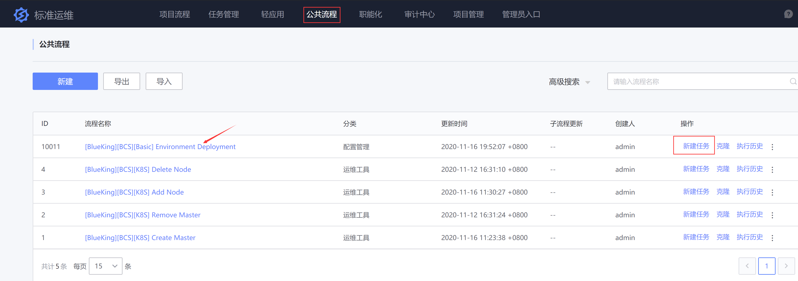

# 一、安装环境准备

## 基础环境依赖

社区版 V6.0+ 以上的基础包软件，必须包含 4 个基础平台和 4 个基础 SaaS：

<table><tbody>
<tr><th width="20%" align='center'>基础平台</th><th width="20%" align='center'>基础 SaaS</th></tr>
<tr><td width="20%" align='center'>管控平台</td><td width="20%" align='center'>用户管理</td></tr>
<tr><td width="20%" align='center'>配置平台</td><td width="20%" align='center'>权限中心</td></tr>
<tr><td width="20%" align='center'>作业平台</td><td width="20%" align='center'>节点管理</td></tr>
<tr><td width="20%" align='center'>PaaS 平台</td><td width="20%" align='center'>标准运维</td></tr>
</tbody></table>


## 服务器资源准备

1. 建议操作系统： CentOS 7.6
   
2. 服务器网络要与安装蓝鲸社区版基础包的服务器相通，在配置平台中需放在同一业务下
   
3. 容器管理平台服务器不能与 K8S 集群服务器、蓝鲸基础服务服务器共用，需要独立申请，否则会导致端口冲突等环境问题
   
4. K8S 集群服务器不能与容器管理平台服务器、蓝鲸基础服务服务器共用，需要独立申请，否则会导致端口冲突等环境问题
   
5. Harbor 私有仓库 IP 地址、BCS 导航页组件 IP 地址与 BCS 监控 IP 地址都会占用 TCP 80 端口，需要部署在 3 台不同的服务器上以免端口冲突

6. 容器管理平台服务器配置与所需数量

   **体验环境（共 3 台）**
   <table><tbody>
   <tr><th width="10%" align='center'>机器</th><th align='center'>安装服务</th><th align='center'>配置</th></tr>
   <tr><td width="10%" align='center'>机器 1</td><td align='center'>MYSQL 数据库、MongoDB 数据库、Redis 数据库、Harbor 私有仓库（客户端浏览器可访问的 IP）</td><td>最低使用 4 核 CPU、8G 内存、200G 磁盘（1 台）</td></tr>
   <tr><td width="10%" align='center'>机器 2</td><td align='center'>BCS 后台服务、BCS 导航页（客户端浏览器可访问的 IP）、web_console 服务</td><td>最低使用 4 核 CPU、8G 内存、100G 磁盘（1 台）</td></tr>
   <tr><td width="10%" align='center'>机器 3</td><td align='center'>容器监控服务</td><td>最低使用 4 核 CPU、4G 内存、100G 磁盘（1 台）</td></tr>
   </tbody></table>

   **生产环境（共 10 台）**
   <table><tbody>
   <tr><th width="10%" align='center'>机器</th><th align='center'>安装服务</th><th align='center'>配置</th></tr>
   <tr><td width="10%" align='center'>机器 1</td><td align='center'>MYSQL 数据库</td><td>最低使用 4 核 CPU、8G 内存、200G 磁盘（1 台，如果已有 MYSQL 实例无需准备服务器）</td></tr>
   <tr><td width="10%" align='center'>机器 2</td><td align='center'>MongoDB 数据库</td><td>最低使用 4 核 CPU、8G 内存、200G 磁盘（1 台，如果已有 MongoDB 实例无需准备服务器）</td></tr>
   <tr><td width="10%" align='center'>机器 3</td><td align='center'>Redis 数据库</td><td>最低使用 4 核 CPU、4G 内存、50G 磁盘（1 台，如果已有 Redis 实例无需准备服务器）</td></tr>
   <tr><td width="10%" align='center'>机器 4</td><td align='center'>Harbor 私有仓库</td><td>最低使用 4 核 CPU、4G 内存、300G 磁盘（1 台，客户端浏览器可访问的 IP）</td></tr>
   <tr><td width="10%" align='center'>机器 5-7</td><td align='center'>容器管理平台后台服务</td><td>最低使用 4 核 CPU、8G 内存、100G 磁盘（3 台，做高可用）</td></tr>
   <tr><td width="10%" align='center'>机器 8-9</td><td align='center'>BCS 导航页（客户端浏览器可访问的 IP）、web_console 服务可以部署在同一台服务器</td><td>最低使用 4 核 CPU、4G 内存、50G 磁盘（2 台，做高可用）</td></tr>
   <tr><td width="10%" align='center'>机器 10</td><td align='center'>容器监控服务</td><td>最低使用 4 核 CPU、8G 内存、200G 磁盘（1 台）</td></tr>
   </tbody></table>
   

7. K8S 集群服务器配置与数量

   **体验集群（最少 2 台）**
   | 节点 | 配置 |
   |--|--|
   | master 节点 | 最低使用 4 核 CPU、8G 内存、100G 磁盘（1 台）|
   | node 节点 | 最低使用 4 核 CPU、8G 内存、100G 磁盘（按需申请）|

   **生产集群（最少 4 台）**
   | 节点 | 配置 |
   |--|--|
   | master 节点 | 最低使用 8 核 CPU、16G 内存、200G 磁盘（3 台，做高可用）|
   | node 节点 | 最低使用 8 核 CPU、16G 内存、200G 磁盘（按需申请）|

## 添加域名解析

```bash
# Linux、Mac：/etc/hosts，Windows：C:\Windows\System32\drivers\etc\hosts
# BCS导航页组件IP地址（客户端浏览器可访问的地址） BCS导航页域名（BCS导航页域名前缀.蓝鲸基础域名） BCS导航页API域名（api-BCS导航页域名前缀.蓝鲸基础域名）
# 例如：
10.0.0.1 bcs.bktencent.com api-bcs.bktencent.com
```


## 安装 GSEAgent

使用节点管理 SaaS 导入服务器信息到配置平台与安装 GSEAgent

- 节点管理使用方法请参考文档：[节点管理-产品白皮书](../../../../../NodeMan/2.2/UserGuide/Introduce/Overview.md)
- 容器管理平台后台、K8S 集群服务器都需要导入服务器信息到配置平台与安装 GSE Agent，请把容器管理平台后台、K8S 集群服务器与安装蓝鲸社区版基础包的服务器放在同一业务下

## 下载、解压安装包

- 下载安装包到社区版基础服务安装的中控机，因为容器管理平台安装包较大，请在相应分区至少保留 20G 的剩余空间（注：本文档以/data 目录为例，如果放到其他目录，请自行修改相关命令涉及到的路径）

   容器管理平台扩展软件包：bcs_ce-6.0.9.tgz

   **下载完成后，请核对 MD5 码。**

- 解压容器管理平台扩展软件包

   ```bash
   tar xvf bcs_ce-6.0.9.tgz -C /data/
   ```

# 二、开始部署

## 部署方案说明

容器管理平台部署全新采用标准运维模版部署，与传统部署方案相比具备页面可视化效果，可以使用作业平台的脚本执行功能与文件传输功能，操作简单方便，只需完成以下几个步骤即可完成部署：
   
- 下载部署容器管理平台标准运维模版
- 导入标准运维模版
- 新建标准运维部署任务
- 标准运维参数填写
- 执行标准运维部署任务
- 容器管理平台部署完成

## 标准运维模版说明

| 标准运维模版名称 | 标准运维模版说明 |
| ---- | ---- |
| [BlueKing][BCS][Basic] Environment Deployment | 容器管理平台部署作业模版，用于部署容器管理平台组件，用户手工通过模版新建任务完成部署工作 |
| [BlueKing][BCS][K8S] Create Master | 容器管理平台 SaaS 调用此模版创建 K8S 集群，此模版请勿手工执行、修改、删除 |
| [BlueKing][BCS][K8S] Remove Master | 容器管理平台 SaaS 调用此模版删除 K8S 集群，此模版请勿手工执行、修改、删除 |
| [BlueKing][BCS][K8S] Add Node | 容器管理平台 SaaS 调用此模版添加 K8S 节点，此模版请勿手工执行、修改、删除 |
| [BlueKing][BCS][K8S] Delete Node | 容器管理平台 SaaS 调用此模版删除 K8S 节点，此模版请勿手工执行、修改、删除 |

## 部署详细步骤

1. 下载标准运维模版文件 bk_sops_common_ce_xxxx_xx_xx_xx.dat
2. 打开标准运维--->公共流程--->导入--->点击上传--->选择标准运维模版文件 bk_sops_common_ce_xxxx_xx_xx_xx.dat--->流程 ID 不变提交（因为 bcs-ops 模块需要关联标准运维模版流程 ID，如果流程 ID 有冲突请参考[BCS 维护手册-FAQ](../../EnhancePackageMaintenance/BCS/FAQ.md)的第 2 小点解决）
   
   
   
   
3. 打开标准运维--->公共流程--->[BlueKing][BCS][Basic] Environment Deployment--->新建任务
   
4. 选择 容器管理平台后台服务器所在业务
   
5. 节点选择，不用修改，直接进入下一步
   
6. 参数填写

   
   

<table><tbody>
<tr><td width="20%">安装包与安装脚本存放路径</td><td width="80%">社区版安装包（src 目录）、安装脚本存放路径（install 目录）和安装后文件存放路径（bkce），默认为/data，建议选择一个大一点的数据分区挂载路径</td></tr>
<tr><td width="20%">中控机 IP 地址</td><td width="80%">社区版基础服务安装的中控机 IP 地址，用于在此服务器上获取一些容器管理平台依赖的其它服务变量</td></tr>
<tr><td width="20%">是否新建 MySQL 实例</td><td width="80%">如果没有 MySQL 实例，这里不用修改，默认为 1，安装步骤会创建一个新的 MySQL 实例；如果已有 MySQL 实例这里修改为 0，安装步骤将会使用已有 MySQL 实例，不会安装新的 MySQL 实例;注意：使用已有MySQL实例时请提前给所有BCS服务器添加授权访问，参考以下命令：
source /data/install/load_env.sh 
/data/install/bin/grant_mysql_priv.sh -n default-root -u root -p ${BK_MYSQL_ADMIN_PASSWORD} -H 192.168.xx.xx #替换真实的bcs_ip </td></tr>
<tr><td width="20%">MySQL IP 地址</td><td width="80%">需安装或可连接的 MySQL 实例 IP 地址或域名，目前只支持单个 IP，如果已有实例是多节点，可以使用域名实现高可用；注意：如果“是否新建 MySQL 实例”值为 1 时，需要指定一台没有部署过 MySQL 实例的服务器上，防止 MySQL 端口冲突</td></tr>
<tr><td width="20%">MySQL 端口</td><td width="80%">MySQL 实例监听端口，默认为 3306，可根据实际情况自行修改</td></tr>
<tr><td width="20%">MySQL 用户名</td><td width="80%">MySQL 用户名，默认为 root，如需新建实例，这里会把实例设置成此用户名；如果是连接已有实例，请输入对应实例的用户名</td></tr>
<tr><td width="20%">MySQL 密码</td><td width="80%">MySQL 密码，如需新建实例，这里会把实例设置成此密码；如果是连接已有实例，请输入对应实例的密码</td></tr>
<tr><td width="20%">是否新建 Redis 实例</td><td width="80%">如果没有 Redis 实例，这里不用修改，默认为 1，安装步骤会创建一个新的 Redis 实例；如果已有 Redis 实例这里修改为 0，安装步骤将会使用已有 Redis 实例，不会安装新的 Redis 实例</td></tr>
<tr><td width="20%">Redis IP 地址</td><td width="80%">需安装或可连接的 Redis 实例 IP 地址或域名，目前只支持单个 IP，如果已有实例是多节点，可以使用域名实现高可用；注意：如果“是否新建 Redis 实例”值为 1 时，需要指定一台没有部署过 Redis 实例的服务器上，防止 redis 端口冲突</td></tr>
<tr><td width="20%">Redis 端口</td><td width="80%">Redis 实例监听端口，默认为 6379，可根据实际情况自行修改</td></tr>
<tr><td width="20%">Redis 密码</td><td width="80%">Redis 密码，如需新建实例，这里会把实例设置成此密码；如果是连接已有实例，请输入对应实例的密码</td></tr>
<tr><td width="20%">是否新建 MongoDB 实例</td><td width="80%">是否新建 MongoDB 实例：如果没有 MongoDB 实例，这里不用修改，默认为 1，安装步骤会创建一个新的 MongoDB 实例；如果已有 MongoDB 实例这里修改为 0，安装步骤将会使用已有 MongoDB 实例，不会安装新的 mongodb 实例；MongoDB 必须使用 2.4.x，使用高版本可能会存在兼容性问题，MongoDB 性能消耗较大，建议使用单独的服务器部署</td></tr>
<tr><td width="20%">MongoDB IP 地址</td><td width="80%">需安装或可连接的 MongoDB 实例 IP 地址或域名，目前只支持单个 IP，如果已有实例是多节点，可以使用域名实现高可用；注意：如果“是否新建 MongoDB 实例”值为 1 时，需要指定一台没有部署过 MongoDB 实例的服务器上，防止 MongoDB 端口冲突</td></tr>
<tr><td width="20%">MongoDB 端口</td><td width="80%">MongoDB 实例监听端口，默认为 27017，可根据实际情况自行修改</td></tr>
<tr><td width="20%">MongoDB 用户名</td><td width="80%">MongoDB 用户名，默认为 root，如需新建实例，这里会把实例设置成此用户名；如果是连接已有实例，请输入对应实例的用户名</td></tr>
<tr><td width="20%">MongoDB 密码</td><td width="80%">MongoDB 密码，如需新建实例，这里会把实例设置成此密码；如果是连接已有实例，请输入对应实例的密码</td></tr>
<tr><td width="20%">BCS 后台服务 IP 地址</td><td width="80%">容器管理平台后台服务部署的 IP 地址，容器管理平台后台服务包括 bcs-api、bcs-dns-service、bcs-storage、bcs-cc，同时还会部署容器管理平台后台服务所依赖的 etcd 与 zookeeper 服务，体验环境使用 1 台服务器即可，生产环境建议用 3 台服务器做高可用，多个 IP 使用半角逗号分隔</td></tr>
<tr><td width="20%">BCS 导航页组件 IP 地址</td><td width="80%">部署项目信息管理服务 IP 地址，负责项目创建及基本信息管理，生产环境建议用 2 台服务器做高可用，多个 IP 使用半角逗号分隔，此 IP 需要在客户端浏览器可访问</td></tr>
<tr><td width="20%">BCS 导航页域名前缀</td><td width="80%">容器管理平台 SaaS 的访问地址，默认为 bcs，例如基础平台使用 bktencent.com 的域名作为基础域名，那容器管理平台 SaaS 的访问地址为：http://bcs.bktencent.com</td></tr>
<tr><td width="20%">Web Console IP 地址</td><td width="80%">部署在提供 kubectl 命令行工具 IP 地址，可以使用 web 页面快捷查看集群内资源，生产环境建议用 2 台服务器做高可用，多个 IP 使用半角逗号分隔</td></tr>
<tr><td width="20%">BCS 监控 IP 地址</td><td width="80%">部署容器监控服务的 IP 地址，目前只支持单个 IP</td></tr>
<tr><td width="20%">Harbor 私有仓库 IP 地址</td><td width="80%">部署私有镜像仓库的 IP 地址，使用 Harbor 提供私有仓库服务，如果需要存放的镜像较多，需要部署在磁盘空间稍大的服务器上，目前只支持部署 1 台服务器；此 IP 需要在客户端浏览器可访问，访问 Harbor 页面管理方式为http://{外网 IP}，管理员用户名默认为：admin，密码为：Harbor12345</td></tr>
</tbody></table>

7. 执行部署作业，执行作业过程中没有出现错误即部署正常，否则需要根据 job 执行错误信息解决问题
   

# 三、访问容器管理平台

刷新蓝鲸工作台，会出现一个容器管理平台的 SaaS，点击图标会跳转到蓝鲸容器管理平台的 console 页面，也可以直接访问 URL [http://bcs.bktencent.com](http://bcs.bktencent.com) 来访问容器管理平台，如果无法访问时，可能是 hosts 域名解析没有生效，可以关闭浏览器后重试。

完成以上步骤容器管理平台就已经部署完毕，[BCS 维护手册](../../EnhancePackageMaintenance/BCS/Term.md)可以帮助用户更全面的了解容器管理平台的内容和后期维护。


# 四、部署验收
## BCS 后台部署验收

标准运维作业可以正常执行完成，执行过程无错误出现

## BCS K8S 集群部署验收

1. 可以正常 新建项目
2. 容器服务 BCS-K8S
3. 创建容器集群正常
4. 添加节点正常
5. 创建/同步/删除命名空间
6. 变量管理/删除/添加变量
7. Helm/Chart 仓库存在 rumpetroll、blueking-nginx-ingress Chart
8. 监控 Dashboard-BCS Node、BCS Cluster、BCS Pod 存在数据
9. 存在告警策略（告警中、正常、停用其中一个不为 0）
10. 指标查询随意查询一个指标有数据
11. 告警历史/通知组/操作审计可以正常打开
12. 删除节点正常
13. 删除容器集群正常
