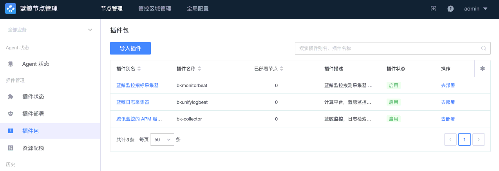
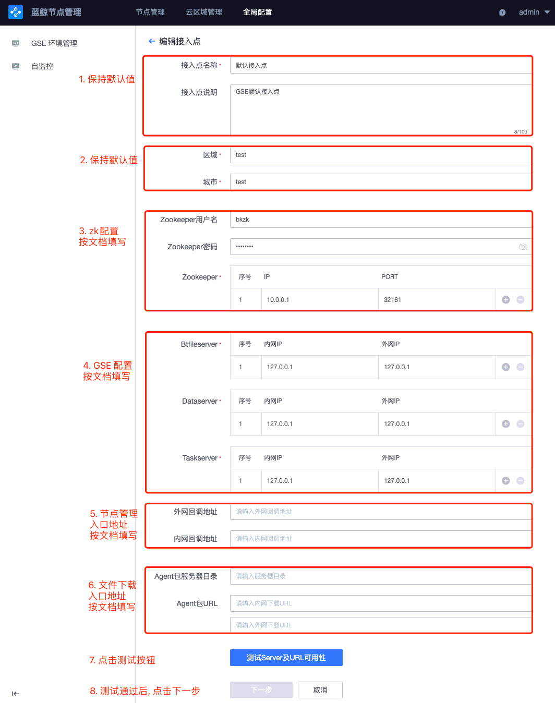

节点管理（bk_nodeman）部署后，需要先上传 Agent 及 插件包，并配置接入点。然后给 k8s 集群安装 Agent，实现纳管。

<a id="post-install-bk-nodeman-gse-client" name="post-install-bk-nodeman-gse-client"></a>

# 上传 GSE agent
>**提示**
>
>* 在之前使用 `./scripts/setup_bkce7.sh -i nodeman` 时，已经完成了此步骤，可以跳过。

>**提示**
>
>* 当你需要更新客户端或者加装云区域代理时，可以在下载后使用此命令重新上传。

在 **中控机** 执行如下命令下载文件：
``` bash
curl -sSf https://bkopen-1252002024.file.myqcloud.com/ce7/7.1-stable/bkdl-7.1-stable.sh | bash -s -- -ur latest gsec
```
上传 Agent 到 节点管理：
``` bash
cd ~/bkce7.1-install/blueking/  # 进入工作目录
./scripts/setup_bkce7.sh -u agent
```

<a id="post-install-bk-nodeman-gse-plugin" name="post-install-bk-nodeman-gse-plugin"></a>

# 上传 gse 插件包
>**提示**
>
>* 在之前使用 `./scripts/setup_bkce7.sh -i nodeman` 时，已经完成了此步骤，可以跳过。

在 **中控机** 执行如下命令下载文件：
``` bash
curl -sSf https://bkopen-1252002024.file.myqcloud.com/ce7/7.1-stable/bkdl-7.1-stable.sh | bash -s -- -ur latest gse_plugins_freq
```
上传 插件包 到 节点管理：
``` bash
cd ~/bkce7.1-install/blueking/  # 进入工作目录
./scripts/setup_bkce7.sh -u plugin
```

结尾最后一段 JSON 显示 `"message": "略 | all package under path->[/app/official_plugin] is import success, file_count->[1] package_count->[7]"` 即为上传成功。

脚本执行完成后，访问节点管理的 「插件管理」——「插件包」界面，可以看到上传成功的插件包：



插件集合包中各子包的用途：
| 插件包名 | 用途 | 描述 |
| -- | -- | -- |
| bkmonitorbeat | 蓝鲸监控指标采集器 | 支持多协议多任务的采集、监控和可用率计算，提供多种运行模式和热加载机制 |
| bkunifylogbeat | 高性能日志采集 | 日志相关的采集 |
| bk-collector | 多协议数据采集 | 高性能 Trace、指标、日志接收端，支持 OT、Jaeger、Zipkin 等多种数据协议格式。替代了之前的 bkmonitorproxy。 |

# 上传 GSE Proxy
>**提示**
>
>* 当你需要更新客户端或者加装云区域代理时，可以在下载后使用此命令重新上传。

在 **中控机** 执行如下命令下载文件：
``` bash
curl -sSf https://bkopen-1252002024.file.myqcloud.com/ce7/7.1-stable/bkdl-7.1-stable.sh | bash -s -- -ur latest gsep
```
上传 Proxy 到 节点管理：
``` bash
cd ~/bkce7.1-install/blueking/  # 进入工作目录
./scripts/setup_bkce7.sh -u proxy
./scripts/setup_bkce7.sh -u opentools  # 上传proxy所需的开源工具
```


<a id="post-install-bk-nodeman-gse-env" name="post-install-bk-nodeman-gse-env"></a>

# 配置 GSE 环境管理
请先登录到蓝鲸桌面，打开“节点管理”应用。然后点击顶部导航栏 “全局配置”，会默认进入“gse 环境管理” 界面。

点击 “默认接入点” 右侧的 “编辑” 图标，进入 “编辑接入点” 界面。如下图所示：



## 按场景快速配置

其中，`zk配置` 的填写要求如下。
* 用户名和密码：使用蓝鲸内置的 `bk-zookeeper-0` 实例时，无需修改。自定义 zk 请按需修改。
* 集群地址：使用蓝鲸内置的 `bk-zookeeper-0` 实例时，IP 填写 **任意 k8s node IP**，PORT 填写 `32181`（注意不是默认的 `2181`，此处取 `bk-zookeeper` 服务的 NodePort）。

根据你的使用场景不同，`GSE服务端`、`回调地址` 以及 `Agent下载地址` 有不同的配置值。我们预设了 3 种使用场景：
* 内网环境使用 IP 访问节点管理及制品库（兼容性最佳）
* 内网环境使用域名访问节点管理及制品库（要求建设内网 DNS 系统，且机器默认可解析相关域名）
* 公网环境配置（多云管理等复杂场景）

请阅读对应的场景章节。

### 场景：内网环境使用 IP 访问节点管理及制品库
将会取用 IP 作为入口地址。

请在 **中控机** 运行如下命令 **生成配置**：
``` bash
zk_host=$(kubectl get pod -A -l statefulset.kubernetes.io/pod-name=bk-zookeeper-0 -o jsonpath='{.items[0].status.hostIP}')
data_server=$(kubectl get pod -A -l app=gse-data -o jsonpath='{.items[0].status.podIP}')
file_server=$(kubectl get pod -A -l app=gse-file -o jsonpath='{.items[0].status.podIP}')
task_server=$(kubectl get pod -A -l app=gse-cluster -o jsonpath='{.items[0].status.podIP}')
bknodeman_bapi_host=$(kubectl get pod -A -l app.kubernetes.io/component=bk-nodeman-backend-api -o jsonpath='{.items[0].status.hostIP}')
bkrepo_gw_host=$(kubectl get pod -A -l bk.repo.scope=gateway -o jsonpath='{.items[0].status.hostIP}')
cat <<EOF
Zookeeper: （可以写任一 node 的 IP，此处取 zk 所在 node，注意端口为nodeport 32181）
$zk_host  32181

Btfileserver （内网 IP 和外网 IP 相同）：
$file_server
Dataserver （内网 IP 和外网 IP 相同）：
$data_server
Taskserver （内网 IP 和外网 IP 相同）：
$task_server

外网回调地址 和 内网回调地址 一样： 
http://$bknodeman_bapi_host:30300/backend

Agent包服务器目录: 保持为空
Agent包URL  : 2 个输入框均改为下面的内容：
http://$bkrepo_gw_host:30025/generic/blueking/bknodeman/data/bkee/public/bknodeman/download
EOF
```

根据提示的内容，在界面填写即可。

点击 “测试 Server 及 URL 可用性” 按钮。测试通过后，可以点击“下一步”。

在新的 “Agent 信息” 及 “Proxy 信息” 确认界面点击 “确认” 按钮即完成。


### 场景：内网环境使用域名访问节点管理及制品库
>**提示**
>
>仅当你的内网具备 DNS 服务，且新系统默认能解析 DNS 时，才能顺畅地使用域名作为入口。如果每次安装 agent 前还需要通过其他方式批量修改 `/etc/resolv.conf` 文件，则使用域名并不划算。

在 **中控机** 运行如下命令生成 配置 及 域名解析信息：
``` bash
cd ~/bkce7.1-install/blueking/  # 进入工作目录
BK_DOMAIN=$(yq e '.domain.bkDomain' environments/default/custom.yaml)  # 从自定义配置中提取, 也可自行赋值
IP1=$(kubectl get pods -A -l app.kubernetes.io/name=ingress-nginx -o jsonpath='{.items[0].status.hostIP}')

zk_host=$(kubectl get pod -A -l statefulset.kubernetes.io/pod-name=bk-zookeeper-0 -o jsonpath='{.items[0].status.hostIP}')
data_server=$(kubectl get pod -A -l app=gse-data -o jsonpath='{.items[0].status.podIP}')
file_server=$(kubectl get pod -A -l app=gse-file -o jsonpath='{.items[0].status.podIP}')
task_server=$(kubectl get pod -A -l app=gse-cluster -o jsonpath='{.items[0].status.podIP}')

cat <<EOF
Zookeeper: （可以写任一 node 的 IP，此处取 zk 所在 node，注意端口为nodeport 32181）
$zk_host  32181

Btfileserver （内网 IP 和外网 IP 相同）：
$file_server
Dataserver （内网 IP 和外网 IP 相同）：
$data_server
Taskserver （内网 IP 和外网 IP 相同）：
$task_server

外网回调地址 和 内网回调地址 一样：
http://bknodeman.$BK_DOMAIN/backend

Agent包服务器目录: 保持为空
Agent包URL  : 2 个输入框均改为下面的内容：
http://bkrepo.$BK_DOMAIN/generic/blueking/bknodeman/data/bkee/public/bknodeman/download

请参考如下映射关系配置 DNS 系统，或者修改待纳管主机的 hosts 文件：
$IP1 bkrepo.$BK_DOMAIN
$IP1 bknodeman.$BK_DOMAIN
EOF
```

根据提示的内容，在界面填写即可。

点击 “测试 Server 及 URL 可用性” 按钮。测试通过后，可以点击“下一步”。

在新的 “Agent 信息” 及 “Proxy 信息” 确认界面点击 “确认” 按钮即完成节点管理的配置。

接下来请你前往 DNS 系统完成上面域名的解析。


### 场景：接入点公网配置
>**提示**
>
>TODO 场景描述

TODO 详细操作


## 配置细节说明
不建议编辑默认接入点的名字及说明。

* 区域及城市 <br/>
  填写 GSE 集群配置的值，如果和 GSE 配置不一致则会禁止安装。在默认接入点中，区域及城市均为 `test`。
* zk 配置 <br/>
  节点管理通过 zk 读取 GSE 服务端的数据。请按需修改，如果使用蓝鲸内置的服务，请参考上面的场景文档填写。
* GSE 服务端系列配置 <br/>
  部署后会填写当前的 IP，可暂不修改。<br />
  今后如需更新某个字段（`BtfileServer`、`DataServer` 或 `TaskServer` ），请将该字段的**内网 IP**改为 `127.0.0.1`，以指示节点管理自动修改。 <br/>
  自动修改仅进行一次，会使用 zookeeper 中的服务发现地址填充**内网 IP**及**外网 IP**。
* 节点管理回调地址 <br/>
  用于安装日志上报等。需配置为节点管理 `bk-nodeman-backend-api` 服务的 NodePort 地址：`IP:30300`。
  * **外网回调地址**：和内网回调地址保持一致。
  * **内网回调地址**：填写 `http://任意Node的IP:30300/backend` （注意结尾没有斜杠）。
* 部署文件下载地址。 <br/>
  用于下载安装脚本、安装文件及用户自定义的监控插件等。
  * **Agent 包服务器目录**：请保持为空。
  * **agent 包 URL**： <br/>
    需配置为制品库 `bk-repo-bkrepo-gateway` 服务入口。可以是域名 `bkrepo.$BK_DOMAIN` 或者 NodePort 地址： `IP:30025`。
    * **内网下载 URL**：第一个输入框。填写 `http://任意Node的IP:30025/generic/blueking/bknodeman/data/bkee/public/bknodeman/download`。
    * **外网下载 URL**：第二个输入框。内容同**内网地址**。

点击“下一步”进入第二页时的配置项：
* 大部分字段均可保持默认值。
* **dataipc** 填写 `47000`。
* **Proxy 上的安装包** 后续会调整。可以临时填写 `gse_client-linux-x86_64.tgz`。

配置完成，点击 “确认” 即可创建接入点。


<a id="k8s-node-install-gse-agent" name="k8s-node-install-gse-agent"></a>

# 给 node 安装 gse agent

需要给集群的 “全部 node”（包括 `master`） 安装 gse agent，并放入《蓝鲸》业务。

agent 用途：
1. job 依赖 `node` 上的 gse agent 进行文件分发。节点管理安装插件时也是通过 job 分发。
2. 容器监控需要通过 `node` 上的 gse agent 完成监控。

因为蓝鲸智云 v6 和 v7 仅为部署形态差异，各产品软件版本会保持一致。故请参考 《[安装蓝鲸 Agent（直连区域）](../../NodeMan/2.2/UserGuide/QuickStart/DefaultAreaInstallAgent.md)》 文档安装 agent。

在节点管理的 “普通安装” 界面，选择 **业务为《蓝鲸》**，云区域为 “直连区域”，安装通道及接入点均使用默认值。
>**提示**
>
>如果误选了《资源池》业务，可等待 agent 安装完毕。然后回到蓝鲸桌面，访问 “配置平台”，进入 “资源” —— “主机” 界面。<br />
>全选刚才新安装的主机，点击 “分配到” 按钮，选择 “业务空闲机池”。在弹窗中选择 《蓝鲸》 业务，点击 “确定” 按钮。完成后可点击顶部导航进入 “业务” 界面，左上角切换业务为 《蓝鲸》，即可看到这批主机。

当安装 agent 完成后，你可以参考 《[插件管理](../../NodeMan/2.2/UserGuide/Feature/Plugin.md)》 文档为所有 agent 批量安装 `bkmonitorbeat` 和 `bkunifylogbeat` 插件，以便 上报主机监控数据 及 提供日志采集能力。

常见报错：
1. `[script] agent(PID:NNN) is not connect to gse server`，请检查 “配置 GSE 环境管理” 章节的配置是否正确。
2. `命令返回非零值：exit_status -> 6, stdout -> , stderr -> curl: (6) Could not resolve host: bkrepo.$BK_DOMAIN; Unknown error`，请检查目标主机的 DNS 配置是否正确，也可临时添加 hosts 记录解决解析问题。或参考 “配置 GSE 环境管理” 章节配置 agent url 为 k8s node IP。
3. `ERROR setup_agent FAILED process check: agentWorker not found (node type:agent)`，agent 启动失败。如果是先添加的 k8s node，然后安装 agent 会遇到此问题。可先行取消调度此 node，然后驱逐所有 pod，并删除主机的 `/var/run/ipc.state.report` 目录。然后先安装 agent，再将 node 加回集群。


# 下一步
回到《[部署基础套餐](install-bkce.md#next)》文档看看其他操作。
