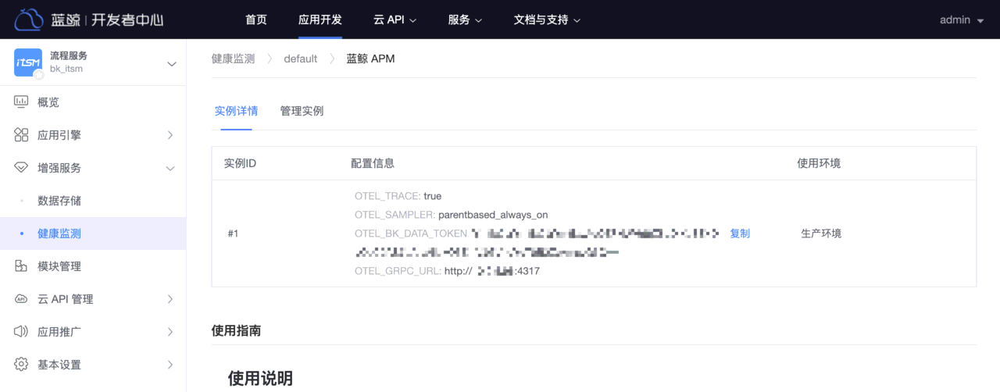
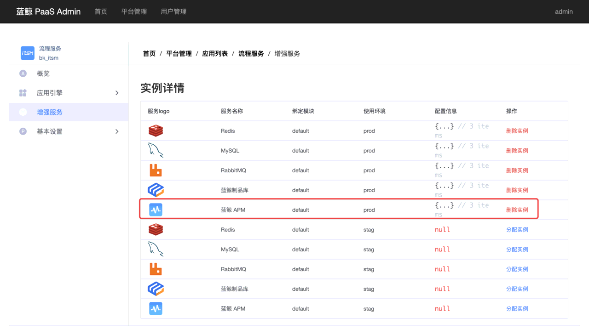

蓝鲸监控日志套餐由监控平台及日志平台组成。二者均借助 容器管理平台（BCS） 实现对容器环境的支持。

早期的 “故障自愈” 独立 SaaS 也整合到了监控平台中。

>**提示**
>
>此前发布的 `7.1.0` 版本有提供监控 3.8 版本，但尚未成为稳定版。请先升级到 7.1.2 版本继续部署监控。

# 检查依赖
## 蓝鲸版本
监控升级了 values 文件，并依赖新版本 apigw 平台。请确保蓝鲸版本为 7.1.2。

在中控机执行如下命令确认蓝鲸版本：
``` bash
cd ~/bkce7.1-install/blueking/  # 进入工作目录
cat VERSION
```

## GSE 版本
登录到 **中控机**，先检查 bk-gse 的版本：
``` bash
helm list -A -l name=bk-gse
```
查看 `CHART` 列里的版本号，预期大于等于 `2.1.2-beta.20`，如果版本较旧，可不卸载，直接重新执行一次部署基础套餐的命令。

## APIGateway 版本
登录到 **中控机**，先检查 bk-apigateway 的版本：
``` bash
helm list -A -l name=bk-apigateway
```
查看 `CHART` 列里的版本号，预期大于等于 `1.11.3`，如果版本较旧，可不卸载，直接重新执行一次部署基础套餐的命令。


# 部署与访问
>**提示**
>
>**如果部署期间出错，请先查阅 《[问题案例](troubles.md)》文档。**
>
>问题解决后，可重新执行 `helmfile` 命令。

## 监控平台

### 启动监控存储服务
请在 **中控机** 执行：
``` bash
cd ~/bkce7.1-install/blueking/  # 进入工作目录
helmfile -f monitor-storage.yaml.gotmpl sync  # 部署监控依赖的存储
```

### 推荐：对接容器管理平台
容器监控功能依赖 **容器管理平台** （BCS），请先完成 [部署容器管理平台](install-bcs.md) 。

``` bash
./scripts/config_monitor_bcs_token.sh  # 获取bcs token，写入监控和日志的 custom-values 文件。
```

### 部署监控
部署监控后台和 saas 以及监控数据链路组件：
``` bash
helmfile -f 04-bkmonitor.yaml.gotmpl sync
```

约等待 5 ~ 10 分钟，期间 `bk-monitor-consul` pod 可能 `Error` 且自动重启。

### 添加桌面图标
>**提示**
>
>目前 “故障自愈” 已经整合到了监控平台，如果需要访问，可以一并添加桌面图标。

在 admin 桌面添加应用，也可以登录后自行添加。同时设置为默认应用，所有新登录的用户都会自动添加此应用到桌面。
``` bash
# 监控
scripts/add_user_desktop_app.sh -u "admin" -a "bk_monitorv3"
scripts/set_desktop_default_app.sh -a "bk_monitorv3"
# 故障自愈
scripts/add_user_desktop_app.sh -u "admin" -a "bk_fta_solution"
scripts/set_desktop_default_app.sh -a "bk_fta_solution"
```

<a id="bkmonitor-install-operator" name="bkmonitor-install-operator"></a>

### 推荐：容器监控数据上报
容器监控数据由 `bkmonitor-operator` release 采集，它提供了 daemonset 工作负载，在所有 k8s node （包括 master ）运行。数据上报由这些主机的 gse-agent 完成，故请先在 “节点管理” 中完成 agent 安装并确保状态正常。

``` bash
helmfile -f 04-bkmonitor-operator.yaml.gotmpl sync  # 部署 k8s operator 提供容器监控数据
```

### 访问监控平台
需要配置域名 `bkmonitor.$BK_DOMAIN`，操作步骤已经并入 《部署步骤详解 —— 后台》 文档 的 “[配置用户侧的 DNS](manual-install-bkce.md#hosts-in-user-pc)” 章节。

配置成功后，即可在桌面打开 “监控平台” 应用了。
>**提示**
>
>刚部署完成时，访问监控如果出现 HTTP 503 报错，请耐心等待界面准备完成。在后台初始化任务完成前，首页可能出现报错。

主机基础监控数据上报由 `bkmonitorbeat` 插件提供，之前安装 agent 时会默认安装。

>**提示**
>
>* 为 Agent 安装并启动 `bkmonitorbeat` 插件后，大概等 2 ~ 5 分钟， “观测场景” —— “主机监控” 界面的主机采集状态会变为 “正常”。此时点击 IP 进入主机详情界面，稍等 1 ~ 2 分钟可以看到监控图表。插件安装步骤见《[配置节点管理及安装 Agent](config-nodeman.md#k8s-node-install-gse-agent)》文档。
>* 完成 “容器监控数据上报” 章节后，访问监控平台 “观测场景” —— “Kubernetes” 界面可能依旧显示 “开启 Kubernetes 监控” 的提示，请稍等 1 ~ 11 分钟，然后刷新页面，即可显示集群信息，稍后会更新监控数据图表。

>**提示**
>
>主机详情界面在刷新后，会导致图表数据自动刷新失效，需要重新设置一次。

## 日志平台
### 配置 ElasticSearch
>**提示**
>
>为了快速部署，我们默认使用了蓝鲸共享的 `bk-elasticsearch` 单副本集群。
>建议你自备多副本集群，并根据采集的原始日志量配置充足的存储。

目前由监控统一定时创建 ElasticSearch 索引，每 10 分钟执行一次。如果 es 自动创建了 `write_` 开头的索引，则会导致搜索时找不到预期的索引，因此需要禁止此行为。

可以在 **中控机** 执行如下命令配置蓝鲸预置 es 服务：
``` bash
kubectl exec -it -n blueking bk-elastic-elasticsearch-master-0 -- curl -X PUT -u elastic:blueking http://127.0.0.1:9200/_cluster/settings -H 'Content-Type: application/json' -d '{"persistent":{"action":{"auto_create_index":"-write_*,*"}}}'
```

>**提示**
>
>如果已经自动创建了 write_ 开头的索引，可以使用如下命令删除：
>``` bash
>kubectl exec -it -n blueking bk-elastic-elasticsearch-master-0 -- curl -u elastic:blueking -X DELETE 'http://localhost:9200/write_*'
>```

### 推荐：对接容器管理平台
之前在部署监控时已经写过配置文件了。可以检查下：
``` bash
cd ~/bkce7.1-install/blueking/  # 进入工作目录
yq e '.configs.bcsApiGatewayToken' environments/default/bklog-search-custom-values.yaml.gotmpl
```
如果显示 `null`，请先部署监控并启用容器监控。

### 推荐：启用蓝鲸各服务的日志上报
我们预置了蓝鲸各服务的容器日志采集，如需启用，可以提前修改配置文件。

请在 **中控机** 执行：
``` bash
cd ~/bkce7.1-install/blueking/  # 进入工作目录
# 蓝鲸服务启用日志上报：
case $(yq e '.bkLogConfig.enabled' environments/default/custom.yaml 2>/dev/null) in
  null)
    tee -a environments/default/custom.yaml <<< $'bkLogConfig:\n  enabled: true'
  ;;
  true)
    echo "environments/default/custom.yaml 中配置了 .bkLogConfig.enabled=true, 无需修改."
  ;;
  *)
    echo "environments/default/custom.yaml 中配置了 .bkLogConfig.enabled 为其他值, 请手动修改值为 true."
  ;;
esac
```

### 部署日志采集器
`bklog-collector` release 定义了 CR： `bklogconfigs.bk.tencent.com`，并提供了 daemonset 工作负载，在所有 k8s node （包括 master ）运行。日志上报经由这些主机的 gse-agent 传递，故请先在 “节点管理” 中完成 agent 安装并确保状态正常。
``` bash
cd ~/bkce7.1-install/blueking/  # 进入工作目录
helmfile -f 04-bklog-collector.yaml.gotmpl sync
```
如果启动失败，请在节点管理中检查 k8s 各 node 上的 GSE Agent 状态是否正常。

### 部署日志平台
请在 **中控机** 执行：
``` bash
cd ~/bkce7.1-install/blueking/  # 进入工作目录
helmfile -f 04-bklog-search.yaml.gotmpl sync  # 部署
# 在admin桌面添加应用，也可以登录后自行添加。
scripts/add_user_desktop_app.sh -u "admin" -a "bk_log_search"
# 设为默认应用。
scripts/set_desktop_default_app.sh -a "bk_log_search"
```

### 推荐：变更其他蓝鲸服务以上报日志
当你完成了 “启用蓝鲸各服务的日志上报” 章节后，此时日志平台已经通知监控平台预创建索引。

先在 **中控机** 检查：
``` bash
kubectl get crd bklogconfigs.bk.tencent.com
```
预期看到一条记录。

如果显示 `Error from server (NotFound): customresourcedefinitions.apiextensions.k8s.io "bklogconfigs.bk.tencent.com" not found`，请先确保日志采集器启动成功。

目前蓝鲸所有平台默认读取全局日志上报设置，如需覆盖平台配置，请自行新增或修改对应的 custom-values 文件。

为了实现采集项上报，需要重启一次采集项对应的 helm release。请在 **中控机** 执行：
``` bash
cd ~/bkce7.1-install/blueking/  # 进入工作目录
# 然后变更其他平台
helmfile -f base-blueking.yaml.gotmpl apply
helmfile -f 03-bcs.yaml.gotmpl apply
helmfile -f 04-bkmonitor.yaml.gotmpl apply
```

注：
1. 如需重启蓝鲸基础套餐的指定 helm release，请使用此命令： `helmfile -f base-blueking.yaml.gotmpl -l name=release名字 sync`。
2. bk-ci 的日志采集还在调试中，暂未预置采集项。

重启完毕后，大概等 10 分钟，回到“日志平台”——“检索”。展开“索引集”下拉框，即可看到采集项右侧的“无数据”标签消失，可以搜索日志了。

如果超过 20 分钟无数据，请步骤是否错漏，以及日志平台是否正常。TODO 排查指引


### 访问日志平台
需要配置域名 `bklog.$BK_DOMAIN`，操作步骤已经并入 《部署步骤详解 —— 后台》 文档 的 “[配置用户侧的 DNS](manual-install-bkce.md#hosts-in-user-pc)” 章节。

配置成功后，即可在桌面打开 “日志平台” 应用了。

此时位于 “检索” 界面，如果左上角 “索引集” 下拉列表为空。可以：
* 启用蓝鲸各平台预置的日志采集项
  1. 完成前面推荐的 “部署容器日志采集器” 章节。
  2. 完成前面推荐的 “蓝鲸各平台容器日志上报” 章节。
  3. 完成前面推荐的 “变更其他蓝鲸服务以上报日志” 章节。
* 采集主机日志
  1. 在节点管理中，为待采集主机安装 `bkunifylogbeat` 插件。
  2. 在日志平台的 “管理” —— “日志采集” 界面添加采集项。
* 采集容器环境日志 （需要完成 “对接容器管理平台” 章节）
  * 蓝鲸集群（BCS-K8S-00000）
    1. 完成 “部署容器日志采集器” 章节。
    2. 在日志平台的 “管理” —— “日志采集” 界面添加采集项。
  * 其他集群
    1. TODO 其他集群容器日志采集步骤。


# 可选功能
## 自定义上报服务器
蓝鲸 bk-collector 是高性能 的 Trace、指标、日志接收端，支持 OT、Jaeger 等多种数据协议格式。

### 安装 bk-collector
通过蓝鲸 “节点管理” 系统部署 bk-collector。

请通过蓝鲸桌面访问 “节点管理” 系统，在 “插件状态” 界面选择至少 1 台服务器。

然后点击 “安装/更新” 按钮，在弹框中选择 `bk-collector` 插件。连续点击 “下一步” 确认版本后，点击 “立即执行” 开始部署。

当插件安装成功后，我们得到了一批 自定义上报服务器。

### 调整蓝鲸监控配置
让蓝鲸 “监控平台” 知晓我们部署的 自定义上报服务器 IP，以便推送配置信息。

请通过蓝鲸桌面访问 “监控平台” 系统，点击顶部导航右侧的齿轮图标，在弹出菜单中选择 “全局设置”。

在 “全局设置” 界面，找到配置项 “自定义上报默认服务器”，填写刚才部署的 OTel 服务端 IP。如果有多个 IP，需要逐个 IP 填写。填写完毕后点击页脚 “提交” 按钮保存配置。


### 使用自定义上报服务器
bk-collector 在启动后，会监听如下的端口：

| 端口 | 协议 | 用途 |
|--|--|--|
| 4317 | GRPC | OTel 上报入口。 |
| 4318 | HTTP | OTel 上报入口，并同时提供 `prometheus pushgateway`。 |
| 10205 | HTTP | 蓝鲸监控自定义指标和事件上报入口，接替早期的 bkmonitorproxy。 |

功能使用位置：
* **OTel 上报**：“观测场景” —— “APM”。
* **prometheus 上报**： “集成” —— “自定义指标” —— 创建 `上报协议` 为 `Prometheus` 的自定义指标。
* **蓝鲸 自定义指标 上报**： “集成” —— “自定义指标” —— 创建 `上报协议` 为 `JSON` 的自定义指标。
* **蓝鲸 自定义事件 上报**： “集成” —— “自定义事件”。
* **Jaeger 平台**： 指定上报服务器为 OTel 上报入口（ `4317` 或 `4318` 端口），我们会处理为 OTel 格式入库供蓝鲸检索。

## 应用监控（APM）
应用监控支持 OpenTelemetry 标准，监控平台提供了集成方案。

### 启动 OTel 服务
请完成前面的“自定义上报服务器”章节，即可获得 OTel 服务端。

### 接入应用监控
你可以参考 [产品文档](../../Monitor/3.8/UserGuide/ProductFeatures/scene-apm/apm_monitor_overview.md)，或者直接开始接入 SDK：
* [SDK FAQ](../../Monitor/3.8/UserGuide/ProductFeatures/integrations-traces/otel_sdk_faq.md)
* [Go](../../Monitor/3.8/UserGuide/ProductFeatures/integrations-traces/otel_sdk_golang.md)
* [Python3](../../Monitor/3.8/UserGuide/ProductFeatures/integrations-traces/otel_sdk_python.md)
* [C++](../../Monitor/3.8/UserGuide/ProductFeatures/integrations-traces/otel_sdk_cpp.md)
* [Java](../../Monitor/3.8/UserGuide/ProductFeatures/integrations-traces/otel_sdk_java.md)

<!--
蓝鲸已有部分 SaaS 接入了应用监控，请参考下面的 “蓝鲸 SaaS 接入应用监控” 章节进行配置。

蓝鲸其他产品还在陆续接入中，敬请期待。
-->

### 【暂无】为 PaaS 启用 OTel
蓝鲸 PaaS 平台的 otel 服务暂有调整，文档临时移除。
<!--
PaaS 启用 OTel 相关配置后，如 SaaS 支持并声明了需要 `otel` 服务，则会为其提供相关环境变量。

#### 修改配置
创建 或 修改 bk-paas 的 custom-values 文件，目前仅支持单个 IP 地址，请按需自备负载均衡器。

请在 **中控机** 执行：
``` bash
cd ~/bkce7.1-install/blueking/  # 进入工作目录
BK_OTEL_IP=127.0.0.1    # 请修改为前面步骤中部署的 OTel 服务端 IP
# 启用 OTel：
case $(yq e '.global.bkOtel.enabled' environments/default/bkpaas3-custom-values.yaml.gotmpl 2>/dev/null) in
  null|"")
    tee -a environments/default/bkpaas3-custom-values.yaml.gotmpl <<< $'global:\n  bkOtel:\n    enabled: true\n    bkOtelGrpcUrl: http://'"$BK_OTEL_IP:4317"
  ;;
  true)
    echo "environments/default/bkpaas3-custom-values.yaml.gotmpl 中配置了 .global.bkOtel.enabled=true, 无需修改."
  ;;
  *)
    echo "environments/default/bkpaas3-custom-values.yaml.gotmpl 中配置了 .global.bkOtel.enabled 为其他值, 请手动修改值为 true."
  ;;
esac
```

#### 重新部署 bk-paas
请在 **中控机** 执行：
``` bash
helmfile -f base-blueking.yaml.gotmpl -l name=bk-paas apply
```
检查 helm release 的配置是否生效：
``` bash
helm get values -n blueking bk-paas | yq e '.global.bkOtel' -
```
预期输出：
``` yaml
bkOtelGrpcUrl: http://OTel服务端IP:4317
enabled: true
```

#### 更新 PaaS 缓存
增强服务的配置项使用了缓存技术，刷新间隔约为 1 小时。为了确保 SaaS 尽快获得 OTel 配置，可主动删除 Redis 缓存并重建。

请在 **中控机** 执行：
``` bash
redis_pass=$(kubectl get secrets -n blueking bk-redis -o go-template='{{index .data "redis-password" | base64decode }}{{"\n"}}')  # 取得redis密码
kubectl exec -i -n blueking bk-redis-master-0 -- redis-cli -h bk-redis-master -p 6379 -a "$redis_pass" -n 0 del "1remote:service:config:a31e476d-5ec0-29b0-564e-5f81b5a5ef32"  # 删除增强服务 蓝鲸apm 的缓存

kubectl exec -i -n blueking deploy/bkpaas3-apiserver-web -- python manage.py shell <<< 'from paasng.platform.scheduler.jobs import update_remote_services; update_remote_services()'  # 重建缓存，此命令无输出。
```
如果重建缓存时抛出异常 `ValueError: Service uuid=a31e476d-5ec0-29b0-564e-5f81b5a5ef32 with a different source already exists`，说明旧缓存没有删除掉，请先重试删除缓存的命令。

#### 确认部署成功
可以参考下面的 “蓝鲸 SaaS 接入应用监控” 章节操作。

#### 关闭 Otel
今后如果需要关闭 Otel，修改 bk-paas 的 custom-values 文件，设置 `.global.bkOtel.enabled` 为 `false`，并重启 `bk-paas` release，然后重新部署启用了 Otel 的 SaaS 即可。
-->

# 采集蓝鲸各平台的数据
为了更好地让管理员了解蓝鲸集群的状况，我们预置了一些数据采集策略。需要手动开启：
* 监控平台
  * 蓝鲸服务 SLI 看板
  * 【暂无】蓝鲸 SaaS 接入应用监控

请阅读下方对应章节进行操作。

## 蓝鲸服务 SLI 看板
我们预埋了 SLI Metrics 上报的逻辑，并提供了 “监控平台” 的 “仪表盘”，方便你了解蓝鲸各组件的服务状态。

>**提示**
>
>如果启用 SLI，会大幅提高 `influxdb` 及 `elasticsearch` 的磁盘及内存开销。建议额外准备 300G 磁盘及 4GB 内存余量。同时磁盘 IO 压力大增，强烈建议使用 SSD 存储。

### 检查 servicemonitor 资源
请先完成 “容器监控数据上报”，并确保 “观测场景” —— “Kubernetes” 界面有监控数据。

在 **中控机** 执行：
``` bash
kubectl get servicemonitors.monitoring.coreos.com -A
```

预期看到 `bkmonitor-operator` 命名空间下的多个资源，如果为空，说明容器监控功能异常。

### 配置指标上报
修改全局配置文件，启用 SLI Metrics 上报。

请在 **中控机** 执行：
``` bash
cd ~/bkce7.1-install/blueking/  # 进入工作目录
# 启用指标上报：
case $(yq e '.serviceMonitor.enabled' environments/default/custom.yaml) in
  null)
    tee -a environments/default/custom.yaml <<< $'serviceMonitor:\n  enabled: true'
  ;;
  true)
    echo "environments/default/custom.yaml 中配置了 .serviceMonitor.enabled=true, 无需修改."
  ;;
  *)
    echo "environments/default/custom.yaml 中配置了 .serviceMonitor.enabled 为其他值, 请手动修改值为 true."
  ;;
esac
```

### 重启待上报指标的平台
为了实现指标上报，需要调整对应平台的 helm release。

请在 **中控机** 执行：
``` bash
cd ~/bkce7.1-install/blueking/  # 进入工作目录
# 变更对应的release
helmfile -f base-blueking.yaml.gotmpl apply
helmfile -f 03-bcs.yaml.gotmpl apply
helmfile -f 04-bkmonitor.yaml.gotmpl apply
helmfile -f 04-bklog-search.yaml.gotmpl apply
```

如果看到如下报错，说明没有正确配置容器监控功能，请重新配置。
``` plain
Error: unable to build kubernetes objects from release manifest: unable to recognize "": no matches for kind "ServiceMonitor" in version "monitoring.coreos.com/v1"
```

### 关闭指标上报
如果启用 SLI Metrics 后，导致环境不稳定，可以关闭 SLI Metrics 上报。

先修改全局配置文件：`environments/default/custom.yaml`，将 `.serviceMonitor.enabled` 改为 `false`，或者将配置项删掉。

然后参考上面的 “重启待上报指标的平台” 章节变更各 release。待重启完毕即会停止上报。


### 导入仪表盘
登录监控平台，并切换到“仪表盘”界面。

点击左侧导航栏的“批量导出和导入”菜单，点击“点击导入”按钮，进入导入界面。

请下载如下文件导入:
* [bk_monitor-dashboards-sli-20221008.tar.gz](https://bkopen-1252002024.file.myqcloud.com/ce7/files/bk_monitor-dashboards-sli-20221008.tar.gz)

导入成功后，无需配置监控目标，点击完成结束整个导入流程。

然后请回到“仪表盘”界面，找到并进入 “\[BlueKing] 各产品看板入口” 仪表盘。您可以从这里快速访问蓝鲸各平台的仪表盘。

>**提示**
>
>您可以收藏此仪表盘。刷新页面后，即可在左侧导航栏看到。

### 已知问题
目前部分 panel 加载时可能出现报错，请等待我们后续优化。
``` plain
请求系统'unify-query'错误，返回消息: {"error":"expanding series: db: process, err:[get cluster failed]"}，请求URL: http://bk-monitor-unify-query-http:10205/query/ts
```

## 【暂无】蓝鲸 SaaS 接入应用监控
目前 bk-paas 对 APM 功能的适配正在调整，暂时无法配置 “流程服务” 和 “标准运维” 的 APM 上报， 请等待文档更新。

<!--
蓝鲸的 “流程服务” 和 “标准运维” 适配了应用监控，完成如下配置即可上报 Trace 数据。

### 前置检查
请先参考 “应用监控（APM）” 章节完成配置，包括 “为 PaaS 启用 OTel” 章节。

### 重新部署 SaaS
之前部署时，PaaS 尚未启用 OTel，因此不会为 SaaS 提供 OTel 环境变量。此时会提供环境变量了，但存量的 SaaS 需要 **重新部署** 一次才能使环境变量生效。

以下步骤以“生产环境”重新部署流程服务为例：
1. 使用有权限管理开发者中心的账户（如 admin ）登录到桌面，在左侧打开 “开发者中心” 应用。
2. 点击导航栏的 “应用开发”。选择要更新的应用（如“流程服务”），会进入“应用概览”。
3. 此时在左侧展开“应用引擎”，点击“部署管理”。
4. 切换下方 Tab 为 “生产环境”，无需重新选择版本，直接点击 “部署至生产环境”。
5. 左上角可以切换到其他 SaaS，如果该 SaaS 有多个模块（如标准运维），需依次在顶部切换到其他模块，然后重新部署生产环境。

部署成功后，访问左侧导航栏的 “增强服务” —— “健康监测” 界面。在 “已启用的服务” 中找到 “蓝鲸 APM”，点击进入。

在新界面的 “实例详情” 面板中，我们可以看到 OTel 相关的环境变量（如下图所示），这个说明我们的 SaaS 已经成功配置了蓝鲸 APM。


如果提示 “暂无增强服务配置信息”，说明 PaaS OTel 配置不正确或者缓存未刷新。请参考 “调整 PaaS 启用 OTel” 章节重新操作一次。

>**提示**
>
>如果您的 OTel 配置发生了变动，但是 SaaS “增强服务”——“健康检测” 里显示的配置信息依旧为旧版本，可以访问后台管理界面手动删除：
>1. 在登录状态下访问 `http://bkpaas.替换为BK_DOMAIN/backend/admin42/applications/` 进入 “蓝鲸 PaaS Admin” 的 “应用列表” 界面.
>2. 点击对应的 SaaS 名称进入管理页。
>3. 在左侧导航点击 “增强服务”，进入 “实例详情” 列表。找到使用环境对应的 “蓝鲸 APM” 服务，点击 “删除实例”。然后重新部署对应环境的 SaaS 即可。
>   

### 访问蓝鲸 APM
通过 “蓝鲸桌面” 打开 “监控平台”，在顶部导航栏选择 “观测场景”，然后侧栏选择 “APM”。

点击左上角空间选择器，切换到带 “蓝鲸应用” 标签的空间，如 “流程服务”。

此时可以看到已经出现了应用列表，点击即可看到详细数据。

如果提示 “无数据”，请耐心等待 10 分钟左右。如果超过 20 分钟没有数据，请检查步骤是否错漏，以及监控平台是否正常。TODO 排查指引
-->

# 下一步
回到《[部署基础套餐](install-bkce.md#next)》文档看看其他操作。
