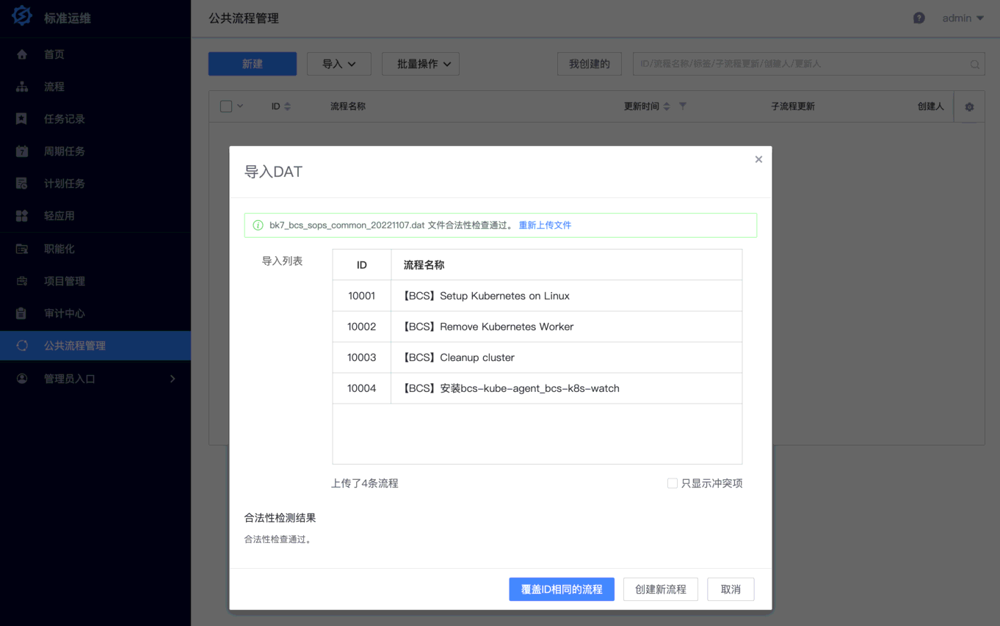

# 部署容器管理套餐

## 部署容器管理平台
### 确认 storageClass
在 **中控机** 检查当前 k8s 集群所使用的存储：
``` bash
kubectl get sc
```
预期输出为：
``` plain
NAME                      PROVISIONER                    RECLAIMPOLICY   VOLUMEBINDINGMODE      ALLOWVOLUMEEXPANSION   AGE
local-storage (default)   kubernetes.io/no-provisioner   Delete          WaitForFirstConsumer   false                  3d21h
```

如果输出的名称不是 `local-storage`，则需通过创建 `custom.yaml` 实现修改：
``` bash
cd $INSTALL_DIR/blueking/
cat <<EOF >> environments/default/custom.yaml
bcs:
  storageClass: 填写上面的查询到的名称
EOF
```

### 禁用消息队列
bcs-services-stack-1.28.2 及以下版本需要调整配置。不然 bcs-storage CPU 使用率会异常偏高。

创建或者编辑 bcs custom values 文件（`./environments/default/bcs-custom-values.yaml.gotmpl`）：
``` yaml
bcs-storage:
  storage:
    messageQueue:
      enabled: false
global:
  storage:
    messageQueue:
      enabled: false
```

### 配置 coredns
容器管理平台 会在 pod 内请求 蓝鲸制品库 提供的 helm 及 docker 仓库，需确保 coredns 配置正确。

在 **中控机** 执行：
``` bash
cd $INSTALL_DIR/blueking/  # 进入工作目录
BK_DOMAIN=$(yq e '.domain.bkDomain' environments/default/custom.yaml)  # 从自定义配置中提取, 也可自行赋值
IP1=$(kubectl get svc -A -l app.kubernetes.io/instance=ingress-nginx -o jsonpath='{.items[0].spec.clusterIP}')
./scripts/control_coredns.sh update "$IP1" bcs.$BK_DOMAIN bcs-api.$BK_DOMAIN docker.$BK_DOMAIN helm.$BK_DOMAIN
./scripts/control_coredns.sh list  # 检查添加的记录。
```

### 开始部署
在 中控机 执行：
``` bash
cd $INSTALL_DIR/blueking
helmfile -f 03-bcs.yaml.gotmpl sync
# 在admin桌面添加应用，也可以登录后自行添加。
scripts/add_user_desktop_app.sh -u "admin" -a "bk_bcs"
# 设为默认应用。
scripts/set_desktop_default_app.sh -a "bk_bcs"
```
耗时 3 ~ 7 分钟，此时可以另起一个终端观察相关 pod 的状态
``` bash
kubectl get pod -n bcs-system -w
```

如果部署失败请先查阅 《[问题案例](troubles.md)》文档。

### 导入标准运维流程

容器管理平台有 2 种方式新建集群：
* 自建集群：由容器管理平台调用 标准运维 在指定主机上安装 k8s，这些主机需要提前安装蓝鲸 GSE Agent。
* 导入集群：在容器管理平台中管理已有的 k8s 集群，你需要提供 kubeconfig 文件或者填写腾讯云访问凭据。

如果你需要 “自建集群” 功能，则请完成本章节；如果仅使用 “导入集群” 功能，则可跳过本章节。


使用 admin 账户登录 “蓝鲸桌面”，打开 “标准运维”。进入 “公共流程管理” 界面，展开 “导入” 按钮，选择 “导入 DAT 文件”。

在新出现的 “导入 DAT” 窗口中，上传如下文件：
* [自建集群所需的标准运维流程模板（20230719 版本）](https://bkopen-1252002024.file.myqcloud.com/ce7/files/bcs-deploy-k8s-bk_sops_common_20230719.dat)

上传成功后会显示导入列表，点击 “覆盖 ID 相同的流程” 按钮完成导入。如果此前有导入过流程，则导入列表下方会高亮提示 `其中4条流程与项目已有流程ID存在冲突`，请点击 “覆盖冲突项，并提交” 按钮。


>**提示**
>
>如果没有导入流程，或者流程 ID 不正确，则新建集群时会报错 “创建失败，请重试”。“查看日志” 里的 “标准运维任务” 步骤日志为 `running failed. CreateBkOpsTask err: Object not found: CommonTemplate(id=10001) does not exist.`

需要配置域名 `bcs.$BK_DOMAIN` 和 `bcs-api.$BK_DOMAIN`，操作步骤已经并入 《部署步骤详解 —— 后台》 文档 的 “[配置用户侧的 DNS](manual-install-bkce.md#hosts-in-user-pc)” 章节。

配置成功后，即可在桌面打开 “容器管理平台” 应用了。

>**提示**
>
>“Helm” — “Chart 仓库” 界面初次访问会提示 `Record not found`，需要点击一次“创建”按钮，即可看到公共仓库的 Chart 列表。项目仓库此时为空，请参考[产品使用文档的“推送业务 Helm Chart 到仓库”章节](../../BCS/1.28/UserGuide/Function/helm/ServiceAccess.md)自行上传。

>**提示**
>
>在部署蓝鲸监控并完成“容器监控数据上报”后，“集群”界面的 “总览” 和 “节点管理” 的监控图表才有数据。


# 下一步
* 继续 [部署监控日志套餐](install-co-suite.md)
* 或回到《[部署基础套餐](install-bkce.md#next)》文档看看其他操作
* 或开始 [了解容器管理平台](../../BCS/1.28/UserGuide/Introduction/README.md)
