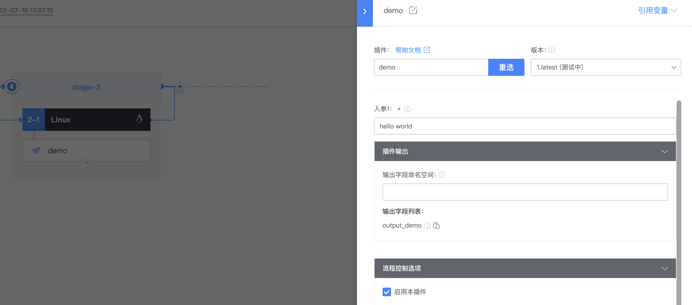

# Python 插件开发指引

## 插件开发框架说明

* 开发者可以使用自己喜欢的框架开发，没有硬性要求
* 示例以源码发布包的方式来组织插件
  * 优点：跨平台，包简单小巧
  * 缺点：执行前需使用 pip 安装，当有其他第三方包依赖时，需能访问镜像源安装依赖包

**一、插件代码工程的整体结构示例如下：**

```text
|- <你的插件标识>              # 插件包名
    |- <你的插件标识>          # 插件包名
        |- __init__.py py     # py包标识
        |- command_line.py    # 命令入口文件
    |- python_atom_sdk        # 插件开发SDK包
    |- MANIFEST.in            # 包文件类型申明
    |- requirements.txt       # 依赖申明
    |- setup.py               # 执行包打包配置
```

**二、如何开发插件：**

> 示例参考 [plugin-demo-python](https://github.com/ci-plugins/plugin-demo-python)

* 创建插件代码工程插件代码建议企业下统一管理。通用的开源插件可以联系蓝鲸官方放到[TencentBlueKing](https://github.com/TencentBlueKing) 下，供更多用户使用
* 修改包名为有辨识度的名称，建议可以和插件标识一致
* 实现插件功能
  * 配置task.json，参考[插件配置规范](../plugin-dev-standard/plugin-config.md)
  * 编写插件逻辑代码，参考[插件开发逻辑代码](https://github.com/ci-plugins/plugin-demo-python)和[python_atom_sdk接口示例](../plugin-sdk/python-atom-sdk.md)
* 规范：
  * [插件开发规范](../plugin-dev-standard/plugin-specification.md)
  * [插件配置规范](../plugin-dev-standard/plugin-config.md)
    * 插件前端不仅可以通过 task.json 进行标准化配置，也可以自定义开发：[自定义插件 UI 交互指引](../plugin-dev-standard/plugin-custom-ui.md)
  * [插件输出规范](../plugin-dev-standard/plugin-output.md)
  * [插件错误码规范](../plugin-dev-standard/plugin-error-code.md)
  * [插件发布包规范](../plugin-dev-standard/release.md)

**三、如何打包发布：**

1. 进入插件代码工程根目录下
2. 执行打包命令打包

   ```text
   # 本示例以 setuptools 的 sdist 命令为例

   python setup.py sdist
   ```

3. 在任意位置新建文件夹，命名示例：release\_pkg = <你的插件标识>\_release
4. 将步骤 2 生产的执行包拷贝到 <release\_pkg> 下
5. 添加 task.json 文件到 <release\_pkg> 下 task.json 见示例，按照插件功能配置。

   * [插件配置规范](../plugin-dev-standard/plugin-config.md)
   * task.json 示例：

   ```text
   {
       "atomCode": "demo",
       "execution": {
           "language": "python",
           "packagePath": "demo-1.1.0.tar.gz",             # 发布包中插件安装包的相对路径
           "demands": [
               "pip install demo-1.1.0.tar.gz --upgrade"   # 执行 target 命令前需进行的操作，如安装依赖等
           ],
           "target": "demo"
       },
       "input": {
           "inputDemo":{
               "label": "输入示例",  
               "type": "vuex-input",
               "placeholder": "输入示例",
               "desc": "输入示例"
           }
       },
       "output": {
           "outputDemo": {
               "description": "输出示例",
               "type": "string",
               "isSensitive": false
           }
       }
   }
   ```

6. 在 <release\_pkg> 目录下，把所有文件打成 `zip` 包即可

`zip` 包结构示例：

```text
|- demo_release.zip         # 发布包
   |- demo-1.1.0.tar.gz    # 插件执行包
   |- task.json            # 插件配置文件
```

打包完成后，在插件工作台提单发布，即可测试或发布插件


## 插件开发逻辑代码
插件的逻辑代码主要在command_line.py里，以下demo示例，演示了一个简单的插件，从输入框input_demo获取用户输入值，将用户输入内容打印到日志中，并输出到插件结果中。
1. `sdk.input().get("key")`是python_atom_sdk提供的获取插件输入的方法，key是输入组件的名称，在task.json里的input定义，在本例中输入组件为input_demo
2. output_demo是输出组件，作为插件输出结果，流水线后续JOB可以引用output_demo的值
3. task.json里input代表UI输入组件，所有和用户交互的输入UI组件都要放在input里，组件名称需唯一，在BK-CI「研发商店」-「控制台」-「调试task.json」可以查看task.json可视化结果

更多sdk接口，请参考：[python_atom_sdk接口示例](../plugin-sdk/python-atom-sdk.md)
更多task.json配置信息，请参考：[插件配置规范](../plugin-dev-standard/plugin-config.md)
更多UI组件使用案例，请参考：[UI组件示例](../plugin-dev-standard/plugin-config.md)
```python

# -*- coding: utf-8 -*-

from __future__ import print_function
from __future__ import absolute_import
from __future__ import unicode_literals
import python_atom_sdk as sdk
from .error_code import ErrorCode

err_code = ErrorCode()


def exit_with_error(error_type=None, error_code=None, error_msg="failed", platform_code=None, platform_error_code=None):
    """
    @summary: exit with error
    """
    if not error_type:
        error_type = sdk.OutputErrorType.PLUGIN
    if not error_code:
        error_code = err_code.PLUGIN_ERROR
    sdk.log.error("error_type: {}, error_code: {}, error_msg: {}".format(error_type, error_code, error_msg))

    output_data = {
        "status": sdk.status.FAILURE,
        "errorType": error_type,
        "errorCode": error_code,
        "message": error_msg,
        "type": sdk.output_template_type.DEFAULT,
        "platformCode": platform_code,
        "platformErrorCode": platform_error_code
    }
    sdk.set_output(output_data)

    exit(error_code)


def exit_with_succ(data=None, quality_data=None, msg="run succ"):
    """
    @summary: exit with succ
    """
    if not data:
        data = {}

    output_template = sdk.output_template_type.DEFAULT
    if quality_data:
        output_template = sdk.output_template_type.QUALITY

    output_data = {
        "status": sdk.status.SUCCESS,
        "message": msg,
        "type": output_template,
        "data": data
    }

    if quality_data:
        output_data["qualityData"] = quality_data

    sdk.set_output(output_data)

    sdk.log.info("finish")
    exit(err_code.OK)


def main():
    """
    @summary: main
    """
    sdk.log.info("enter main")

    # 输入
    input_params = sdk.get_input()

    # 获取名为input_demo的输入字段值
    input_demo = input_params.get("input_demo", None)
    sdk.log.info("input_demo is {}".format(input_demo))
    if not input_demo:
        exit_with_error(error_type=sdk.output_error_type.USER,
                        error_code=err_code.USER_CONFIG_ERROR,
                        error_msg="input_demo is None")

    # 插件逻辑
    sdk.log.info("input: %s"%input_demo)

    # 插件执行结果、输出数据
    data = {
        "output_demo": {
            "type": sdk.output_field_type.STRING,
            "value": input_demo
        }
    }
    exit_with_succ(data=data)

    exit(0)
```

对应的task.json:
```json
{
    "atomCode": "demo",
    "execution": {
        "packagePath": "demo-1.0.0.tar.gz",
        "language": "python",
        "demands": [
            "pip install demo-1.0.0.tar.gz"
        ],
        "target": "demo"
    },
    "input": {
        "input_demo": {
            "label":"入参1",
            "default":"",
            "placeholder":"入参1",
            "type":"vuex-input",
            "desc":"入参1",
            "required": true
        }
    }, 
    "output": {
        "output_demo": {
            "description" : "输出示例",
            "type": "string",
            "isSensitive": false
        }
    }
}
```

执行结果：




