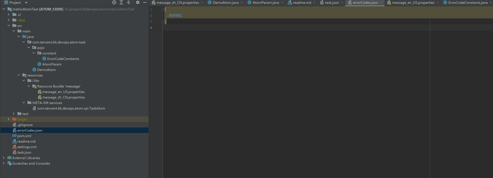
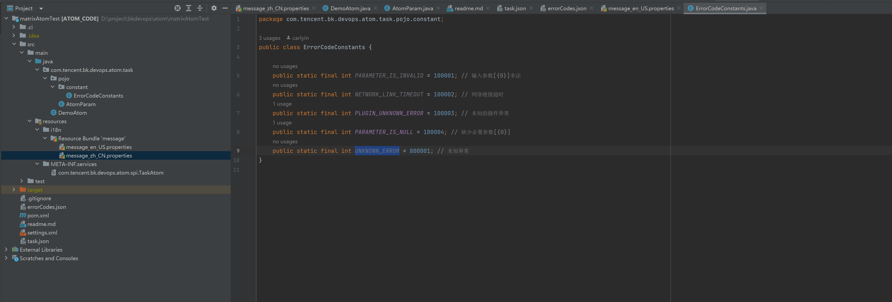

# 插件错误码规范

## 总体要求

* 插件开发者需对导致插件执行失败的各种场景进行细分，使用错误码（errorCode）进行标识，并在插件日志、使用指引中给出详细的描述和解决方法，方便用户快速定位和解决问题
* 插件开发者需对导致插件执行失败的错误进行归类，指定错误类型 errorType，用于度量统计

## 错误类型和错误码规范

### 1 插件错误类型（errorType）

通过插件结果中的 errorType 字段上报：

| 错误类型 | 取值 | 含义 | 详细说明 |
| :--- | :--- | :--- | :--- |
| USER | 1 | 用户配置错误 | 用户在流水线配置的插件参数有误，或是用户业务逻辑出错 |
| THIRD\_PARTY | 2 | 第三方系统错误 | 非 bkci 的其他平台接口调用出错，如：第三方镜像平台接口错误、作业平台接口错误、织云上传接口请求失败等 |
| PLUGIN | 3 | 插件执行错误（默认） | 插件执行逻辑出错，需开发者跟进和修复，插件开发者有义务将 PLUGIN 错误细分为其他类型 |

> 注：插件 SDK 只提供 1-3 的传值枚举，插件结果内未指定或指定 1-3 以外的值，则错误类型取值为 3（插件执行错误）

### 2 插件错误码（errorCode）

通过插件结果中的 errorCode 字段上报：

| 取值 | 含义 | 详细说明 |
| :--- | :--- | :--- |
| 2199001 | 默认错误码 | 插件开发者未指定错误码时将使用 bkci 平台规范的插件默认错误码 |
| 自定义 | 插件开发者定义的错误码 | 插件开发者按所处团队/平台使用的规范定义，可用于后期插件/构建的数据度量 |

> 注：插件错误码有助于开发者定义完整的、成体系的错误信息，方便问题定位和报表生成

### 3 插件自定义的错误码（errorCode）在插件代码库中申明

需在代码库根目录下增加 errorCodes.json 文件，申明插件自定义错误码

以 Java 插件为例：

errorCode 在 errorCodes.json 文件中申明：

对应的错误码常量：

