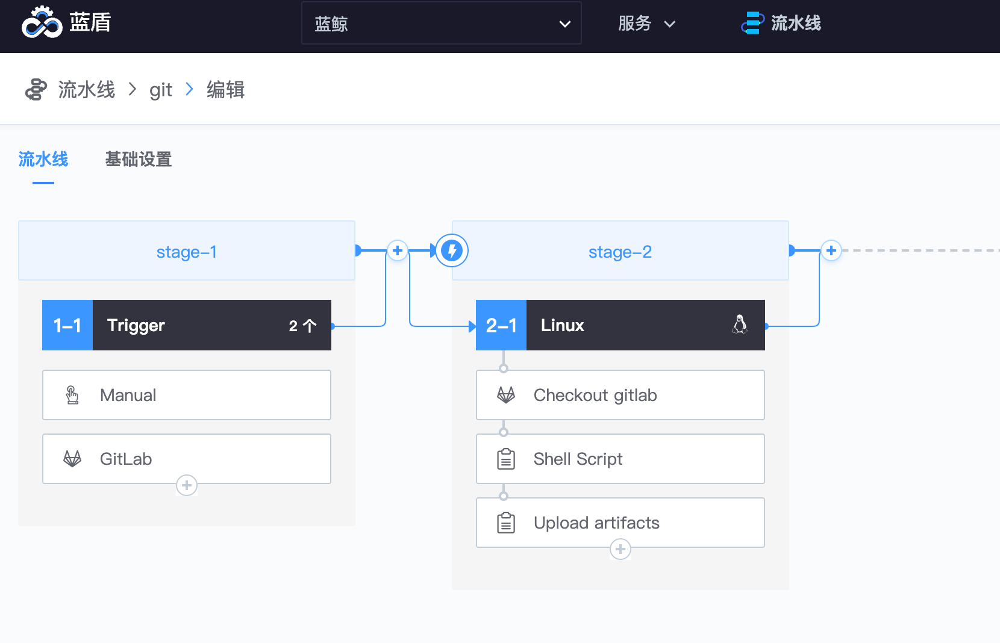
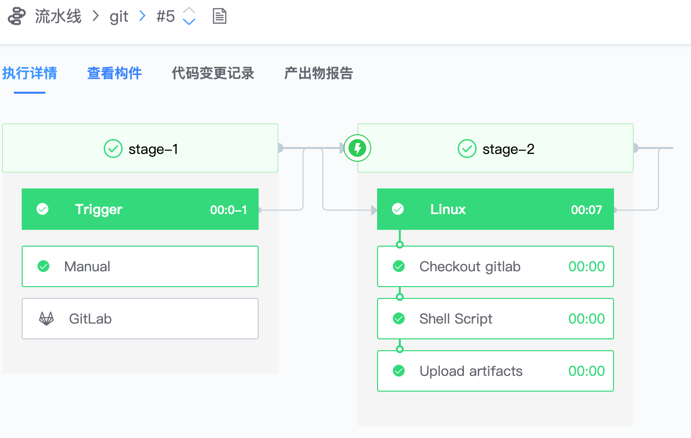

# 创建你的第一条流水线

这个 step-by-step 教程为你的 Go 工程创建一条流水线。

## 准备事项

- 一个 git 工程，可参考 [关联你的第一个代码库](Link-your-first-repo.md)
- 一个 BK-CI 项目
- 熟悉 [编辑流水线](../Services/Pipeline/pipeline-edit-guide/pipeline-edit.md)页面相关操作

## 运行你的第一次构建

1. 打开 BK-CI，切换至流水线服务
2. 切换到你的项目
3. 点击新建流水线
4. 编辑如下图所示的流水线：
   
5. 点击**保存并执行**
6. 你的 #1 构建已经成功运行，请耐心等待结束
   

## 接下来你可能需要

接下来你可能需要对流水线有更深一步的了解：

- [5 分钟读懂 BK-CI 流水线](../intro/terminology/Learn-pipeline-in-5min.md)
