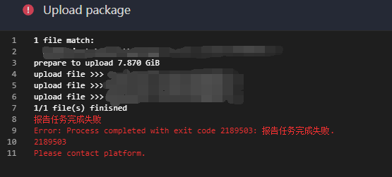

# 服务对应功能

BK-CI 的各个微服务对应各个功能，当有功能进行异常时，可以优先考虑排查对应的服务日志。服务日志路径参考[基本概念](./user-guide.md)

| 微服务          | 功能                             |
| --------------- | -------------------------------- |
| gateway         | BK-CI 网关                         |
| artifactory     | 制品构件服务，默认的构件仓库     |
| dockerhost      | 公共构建机                       |
| environment     | 私有构建机服务。导入、管理构建机 |
| process         | 流水线                           |
| project         | 项目管理                         |
| plugin          | 服务的插件扩展服务               |
| repository      | 代码库                           |
| ticket          | 凭证管理                         |
| store           | 研发商店                         |
| image           | 公共构建机镜像                   |
| dispatch        | 私有构建机调度                   |
| dispatch-docker | 公共构建机调度                   |
| agentless       | 无编译环境                       |
| auth            | 鉴权认证                         |
| log             | 构建日志                         |
| notify          | BK-CI 内置通知服务                 |
| openapi         | BK-CI API 服务                      |

详细的组件描述及关联请参考[bkci组件](https://docs.bkci.net/overview/components)

# 排查示例

#### 问题背景

1. 流水线执行时，upload产物无法显示

2. 且插件偶现报错

#### 排查思路

①：排查构建日志

获取该次构建对应的构建日志进行排查，日志获取方式请参考[基本概念](./user-guide.md)

排查构建日志时，可以通过报错的插件名搜索，方便定位错误点。例如 Upload package 插件报错，我们可以在日志中尝试查询 upload 字段，搜索到 upload 执行的对应日志。然后继续查询到报错日志如下：

②：排查服务日志

根据构建日志，可以看出构建在请求 artifactory 服务时报错，因此对 artifactory 日志进行排查。

1. 排查服务日志可以先对 error 日志进行排查，若有明显报错可直接进行解决。若无报错，则继续对服务日志进行排查。
2. 排查服务日志时，通常以构建日志报错时间进行定位

排查日志时，发现两处明显报错：

此时应继续对 process 服务进行排查，后续排查发现 process 服务在本次构建时，因CI机器负载压力过大，导致服务出现异常。

#### 解决

1. 根据日志，对 process 进行服务重启。

2. 根据报错 No Space left on device ，对 CI 机器的空间进行清理。

