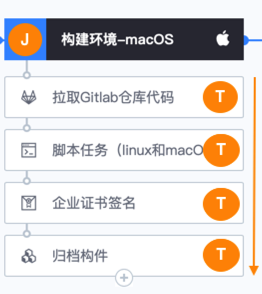
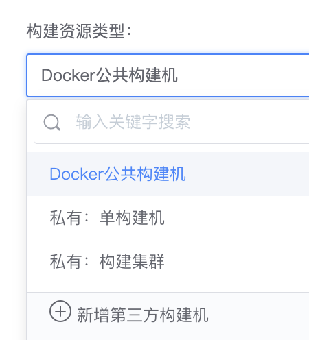
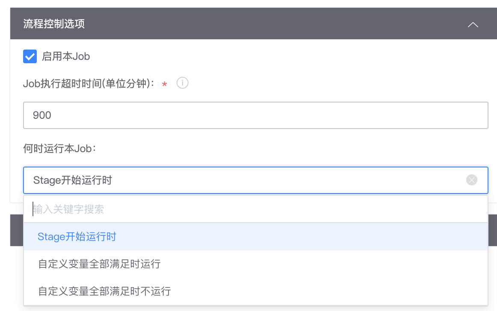

# Job

Job，可以运行在一个构建环境里，比如运行在 macOS；也可以作为不需要构建环境的普通任务调度编排。它有如下特性：

- 由多个 Tasks(插件)组成；
- 一个 Task 失败，则该 Job 失败，其余 Task 将不会运行；

> BK-CI 内置了 Linux Docker 公共构建机（如果该选项无法选中，请联系您的 CI 平台管理员），同时也支持业务自己管理的 Windows、macOS、Linux 构建机。
>
> 

## WORKSPACE

每个 Job 都有自己的 WORKSPACE，WORKSPACE 就是该 Job 下所有插件的运行根目录。
> 由 BK-CI 自动生成的 WORKSPACE 中的文件不会随着 Docker 销毁而消失，只要是同一个流水线的同一个 Job，以下目录中的文件都是持久化存在的：
>
> - WORKSPACE：不指定的话就是当前 Job 的整个 WORKSPACE 目录
> - maven 缓存：/root/.m2/repository
> - npm 缓存：/root/Downloads/npm/prefix
> - npm 缓存：/root/Downloads/npm/cache
> - ccache 缓存：/root/.ccache
> - gradle 缓存：/root/.gradle/caches
> - golang 缓存：/root/go/pkg/mod
> - scale 缓存：/root/.ivy2
> - scale 缓存：/root/.cache
> - yarn 缓存：/usr/local/share/.cache/

如果一个 Job 中包含了“子流水线调用”插件，那该子流水线下的 Job 的 WORKSPACE 也会遵循上述原则，完全独立，不会跟父流水线的 WORKSPACE 冲突。

## Job 的通用选项

### 流程控制选项

通过高级流程控制，可以定义 Job 的运行逻辑。

### 互斥组

互斥组是为了解决并发构建使用同一构建机时的资源冲突问题而设计的，对不同流水线的不同 Job 设置同一个互斥组。

## 接下来你可能需要

- [Task](Task.md)
- [Stage](Stage.md)
