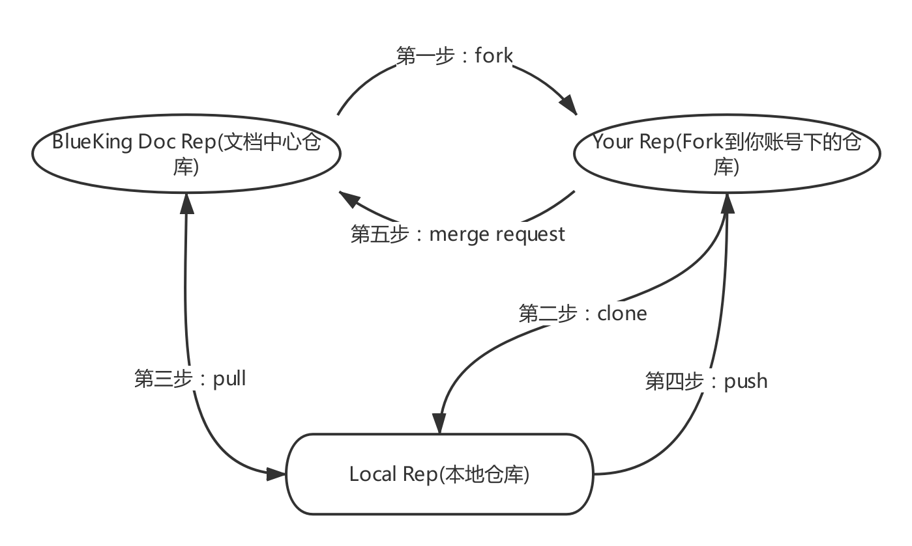

# 文档更新帮助

文档中心 最下面切换中英文。

## 文档目录

* [上传文档帮助](#上传文档帮助)

* [文档章节帮助](#文档章节帮助)

* [蓝鲸文档编写规范](./rules.md)

## 上传文档帮助

因为文档的维护人员较多，各自负责相关部分，为了避免个别失误带来整个仓库的瘫痪，所以采用`Fork+Merge Request`方式提交修改，如果对此不熟悉请仔细阅读该文档，如有疑问请直接联系 张媛。

### 工作流程图解



### 事先准备工作

- 安装 git，下载地址：[https://git-scm.com/downloads](https://git-scm.com/downloads)

- 申请 git 仓库权限

    - 仓库地址：[https://github.com/TencentBlueKing/support-docs/](https://github.com/TencentBlueKing/support-docs/)

    - 审核人：张媛

### 工作流程详解

- 第一步：进入文档中心项目首页：[https://github.com/TencentBlueKing/support-docs/](https://github.com/TencentBlueKing/support-docs/)

  点击 Fork，成功后文档项目会出现在你的项目下。

- 第二步：clone 自己的文档项目到本地。

  ```bash
  # 从 github 获取文档
  git clone http://github.com/{你的github账号}/support-docs.git
  # 首次下载需要输入 github 的账号和 access token
  ```
  [github 获取 access token 官方文档](https://docs.github.com/cn/authentication/keeping-your-account-and-data-secure/creating-a-personal-access-token)

- 第三步：为本地项目添加同步文档中心远程仓库，然后 pull master 分支同步最新的文档。

  ```bash
  # 添加远程仓库
  git remote add blueking https://github.com/TencentBlueKing/support-docs.git
  # 查看
  git remote -v
  ```

  其中 `blueking` 是别名，可以自己取一个有意义的。

  <font color=red>注意:请在每次修改文档前同步文档 `git pull blueking master`</font>

- 第四步：进行文档修改，检测完成后 push 新文档到自己的仓库。

  ```bash
  cd support-docs
  git add .
  git commit -m "更新 xx版本 XX产品 XX章节"
  git push -u origin master
  ```

- 第五步：登入自己 github 仓库，发起 Pull requests 请求。

  选择 master -> master 分支 -> 比较两分支

  填写相关信息后发起 merge 请求

- 第六步：通知审核人员审核，审核变更内容,通过则合并版本
- 第七步：之后每次写作之前执行`git pull blueking master`先从主库同步到本地

## 文档章节帮助

### 背景说明

构建私有化的企业版文档中心，需要将原先企业版各个文档更新到最新版本。

### 文档内容说明

- 文档分为中文和英文，每个产品有三篇文章，分别为产品白皮书（UserGuide），开发架构文档（Architecture），应用运维文档（Operation），目前需要更新的是中文和英文的部分。

- 文档为 MD 格式，经过渲染后效果参考当前[官网文档中心](https://bk.tencent.com/docs)

`其中 EN 下为英文文档，ZH 下为中文文档`


#### 白皮书目录格式

| 中文               | 英文    |
| -------------------| -------- | 
| 产品公告 |News|
| 产品简介  |Overview |
| 术语解释 |Term|
| 产品架构 |Architecture |
| 特点及优势 |Advantage |
| 快速入门 |QuickStart |
| 产品功能 |ProductFeatures |
| 场景实践 |UserCase|
| 常见问题 |FAQ |
| 视频教程 |VideoTutorial|
| 集成开发 |IntegrateGuide|
| 开发者工具 |DevelopTools|
| API 文档 |APIDocs|
| 错误码 |ErrorCode |
| 开源共建 |ContributorGuide|
| 资源下载|Download |
| 联系我们|ContactUs |
| 结语|Conclusion|

> 白皮书的一级目录按照上述所示，保持**命名一致、顺序一致**，若无`集成开发`, `API文档` 等去掉即可，若有其他章节添加的合适的位置即可。


#### 开发架构文档和应用运维文档

- 开发架构目录请参考 

| 中文               | 英文    |
| -------------------| -------- | 
| 编写目的 |Purpose|
| 术语解释  |Term |
| 系统概述 |Overview|
| 系统设计 |Design |
| 功能描述/子系统结构与功能 |Function |
| 业务流程 |UserCase |
| 系统性能 |Performance |
| 系统可用性/可持续性 |Reliability|
| 常见问题 |FAQ |
| 附录 |Appendix|

- 应用运维目录请参考

| 中文               | 英文    |
| -------------------| -------- | 
| 编写目的 |Purpose|
| 术语解释  |Term |
| 系统概述 |Overview|
| 系统设计 |Design |
|安装指南|InstallationGuide|
| 目录信息 |DirectoryGuide |
| 常见问题 |FAQ|
| 附录 |Appendix |
| 部署结构图 |DeploymentDiagram|
|文档介绍|Introduce|

## 特殊符号
#### {{ }} / 

上述两个标记为特殊标记符号，在文档中用于环境变量赋值，实现路径补充，请慎重使用
<br/>
{{ BK_DOCS_MD_URL }} + ZH/xxx/xxx.md：在本文档中可跳转访问其他产品对应的文件

## 特殊文件
在产品版本中，可以使用SUMMARY.md来定位文档的菜单，控制了左边菜单栏的显示内容。它通过 Markdown 中的列表语法来表示文件的父子关系。
#### 整体SUMMARY.md模版

以 节点管理 的 整体 SUMMARY.md 文件为例(<font color=red>注意：需要确保路径为英文路径</font>)：
此模板可以结合https://bk.tencent.com/docs/markdown/ZH/NodeMan/2.2/UserGuide/Introduce/Overview.md左边目录进行参照

```bash
# Summary

## 节点管理
* [产品公告](../ReleaseNotes/ReleaseNotes.md)
* [产品简介](UserGuide/Introduce/Overview.md)
* [术语解释](UserGuide/Introduce/Terms.md)
* [产品架构](UserGuide/Introduce/Architecture.md)
* [特点及优势](UserGuide/Introduce/Advantage.md)
* [快速入门]()
    * [安装蓝鲸 Agent（直连区域）](UserGuide/QuickStart/DefaultAreaInstallAgent.md)
    * [安装蓝鲸 Agent（自定义云区域）](UserGuide/QuickStart/CustomCloudAreaInstallAgent.md)
* [产品功能]()
    * [Agent 管理](UserGuide/Feature/Agent.md)
    * [插件管理](UserGuide/Feature/Plugin.md)
    * [云区域管理](UserGuide/Feature/CloudArea.md)
    * [任务历史](UserGuide/Feature/History.md)
    * [全局配置](UserGuide/Feature/Globe.md)
* [场景实践]()
* [常见问题]()
    * [agent 问题]()
        * [手动卸载 Agent](UserGuide/FAQ/AgentIssues/ManualUninstallAgent.md)
        * [安装 Agent 常见报错](UserGuide/FAQ/AgentIssues/CommonErrorsInInstallAgent.md)
        * [常见 FAQ](UserGuide/FAQ/AgentIssues/FAQ.md)
    * [Porxy 问题]()
        * [安装 Proxy 需要开通哪些端口](UserGuide/FAQ/ProxyIssues/WhichPortNeedToBeOpenedToInstallProxy.md)
* [视频教程](../Vedios.md)
* [API文档](APIDocs/Index.md)
* [错误码](../ErrorCode/readme.md)
* [开源共建](../GithubContributorGuide.md)
* [资源下载](../downloads/DevTools.md)
* [开发架构文档](ArchitectureGuide/SUMMARY.md)
* [应用运维文档](OperationGuide/SUMMARY.md)
```

它代表了 PaaS 平台白皮书渲染后的目录， `[]` 后是目录的文字 ， `()` 内则是该章节对应的内容的 MD 文件了。

