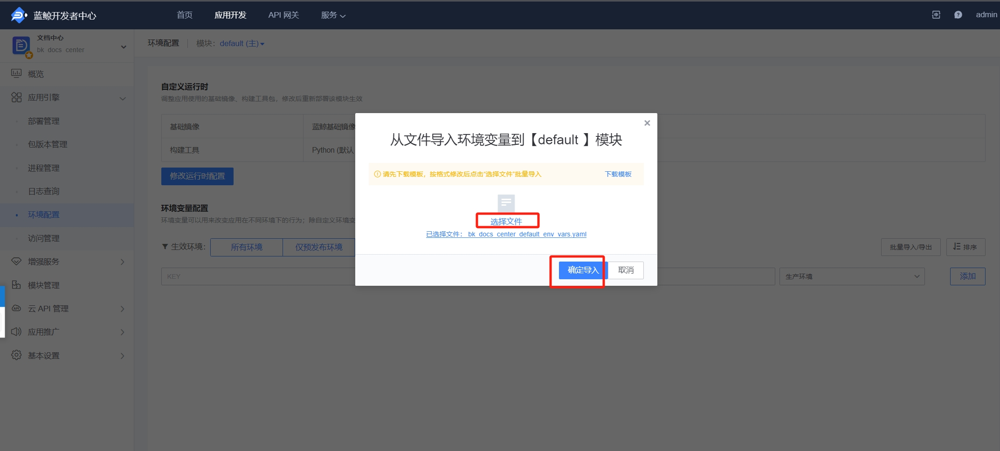
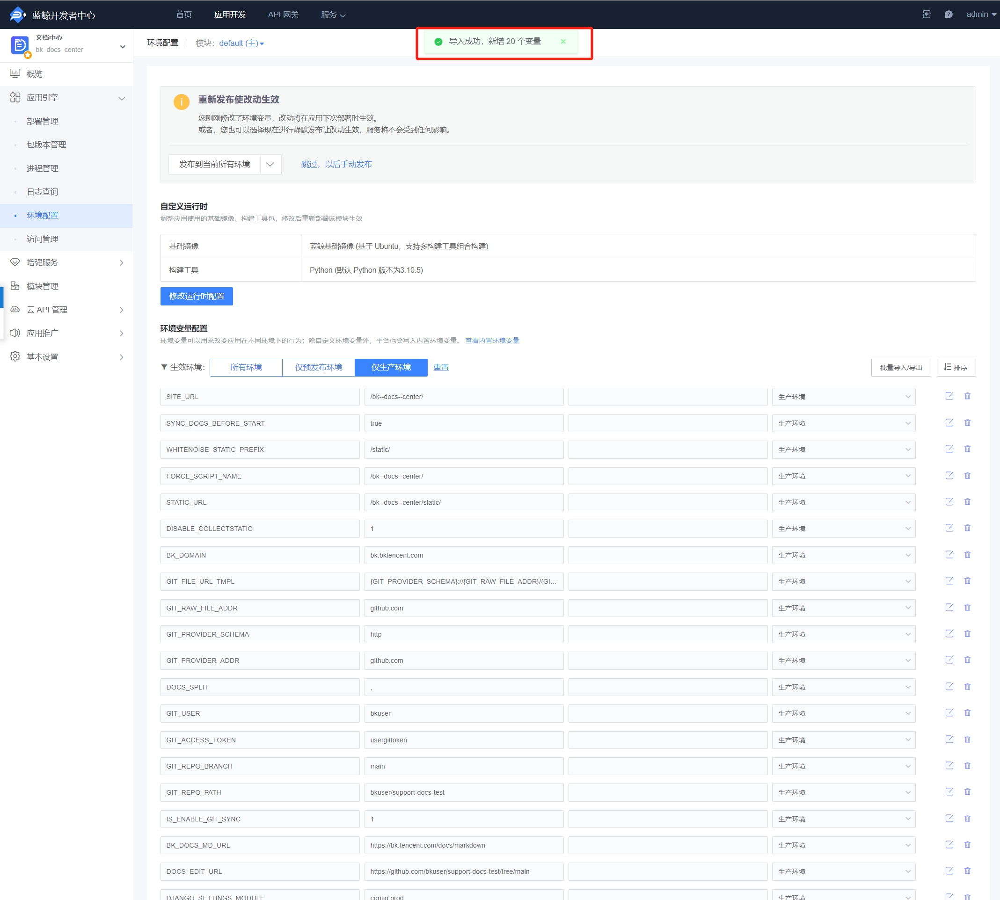
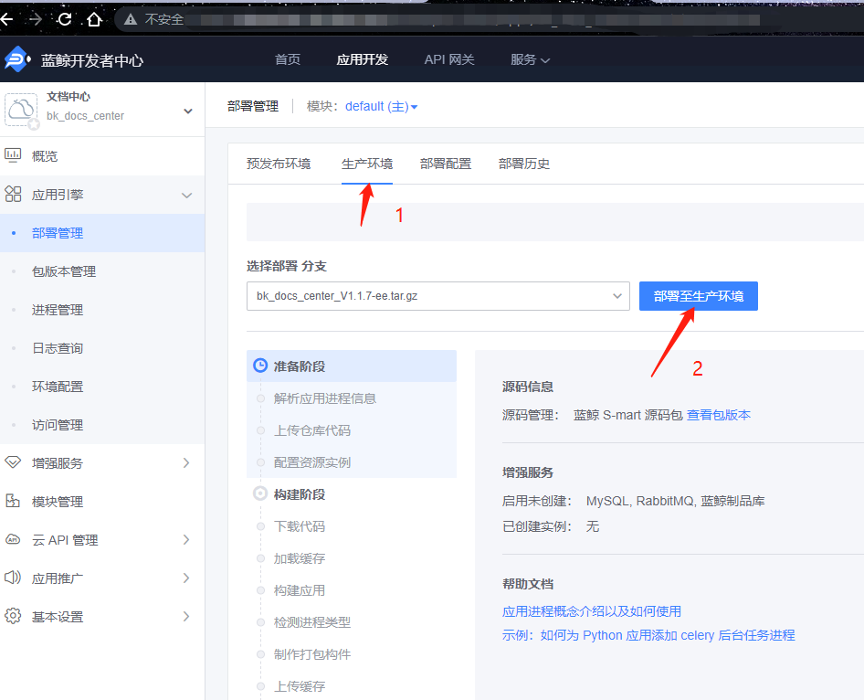
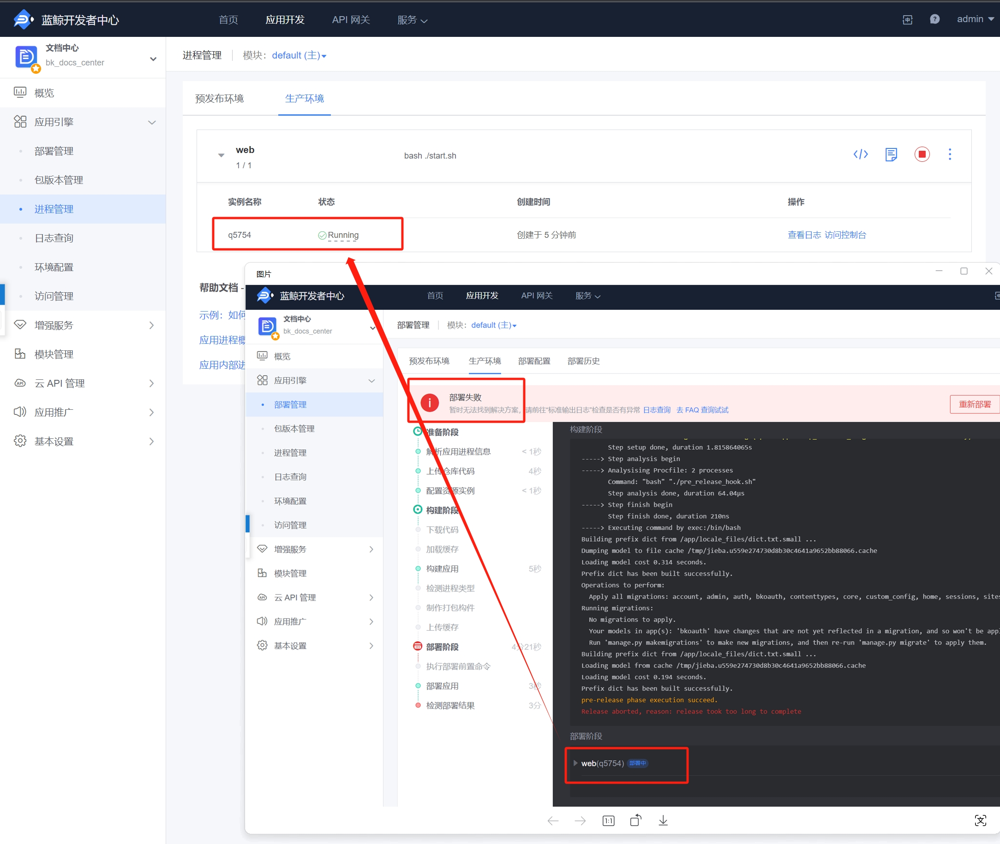
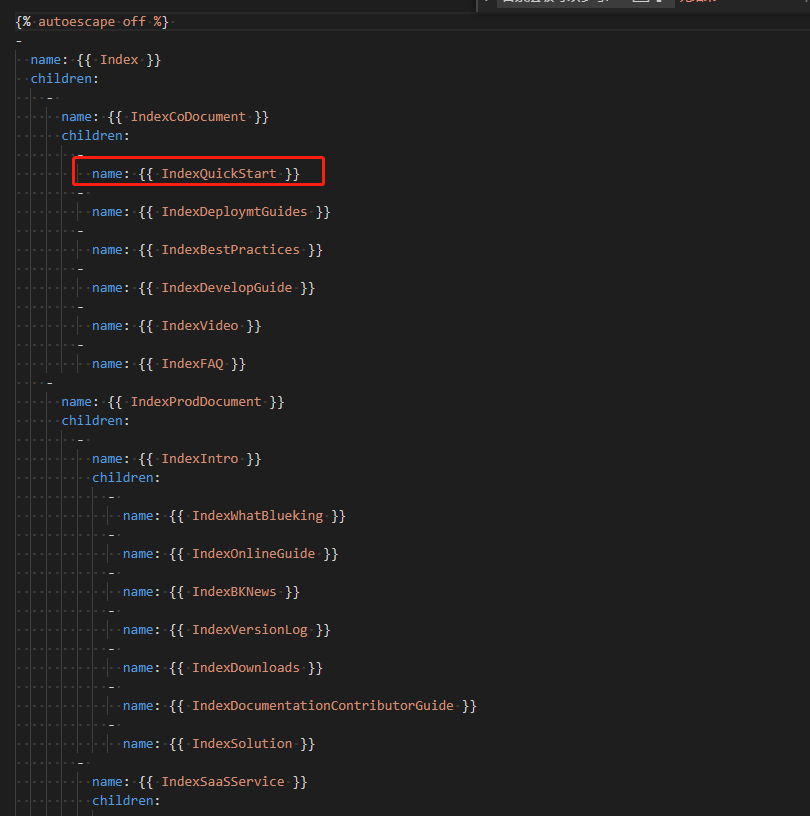

# 蓝鲸文档中心部署及维护

## 文档包组成简介

文档中心包分为两部分，分别为SaaS包和文档内容包。

- SaaS包是承载文档内容的主体，也就是应用，通常由开发编写逻辑去读取文档内容包的内容进行渲染。

- 文档内容包通常就是文档内容存放的地方，由各产品或在里面撰写文档，并由运营对文档内容包配置文件进行控制来渲染文档官网页面所展示的内容。

## 部署指引

### 部署前置准备

#### 部署前详解

文档中心部署分为两个板块，一个是文档包，一个是文档中心SaaS。最终部署后，需要把文档包传输到SaaS项目中进行渲染，所以目前采用的有两种方案：

1. 将文档内容传至git，在SaaS配置好git的对应变量，启动saas后自动去git拉取文档
2. 后台上传（待开放）

#### 部署准备

- 私有化环境: 部署前需要拥有一套私有化环境,来承载和部署saas，本文档部署条件如下：
    - 版本
        - 蓝鲸版本号：7.1
        - 开发者中心版本号：v1.3.0-beta.1
        - SaaS文档包：v1.1.7
        - 文档包： 无版本

    - 部署权限
    本文档是按admin权限进行实践的，如普通用户遇到权限不足请联系环境负责人或者[参考文档](../7.0/../../IAM/1.12/UserGuide/Feature/PermissionsApply.md)申请权限。

### 文档包部署指引

#### 文档包和SaaS包交付

因暂未开源,目前文档包交付形式是在企业v群内交包,如有需要进群请联系 seingan 

后续开源后可以自行去仓库进行下载，外网请准备github地址，内网请准备gitlab地址：

- SaaS包： 该包有文档的发行版,可用在github进行下载最新的稳定版本进行操作: https://github.com/TencentBlueKing/blueking-docs/releases
- 文档包： 仓库为 https://github.com/TencentBlueKing/support-docs/tree/prod-sg, 该文档包随时下载可用。

>***注意：所选用的 <font color="red">git 必须和 SaaS 所在服务器直接要网络相通</font>***

#### 能通外网

- **传至 github 部署**

1. 新建 github 项目
    
    
    

2. 本地创建目录并解压文档包
    ```
    mkdir support-docs-test && tar xf support-docs-tar.gz -C support-docs-test/
    cd support-docs-test/
    ```

3. 本地 git 初始化并推送至远程仓库

    ```
    # git 初始化
    git config --global user.name "bkuser"
    git config --global user.email "bkuser@test.com"
    git init

    # 推送至远程仓库
    git add .
    git commit -m "upload the document package"
    git branch -M main
    git remote add origin https://github.com/bkuser/support-docs-test.git
    git push -u origin main
    ```


#### 不能通外网

- **传至 gitlab 部署**

1. 新建 gitlab 项目
    
    
    
    

2. 本地创建目录并解压文档包

    ```
    mkdir support-docs-test && tar xf support-docs-tar.gz -C support-docs-test/
    cd support-docs-test/
    ```

3. 本地 git 初始化并推送至远程仓库

    ```
    # git 初始化
    git config --global user.name "bkuser"
    git config --global user.email "bkuser@test.com"
    git init

    # 推送至远程仓库
    git remote add origin http://gitlab.bktest.com/bkuser/support-docs-test.git
    git add .
    git commit -m "upload the document package"
    git push -u origin master
    ```

- **离线方案(待开放)**

### 文档包部署指引及SaaS基本配置

文档SaaS部署大致部署可以分为以下六个步骤：

1. 进入开发者中心，创建应用
2. 创建S-mart应用
3. 上传saas包
4. 配置环境变量
5. 部署saas
6. 验收


具体细节操作步骤如下：

1. 进入开发者中心 

    

2. 创建文档中心新应用

    

3. 将下载好的文档saas包上传至开发者中心后台，应用就自动创建好了（注意包要下载tar.gz的格式）

    

4. 确认创建应用

    

5. saas部署前配置环境变量（Github）

    ***<font color="red">附件</font>：[bk_docs_center_default_env_vars.yaml](http://bktencent-1252002024.file.myqcloud.com/bk_docs_center_default_env_vars.yaml)***
    [bk_docs_center_default_env_vars.yaml](http://bktencent-1252002024.file.myqcloud.com/bk_docs_center_default_env_vars.yaml)
    
- 进入环境变量配置页面

    
    路径：以“admin”的角色进入“开发者中心” -> 应用开发 -> 文档中心 -> 应用引擎 -> 环境配置 -> 选择 “批量导入/导出” 导入文件

    
    

- 环境变量文件需要修改的地方

    | 环境变量Key        | 环境变量value           | 参考值 |
    | :----             | :----                  | :---- |
    | BK_DOMAIN         | 域名                    | bk.bktencent.com |
    | DOCS_EDIT_URL     | 仓库url                 | https://github.com/bkuser/support-docs-test/tree/main| 
    | GIT_REPO_PATH     | 仓库路径                | bkuser/support-docs-test |
    | GIT_REPO_BRANCH   | 仓库分支                | main |
    | GIT_USER          | Git用户名               | bkuser |
    | GIT_ACCESS_TOKEN  | Git用户token        | ghp_************* |
    | GIT_PROVIDER_ADDR | Git服务地址   | github.com |
    | GIT_RAW_FILE_ADDR | Git原始文件地址   | github.com |

- 导入环境变量
    
    

- 导入成功

    


6. 选择正式环境(这里是验收环境，直接一步到位，如有特殊情况可以先部署预发布)
    

    注意：如遇到部署失败的情况，只要看到进程状态正常就没问题
    

7. 最后我们进入到访问链接点击访问，能看到正常访问就是完成了。
    

## 维护指引

### SaaS应用配置指引

#### 环境变量汇总

SaaS环境变量汇总请[参考文档](https://github.com/TencentBlueKing/blueking-docs/tree/master/docs)

### 文档包配置维护指引

#### 文档结构简介

请参考文档的[目录层级模板](./rules.md#目录层级模板)

#### 配置文件详解

##### <span id="jump1">**SUMMARY.md文件简介**</span>

请参考文档的[整体 SUMMARY.md 模版](./collaborateguide.md#整体-summarymd-模版)

##### CONFIG目录

**config/template.yml**

template是所有的title集合，不管这个变量是否需要展示,所有要在官网展示的title都要写在这个文件里面,其作用有两个
1. 控制顺序
2. 占位给ZH.yml去补充其属性进行渲染

template.yml分为两个板块
1. Index：首页的模板变量

2. Doc： 产品页的小容器的变量


**config/language/ZH.yml|EN.yml**

ZH.yml和EN.yml分别是中文的配置和英文的配置，ZH则会去从ZH目录渲染，EN则会去EN目录渲染
每个模板变量对应列表的含义分别为:[官网显示标题,跳转链接(首页),描述,图片链接,is_disable: True]

**version-map.yml**
版本导航，告诉蓝鲸前端版本需要找对应产品的哪个版本，也供运营侧参考，次版本对应关系要和ZH.yml的跳转链接的路径中的版本号要一致

**co-map.yml**
为旧文档id与新文档路径映射表，如无特别需求可不关注。


## 写作指引

### 如何新建一套产品文档

1. 在文档体系中，一个目录就是代表一个产品的维度，所以我们只需要新建一个目录来装整个产品的文档即可。我们有提供内置文档目录初始化脚本,可以按以下执行

```bash 
cd support-docs
bash script/init_prodir.sh  product1 ZH 1.0    #product1是产品名字也是目录名字,尽量用英文命名。ZH代表是在中文版本下创建,1.0是产品的版本号,
```

>注意，脚本是bash解释器执行的，如没有可以自行安装git bash或者是wsl。

2. 我们可以在这里看到新建好的产品目录,然后入手点可以从[SUMMARY.md](#jump1)开始写整体框架（<font color="red">建议路径统一用英文</font>），然后跟据框架去新建文档即可

3. 写完文档之后我们要在配置中加入该产品让其渲染到官网,我先在config/template.yml自定义一个变量,按需若只希望显示在首页，那我们在这个变量前面加上Index，并放在Index的数组里

比如上图在首页小板块第一个加一个快速入门的变量

4. 我们将config/template.yml加的变量放到ZH的版本里面来,并且写好他们的属性


5. 在version.map加入版本指引,比如蓝鲸7.1的版本是用的快速入门7.0的目录，那就加入一行


6. 这样新的产品就完成了，上传至gitlab或者github之后重新部署应用就可以刷新文档


### 成员修改文档指引

成员协作方法不唯一，本文档写作指引仅供参考，可以[参考文档](./collaborateguide.md)，注意将仓库替换成自己的仓库。

### 文档写作规范

请参考文档[规范。](./rules.md)

## 合并文档可能会带来的冲突问题

用户侧在有自己的需求的情况下,可能会涉及更改蓝鲸产品文档，在下次与蓝鲸新增的文档合并时必然会产生冲突问题。对于该类问题我们给到的建议是：

1 如果量比较小的话，可以记录修改的地方，每次全量同步蓝鲸文档后手动按照记录或脚本的形式进行修改。

2 如果修改量比较大的话，最好不直接嵌入修改蓝鲸产品的目录。如有需要可以将蓝鲸文档拷贝至新的目录，将对应产品的引用改为新目录，这样每次同步覆盖掉蓝鲸的目录，在按需自行整合到自己的新增的目录，不至于丢失新目录的修改。